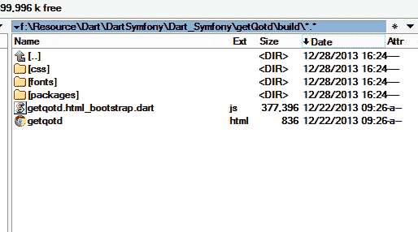

# 整合聚合物/Dart 和 Symfony–第 1 部分

> 原文：<https://www.sitepoint.com/integrating-polymerdart-symfony-part-1/>

我为 SitePoint 写的前四篇文章专门讨论 Symfony(我最喜欢的 PHP 框架)和 Dart(我最喜欢的 HTML 5 开发工具)。

在这个由 2 部分组成的系列中，我们将看看如何将这两个强大的工具集成在一起，即在 Symfony 网站中运行 Dart(编译成 JavaScript 后)以增加一些动态。我们还将讨论避免 JSONP 从远程服务器访问数据的变通办法，在远程服务器上，用户没有直接控制权，调用的 RESTful API 没有启用 T2 CORS。最后，我们将强调集成的局限性，并寻求 Dart 团队的关注，以解决问题并使 Dart 成为更好的平台。

本文讨论的主题相当高级。读者需要对 Symfony 和 Dart/Polymer 有一个基本的了解。通过**基本理解**，我的意思是用户可以自己开发一个 Symfony 站点和一个 Dart 应用程序，因此熟悉我们将在本文剩余部分使用的术语。读者还应该了解 Symfony web 应用程序和 Dart/Polymer 应用程序的结构。要了解 Dart/Polymer，看[这里](https://www.dartlang.org/polymer-dart/)，要熟悉 Symfony，看[我以前的文章](https://www.sitepoint.com/author/tren)。

本程序中使用的 Dart/Polymer 代码已上传至 [Github](https://github.com/phpmasterdotcom/Dart_Symfony) 。随意克隆一个副本，玩玩。然而，Symfony 代码没有包括在内，因为它太大了，而且包含了许多与本文主题无关的文件。

让我们从第 1 部分开始。

### 典型的 Symfony 树枝模板

Symfony 默认使用 [Twig](http://twig.sensiolabs.org/) (同一作者的另一款产品)模板引擎。让我们来看看一个典型的 Twig 模板:

```
File: Resources/views/Default/index.html.twig
```

```
<!DOCTYPE html>
<html lang="zh-CN">
    <head>
        <meta charset="utf-8">
        <meta name="description" content="">
        <meta name="author" content="TR@SOE">
        <meta name="viewport" content="width=device-width, initial-scale=1.0, maximum-scale=1.0">

        <link rel="shortcut icon" href="/favicon.ico">

        <link rel="stylesheet" type="text/css" href="/css/semantic.css">
        <link rel="stylesheet" type="text/css" href="/css/rsywx.css">

        <title>Welcome to my website!</title>
    </head>

    <body id="home">
        
        <div class="ui page grid overview segment">
            <div class="sixteen wide column">
                <div class="ui four column center aligned stackable divided grid">
                    <div class="equal height row">
                        <div class="column">
                            <div class="ui icon header">
                                <a href="{{path('book_list')}}"><i class="circular inverted book link icon"></i></a>
                                Books
                            </div>
                            <p>Up to {{"now"|date('Y-m-d')}}, I have {{bs.summary.bc|number_format(0,'.',',')}}books. <br><br>The newest book collected (on （{{bs.last.purchdate|date('Y-m-d')}}） is by {{bs.last.author}}, title: <a href="{{path('book_detail', {'id':bs.last.id})}}">{{bs.last.title}}</a></p>
                        </div>
                    </div>
                </div>
            </div>
        </div>

        
    {{ include ('trrsywxBundle:Default:footer.html.twig') }}
    </body>
</html>
```

以上是我改版后的网站索引页面的精简版。它完全符合 HTML5，具有所有必要的组件:metas、CSS 链接、语义 UI(是的，我将自己的偏好从 Bootstrap 改为语义 UI)和内容。

HTML 的 Twig 引擎是``和`{{...}}`部分。请特别注意`{{...}}`符号。稍后我们将看到它如何影响我们的 Dart/Polymer HTML 模板。

### 典型的 Dart/Polymer HTML 模板(发布后构建)

在我的新网站主页中，我想集成两个动态元素:一个是从我的数据库(托管在同一个服务器上)中获取随机报价，另一个是从两个来源(一个是中文，另一个是英文)中获取我住所的天气信息。每个“小部件”都有一个“刷新”按钮。对于报价部件，它将获取一个新的随机报价，对于天气部件，它将在显示中文信息和英文信息之间切换。

我们首先关注的 Dart 应用程序是 QOTD(今日报价)。代码位于[这里](https://github.com/taylorren/Dart_Symfony/tree/master/getQotd)。这是一个非常简单的 Dart 应用程序，所以我们将跳过 Dart 部分的解释，只关注这个应用程序的编译版本。

在您的 Dart IDE 中(我使用的是基于 Eclipse 的 Dart 编辑器，但是 PHPStorm 和 WebStorm 也支持 Dart)，选择`build.dart`文件，并从菜单中选择“工具|发布构建”。生成的文件将放在`build`目录中。在该目录中，除了用于 Dart 应用程序的其他支持文件(包、CSS、字体、图像等)，还有两个文件。一个是我们的 Dart 文件的 JavaScript 版本(在我的例子中是`getqotd.html_bootstrap.dart.js`)，另一个是 HTML 文件(`getqotd.html`)。



我们现在要做的是将这个`build`目录的内容集成到我的 Symfony 设置中。为此，需要采取几个步骤:

首先，将所有支持文件/目录(**除了`getqotd.html`文件**)复制到 Symfony project 的`web`目录中。请确保保留目录结构。毕竟，上面截图中显示的目录结构在任何网站中都是相当传统的设置。高级用户可以选择将文件和目录复制到不同的位置。这是可行的，但可能需要在后面的步骤中进一步调整。

现在在 Symfony 项目的`web`目录中，除了那些 Symfony 生成的文件/目录之外，我们还有一些为 Dart 应用程序建立基础的文件(或者，在我的上下文中，我更愿意称之为 Dart 小部件)。

接下来，返回到`index.html.twig`文件，进行一些修改以包含必要的 Dart 相关文件。要做的更改实际上可以从`getqotd.html`文件中获取，我总结如下:

在 HTML `<head>...</head>`部分包含来自 Dart 的 3 个 JS 文件。三档分别是:`shadow_dom.debug.js`、`custom-elements.debug.js`和`interop.js`。**注意:**在生产环境中，请不要使用前两个 JS 文件的调试版本，分别替换为`shadow_dom.min.js`和`custom-elements.min.js`。

现在`<head>...</head>`部分看起来像这样:

```
<head>
        <script src="/packages/shadow_dom/shadow_dom.debug.js"></script>
        <script src="/packages/custom_element/custom-elements.debug.js"></script>
        <script src="/packages/browser/interop.js"></script>
        <meta charset="utf-8">
...
</head>
```

确保 CSS 链接是正确的。通常这是多余的，但在双重检查中没有坏处。

带入 Bootstrap JS 文件:`getgetqotd.html_bootstrap.dart.js`。

`<head>...</head>`部分看起来像这样:

```
<head>
        <script src="/packages/shadow_dom/shadow_dom.debug.js"></script>
        <script src="/packages/custom_element/custom-elements.debug.js"></script>
        <script src="/packages/browser/interop.js"></script>
        <meta charset="utf-8">
...
        <script src="/getwidget.html_bootstrap.dart.js"></script>
</head>
```

1.  在最开始的`<body>...</body>`段中包含`<polymer-element>...</polymer-element>`声明:

```
 <body id="home">
    <polymer-element>
        <polymer-element name="qotd-tag">
            <template>
                <div class="ui message">
                    <p>{{quote}}<br>
                        <em>{{source}}</em>&nbsp;&nbsp;<i title="Refresh" class="refresh teal icon small link" on-click="{{getQuote}}"></i></p>
                </div>
            </template>
        </polymer-element>
...
```

模板实际上是从我的存储库中的`qotd.html`文件中提取的。在发布过程中，Dart 只是将`qotd.html`中的内容复制到`getqotd.html`的最终输出中。

特别注意`...`标签对。这是一个 Twig 模板语法(不是 Dart ),告诉 Twig 引擎这两个标记之间的所有内容都应该一字不差地输出。

如果我们跳过这些标签，将会出现运行时错误。在 Twig 中，`{{...}}`用来输出一个变量。所以 Twig 会将`{{source}}`视为显示一个名为`source`的变量的值。显然，`source`是聚合物模板中使用的 Dart 变量，我们永远不会在我们的 Symfony 中定义它(或者如果我们定义了，我们需要在 Symfony 或 Dart 中更改变量名，以避免不必要的引用错误的变量)。因此，由于 Twig 在使用未声明的变量时非常严格，错误会弹出“变量‘source’不存在”。

我们可以通过配置我们的 Twig 引擎来使用不同的定界符集(比如 Smarty 风格的`{$ ... }`对，或者 Ruby 风格的`<%= ... %>`对)来绕过这个限制。但是这需要在 Twig 内部进行一些高级的调整。因此，有了更直接、更简单的方法，我们将跳过这一步。唯一的缺点是我们必须键入更多的字母。感兴趣的可以阅读[如何定义自己的小枝分隔符](http://twig.sensiolabs.org/doc/recipes.html)了解更多详情。

最后，将自定义元素标签(`qotd-tag`)对插入您想要显示该信息的任何地方:

```
 <div class="ten wide column">
        <qotd-tag></qotd-tag>
    </div>
```

瞧啊。将该页面加载到您的 web 服务器中，我们可以看到 QOTD 小部件工作正常。每次页面加载或单击“刷新”按钮时，它都会显示数据库中的随机引用。

这标志着我们 Dart-Symfony 整合的一个里程碑。

## 结论

在这一部分中，我们在我们的网站中实现了一个 Dart 小部件，并解释了所用技术之间的一些可能的干扰。在第 2 部分中，我们将做一些更高级的实现。

有反馈？留在评论里吧！

## 分享这篇文章