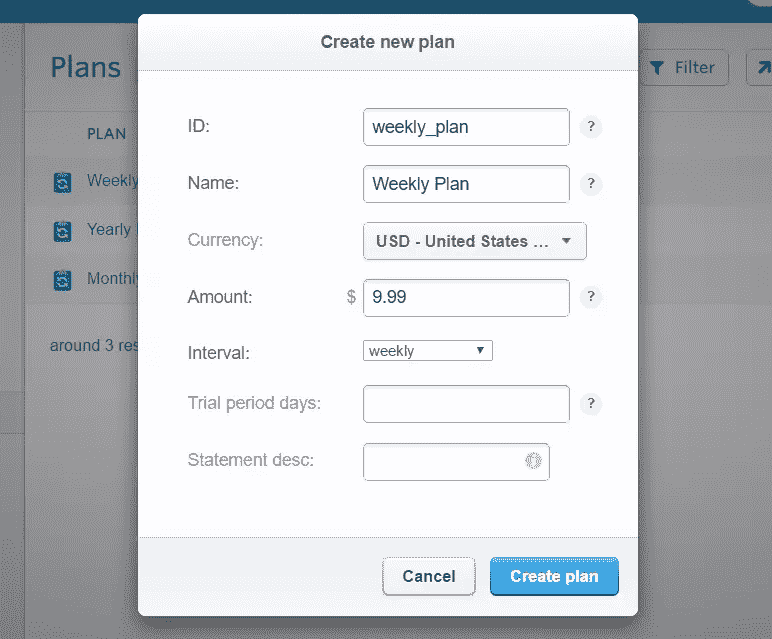
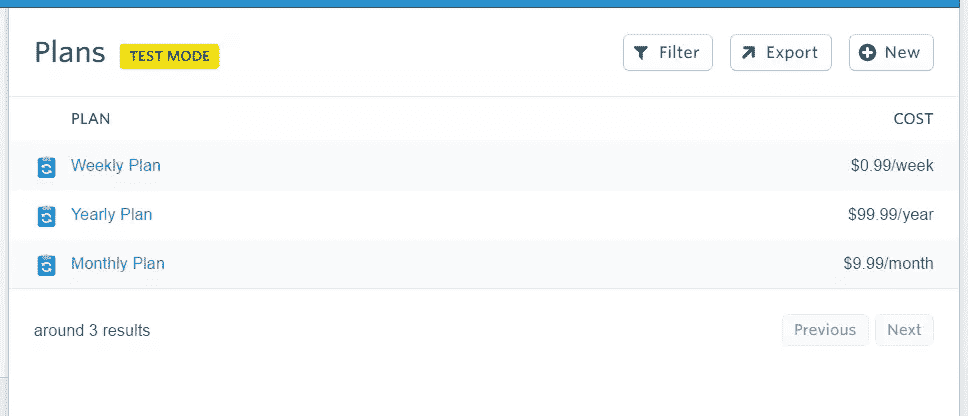
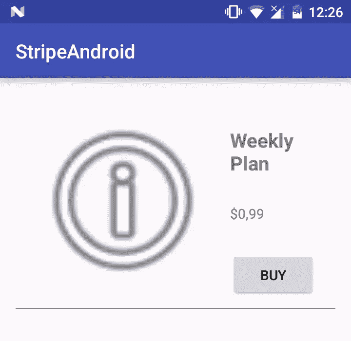
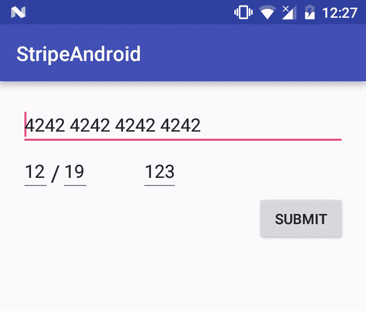

# 将 Stripe 集成到您的 Android 应用中

> 原文：<https://www.sitepoint.com/integrating-stripe-into-your-android-app/>

在本教程中，我将展示如何使用 [Stripe](https://stripe.com/) 让用户从你的应用程序购买产品或服务。Stripe 是管理在线产品、订单和支付的最简单方式之一。

你可以在 [Github](https://github.com/theodhorpandeli/Stripe-Integration-Android) 上找到这个教程的代码。

## 条纹仪表板

在本教程的最后，用户将能够购买计划订阅。第一步是制定一些简单的计划。

首先，[登录](https://dashboard.stripe.com/login)进行分条(或者创建一个帐户，如果您还没有的话)。在从[仪表板](https://dashboard.stripe.com/test/plans)创建计划之前，确保您处于**测试模式**。




下面我创建了 3 个订阅计划，*每周*，*每月*和*每年*。他们有一些批量信息和价格，只是为了相互区分。



## 设置 Android 项目

在 Android Studio 中创建一个新项目，并将这些行添加到 *build.gradle* 文件中的**依赖关系**中:

```
compile ('com.stripe:stripe-android:1.0.4@aar'){
    transitive=true
}
```

由于该应用需要互联网连接，请在 *AndroidManifest.xml* 文件中添加以下**用户权限**:

```
<uses-permission android:name="android.permission.INTERNET" /> 
```

# 装载产品

为了从 Stripe 仪表板下载我们的计划，我们首先需要使用 [API 键](https://dashboard.stripe.com/account/apikeys)将我们的应用程序与它连接。

总共有 4 个键，但是我们将只使用**测试**键。现在打开 *MainActivity.class* ，并在`onCreate()`方法之前添加这些声明:

```
ArrayList<SimplePlan> planArrayList;
RecyclerView recyclerView;
ItemsAdapter adapter; 
```

然后，在`onCreate()`内部初始化*数组列表*:

```
 planArrayList = new ArrayList<>();

    new Async().execute(); 
```

在主类内部，我们需要创建一个`AysncTask`。该任务将从 stripe 下载数据，并将在一个*新线程*中运行，因此主线程不会被网络连接事件中断。

将该类添加到主活动代码中:

```
public class Async extends AsyncTask<Void,String,ArrayList<SimplePlan>> {

        @Override
        protected ArrayList<SimplePlan> doInBackground(Void... params) {

            try {
            String line, newjson = "";
            URL url = new URL("[YOUR_SERVER_PLANS_SCRIPT_URL]");
            try (BufferedReader reader = new BufferedReader(new InputStreamReader(url.openStream(), "UTF-8"))) {
                while ((line = reader.readLine()) != null) {
                    newjson += line;
                }
                String json = newjson.toString();
                JSONObject jObj = new JSONObject(json);
                Log.e("Obj",jObj.toString());
                JSONArray plans = jObj.getJSONArray("plans");
                for (int i=0;i<plans.length();i++){
                    JSONObject plan = plans.getJSONObject(i);
                    plan.getString("amount");
                    Log.e("Amount",plan.getString("amount"));
                    planArrayList.add(new SimplePlan(plan.getInt("amount"),plan.getString("name"),plan.getString("statement_descriptor")));
                }
            }
        } catch (Exception e) {
            e.printStackTrace();
        }

        return planArrayList;
    }

        @Override
        protected void onPostExecute(final ArrayList<SimplePlan> plan) {
            super.onPostExecute(plan);
            new Handler().postDelayed(new Runnable() {
                @Override
                public void run() {
                    showRcv(plan);
                }
            },3000);
        }
    } 
```

这段代码从 Stripe API 中检索所有计划，并将它们添加到一个名为 **planArrayList** 的*数组列表*中。所有这些指令都在后台执行*。这个`doInBackground`函数返回一个数组列表。当第一个函数完成时，另一个函数`onPostExecute(final ArrayList<SimplePlan> plans)`被调用。*

它需要从第一个方法返回的相同的 *ArrayList* 作为参数。因为我们不能确定第一次调用能持续多少秒，所以最好在一段时间后运行第二个方法，在此之后我们可以确定调用已经结束。这段时间是 **3000ms** 。

所以在这段时间之后，这个函数运行另一个名为`showRcv(plans)`的函数。您可以在下面找到它的代码:

```
public void showRcv(ArrayList<SimplePlan> plans){
        adapter = new ItemsAdapter(this,plans);
        recyclerView = (RecyclerView)findViewById(R.id.recyclerView);
        recyclerView.setLayoutManager(new LinearLayoutManager(this));
        recyclerView.setAdapter(adapter);
    } 
```

到目前为止，我们只是列出了应用程序中的计划。我不会关注*recycle view Adapter*和*viewsholder*代码，但是你可以在 [Github](https://github.com/theodhorpandeli/Stripe-Integration-Android/tree/master/StripeAndroid/app/src/main/java/com/example/theodhor/stripeandroid) 中找到它们。

这些计划是这样列出的:



主活动中列出的每一件商品右侧都有一个**购买**按钮。

每个*购买*按钮上都附有一个*onclick listener*；

```
holder.buy.setOnClickListener(new View.OnClickListener() {
            @Override
            public void onClick(View v) {
                Intent buyIntent = new Intent(activity,PayActivity.class);
                buyIntent.putExtra("plan_id",""+planArrayList.get(i).getId());
                buyIntent.putExtra("plan_price",planArrayList.get(i).getAmount());
                buyIntent.putExtra("plan_name",""+planArrayList.get(i).getName());
                activity.startActivity(buyIntent);
            }
        }); 
```

点击按钮，两个变量作为*意向附加*传递:**计划价格**和**计划名称**。这些是产生电荷的最重要的因素。

## 接受付款

右键单击您的包目录并创建一个新的**空活动**。此活动将在选择购买任何计划后开启。
其`xml`代码为:

```
<?xml version="1.0" encoding="utf-8"?>
<RelativeLayout 
    xmlns:android="http://schemas.android.com/apk/res/android"
    xmlns:tools="http://schemas.android.com/tools"
    android:id="@+id/activity_main"
    android:layout_width="match_parent"
    android:layout_height="match_parent"
    tools:context="com.example.theodhor.stripeandroid.PayActivity">

    <RelativeLayout
        android:layout_width="match_parent"
        android:layout_height="wrap_content"
        android:layout_margin="20dp">

        <EditText
            android:layout_width="wrap_content"
            android:layout_height="wrap_content"
            android:id="@+id/cardNumber"
            android:layout_alignParentTop="true"
            android:layout_alignParentLeft="true"
            android:layout_alignParentStart="true"
            android:layout_alignParentRight="true"
            android:layout_alignParentEnd="true"
            android:text="4242 4242 4242 4242" />

        <EditText
            android:layout_width="30dp"
            android:layout_height="wrap_content"
            android:inputType="number"
            android:ems="10"
            android:id="@+id/month"
            android:layout_below="@+id/cardNumber"
            android:layout_alignParentLeft="true"
            android:layout_alignParentStart="true"
            android:text="12" />

        <EditText
            android:layout_width="30dp"
            android:layout_height="wrap_content"
            android:inputType="number"
            android:ems="10"
            android:id="@+id/year"
            android:text="19"
            android:layout_below="@+id/cardNumber"
            android:layout_toRightOf="@+id/textView"
            android:layout_toEndOf="@+id/textView" />

        <TextView
            android:layout_width="wrap_content"
            android:layout_height="36dp"
            android:textAppearance="?android:attr/textAppearanceLarge"
            android:text="/"
            android:id="@+id/textView"
            android:layout_alignBottom="@+id/month"
            android:layout_toRightOf="@+id/month"
            android:layout_toEndOf="@+id/month" />

        <EditText
            android:layout_width="wrap_content"
            android:layout_height="wrap_content"
            android:id="@+id/cvc"
            android:text="123"
            android:layout_below="@+id/cardNumber"
            android:layout_toRightOf="@+id/year"
            android:layout_toEndOf="@+id/year"
            android:layout_marginLeft="49dp"
            android:layout_marginStart="49dp" />

        <Button
            android:layout_width="wrap_content"
            android:layout_height="wrap_content"
            android:text="Submit"
            android:id="@+id/submitButton"
            android:layout_below="@+id/cvc"
            android:layout_alignParentRight="true"
            android:layout_alignParentEnd="true"
            android:onClick="submitCard" />

    </RelativeLayout>

</RelativeLayout> 
```

## 支付活动

我们需要在这个类中声明一些变量。

```
Stripe stripe;
Integer amount;
String name;
Card card;
Token tok; 
```

现在在`onCreate()`方法中，我们需要获得之前从**购买**按钮发送的额外内容。该计划的价格**金额**和**名称**将在以后创建费用时使用。

```
Bundle extras = getIntent().getExtras();
amount = extras.getInt("plan_price");
name = extras.getString("plan_name");

    Also, a Stripe instance will be created using the *Publishable Test Key*:

try {
        stripe = new Stripe("[YOUR_PK_TEST_KEY_HERE]");
                } catch (AuthenticationException e) {
        e.printStackTrace();
} 
```

在创建费用之前，应验证 ***卡*** 信息。
这个方法`sumbitCard(View view)`检查给定的卡信息是否有效，如果有效，它创建一个卡**令牌**用于收费。

```
public void submitCard(View view) {
        // TODO: replace with your own test key
        TextView cardNumberField = (TextView) findViewById(R.id.cardNumber);
        TextView monthField = (TextView) findViewById(R.id.month);
        TextView yearField = (TextView) findViewById(R.id.year);
        TextView cvcField = (TextView) findViewById(R.id.cvc);

        card = new Card(
                cardNumberField.getText().toString(),
                Integer.valueOf(monthField.getText().toString()),
                Integer.valueOf(yearField.getText().toString()),
                cvcField.getText().toString()
        );

        card.setCurrency("usd");
        card.setName("[NAME_SURNAME]");
        card.setAddressZip("[ZIP]");
        /*
        card.setNumber("4242424242424242");
        card.setExpMonth(12);
        card.setExpYear(19);
        card.setCVC("123");
        */

        stripe.createToken(card, "[YOUR_PK_TEST_KEY_HERE]", new TokenCallback() {
            public void onSuccess(Token token) {
                // TODO: Send Token information to your backend to initiate a charge
                Toast.makeText(getApplicationContext(), "Token created: " + token.getId(), Toast.LENGTH_LONG).show();
                tok = token;
                new StripeCharge(token.getId()).execute();
            }

            public void onError(Exception error) {
                Log.d("Stripe", error.getLocalizedMessage());
            }
        }); 
```

有效卡的默认测试信息如下所示:



但是您可以使用以下命令来设置这些值:

```
card.setNumber("4242424242424242");
card.setExpMonth(12);
card.setExpYear(19);
card.setCVC("123"); 
```

因此，在验证卡并生成令牌后，就可以创建费用了。**费用**由你的服务器端脚本`charge.php`创建。所以我们需要向服务器发布数据，包括*卡验证令牌*，它不应该在*主线程*上执行。

在 *PayActivity.class* 中创建一个名为 *StripeCharge* 的**新 AsyncTask** 类:

```
public class StripeCharge extends AsyncTask<String, Void, String> {
    String token;

    public StripeCharge(String token) {
        this.token = token;
    }

    @Override
    protected String doInBackground(String... params) {
        new Thread() {
            @Override
            public void run() {
                postData(name,token,""+amount);
            }
        }.start();
        return "Done";
    }

    @Override
    protected void onPostExecute(String s) {
        super.onPostExecute(s);
        Log.e("Result",s);
    }
} 
```

**充值**模型最重要的参数是*金额*、*货币*和*卡*，卡由*令牌 id* 标识。

下一个方法执行对服务器的调用，提交所需的数据以创建费用:

```
public void postData(String description, String token,String amount) {
        // Create a new HttpClient and Post Header
        try {
            URL url = new URL("[YOUR_SERVER_CHARGE_SCRIPT_URL]");
            HttpURLConnection conn = (HttpURLConnection) url.openConnection();
            conn.setReadTimeout(10000);
            conn.setConnectTimeout(15000);
            conn.setRequestMethod("POST");
            conn.setDoInput(true);
            conn.setDoOutput(true);

            List<NameValuePair> params = new ArrayList<NameValuePair>();
            params.add(new NameValuePair("method", "charge"));
            params.add(new NameValuePair("description", description));
            params.add(new NameValuePair("source", token));
            params.add(new NameValuePair("amount", amount));

            OutputStream os = null;

            os = conn.getOutputStream();
            BufferedWriter writer = new BufferedWriter(new OutputStreamWriter(os, "UTF-8"));
            writer.write(getQuery(params));
            writer.flush();
            writer.close();
            os.close();
        } catch (IOException e) {
            e.printStackTrace();
        }
    } 
```

如果充值成功，您应该会在您的[条带仪表盘总容量](https://dashboard.stripe.com/test/dashboard)中看到转账金额，如下所示:


## 服务器端脚本(PHP)

小心点！您的**秘密 API 密钥**应该只存在于您的服务器端脚本中。出于安全考虑，不要将其包含在客户端代码中。

`retrieveplans.php`:

```
<?php
define('STRIPE_SECRET_KEY','[YOUR_SECRET_API_KEY]');
define('STRIPE_PUBLIC_KEY','[YOUR_PUBLISHEABLE_API_KEY]');
header('Content-Type: application/json');
$results = array();
require 'vendor/autoload.php';
\Stripe\Stripe::setApiKey(STRIPE_SECRET_KEY);
try{
    $products  = \Stripe\Plan::all();
    $results['response'] = "Success";
    $results['plans'] = $products->data;

}catch (Exception $e){
    $results['response'] = "Error";
    $results['plans'] = $e->getMessage();
}
echo json_encode($results); 
```

另一个脚本使用`token id`和`amount`创建一个*费用*。

`charge.php`:

```
<?php
define('STRIPE_SECRET_KEY','[YOUR_SECRET_API_KEY]');
define('STRIPE_PUBLIC_KEY','[YOUR_PUBLISHEABLE_API_KEY]');
header('Content-Type: application/json');
$results = array();
require 'vendor/autoload.php';
\Stripe\Stripe::setApiKey(STRIPE_SECRET_KEY);
if(isset($_POST['method'])){
    $method = $_POST['method'];
    if($method =="charge"){
        $amount = $_POST['amount'];
        $currency = $_POST['currency'];
        $source = $_POST['source'];
        $description = $_POST['description'];
        try {
            $charge = \Stripe\Charge::create(array(
                "amount" => $amount, // Amount in cents
                "currency" => $currency,
                "source" => $source,
                "description" => $description
            ));
            if($charge!=null){
                $results['response'] = "Success";
                $results['message'] = "Charge has been completed";
            }
        } catch(\Stripe\Error\Card $e) {
            $results['response'] = "Error";
            $results['message'] = $e->getMessage();
        }
        echo json_encode($results);
    }else {
        $results['response'] = "Error";
        $results['messsage'] = "Method name is not correct";
        echo json_encode($results);
    }
}else {
    $results['response'] = "Error";
    $results['message'] = "No method has been set";
    echo json_encode($results);
} 
```

## 结论

Stripe 是最好的在线支付平台之一。其独特的仪表板让您可以构建电子商务应用程序并销售产品，甚至无需一行后端代码。我希望你和我一样觉得它很容易使用，如果你有任何意见或问题，请在下面告诉我。

## 分享这篇文章