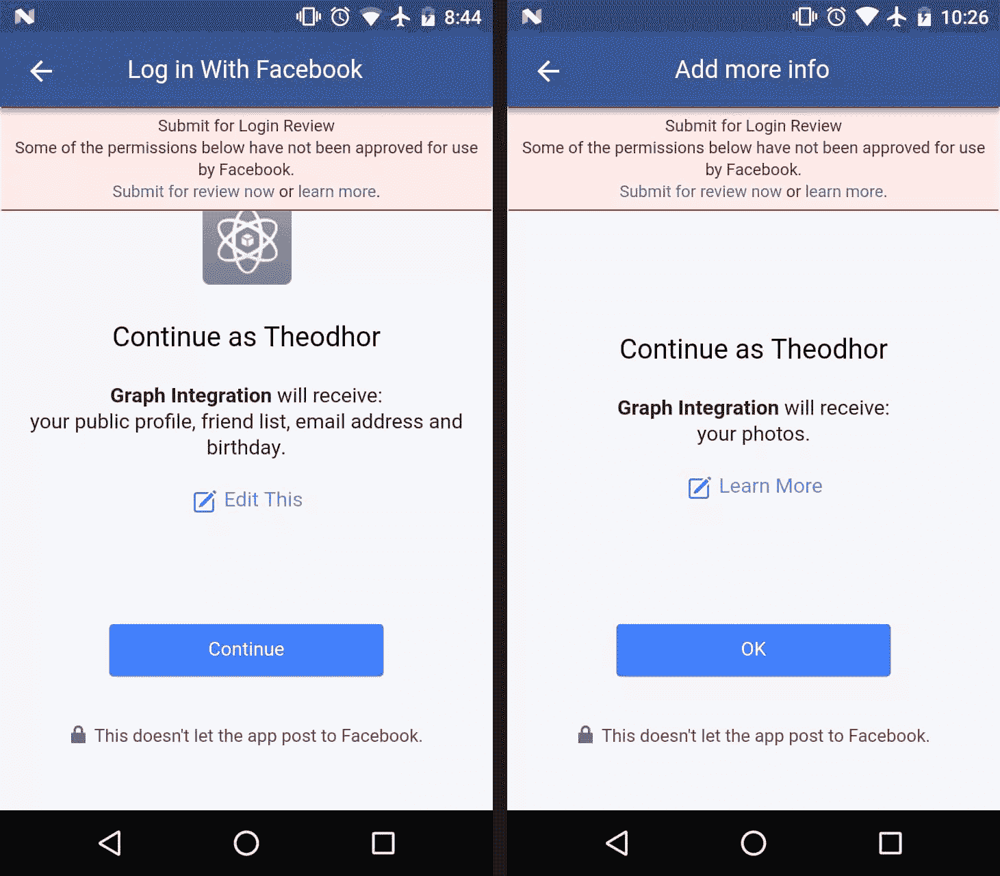
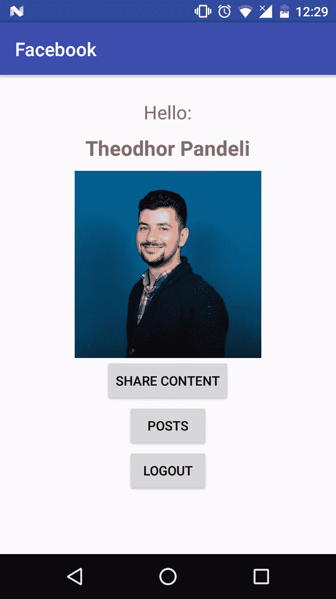
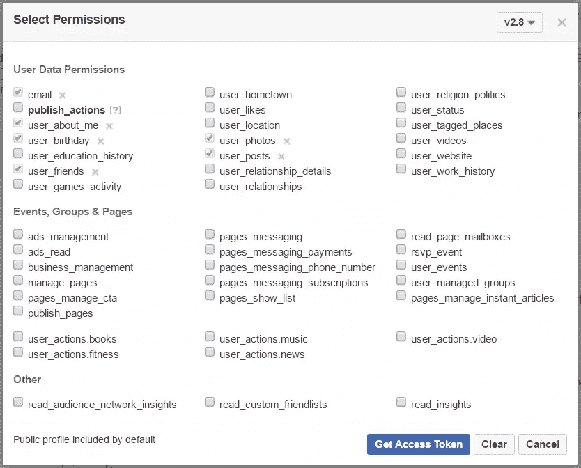

# 在 Android 中集成脸书图形 API

> 原文：<https://www.sitepoint.com/integrating-the-facebook-graph-api-in-android/>

在本教程中，我将展示如何使用 Graph API 发送请求并从脸书获取数据。你可以在 [Github](https://github.com/sitepoint-editors/Facebook-Graph-API-Android-Integration) 上找到这个项目

为了执行对图形 API 的请求，用户必须使用 Android 的脸书 SDK 登录。

你可以在这里找到**脸书登录整合**文章

## 创建项目并设置 SDK

确保你有一个最新版本的 Android Studio。我正在使用 2.2.3 版本
打开 Android Studio 并创建一个*新项目*，如你所愿命名。点击*下一步，*选择*最低 API 等级 17* ，再次点击*下一步*。选择*空活动*作为第一个活动，命名为 *LoginActivity* ，点击*完成*。

接下来，我们向项目添加另一个空白活动。*右击*包，选择*新建- >活动- >空白活动*。保留其默认名称，点击*完成*。

打开`build.gradle (Project)`并将`mavenCentral()`添加到两个存储库部分。然后打开`build.gradle (Module)`,通过将下面一行添加到依赖项来添加 SDK 库:

```
 compile 'com.facebook.android:facebook-android-sdk:4.18.0' 
```

打开`strings.xml`并添加这一行

```
<string name="facebook_app_id">{Your App ID here}</string> 
```

通过添加以下内容，确保您已授予*互联网*对您的应用程序的权限:

```
<uses-permission android:name="android.permission.INTERNET" /> 
```

在你的 *AndroidManifest.xml* 文件中。
在同一个文件中，在`<application></application>`标记内，添加:

```
<meta-data
    android:name="com.facebook.sdk.ApplicationId"
    android:value="@string/facebook_app_id" />

<activity
    android:name="com.facebook.FacebookActivity"
    android:label="@string/app_name"
    android:screenOrientation="portrait" /> 
```

## 登录

在`activity_login.xml`布局中添加*脸书登录按钮*:

```
<com.facebook.login.widget.LoginButton
            android:id="@+id/login_button"
            android:layout_width="match_parent"
            android:layout_height="wrap_content"
            android:layout_gravity="center_vertical"
            android:gravity="center"
            android:layout_margin="4dp"
            android:paddingTop="12dp"
            android:paddingBottom="12dp"/> 
```

这是在 *LoginActivity* 中显示的唯一小部件。

打开`LoginActivity`类。首先，我们需要通过添加以下内容来初始化*脸书 SDK* :

```
FacebookSdk.sdkInitialize(this); 
```

在`setContentView()`线之前。

在`onCreate()`方法之前初始化这些变量:

```
private CallbackManager callbackManager;
private AccessTokenTracker accessTokenTracker;
private ProfileTracker profileTracker;
private LoginButton loginButton;
private String firstName,lastName, email,birthday,gender;
private URL profilePicture;
private String userId;
private String TAG = "LoginActivity"; 
```

在`setContentView()`方法之后，添加以下几行:

```
callbackManager = CallbackManager.Factory.create(); 
```

这里我们创建一个`callbackManager`，它将被注册到我们的*脸书登录按钮*。
通过添加以下内容将创建一个*登录按钮*的实例:

```
loginButton = (LoginButton) findViewById(R.id.login_button);
loginButton.setHeight(100);
loginButton.setTextColor(Color.WHITE);
loginButton.setCompoundDrawablesWithIntrinsicBounds(null, null, null, null);
loginButton.setCompoundDrawablePadding(0); 
```

现在是创建`Login Result Callback`的时候了。这个回调将与我们之前创建的`callbackManager`一起附加到登录按钮上。

登录结果回调的代码如下:

```
FacebookCallback<LoginResult> callback = new FacebookCallback<LoginResult>() {
            @Override
            public void onSuccess(LoginResult loginResult) {
                GraphRequest request = GraphRequest.newMeRequest(loginResult.getAccessToken(), new GraphRequest.GraphJSONObjectCallback() {
                    @Override
                    public void onCompleted(JSONObject object, GraphResponse response) {
                        Log.e(TAG,object.toString());
                        Log.e(TAG,response.toString());

                        try {
                            userId = object.getString("id");
                            profilePicture = new URL("https://graph.facebook.com/" + userId + "/picture?width=500&height=500");
                            if(object.has("first_name"))
                                firstName = object.getString("first_name");
                            if(object.has("last_name"))
                                lastName = object.getString("last_name");
                            if (object.has("email"))
                                email = object.getString("email");
                            if (object.has("birthday"))
                                birthday = object.getString("birthday");
                            if (object.has("gender"))
                                gender = object.getString("gender");

                            Intent main = new Intent(LoginActivity.this,MainActivity.class);
                            main.putExtra("name",firstName);
                            main.putExtra("surname",lastName);
                            main.putExtra("imageUrl",profilePicture.toString());
                            startActivity(main);
                            finish();
                        } catch (JSONException e) {
                            e.printStackTrace();
                        } catch (MalformedURLException e) {
                            e.printStackTrace();
                        }
                    }
                });
                //Here we put the requested fields to be returned from the JSONObject
                Bundle parameters = new Bundle();
                parameters.putString("fields", "id, first_name, last_name, email, birthday, gender");
                request.setParameters(parameters);
                request.executeAsync();
            }

            @Override
            public void onCancel() {
            }

            @Override
            public void onError(FacebookException e) {
                e.printStackTrace();
            }
        }; 
```

这个回调有三个*被覆盖的*方法:`onSuccess()`、`onCancel()`和`onError`。每次用户登录时，只会调用其中一个方法。在`onSuccess()`方法中，一个新的`GraphRequest`将被创建。这个请求将接受两个参数:登录结果访问令牌(loginResult.getAccessToken())和一个带有`JSONObjectCallback`的新`GraphRequest`。
如果请求成功，将开始一个新的活动

GraphRequest 响应的类型是`JSONObject`，它将包含必需的字段。
在`onCreate()`方法结束标记之前，我们需要添加`loginButton read permissions`。

```
loginButton.setReadPermissions("email", "user_birthday","user_posts");
loginButton.registerCallback(callbackManager, callback); 
```


`LoginActivity`类的最后一个方法是:

```
@Override
    protected void onActivityResult(int requestCode, int responseCode, Intent intent) {
        super.onActivityResult(requestCode, responseCode, intent);
        callbackManager.onActivityResult(requestCode, responseCode, intent);
    } 
```

## 获取数据并共享给脸书


用户登录后，会启动一个`new Intent`。接下来的活动是`MainActivity`课。
确保你的`public class MainActivty implements View.OnClickListener`。
其布局的`xml`代码为:

```
 <LinearLayout
        android:layout_width="match_parent"
        android:layout_height="match_parent"
        android:orientation="vertical">

        <TextView
            android:text="Hello:"
            android:layout_width="wrap_content"
            android:layout_height="wrap_content"
            android:layout_marginTop="10dp"
            android:textSize="20dp"
            android:layout_gravity="center_horizontal"/>

        <TextView
            android:layout_width="wrap_content"
            android:layout_height="wrap_content"
            android:id="@+id/nameAndSurname"
            android:textSize="22dp"
            android:textStyle="bold"
            android:layout_marginTop="10dp"
            android:layout_gravity="center_horizontal"/>

        <ImageView
            android:layout_width="200dp"
            android:layout_height="200dp"
            android:id="@+id/profileImage"
            android:layout_marginTop="10dp"
            android:layout_gravity="center_horizontal"/>

        <Button
            android:layout_width="wrap_content"
            android:layout_height="wrap_content"
            android:id="@+id/share"
            android:layout_gravity="center_horizontal"
            android:onClick="onClick"
            android:text="Share Content" />

        <Button
            android:layout_width="wrap_content"
            android:layout_height="wrap_content"
            android:id="@+id/getPosts"
            android:layout_gravity="center_horizontal"
            android:onClick="onClick"
            android:text="Posts"/>

        <Button
            android:layout_width="wrap_content"
            android:layout_height="wrap_content"
            android:layout_gravity="center_horizontal"
            android:onClick="onClick"
            android:text="Logout"
            android:id="@+id/logout"/>

    </LinearLayout> 
```

打开`MainActivity`类，在“onCreate()”之前添加以下几行:

```
private ShareDialog shareDialog;
private String name, surname, imageUrl;
private String TAG = "MainActivity"; 
```

创建活动后要做的第一件事是从之前的活动中获取 *intent extras* 。

```
Bundle inBundle = getIntent().getExtras();
name = inBundle.getString("name");
surname = inBundle.getString("surname");
imageUrl = inBundle.getString("imageUrl"); 
```

我们可以使用`name`和`surname`变量来显示用户信息，方法是:

```
TextView nameView = (TextView)findViewById(R.id.nameAndSurname);
nameView.setText("" + name + " " + surname); 
```

因为我们的`MainActivity`类正在实现一个`View.OnClickListener`，所以我们需要`@Override`这个`onClick(View view)`方法:

```
@Override
public void onClick(View view) {
    switch (view.getId()){
        case R.id.share:
            share();
            break;

        case R.id.getPosts:
            getPosts();
            break;

        case R.id.logout:
            logout();
            break;
    }
} 
```

这是`share()`法:

```
private void share(){
    shareDialog = new ShareDialog(this);
    List<String> taggedUserIds= new ArrayList<String>();
    taggedUserIds.add("{USER_ID}");
    taggedUserIds.add("{USER_ID}");
    taggedUserIds.add("{USER_ID}");

    ShareLinkContent content = new ShareLinkContent.Builder()
            .setContentUrl(Uri.parse("http://www.sitepoint.com"))
            .setContentTitle("This is a content title")
            .setContentDescription("This is a description")
            .setShareHashtag(new ShareHashtag.Builder().setHashtag("#sitepoint").build())
            .setPeopleIds(taggedUserIds)
            .setPlaceId("{PLACE_ID}")
            .build();

    shareDialog.show(content);
} 
```

上面的方法共享一个*链接*内容。您可以使用类似的方法，如`SharePhotoContent`、`ShareVideoContent`、`ShareFeedContent`、`ShareMediaContent`等。内容应该总是显示在`ShareDialog`里面。

为了获得用户时间线帖子，我们需要制作一个`GraphRequest`:

```
private void getPosts(){
        new GraphRequest(
                AccessToken.getCurrentAccessToken(), "/me/posts", null, HttpMethod.GET,
                new GraphRequest.Callback() {
                    public void onCompleted(GraphResponse response) {
                        Log.e(TAG,response.toString());
                    }
                }
        ).executeAsync();
    } 
```

在这种情况下，用户帖子是我们可以从配置文件中获得的唯一数据，因为这是登录时唯一的权限请求:

log in button . setreadpermissions(" email "、" user_birthday "、" user _ posts ")；

可以看到下面的权限:


或者你可以试试 [Graph API Explorer](https://developers.facebook.com/tools/explorer/) 来更好的理解它是如何工作的。

`logout()`的方法是:

```
private void logout(){
        LoginManager.getInstance().logOut();
        Intent login = new Intent(MainActivity.this, LoginActivity.class);
        startActivity(login);
        finish();
    } 
```

## 结论

脸书图形 API 要比这广泛得多。这只是一个简单的应用，目的是展示它是如何在 Android 中实现的。如果你有任何问题，请在下面的评论中告诉我。

## 分享这篇文章