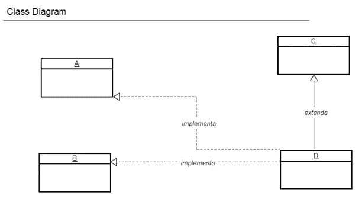

# Java 中的接口和继承:接口

> 原文：<https://www.sitepoint.com/interface-and-inheritance-in-java-interface/>

接口是一个 100%的抽象类。它只包含常量和方法签名。换句话说，它是一个类似于 class 的引用类型。无法实例化接口。它可以由一个类实现，也可以由另一个接口扩展。

## 如何定义:

接口可以定义如下:

```
public interface DriveCar { 
void turnLeft(); 
void turnRight();
void moveBack(); 
void accelerate();
}
```

接口中声明的方法没有方法体。默认情况下，接口中的所有方法都是**公共抽象**。类似地，我们在接口中定义的所有变量本质上都是常量，因为它们是隐式的**公共静态 final** 。所以，下面的接口定义等价于上面的定义。

```
public interface DriveCar { 
public abstract void turnLeft(); 
public abstract void turnRight(); 
public abstract void moveBack(); 
public abstract void accelerate(); 
}
```

## 如何使用:

接口定义了实现类必须遵守的契约。上面的接口`DriveCar`定义了一组必须由`Car`支持的操作。因此，实际实现接口的类应该实现接口中声明的所有方法。

示例:

```
class Car implements DriveCar{ 
void turnRight(){ 
//implementation code goes here 
} 

void turnLeft(){ 
//implementation code goes here 
}

void moveBack(){ 
//implementation code goes here 
}

void accelerate(){ 
//implementation code goes here 
}

}
```

现在我们可以获取一个类型为`DriveCar`的引用，并给它分配一个对象`Car`。

示例:

```
DriveCar carDriver=new Car(); 
carDriver.turnLeft(); 
carDriver.moveBack(); 
//other method invocations 
```

我们也可以用以下方式编码:

示例:

```
Car car=new Car(); 
car.turnLeft(); 
car.moveBack(); 
//other method invocations 
```

## 为什么使用接口:

接口充当 API(应用程序编程接口)。让我们以一家图像处理公司为例，该公司编写各种类来提供图像处理功能。因此，一个好的方法是创建接口，在其中声明方法，并让类实现它们。通过这种方式，可以将软件包交付给客户端，客户端可以通过查看接口内声明的方法签名来调用这些方法。他们不会看到方法的实际实现。因此，实现部分将是一个秘密。稍后，公司可能会决定以另一种方式重新实现这些方法。但是客户只关心接口。

接口提供了多重继承的替代方法。Java 编程语言不支持多重继承。但是接口提供了一个很好的解决方案。任何类都可以实现一个特定的接口，重要的是这些接口不是类层次结构的一部分。所以，一般的规则是**扩展一个但是实现多个**。一个类只能扩展一个类，但是它可以实现许多接口。这里一个类有多种类型。它可以是它的超类和它实现的所有接口的类型。

示例:

假设我们有两个接口 A & B 和两个类 C & D

```
interface A{ } 
interface B{ } 
class C{ } 
class D extends C implements A,B { } 
```

因此，D 类的对象有 3 种类型，如下所示:

```
A a=new D(); B b=new D(); C c=new D(); 
```



但是要小心。如果你使用接口作为引用类型，并给它分配一个实现类的对象，那么你只能调用那些在接口内部声明的方法。这很明显，因为实现类可以定义自己的方法，而这些方法不是接口和类之间的契约的一部分。因此，要调用这些方法，您必须使用该类作为引用类型，如下所示:

`D d=new D();`

## 扩展接口:

考虑下面的场景。你有一个接口 A 和几个实现类。它定义了两种方法。

```
interface A{ 
int doThis(); 
int doThat(); 
} 
```

现在假设您想向接口 A 添加另一个方法:

```
interface A{ 
int doThis(); 
int doThat(); 
int doThisAndThat(); 
} 
```

如果将第三个方法添加到接口中，将会破坏代码，因为实现类将不再遵守契约。但是，如果我们创建另一个接口并使其扩展前面的接口，就可以避免这个问题。

```
interface APlusPlus extends A{
int doThisAndThat(); 
} 
```

现在，您的用户可以选择使用旧界面或升级到新界面。

**注:**

任何实现接口的类都必须实现该接口中声明的方法，以及超级接口中存在的所有方法。

如果实现类是抽象的，它可以选择实现接口中声明的所有方法、部分方法或不实现任何方法。但是抽象类的具体子类必须实现所有未实现的方法。

## 总结:

*   接口只能包含常量和方法签名，而不能包含实现。
*   *接口不能实例化。它们只能由实现类实现或由另一个接口扩展。*
*   实现接口的类必须提供接口中声明的所有方法的实现。
*   接口可以作为实现类的对象的引用类型。
*   一个接口可以被另一个接口扩展。

## 分享这篇文章