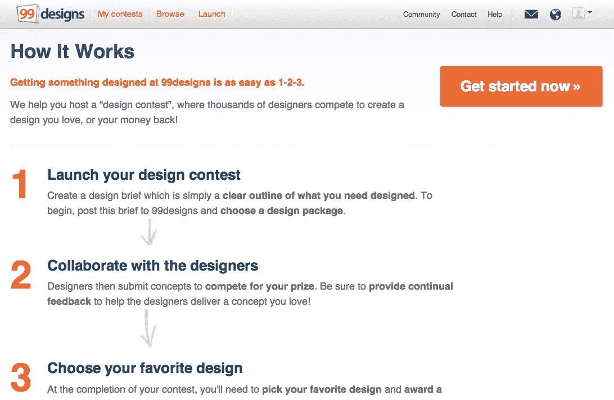
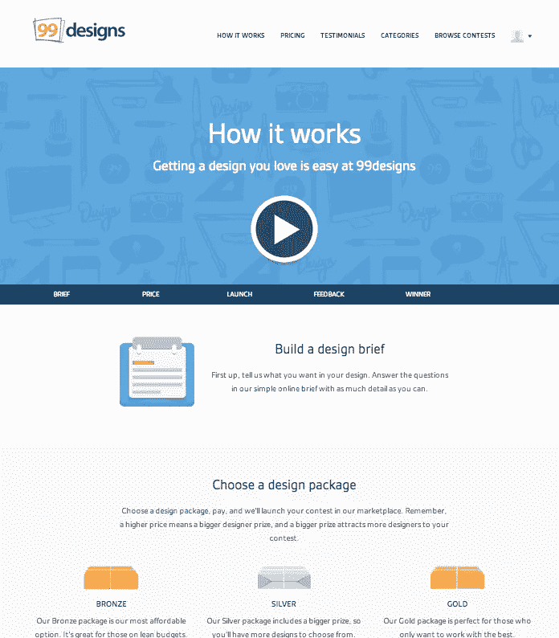

# 国际化:复制难题

> 原文：<https://www.sitepoint.com/internationalization-the-copy-conundrum/>

Lars 最近的文章《国际化 99designs》解释了开发人员为使 99designs 网站多语言化所做的工作。

今天，我想看看关于将英文网站营销文案翻译成英语以外的语言的一些问题。

## 翻译基础

首先，让我们确保我们在国际化的一个重要方面达成一致。

我们不能指望对文本进行直接的、逐字逐句的翻译，在常规的基础上有任何程度的可靠性。为什么？因为语言和文化是纠缠在一起的，而每种文化表达的意思都不一样。

据我所知，似乎每一种语言都有词汇来表达其他语言所没有的东西。因此，尽管逐字翻译在某些个别情况下可能是可行的，但它不太可能是一种始终如一的表达意思的理想方式。

从最基本的层面来说，从布局的角度来看，这也不太可能实现。想想把你的英文网站翻译成一种使用[标识系统](http://en.wikipedia.org/wiki/Logographic)编写的语言(例如，韩国的[汉字](http://en.wikipedia.org/wiki/Hanja)，或者日本的[汉字](http://en.wikipedia.org/wiki/Kanji))，你马上就会明白为什么直接翻译并不总是可行——即使两种语言都有意思相同的单词。

这意味着人类需要参与进来，而不仅仅是在逐字翻译的层面上。以下是一些影响网站转换成不同语言和地区的因素。

## 品牌

99designs 站点的国际化与最初的 99designs 站点的重新开发几乎同时发生。重建的一个关键部分是重新定位品牌。

围绕品牌所做的工作被收集到一个单一的风格指南中。这是用英语写的(幸运的是，全球所有 99designs 的国家经理都精通这种语言)。

风格指南涵盖了从字体和颜色到企业使命、价值主张和用户角色的所有内容。这意味着，当需要翻译文本时，国家经理可以从一个角度来衡量风格、语气和品牌个性。

如果没有这份文件，他们的国家经理会用什么来指导他们自己的文案翻译？潜在地，他们唯一的参考将是英文网站本身。

但是将营销材料本身作为翻译的唯一依据并不是一个好主意，原因如下:

*   对于新聘的国家经理来说，网站本身并不能提供深入的信息和必要的背景来理解 99 与观众沟通的方法背后的思想。
*   只看网站上现有的文本可能会鼓励逐字翻译，而风格指南则鼓励员工退一步，看看我们试图实现的目标，然后重新考虑如何最好地实现与当地受众的沟通目标。
*   网站是交流的冰山一角；有了更多的背景信息，任何国家的员工都可以找到更好的方法来完善 99designs 的信息，以适应他们文化和语言的独特方面——并在现有的布局内实现这一点。

当你比较[时，你可以清楚地看到品牌重新定位的影响。这个网站有一个新的翻译版本，比如](http://99designs.com/) [99designs.nl](http://99designs.nl/) 。所以你可以比较两个网站的内容，我在这里附上了旧英文网站的[页面和新网站的](https://99designs.com/how-it-works)页面的截图。

如你所见，改变的不仅仅是外观或文字:提供信息的方式以及所提供信息的性质也受到了更名的影响。

## 感觉和文化

我们上面提到了文化，但重要的是要承认语言的文化方面不只是阻止一些短语在直接翻译中有意义。

它们还可以提供机会，以其他特定于文化的方式传达你的信息，对于使用某种语言的人来说，这种方式有更深层次的意义，可以说有更大的共鸣。

这不仅仅是关于使用习语；这是关于谈论实际意义。让我告诉你我的意思。

99designs.com 的标题看起来很简单。但一些语言可能会使用一个短语，而不是一个单词来表达保证的概念(就像法语使用“小午餐”——在该语言中相当于三个单词——来表示“早餐”)。所以词汇是一个问题——这包括你的[品牌词汇](https://www.sitepoint.com/tell-the-story-of-your-brand-service-or-product-with-a-brand-vocabulary/)。你选择的词语是否适合你翻译的目标语言和目标人群？

语法可能也是一个问题。假设他们有一个，一些语言可能不使用他们的单词“保证”作为动词。各种语言在使用句子主语和宾语、动词的变化以及冠词的使用方式上都有所不同——所有这些都可能使理解成为一项真正的挑战。然后，再加上链接文本这样的问题，事情会变得更加棘手。

还有一些常见的、特定于文化的用法需要考虑。正如迈克尔在上周的帖子中指出的那样，在不同的 T2 英语区的某些情况下，甚至像“请”这样简单的词都可能在文化上不合适，更不用说在使用其他语言的地方了。

但是等等！我们不要忘记标点符号。认为它只是点和破折号(还有引号、逗号、圆括号和省略号……不胜枚举)的问题就好了，但是标点以极其微妙的方式影响着意义。考虑这些备选标题:

*   获得您喜欢的设计—保证
*   获得您喜欢的设计:保证
*   获得您喜欢的设计。担保
*   得到一个你会喜欢的设计？担保

我不想让自己听起来很戏剧化，但是糟糕的标点符号真的会是一场灾难。正如用英语做好通常需要专家一样，用外语做好也是如此。

## 长度和空间

我们在上面提到了标识书写系统，但是你不需要在[书写系统](http://en.wikipedia.org/wiki/List_of_writing_systems#Logographic_writing_systems)之间切换来让翻译打破你的布局。

许多拉丁字母书写系统使用[变音符号](http://en.wikipedia.org/wiki/Diacritic)来改变你的副本所需的空间。语法和词汇问题会让行和段落变长。当以不同的语言呈现时，即使是单个单词的菜单项也会打乱你的导航设计。

## 人类的解决方案

这是一个很大的潜在问题列表，但这意味着你不能总是依赖直接的逐字翻译。你需要使用一个有语言经验的翻译，他也能为你的品牌做公正的评价。也许你的公司已经有这些人了，但是如果没有，你可能需要雇佣一些。

99designs 长期从事翻译的地方之一是在 [99designs 帮助内容](http://99designs.com.au/help)中。这个帮助可以从[站点](http://99designs.fr/help)的所有[不同版本](http://99designs.nl/help/)中获得。我们用英语编写最初的帮助文章，然后让相关国家的工作人员将其翻译成他们负责的语言。

《品牌风格指南》包含了我们的品牌词汇(英文版),已经可以支持这项工作了——当然，在这个过程中，对于不同的翻译和文化，可能需要围绕该词汇进行一些协商。但它将帮助我们翻译和开发除英语之外的其他语言的营销文本，这些文本具有品牌意识、文化敏感性和吸引力。

不过，就营销文本而言，我敢打赌，99designs 最终会希望与精通每种语言的文案合作，以获得针对每个当地市场的最佳沟通效果。

## 分享这篇文章