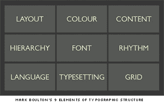
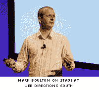

# 对漫画的坦白:马克·博尔顿访谈

> 原文：<https://www.sitepoint.com/interview-mark-boulton/>

在今年的 *[网络方向南方](http://south09.webdirections.org/)* 会议上，SitePoint 的 Matthew Magain 采访了设计师、演讲者和作者 [Mark Boulton](http://www.markboulton.co.uk/) 。这是他们的聊天记录。

Mark, thanks for coming to Australia. When we spoke earlier, you mentioned that you love this country and occasionally contemplate moving here. Surely you’d miss the British weather, though?

哈哈！从这个星期来看，不。这里有你自己的英国天气！

这是我们第三次旅行了。大约十年前，我和妻子曾在曼利住了六个月，三年前我们回来参加了一个婚礼。每次我们回来都会有同样的讨论，比如，“我们应该搬到这里吗？”太美了。

老实说，我想我们会错过一杯好茶。茶不是很好。

But the coffee’s excellent!

咖啡很棒——但我不喝咖啡！给你。

You’re well-known for being a typographic designer. Could you tell our readers what a typographic designer does?

首先，我用字体来设计——这不仅仅是选择字体。它意味着排版设计的所有元素，从网格和层次到排版，以及所有类似的东西。这意味着专注于此。所以排版设计师和平面设计师的区别在于平面设计师做排版设计，但这不是他们的主要关注点。他们通常专注于图像、摄影和艺术指导——这些方面。

Many of our readers and listeners think of typography as being one aspect of design, but you were saying in your presentation today that you consider imagery, layout, and color to each be one aspect of typography?

是的，我知道。我认为你在设计中使用的任何图像都应该适合一个网格。网格是印刷网格。它应该被创造和设计为首要元素的印刷铭记。它们都与类型有关，作为设计师，我们在网上做的 99%都是排版设计。

当然，你有交互层，确保它是可用的。但我认为所有这些都是排版设计。真的。想象一个设计师在做我在大学里做的事情:设计一本百科全书。你必须考虑导航和访问结构，你必须考虑层次和流程，因为百科全书不是从头到尾读的——它是一本参考书。所以它必须像网站一样被导航。在我看来，相似之处非常明显。

The key slide in your presentation that stood out was the [9 factors of typographic structure](http://www.markboulton.co.uk/journal/comments/web-directions-typographic-structure). It really resonated for me. Would you mind sharing how you came up with that structure, and how you use it in your workflow?

是的。达到这一点需要一段时间。这是我用来解释我对排版的想法的第三个模型，我认为排版是什么。结构由九个方格组成:我们沿着底层有 *功能*—语言、排版、网格；在此之上，我们有代表 *形式* 的东西——节奏、字体和层次；在顶部我们有 *属性*——布局、颜色和内容。

所有这些必须一起工作来创建一个强大的排版结构，虽然你可以删除一对夫妇，仍然保留一个强大的结构。在网络上，我们总是有非常有限的字体选择，以至于设计师很少考虑字体。但是由于所有其他元素，我们有一个非常强大的结构，所以我们能够在网络上创建非常好的、强大的排版设计。

仅仅因为我们不能选择我们的字体，并不意味着我们必须做出糟糕的作品。仍然有可能在网络上创建立体的排版设计。

I have to confess one point that came to mind when I saw you omit “font” from your typographic structure—I thought, “but the center doesn’t hold!” Is having this whole range of new fonts available on the horizon for use as simple as dropping “font” into the equation? Or are we going to have to relearn the structure for every font?

是的，这并不像把它放进去那么简单，这是我对`@font-face`的一个担忧——这样做的门槛就像从下拉菜单中选择漫画 San 一样简单。它不需要任何思考。当你选择一种字体时，你用一种不同的字体替换中间的那一点，它对周围的一切都有影响。所以，是的，任何放入其中的字体都会影响排版、布局、内容和节奏。

Speaking of Comic Sans, you mentioned in your presentation that you had, perhaps mistakenly, been held up as a defender of the font. Do you want to clarify what your stance is on Comic Sans, and where it fits in the big picture?

我几乎可以听到一些设计师心中的愤怒。不，我不认为漫画字体不好。糟糕的设计师用过它，非设计师也用过它，他们在没有合适工具的情况下做设计决策。例如，我的父母可能会为他们的教堂制作一份时事通讯。他们希望它友好，所以他们使用漫画桑。我们到处都能看到这种情况。

它只是被用在错误的上下文中太多次了，因为进入的门槛太低了——不需要印刷学校就能从下拉列表中选择它。人们无缘无故地痛斥它。这是一种被过度使用的字体，而不是一种本来就不好的字体。

Talking about bad fonts—an audience member at the end of your session asked about free fonts, and you responded that you thought the majority were “rather crappy.” Tell me, then: what’s the difference between a bad font, and a font *perceived* to be bad like Comic Sans.

有一些不同之处。首先，是软件的实际质量——它在不同平台和其他浏览器上的表现如何。我在自由字体中看到的最大问题是糟糕的字距调整——单个字母之间的距离。例如，如果您有一个大写的 *T* ，旁边有一个小写的 *r* ，则 *r* 必须位于 *T* 的横木下方。这些类型的问题，包括间距要求，需要由印刷工在生成字体时解决。使用免费字体——因为它们是免费的，而且它们背后没有商业支持——那么时间可能会减少，结果字距调整会更差。

此外，免费字体通常缺乏宽度的重量可用，使他们适得其反，以商业用途。相当多的设计师会选择印刷世界中的字体，并希望整个设计中能够使用完整的字体系列；这样，他们可以只使用一种字体，并在许多应用程序中使用它。自由字体，另一方面，一般只有单一的重量。它们很少有多种重量的。所以这是另一个问题。

而且它们需要很长时间来生产。我不想尝试免费字体。字体设计是一门完全不同的学科。我向字体设计师致敬，因为这是一项艰苦的工作；这需要很长很长的时间来做，也难怪代工厂非常保护(正常情况下)年复一年的工作。

I have a question about fixed and fluid layouts, as it’s obviously one of those topics that generate almost religious fervor in debate and discussion. The concept of a grid, and the concept of vertical rhythm—these are elements that seem to work quite well for a fixed layout. Is it possible to apply those concepts to a fluid layout as well?

是的，它是。只是你的基本度量单位需要是相对的，而不是固定的。所以你可以用百分比来表示 ems。很多时候，对于任何一种布局，使用 em 实际上比使用像素更好，因为 em 与你的类型有关。所以在布局和你使用的字体之间有一种内在的联系。

What about incorporating IAB ad units, which are always specified in pixels, and which won’t change as text size increases or decreases?

我认为这归结于控制。归根结底，设计师需要在网络上失去控制，这是设计师很难做到的。我在过去的几天里提到过这个问题，像 Khoi Vinh 这样的人已经谈论这个问题很多年了；我想我只是刚刚开始理解他的想法。这并不是因为设计师很难相处——这是我们被教育的方式。这是我们 DNA 的一部分:控制信息，控制设计。因此，要求我们失去控制实际上是一个很大的要求，我认为这就是为什么许多设计师最终会固定下来——因为他们可以在一定程度上控制它。

Maybe it’s their clients that are unable to give up that control?

也许是吧！这也是一个大问题——客户的期望。但是你知道，客户的期望也可能是相反的。我有一些客户期待全幅、流畅的布局，他们会问，“为什么屏幕上有这么多空白？”所以这是双向的。

In your talk, the definition of typography that you presented was: “the mechanical notation and arrangement of language.” My question is, does the word “mechanical” imply that the art of typography is more of a science than an art?

是的，我想是的。我认为字体设计——字体的设计——更类似于艺术。在这个过程中有很多艺术技巧。设计一种特殊的字体来传达大量文本的某种感觉或想法是非常具有挑战性的。与其说是科学，不如说是艺术。

印刷设计，我正在谈论的东西，更科学，真的。有规则，有做事的方法…这绝对不是艺术而是字体设计。

Finally, I thought your presentation was fantastic, but I was unable to work out whether you were pessimistic or optimistic about the imminent arming of hobbyists with a whole stack of new fonts to choose from.

哈哈，是的，我想我两者都有一点。我现在有点悲观，因为我觉得我们在给孩子们发手榴弹。使用错误的工具——比如下拉菜单中的漫画——人们无法做出好的设计决策。

对于设计师来说，我认为这很令人兴奋，这是一个很好的地方。然而，我认为现阶段我们缺乏合适的字体在网络上使用。网络字体和印刷字体之间的差异是巨大的——不仅仅是在技术上，而是在字体本身的实际设计上。我希望看到浏览器供应商或大公司挺身而出，像微软一样，投资设计和分发网络字体——无论是像 TypeKit 这样的公司，还是代工厂自己——这样就有办法把正确的字体放到正确的人手里。因为目前，把 Garamond 或者 Bodoni 放到网上是相当普通的。

Thank you very much for your time, Mark, it’s much appreciated. And enjoy the rest of your time in Australia.

没关系，非常感谢！

## 分享这篇文章