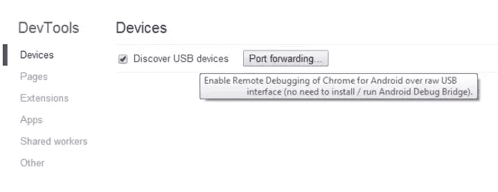
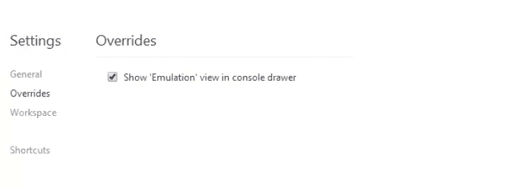
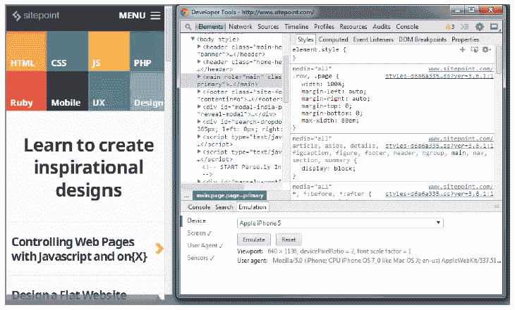

# 手机版 Chrome DevTools 简介

> 原文：<https://www.sitepoint.com/introducing-chrome-devtools-mobile/>

谷歌总部的网络大师们最近发布了一项公告，这应该会给移动网络开发注入一剂备受赞赏的强心针。在本月早些时候发布的 Chrome Beta 更新中，Chrome DevTools for Mobile 旨在使移动网络开发像其桌面版一样简单。

与内置的开发者工具悄悄捆绑在一起，任何拥有 Chrome 浏览器更新版本(测试版)的人都可以快速导航到菜单>工具>开发者工具，以启用
DevTools 窗口，并体验新的移动功能。

## 屏幕共享便于调试

那些使用 Android 手机的人可以利用 Chrome 新的“截屏”技术，将你的移动设备作为一个更真实的测试平台。只需通过 USB 连接您的 Android 设备，并在设备设置中启用“USB 调试”。没有必要与 adb 命令行或迟钝的配置争论。Chrome 将通过自动发现你的手机并将其集成到开发者工具选项中来处理剩下的事情。

一旦连接上，你可以通过点击开发者工具窗口中的专用按钮开始[截屏](https://developers.google.com/chrome-developer-tools/docs/remote-debugging#screencasting)，然后在一个新的面板中呈现你的设备屏幕。你的 Android 设备可以直接从你的桌面屏幕上接收输入。

这一特性为提高生产率提供了机会。当浓缩后，你基本上减少了在桌面和移动显示器之间切换调试的时间。您还可以放心，通过截屏，您实际上是在物理硬件上查看站点的性能，而不是仿真。

顺便说一下，所有这些都可以通过访问 Chrome 浏览器中的`chrome://inspect`进行配置:

顺便提一下，上图中的“端口转发…”按钮为那些可能没有在同一个网络上安装屏幕和开发机器的人提供了一点灵活性。在这种情况下，您可以在移动设备上创建一个侦听 TCP 端口，并将其映射到开发机器上的给定 TCP 端口。所有转发的流量都通过 USB 传输，绕过移动设备的网络配置。在某些情况下，这当然是一个方便的特性。

## 移动仿真

Chrome 的 screencast 允许你在桌面屏幕的舒适范围内查看网站的真实 Android 性能，新的[移动仿真](https://developers.google.com/chrome-developer-tools/docs/mobile-emulation)功能允许访问更广泛的设备进行调试。

启用仿真视图就像在开发人员工具设置菜单中选中正确的框一样简单:

在仿真视图(位于控制台抽屉内)中，可以设置关于视口的属性。这些包括用户代理、屏幕分辨率、像素比率以及流行设备的预设模板。

通过点击“仿真”按钮，当前页面根据设置的属性缩小到仿真屏幕参数。这种模拟显示可以用鼠标操作，就像用手指在物理设备上操作一样。

利用 Chrome DevTools for Mobile 的这一特性，可以在各种移动设备上进行更快、更彻底的调试。手指缩放、手指滚动甚至多点触摸事件都可以在该视图中模拟。

## 移动调试中的跑腿工作

最终，这些新的 Chrome 移动开发工具消除了一些在非移动设备上开发移动网站的常见问题。随着移动浏览的持续增长以及随之而来的对响应式网页设计的需求，像 Chrome 的 DevTools for Mobile 这样更容易为移动用户开发的工具总是受欢迎的。

通过提供一种简单而全面的方法来将您的 Android 设备集成到调试过程中，并提供有用的工具来在同一个屏幕上模拟过多的流行移动设备，谷歌的新开发工具集保证了 Chrome Beta 的下载。

哦，我有没有说过这是完全免费的？

## 分享这篇文章