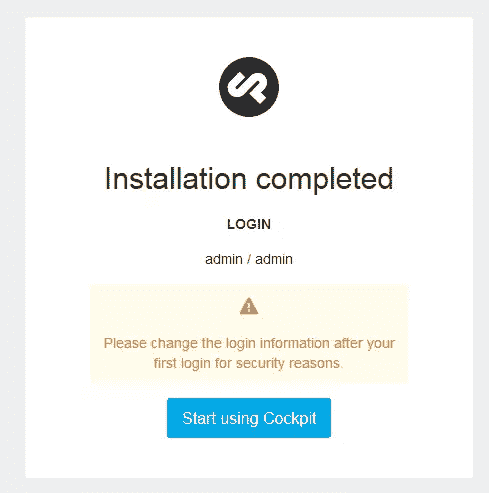
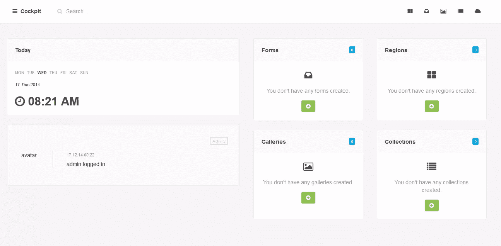
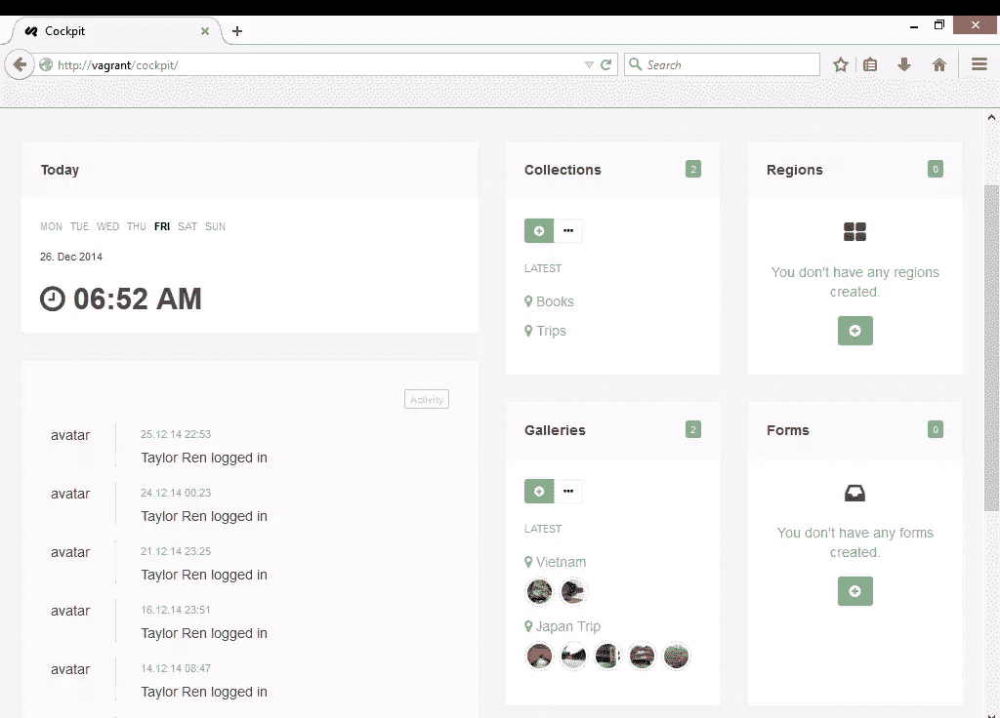
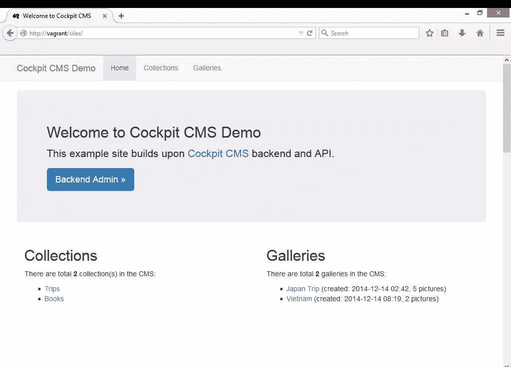
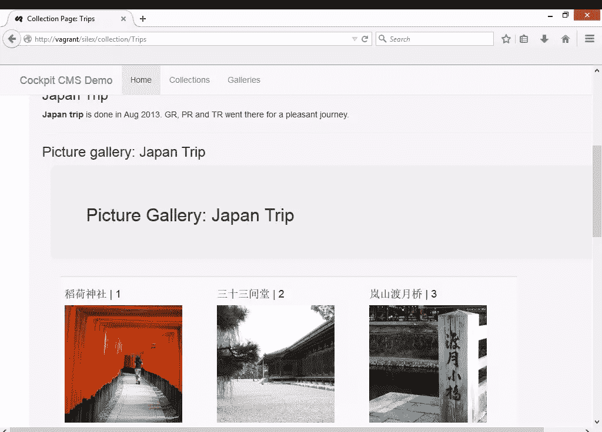

# CockpitCMS 简介——面向开发人员的 CMS

> 原文：<https://www.sitepoint.com/introducing-cockpitcms-cms-developers/>

在本教程中，我们将了解如何使用 [Cockpit CMS](http://getcockpit.com/) 来设置 CMS 后端，以及如何使用 Cockpit 提供的 API 接口来构建定制的功能前端。

不像其他“重型”或“完全成熟”的 CMSes，驾驶舱是轻型和“裸露”的。它只提供了一个后端来管理元数据和数据条目，而前端都在开发人员的手中。

## 装置

驾驶舱 CMS 的副本可以从[这里](http://getcockpit.com/download)以 zip 格式下载。下载后，只需将存档文件解压缩到您的 web 服务器上可访问的目录中。在我的例子中，它被映射到:`http://vagrant/cockpit`。

接下来，访问安装页面:`http://vagrant/cockpit/install`开始安装过程。

**注意:** Cockpit 默认使用 SQLite 作为其数据库引擎。如果您尚未安装 SQLite，请在安装前安装。

**注意:**驾驶舱还要求它的`/storage/data`目录是可写的。请相应地更改该目录的模式。

安装只需点击一下。安装完成后，您将看到以下页面:



现在我们可以使用`admin/admin`登录，将显示后端管理仪表板页面:



嗯，我们还没有做任何准备。在我们创建自己的内容之前，让我们了解一下 Cockpit 中的几个关键模块。

## 驾驶舱内的模块

驾驶舱最重要的两个模块是:收藏和画廊。

我们可以将“集合”视为一堆表格。所有集合都在 Cockpit 中定义，包含几乎所有类型的各种字段。集合由“**条目**填充，这类似于表中的记录。

画廊就是“相册”。一个用户创建了一个相册，其中可以包含稍后可以在后端使用的图片。

Cockpit 还有其他模块:表单、区域(一种插入前端页面的可重用片段)、媒体管理器(管理站点中的所有媒体文件)。这些模块(包括收藏和画廊)的详细文档可以在官方网站上找到。

### 创建一个`Trip`收藏

首先，我将创建一个收藏来记录我的旅行。我们需要为集合(`Trips`)提供一个名称，并定义它的条目将包含什么:


它是一个简单的结构，由以下字段组成:

*   `name`:一个`Text`字段。
*   `date`:一个`Date`字段。
*   `location`:一个`Text`字段。
*   `diary`:一个`Markdown`字段，用于捕捉旅行中的一些亮点。
*   `pic`:一个`Text`字段，用于链接到与旅行相关的图片集。

上面的屏幕截图显示了用户如何直观地定义结构和其他选项(比如“在入口页面中显示什么，以及在哪个字段上按什么顺序显示”)。挺直观的。

**注意:** Cockpit 还会自动创建其他几个字段来存储 ID、创建日期、修改日期等信息。我们也可以在代码中使用这些“元”字段。

我们创建了一个字段`diary`来包含降价文本。稍后，我们将看到如何在网页中显示它。

您可能还注意到，尽管 Cockpit 支持字段类型“`Gallery`”，但我们仍然使用“`text`”字段。这是因为 Cockpit 还不能链接收藏条目中的现有画廊。稍后，我们将看到如何解决这个问题。

我们可以创建更多的收藏，画廊，并在那里放下一些条目。



现在，让我们转到“前端”部分。

### 前端

**注意:**我们将使用带有 Twig 的 Silex 框架来构建我们的前端，但是你可以选择你最喜欢的——逻辑在任何情况下几乎都是一样的，只要你做我们下面提到的`require`。

Cockpit 有一个整洁的后端，但是它缺少一个前端来呈现数据。实现这一点是程序员的工作。为了促进这一点，Cockpit 公开了一些基本的 API，这些 API 按照不同的模块和不同的助手进行分类。官方文档包含这些函数的列表。在本演示中，我们将只关注其中的一部分。

首先，让我们看看如何显示包含所有摘要信息的欢迎页面。

**注意:**要在我们的 PHP 代码中使用这些 API，请`require_once __DIR__ . '/../cockpit/bootstrap.php';`



代码如下所示:

```
$app->get('/', function () use ($app) {
    $collections = cockpit('collections:collections', []);
    $galleries = cockpit('galleries:galleries', []);

    return $app['twig']->render('index.html.twig', ['collections' => $collections, 'galleries' => $galleries]);
})->bind('home');
```

我们通过 Cockpit API 接口获取所有的集合和图库。这很简单。

可以使用下面的小枝代码显示集合部分:

```
<h2>Collections</h2>
	<p>There are total <strong>{{collections|length}}</strong> collection(s) in the CMS:</p>
    <ul>
    
    	<li>
        	<a href="{{ url('collection', {col: col})}}">{{col}}</a>
        </li>
    
    </ul>
```

在 Symfony 的新 [VarDumper](https://www.sitepoint.com/var-dump-introducing-symfony-vardumper/) 的帮助下，检查变量的内部结构非常方便，这样我们就可以很容易地定位到要使用的正确成员。

**注意:** `VarDumper`也可以在 Silex 中使用，也可以在其他任何框架或非框架 app 中使用。关于 Symfony 这个新工具的详细介绍，请看看 [Bruno 关于 VarDumper](https://www.sitepoint.com/var-dump-introducing-symfony-vardumper/) 的文章。要在 Silex 中使用它，您需要`use Symfony\VarDumper;`并在您的`composer.json`文件中添加一行:

```
"symfony/var-dumper": "3.0.*@dev"
```

我们现在可以单击一个入口链接，它会将我们带到入口页面:



这里需要强调两点。

条目的注释(`diary`字段)是一个`Markdown`字段，我在后端的输入是:

```
###Japan Trip

**Japan trip** is done in Aug 2013\. GR, PR and TR went there for a pleasant journey.
```

使用 Markdown 语法，我可以跳过在线编辑器的配置，使用“纯文本”来实现一定程度的格式化效果，在大多数情况下，这就足够了。

为了在最终的 HTML 页面中显示 Markdown，我们需要通过在`composer.json`文件中添加一行来安装 Markdown 包:

```
"michelf/php-markdown": "~1.4"
```

并在我们的`index.php`文件中引用它:

```
use Michelf\MarkdownExtra;
```

**注意:**我在这个演示中使用了 Markdown Extra 语法。关于 Markdown(和 Markdown Extra)语法的细节可以在[这里](https://michelf.ca/projects/php-markdown/reference/)找到。

减价字符串(文本)的呈现很简单:

```
foreach ($entries as &$entry) {
        $text = $entry['diary'];
        $html = MarkdownExtra::defaultTransform($text);

        $entry['diary'] = $html;
    }
```

Markdown 渲染的输出令人满意。

接下来，我们可能想要显示与该条目相关联的图片库。如前所述，没有简单的方法(或者在我看来，直观的方法)来做到这一点。在这个演示中，上面定义的`pic`字段充当包含图片的图库的“链接”。显示图像需要几行代码。

```
$app->get('/gallery/{gal}', function ($gal) use ($app) {

    $images = cockpit("galleries")->gallery($gal);
    foreach ($images as &$img) {
        $image = $img['path'];
        $imgurl = cockpit('mediamanager:thumbnail', $image, 200, 200);
        $img['cache']=$imgurl;

        $path=$img['path'];
        $url=str_replace('site:', 'http://'.$app['request']->getHost().'/', $path);
        $img['url']=$url;

    }

    return $app['twig']->render('gallery.html.twig', ['images'=>$images, 'gal'=>$gal]);
	}
	)->bind('gallery');
```

第一步是通过调用 Cockpit API: `$images = cockpit("galleries")->gallery($gal);`获取特定图库的所有图像。

接下来，我们需要从每张图片中获取两样东西:缩略图和图片的真实路径。

为了获得缩略图，Cockpit 提供了一个 API: `cockpit('mediamanager:thumbnail', $image, 200, 200);`，其中`200`指定缩略图的宽度/高度。还有一些其他选项可用于创建缩略图，如控制质量和裁剪模式。有关详细的用法说明，请参考文档。

不过，这个 API 缺少一点，那就是自动旋转图片，以便能够正确识别和显示纵向拍摄的照片。现在，无论原始图片的方向如何，系统都会以横向模式显示所有图片。

驾驶舱不存储图片的真实路径。这在我的情况下可能有意义，因为我的图片实际上是使用`vagrant/cockpit`加载到后端的，而前端是`vagrant/silex`。

如果我们检查`$images`的 VarDumper 转储，那么`path`实际上类似于:`"path" => "site:cockpit/asseimg/IMG_3427.JPG"`。因此，我们使用一个`str_replace`来为这个图像生成一个真实的网络 URI:`"url" => "http://vagrant/cockpit/asseimg/IMG_3548.JPG"`。当然，要实现这一点，我们必须确保图像通过 URI 得到正确的服务。

就是这样！通过不多的代码，我们有了一个由驾驶舱 CMS 驱动的功能前端。

### 结论

驾驶舱重量轻，易于安装和设置。它的后端整洁而直观。创建收藏和画廊很简单，我个人喜欢它提供的各种领域类型。在收藏中填充一个条目并将图片加载到图库中也不难。

在我看来，缺少前端并不是一件坏事。不同的集合结构肯定需要不同的表示和布局。例如，`book`收藏可能使用表格样式，而`trip`收藏可能包含显示一些图片的图库部分。一个条目的所有字段的缺省转储将只是丑陋和不合适的。因此，我认为 Cockpit 不提供这样的服务是非常明智的。但是，这将要求用户为每个集合结构编写不同的布局。在某些情况下，这可能会很麻烦和耗时，并且需要一定的编程技能，这就是为什么 CockpitCMS 将自己标记为“开发人员的 CMS”。

它的 API 在我们做前端开发的时候是很有价值的，但是它还是不完整。例如，我在使用 CMS 的短暂时间里注意到，缺乏对图片提供可用的真实路径，以及缺乏根据图片方向旋转图片的选项。我建议 CMS 的作者在这方面做一些进一步的改进。

最关键的是，它没有提供 API 来 CRUD 一个条目。这可能是因为集合结构互不相同，而且提供一个通用的 CRUD API 几乎是不可能的。但这也阻止了我们使用 PHP 代码快速、轻松地管理数据。留给我们的只有后端，有时候可能不够方便。我很乐意看到 API 的这一部分成为现实。

Cockpit CMS 最适合那些拥有一定水平的 PHP、CSS 和框架知识，不愿意被其他更重的 CMS 束缚，希望打造一个简单、整洁、“一切尽在我掌控”的 CMS 来炫耀自己的工作和生活的 PHP 开发人员。然而，需要强调的是，这可能会增加编程难度，尤其是当我们需要在 fronend 中添加更多功能时。

驾驶舱提供的某些其他领域没有在这篇文章中涉及到——请随意探索它的潜力并分享你的成就。

本教程的演示代码可以在 Github repo [这里](https://github.com/sitepoint-editors/cockpitdemo)找到。

## 分享这篇文章