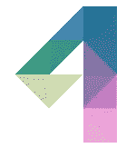

# 介绍四:是 WebGL，但是更简单

> 原文：<https://www.sitepoint.com/introducing-four-webgl-easier/>

WebGL 已经存在了几年，我们已经看到它成熟为今天这样可靠且受到广泛支持的图形技术。随着像 Google、Mozilla 和微软这样的大公司提倡使用它，很难不对它感到好奇。

自 2011 年其规格最终确定以来，它已经获得了很大的吸引力。在像 [ThreeJS](http://threejs.org/) 、 [BabylonJS](http://www.babylonjs.com/) 和 [Play Canvas](https://playcanvas.com/) 这样的框架的帮助下，这个领域已经变得不那么令人生畏了。有了它们，学习起来就容易多了，但这仍然需要努力学习，因为这是一门完全不同的学科。

本文将向您简要介绍什么是 WebGL，然后我将介绍四个框架，这是我创建的一个框架，旨在帮助开发人员快速深入 WebGL 世界。如果你想看看 Four 和 WebGL 能为你做什么，看看我做的这个简单的演示[。](http://allotrop3.github.io/four)

## WebGL 是什么？

WebGL 是基于嵌入式系统开放图形库(OpenGL ES 2.0)的图形 API。这允许支持它的浏览器在 HTML `canvas`元素中呈现三维元素。之所以选择 OpenGL ES 2.0，是因为它是一个著名的计算机图形开放标准，更重要的是，它旨在优化嵌入式设备的性能，如手机和平板电脑。鉴于现代浏览器广泛的设备可访问性，这一点至关重要。

API 本身是通过 JavaScript 公开的。API 是低级的，因此它的使用会导致大量重复和复杂的代码。此外，典型的基于 OpenGL 的应用程序的性质强加了这种语言没有准备好的编程设计范例和数据结构，例如面向对象的编程和一元运算符，它们支持快速矩阵操作。这对于依赖于大型矩阵结构操作的物理模拟来说是有问题的。这就是四的用武之地。

## 介绍四个



在过去的三年里，我一直在使用 WebGL 进行基于网络的物理模拟，我已经意识到缺乏一个基于网络的物理引擎。这可能是因为这样做需要大量的数据操作。为了解决这个问题，我开始开发四个。

四是为网络开发 3D 内容的框架。它让您避免了重复和复杂的负担，从而加快和简化了开发，同时展示了 WebGL API 的灵活性。这是通过公开几个层来实现的，每个层都建立在前一层的基础上，这使您可以访问不同的抽象级别。根据您的需要，您可以访问最基本的级别或更高的级别。作为开发人员，这可以让你专注于重要的事情:在屏幕上显示一些东西。

请注意，Four 使用 gl-matrix 库进行矩阵和向量操作，该库包含在框架中。所以，要使用它，你需要有一些 gl-matrix 库的工作知识。如果你不知道它是什么，我推荐你看一看 gl-matrix 库文档。

四是在一个非常早期的阶段，因为我已经发布了几天前的第一个公开版本。它的最终目标是使用 GPGPU 技术将物理逻辑转移到 GPU，以便在强大的并行多核处理器架构上执行。这打开了网络，进入了一个高性能三维物理模拟的世界。

在本文中，我不打算详细介绍 GPGPU。如果你想阅读更多关于这个话题的内容，我建议你阅读相关的维基百科页面。

## 四是如何构成的

框架的基础是三个层次的抽象:基石、砖石和 Rest。在接下来的几节中，我将介绍每一层。

### 基本原则

基础层非常接近地反映了 WebGL API 的语言。这一层属于脚手架类，您将使用这些类来设置着色器、链接程序和配置帧缓冲区渲染目标。下面列举了几个例子:

*   **着色器**:用于维护定义渲染例程的源代码
*   **程序**:可以附加着色器的对象
*   **属性**和**制服**:分别用`attribute`和`uniform`存储限定符维护着色器源代码中定义的变量
*   **帧缓冲区**:为你的应用程序创建渲染目标。一个通用的 framebuffer 实例建立一个对`canvas`的引用，作为渲染的目的地
*   **纹理**:图像的存储容器，通常映射到网格上以伪造各种细节
*   **顶点数组对象**:为将要在着色器中处理的顶点数据维护存储缓冲

### 砖石建筑

在基岩层之上是砖石建筑。他们使用基础层来抽象新概念，以完成各种任务，从渲染网格到架构结构。

结构是特别值得注意的。它们在着色器中采用了类似于`struct`的“分组”性质，因为它们整理制服，如灯光和摄像机。相机具有投影矩阵、模型视图矩阵和法线矩阵等。它们都作为着色器中的制服存在，以渲染场景。摄像机的结构将生成制服，并假设它们的值存在于使用相同名称的结构的属性中。随后绑定一个结构会自动将这些值应用于生成的制服。吸引人的是能够通过摄像机结构展示附加功能，以便在渲染时最终计算和更新其制服。

### 休息

最高层是 Rest 抽象。这隐藏了许多低级功能，有助于您快速开发内容。这一层的例子包括各种形式的照明和材质效果。值得注意的是，您将需要着色器来支持该层的渲染功能。这可以在四个文档各自的页面中找到。您还可以使用砖石层的结构为 Rest 层开发新的抽象。

既然我已经给了您一个框架的概述，那么是时候看看它的实际应用了。

## 从四个开始

你需要做的第一件事是[从它的 GitHub 库](https://github.com/allotrop3/four)下载四个。完成后，将脚本包含在 HTML 页面中:

```
<script src="path/to/four.min.js"></script>
```

此时，您需要包含一个 HTML `canvas`元素。

```
<canvas width="500" height="500"></canvas>
```

`canvas`是最终场景将被渲染到的视口。如果没有设置`width`或`height`属性，框架会采用它们各自的视口大小。

有了这个，你就可以使用四个了。为了帮助你理解它是如何工作的，让我们看一个例子。

## 渲染和旋转网格

第一步是使用[帧缓冲区](https://github.com/allotrop3/four/wiki/Framebuffer)为`canvas`创建一个处理程序。

```
var view = new Four.Framebuffer();
```

该程序附加将用于建模和渲染场景的着色器。`selector`参数指定指向 HTML 中着色器位置的 CSS 类选择器。

```
var program = new Four.Program({ selector: '.my-shader-class' });
```

我们进一步构建了一个网格形状，一个照亮场景的光源，以及一个三维透视投影来观察它。

```
var camera = new Four.PerspectiveCamera({
    program: program, location: [50, 50, 50]
});

var light = new Four.Light({
    program: program,
    location: [10, 10, 10]
});

var mesh = new Four.Mesh({
    buffers: new Four.VertexArrayObject({
        program: program,
        attributes: ['vec3 position']
    }),
    vertices: […]
    material: new Four.Material({
        program: program,
        diffuse: 0x9F8A60
    })
});
```

最后的代码片段将网格添加到场景中，并将其渲染到视图中。场景的预渲染执行例程每帧将场景围绕网格旋转 0.25 度。

```
scene = new Four.Scene();

scene.put(mesh);
scene.render(view, camera, function() {
    program.bind();
    light.bind();

    scene.rotation += 0.25;
});
```

有了这段代码，我们可以创建一个场景，添加一个网格，并照亮它。为了结束我们的示例，我们需要创建生成输出所需的着色器。我们开始吧！

### 着色器

除了画布和 JavaScript，你还需要着色器脚本。这些程序运行在 GPU 上，对网格提供的数据进行建模和渲染。这是使用[图形库着色语言(GLSL)](https://en.wikipedia.org/wiki/OpenGL_Shading_Language) 开发的，需要一个[顶点](https://github.com/allotrop3/four/wiki/VertexShader)和[片段](https://github.com/allotrop3/four/wiki/FragmentShader)着色器。

应该使用 HTML 中的“着色器脚本标签”来包含着色器。着色器标签有两种形式:

```
<!-- Vertex shader -->
<script class="my-shader-class" type="x-shader/x-vertex"></script>

<!-- Fragment shader -->
<script class="my-shader-class" type="x-shader/x-fragment"></script>
```

重要的是，它们的类与上面 JavaScript 中传递给程序的选择器具有相同的值。将相同的类应用于顶点和片段着色器的组合，以链接程序。

顶点着色器对通过`a_position`位置属性传递的每个顶点执行一次。顶点着色器的输出被分配给内置变量`gl_Position`。

```
<script class="your-shader-class" type="x-shader/x-vertex">
    #version 100
    precision lowp float;

    struct camera {
        mat4 projectionMatrix;
        mat4 modelViewMatrix;
        mat3 normalMatrix;
    }

    uniform camera u_camera;
    attribute vec3 a_position;    

    void main() {
        gl_Position = camera.projectionMatrix * camera.modelViewMatrix *
                      vec4(a_position, 1.0);
    }
</script>
```

在渲染场景之前，在顶点和片段处理器之间，需要做两件事情。首先，使用从顶点处理器输出的顶点连接顶点以构建网格。其次，在`gl_FragColor`中，碎片被计算为随后用由碎片处理器输出的颜色进行着色。

```
<script class="your-shader-class" type="x-shader/x-fragment">
	#version 100 
    precision lowp float;

    void main() {
        gl_FragColor = vec4(1.0);
    }
</script>
```

随着渲染管道的完成，我们的场景可以被渲染到视图中。

## 四的未来

正如我在介绍中提到的，四是在非常早期的阶段。因此，在我们着手建造物理引擎之前，还需要做更多的工作。在即将推出的版本中，您可以预期会添加以下功能:

*   基本几何体的网格默认值，例如立方体、四面体、球体等
*   反射映射
*   阴影映射
*   法线映射
*   附加网式装载机
*   关键帧动画
*   效果–开花，细胞…
*   还有更多…

## 结论

WebGL 是一种为网络渲染 3D 内容的技术，但其 API 可能很难使用。第四个是一个框架，试图抽象出这个困难，这样你就可以专注于你的内容。由于抽象层很少，它可以灵活地满足开发人员的需求。它还鼓励开发人员分解这些抽象，以增加他们对图形应用程序如何工作的理解。

## 分享这篇文章