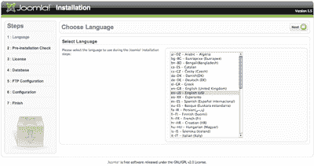
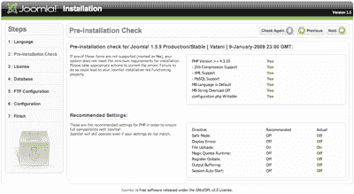
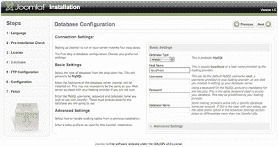
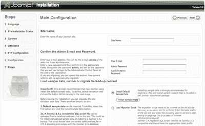
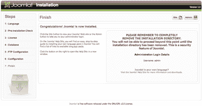
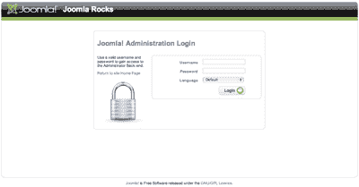
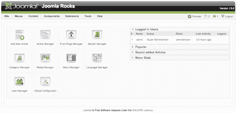
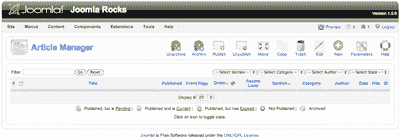
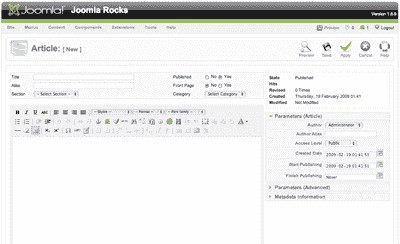
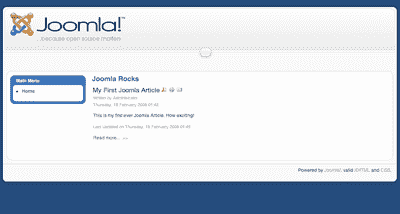

# 介绍 Joomla

> 原文：<https://www.sitepoint.com/introducing-joomla/>

Joomla (TM)是当今最流行的开源内容管理系统之一，与 Drupal 和 WordPress 并列。如果您只是需要为自己建立一个网站，并且不熟悉所有这些 HTML 内容，或者您为其他人开发网站，或者如果您处于开发基于 web 的应用程序的尖端，那么 Joomla 确实应该在您的评估列表中。它易于安装、使用和扩展。

##### 装置

Joomla 对服务器的要求非常低。你需要一台支持 PHP 和 MySQL 的主机，以及一个至少有 50MB 磁盘空间的账户。这允许 Joomla 安装、数据库和一些媒体的空间。虽然 Joomla 可以在早期版本的 PHP 上运行，但出于安全原因，您的主机应该运行最新版本的 PHP4 (4.4.9 是开发停止后的最终版本)或 PHP5。Joomla 确实在 PHP5 上运行得更好，但是要小心像 5.0.4 这样的错误版本。MySQL 最理想的版本是版本 4。选择一个在 CGI 模式下运行 PHP 的主机也是明智的，因为这可以解决许多由文件权限引起的烦人问题。关于技术要求[的更多信息可以在 Joomla 网站](http://www.joomla.org/about-joomla/technical-requirements.html)上找到。

你也可以从 Joomla 网站下载 Joomla 的最新版本。当一个新版本出来时，你可以下载增量补丁包，只包含版本之间的变化文件，从而节省你一点上传时间和带宽。

以正常的方式将文件传输到您的服务器，或者通过上传包并在您的服务器上解包，或者先解包然后上传所有单个文件(后者需要一段时间)。一旦完成，这通常是你最后一次需要接触你的 FTP 客户端；其余的设置在您的浏览器中完成。

将您的浏览器指向您的站点的 URL 包括任何子文件夹路径，如果需要的话——您解压所有 Joomla 文件的地方。您将被带到 Joomla 安装向导，如以下屏幕所示:

在这个屏幕上，您可以选择安装过程的语言(有 40 多种语言可供选择)。点击下一个的**，进入安装前检查界面。**

这个屏幕显示您的主机是否具备 Joomla 站点运行所需的所有设置。假设一切正常，点击下一个的**，你将进入许可信息屏幕。这个屏幕显示了 GNU 通用公共许可证的副本，Joomla 源代码就是在这个许可证下发布的。闲暇时细读，点击**下一个**。这将带您进入数据库配置屏幕。**

这可能是这个过程中最复杂的部分，因为您必须知道您的数据库凭证，站点才能正常工作。如果您是一个真正的极客，通常可以使用 Plesk、Cpanel、phpMyAdmin 或命令行来完成。但是如果你不确定，你需要询问你的托管服务。我假设您已经知道如何创建数据库和用户帐户:

*   数据库类型可能是“mysql”(如果您知道“MySQL”是什么，那么您可能知道是否应该选择它)。
*   主机名可能是“localhost ”,但请咨询您的主机服务或 IT 部门。
*   用户名和密码将由您创建或由您的托管服务提供给您。
*   数据库名称可以是您创建的名称，或者如果您拥有的数据库用户帐户有权创建数据库，则您可以输入新名称。

如果这是第一次安装，不要担心高级设置滑块。只有在现有数据库的基础上安装时才需要它。

点击**下一个**。数据库脚本运行时可能会有短暂的延迟，如果没有遇到错误，您将看到 FTP 配置屏幕。除非您知道您将遇到文件权限问题(根据以前的经验)，否则您可以跳过此屏幕。Joomla 的“FTP 层”试图解决一些文件权限问题，但是，如前所述，如果主机在 CGI 模式下运行 PHP，您完全可以忽略这一步。

住野边只需点击**下一个**；这将把您带到主配置屏幕。

在这个屏幕上，我们设置网站名称，然后超级管理员的电子邮件地址和密码。我们也可以选择安装一些样本数据，这将产生一个完全成熟的网站——给你一个你可以做什么的例子——或者你可以从以前版本的 Joomla 加载一个迁移脚本。在这个例子中，我们将绕过加载任何样本数据，因为我们想要一个干净的站点。

点击**下一个**，你将被带到完成屏幕。我之前撒了个谎。你必须使用你的 FTP 客户端或文件管理器来删除名为`installation`的文件夹。这真的很重要，因为网站将无法工作，否则。此外，有一些不择手段的人在那里，用 Joomla 的强大知识武装起来，如果你把它留在那里，他们很可能对你的站点做一些令人讨厌的事情。

选择懒惰和仅仅重命名文件夹是不明智的——确保你完全删除它。完成后，点击**站点**按钮。你会看到一个相当平淡无奇的网站和一个主页链接。我们需要解决这个问题！

关于安装 Joomla 的更多信息，请参见 Joomla 文档网站。

##### 使用 Joomla

对于一篇文章来说，您可以用 Joomla 做的事情范围太广了。《Joomla 绝对初学者指南》是一份参考资料，温和地引导你了解成为一名经验丰富的 Joomla 大师所需的知识。不过现在，我们将看看如何在网站上放置一些文章。

Joomla 是为数不多的内容管理系统之一，它将管理职责与访问者看到的实际网站完全分开。我们通过在您浏览器的 URL 路径中添加“*/管理员/* ”来联系管理员，例如:`http://www.example.com/joomla/administator/`。

您将被要求输入登录用户名和密码。默认情况下，用户名是“admin ”,密码是您在安装过程中设置的。一旦你进入，你会看到所谓的控制面板，随着时间的推移，你会变得非常熟悉的屏幕。

我们想开始写一些很酷的东西，所以找到并点击控制面板中的文章管理器图标(或者从菜单栏中悬停在内容上，然后选择文章管理器)。

这是一个非常典型的 Joomla 管理员页面。菜单栏下面是工具栏，下面是一个表格，最终会显示我们写的所有文章。工具栏上有图标，用于对列表中的选定项目执行操作或独立操作。现在，让我们创建一篇文章。点击工具栏中的**新建**。

这是您创建或编辑文章的屏幕。有许多领域，但一篇文章的基本要素是:

*   标题——自然是文章的标题
*   别名——启用时用于搜索友好的 URL(在 Joomla 中称为 SEF)
*   已发布-文章是否对网站上的访问者可见
*   首页–使您能够将文章显示在您网站的首页

此外，Joomla 有一个两级分层系统:

*   部分–顶层
*   类别–第二层

对于本例，提供一个合适的标题，但将别名字段留空(这将自动生成)。选择**是**发布，选择**是**首页。在 Section 下拉菜单中选择**未分类**。类别下拉列表也会自动选择未分类的**。**

 **顶部字段集下面通常是你文章正文内容的所见即所得编辑器。在这个编辑器中，你可以为文章放置任何你想要的内容。Joomla 支持将介绍性文本和文章内容分开的概念(它也支持文章中的页面，但我们将在另一个时间讨论这个问题)。要了解其工作原理，请键入一个段落，该段落代表您希望访问者在首页看到的介绍性文本。然后点击编辑框下的**阅读更多**按钮。将出现一条红色虚线。在那条虚线下面，为你文章的其余部分添加一些段落。请注意，完成“阅读更多”部分并不重要。

现在点击工具栏中的**保存**。当页面刷新时，你会看到你的文章现在在文章列表中。

要查看您的劳动成果，请单击工具栏上方的**预览**链接(或者使用您需要的任何键或鼠标点击组合将其作为新标签打开)。

维奥拉。你有内容。

这就是我们在这个介绍性概述中所能涵盖的全部内容。下一次(如果他们让我回来的话)我们会用一个新的模板(老实说，我们提供的股票模板很好，但真的很无聊)让网站变得更好，并添加一个很酷的 Ajax 驱动的评论系统，这样我们就可以开始写博客了。

##### 有用的链接

同时，当你开始进入 Joomla-sphere 的旅程时，有一些链接你绝对必须知道。

[www.joomla.org 是主要站点](http://www.joomla.org)。主页很有用，因为它聚集了来自不同地方的提要，如果你对这类东西感兴趣，还有一些关于该项目的信息。

community.joomla.org 是 Joomla 信息世界的中心。它托管了来自项目中各个工作组的所有官方博客，以及一个非常酷的 Joomla 相关网站的聚合器(看看[Joomla connect](http://community.joomla.org/connect.html)——它会把你和 Joomla 社区中的精英们联系起来)。

你需要带着你的购物袋去 extensions.joomla.org，因为在那里你可以找到 Joomla 可以添加的内容。实际上有成千上万的不同的位可以添加——有些是免费的，有些是商业的。

如果你真的想有心情，你可以[买一件 t 恤](http://shop.joomla.org)，但你的主要注意力可能会集中在所有关于 Joomla 的书籍上。

也许不如其他站点令人兴奋，但仍然有用，[documentation wiki 站点](http://docs.joomla.org)拥有大量社区贡献的关于使用和扩展 Joomla 的信息。

Joomla 是 [Open Source Matters，Inc.](http://www.opensourcematters.org) 在美国和其他国家的商标。** 

## **分享这篇文章**