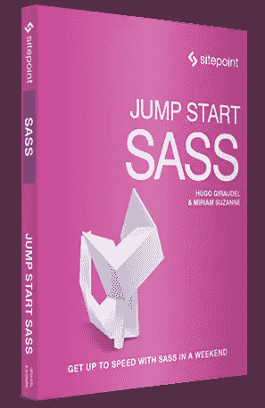

# 介绍我们最新的书:跳跃开始 Sass

> 原文：<https://www.sitepoint.com/introducing-our-newest-book-jump-start-sass/>

嘿大家好，

我有一件大事要宣布！就在几天前，我们为 Jump Start 系列的最新杰作添加了最后的润色: [Jump Start Sass](https://www.sitepoint.com/premium/books/jump-start-sass) 。

在过去的几个月里，我一直在与 SitePoint 密切合作，撰写一本关于 Sass 的书，专门面向那些希望了解预处理器、其语言以及如何在日常项目中使用它来帮助提高生产率的人。

Miriam Suzanne([Susy](http://susy.oddbird.net/)和 [True](http://oddbird.net/true/) 测试框架的作者)和我联手为您提供一个不仅全面，而且简单易懂的结果。基本上，这是 157 页的牛逼(在我不偏不倚的观点！).

## 里面有什么？

这里是目录和每章的一些单词，让你感到饥饿:

1.  **前言**(不是别人，正是[克里斯·埃普斯坦](https://twitter.com/chriseppstein)
2.  **Hello World** —介绍现代前端开发中的 Sass，它的历史，它的语法(Sass 和 SCSS)以及它的竞争对手(LESS，Stylus 和 PostCSS)。
3.  **入门** —关于如何安装 sass 二进制文件(包括 Ruby gem 和 node-sass)以及如何使用它们将 Sass 样式表编译成 CSS 的简短说明。
4.  **变量** —一个关于变量、它们如何工作、如何使用、何时使用以及为什么使用的广泛章节，以与 CSS 自定义属性的比较结束。
5.  **函数&混合元素**——这一章致力于掌握函数和混合元素，开始构建小型系统。
6.  **循环&条件**—Sass 中逻辑结构如何工作的简明解释，主要是循环和条件语句，以及如何使用它们来构建强大的混合。
7.  **嵌套** —关于嵌套特性的提醒，主要集中在选择器嵌套上，提供有用的提示以避免迷失在可怕的选择器水平金字塔中。
8.  **扩展**——对`@extend`指令以及使用它时如何避免输出膨胀的可靠介绍。
9.  **警告&错误**——介绍直接从样式表中发出警告和抛出错误的能力，以及这样做的原因和时机。
10.  **架构** —这是一个关于 Sass 支持的项目架构的不同方法的大型章节，包括 OOCSS、ITCSS、SMACSS 等等。
11.  **生态系统** —最后一章向您介绍 Sass 生态系统，它的主要工具包、库和框架，如 Bourbon、Susy、Accoutrement、SassDoc、Sass-Guidelines、Modular Scale、SCSS-林特等等。

那涵盖了相当多，不是吗？

## 这本书是给谁的？

从目录中你可以猜到，这本书本质上是针对新手和初学者的，一直到中级水平。这是 SitePoint 的 *Jump Start* 系列的一部分，所以不是针对高级 Sass 用户的。

然而，如果你觉得有点缺乏 Sass，不太确定如何处理项目架构，或者只是发现自己需要复习，你会很高兴。我保证。

在这本书的基础上，我推荐你将 site point Sass Reference(site point Sass 参考)加入书签，作为本书中处理的功能的快速参考，以及将你的 Sass 代码质量推向下一个水平的 [Sass 指南](http://sass-guidelin.es)。

它可以在 SitePoint 的订阅服务网站 SitePoint Premium 上获得，或者你可以通过 [O'Reilly](http://shop.oreilly.com/product/9780994182678.do) 订购印刷版或电子书版。

好吧。现在就去读吧，让我们知道你的想法！

## 分享这篇文章