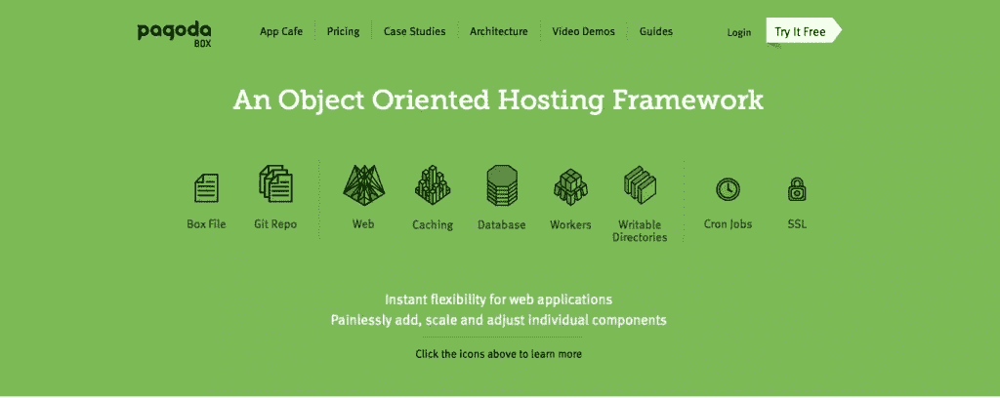
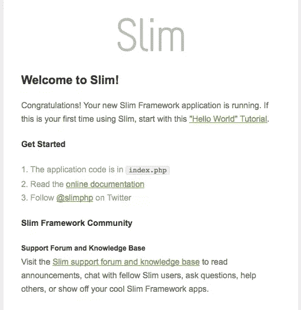
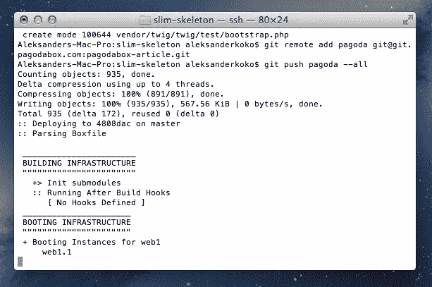
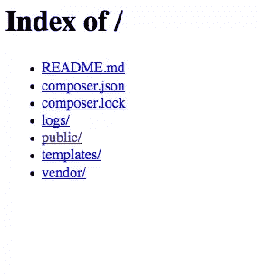

# 介绍 Pagoda Box——一个仅用于 PHP 的 PaaS

> 原文：<https://www.sitepoint.com/introducing-pagoda-box-paas-just-php/>

在本文中，我们将看看 [Pagoda Box](http://pagodabox.com) ，另一个 [PaaS](http://en.wikipedia.org/wiki/Platform_as_a_service) (平台即服务)。如果你在之前的项目中使用过其他 PaaS，宝塔盒子类似于 [Heroku](http://heroku.com) 。Pagoda Box 仅支持 PHP(目前而言),它有一个定义良好的架构，可以开始用 PHP 开发。PB 里的一切都是组件。数据库是一个组件，[web 服务器](https://pagodabox.com/features/scalable-web-hosting)， [workers](http://help.pagodabox.com/customer/portal/articles/430779) ， [cron jobs](http://help.pagodabox.com/customer/portal/articles/333772) 和[缓存](https://pagodabox.com/features/scalable-redis-memcached)。拥有这样一个架构不仅能让你轻松开发，还能控制资金的使用。这篇文章将对这个平台做一个快速的概述。我们将建立一个框架，并查看利弊列表，将其与 Heroku 进行比较。



## 快速概述

让我们看看宝塔盒提供的组件。

第一个也是最重要的组件是 Web 组件。该组件保存所有代码，并在每次请求时运行它。这是应用程序的入口点。您最多可以拥有 25 个 Web 组件实例。您可以选择 200MB 到 1GB 的内存。总的来说，每个应用程序可以有 25GB。一个 200MB 的 Web 组件是免费的。

数据库组件不需要介绍。目前唯一可以使用的数据库是 MySQL 数据库。您可以选择两种风格之一，云 MySQL 和私有云 MySQL。只有云 MySQL 有一个免费的基本计划，内存为 10MB。对于一个实例，它可以扩展到 500MB，私有云 MySQL 可以扩展到 16 个 CPU 核心、16 GB RAM 和 300 GB 存储。

缓存组件有 [Redis](http://redis.io/) 和 [Memcached](http://memcached.org/) 两种风格。两者都提供 10MB 的免费基本计划。两者都只有云版本，没有私有云。

Pagoda Box 还提供 Cron 作业组件、共享可写组件(有 10MB 免费计划)和 SSL。

## 设置本地环境

在这个例子中，我们将看到如何在 Pagoda Box 中部署 [Slim 框架](http://www.slimframework.com/)。更准确地说，我选择了[瘦骨架](https://github.com/codeguy/Slim-Skeleton)，因为它需要有写权限的目录。

当我开始一个新项目时，我做的第一件事就是把[家园](https://github.com/laravel/homestead)建立起来。这不是一个 [Laravel](http://laravel.com/) 项目，而是我更喜欢使用的盒子。如果你更愿意使用 Homestead Improved，它更简单，更适合多平台，请看[这个快速入门](https://www.sitepoint.com/quick-tip-get-homestead-vagrant-vm-running/)。否则，继续下面的说明。如果你还不熟悉 Homestead，请阅读他们的[文档](http://laravel.com/docs/4.2/homestead)。有一本很好的指南，里面有更深入的信息。

在使用`homestead edit`配置了`Homestead.yaml`之后，我的配置如下所示:

```
ip: "192.168.10.10"
memory: 2048
cpus: 1

authorize: ~/.ssh/id_rsa.pub

keys:
    - ~/.ssh/id_rsa

folders:
    - map: ~/projects/homestead/Code
      to: /home/vagrant/Code

sites:
    - map: slim.app
      to: /home/vagrant/Code/slim-skeleton/public

databases:
    - homestead

variables:
    - key: APP_ENV
      value: local
```

我要做的下一件事是编辑主机上的 hosts 文件。我把`slim.app`加上 IP: `192.168.10.10`。

```
192.168.10.10   slim.app
```

导航到您的项目文件夹，然后克隆瘦骨架。我的项目文件夹是`~/projects/homestead/Code`。

```
git clone https://github.com/codeguy/Slim-Skeleton.git slim-skeleton
```

之后，执行`homestead up`。使用 ssh 在框内导航，使用 composer 安装依赖项。

```
homestead ssh
cd Code
cd slim-skeleton
composer install
```

查看浏览器中的`slim.app`。如果一切正常，您应该会看到类似这样的内容。



## 部署第一个应用程序

如果您还没有在 Pagoda Box 上创建帐户，请先创建一个。创建新的应用程序。您可以选择从现有项目、现有存储库或空存储库开始。该项目存储在本地，所以我们将使用第三个选项。给它一个名字并启动应用程序。

如果这是您第一次创建项目，您必须配置 SSH 密钥。如果您不熟悉 SSH 密钥，请阅读 Github 关于[生成密钥](https://help.github.com/articles/generating-ssh-keys/)的文章。


在执行 Pagoda Box 建议的命令之前，首先确保从`slim-skeleton`文件夹中删除现有的 Git 文件。

```
rm -rf .git
rm .gitignore
```

删除 git 文件后，执行以下命令:

```
git init
git add .
git commit -m 'your commit message'
git remote add pagoda *your pagodabox git repository here*
git push pagoda --all
```



这将在这个项目中初始化一个 Git repo，添加所有文件，提交更改，添加一个远程存储库(Pagoda Box 中的项目 repo)并将所有内容推送到服务器。执行这些命令后，单击继续应用仪表板按钮。在浏览器中检查您的应用程序 URL，看看是否一切顺利。如果不知道网址，应该是类似`your-app-name.gopagoda.com`的东西。如果您得到这样的输出，请不要担心:



第一个原因是 web 服务器没有指向引导 PHP 脚本。starter PHP 文件(bootstrap)位于`public`文件夹下。该文件夹中的`index.php`启动一切，就像大多数现代 PHP 应用程序一样。即使我们导航到`public`文件夹，我们也会看到一些错误。那是因为`logs/`和`templates/cache`不可写。默认情况下，所有内容都是只读的。我们必须告诉 web 服务器 init 文件在哪里，并且这两个文件夹应该是可写的。

如果您过去使用过其他 PaaS 平台，您可能使用过一些配置文件。在 Pagoda Box 上，配置文件是`Boxfile`。使用这个文件，您可以告诉平台您希望应用程序中包含哪些组件。不要忘记每个组件都是可配置的。例如，您可能希望有 3 个 web 组件、2 个私有 MySQL 数据库、2 个可写目录，可能还有用于缓存的 Redis。所有这些都可以通过 Boxfile 进行配置。当您将代码推送到 Pagoda Box 上时，平台会寻找一个 Boxfile，如果提供了，它将使用其中的配置来构建环境。

当我们第一次在没有 Boxfile 的情况下推送代码时，平台正在使用默认的 Boxfile 构建项目。也可以使用仪表板配置组件，但建议使用 Boxfiles。假设您有不同版本的应用程序，并且您想回滚到以前的版本。该平台还将扩展到以前的规模。

在项目的根目录下创建一个 Boxfile。在本例中，我们需要 1 个 web 组件、1 个 MySQL 数据库、2 个可写目录、1 个环境变量(APP_ENV: production)。如果你注意到，在 Homestead 上我使用了一个环境变量，在 Pagoda 上我使用了相同的环境变量，但是值不同。因此，如果我使用这个环境变量，代码将在两种环境下都工作，而无需更改。我最后的`Boxfile`看起来是这样的:

```
web1:
  shared_writable_dirs:
    - logs
    - templates/cache
  document_root: public
  php_extensions:
    - mysql

db1:
  name: slim
  type: mysql

global:
  env:
    - APP_ENV: production
```

现在推动所有改变。

```
git add .
git commit -m "Adding Boxfile"
git push pagoda --all
```

在浏览器中再次搜索您的项目，您应该看到现在一切正常。您现在有了一个准备就绪的项目。

## 利弊

宝塔盒很容易上手。对我来说，这比使用 Heroku 更容易，但我必须承认，它有点过时，缺乏很多新功能。如果你在仪表盘中注意到了，他们宣传 PHP 5.5 是一个新版本，而 5.6 已经发布了一段时间。他们的文档非常好，对你帮助很大。我最喜欢的是分析区域和易于扩展。如果我的应用程序比我想象的增长得更快，我可以很容易地扩展，但我真的无法与 Heroku(作为领先的 PaaS 平台)相比，因为 Heroku 提供了很多可扩展性。我可以选择不同的第三方服务并立即使用它们。此外，Heroku 作为 [12 因子 app](http://12factor.net/) 的创造者，对建筑有着更好的定义。Pagoda Box 专注于 PHP，而在 Heroku 上就不像[那么容易上手 PHP](https://www.sitepoint.com/deploying-to-heroku-an-introduction/) 。如果你是第一次使用 PHP 的 PaaS，你应该试试 pagobox——特别是如果你只是在寻找一个可以快速部署你的应用的地方。PagodaBox 是一个完美的原型和示例主机。

## 结论

在本文中，我们看到了什么是 Pagoda Box，以及如何开始使用 Homestead 在本地开发它。我们创建了一个基础应用程序，这是开始您的应用程序的良好基础。但是不要就此打住。PagodaBox 的仪表盘有很多分析工具。尝试本文中没有用到的各种组件——如果你不破坏东西，你就永远不会学到东西，在 PaaS 上，很少有东西会一直坏着。

我们想听听你的意见。在你的下一个项目中，你会考虑宝塔盒吗？你试过了吗？你怎么想？

## 分享这篇文章