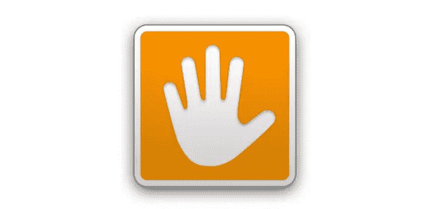

# Android 辅助功能简介

> 原文：<https://www.sitepoint.com/introduction-android-accessibility-features/>

每个人都同意一个应用程序应该易于使用，直观和用户友好，但这就足够了吗？我们经常忘记，应用程序开发的一个重要部分是确保你的应用程序对每个人来说都是可访问的和易于导航的，即使是那些有视觉或身体残疾的人。

Android 提供了许多可访问性选项和功能，但是在设计和实现阶段，它们经常被忽略。易访问性 API 最初是在 Android 1.6 (API level 4)中引入的，但是许多开发人员对它们并不熟悉或者不感兴趣。可访问性通常是事后的想法，如果你在谷歌或 StackOverflow 上快速搜索，很少有人提到。

不应该是这样的，因为在你的应用程序中实现辅助功能是简单明了的，所以今天我们来看看如何实现。

## 向 UI 元素添加文本描述

每个优秀的设计师都知道，一个设计良好的界面应该是不需要说明的，直观的。但情况并非总是如此。身体有障碍的用户需要音频提示和/或视觉提示来导航，即使是最简单的界面，这也是使用**内容描述**的地方。

内容描述是最容易实现的辅助功能，也是最有用的功能之一。它们就像代码中的注释。谷歌建议主要使用对`ImageView`、`ImageButton`和`CheckBox`元素的描述，因为这是最需要它们的地方。

描述以两种方式添加，通过 XML 布局或传统的 Java 方法。

使用 XML，您可以像这样为图像添加描述(注意最后一行):

```
<ImageView
    android:id="@+id/new_image"
    ...
    android:contentdescription="@string/image_desc"
    />
```

`@string`在 *strings.xml* 文件中声明如下:

```
<string name="image_desc">Simple description of what the image represents</string>
```

对于`EditText`字段，使用下面的行向用户解释他们应该键入什么:

```
android:hint = "Name Field"
```

如果你的界面元素改变状态，比如切换按钮或复选框，你应该确保`contentDescription`根据状态动态改变。在这种情况下，使用`setContentDescription()`方法:

```
label.setContentDescription("Toggle is set to: " +  (ToggleButton).isChecked())
```

如前所述，如果没有必要，不要添加描述，因为你可能会惹恼用户。如果你觉得这个元素不言自明，没有任何真正的功能，例如一个应用程序图标，使用:

```
android:contentdescription="@null"
```

## 不使用触摸屏的导航

这也被称为焦点导航，允许用户使用你的应用程序，而不需要触摸屏，而是使用方向控制器。这些包括 D-pad、轨迹球、手势、箭头键或一些现代智能手机上的眼睛。你的应用支持这些不同的导航机制是很重要的。

使用方向按钮确保每个输入元素都是可聚焦和可点击的。不要忘记突出显示用户关注的元素。默认情况下，Android 中的每个控件元素都启用了这个特性，但是如果您已经创建了自己的元素，请使用`setFocusable(true)`方法或`android:focusable`属性使它们可聚焦:

```
<EditText
        ...
       android:focusable = "true"
  />
```

Android 有找到最近的可聚焦元素的算法，因此用户可以使用方向控制器直观地导航界面。如果要覆盖此功能，请使用下面的 XML 属性:

```
android:nextFocusDown,
android:nextFocusLeft,
android:nextFocusRight,
android:nextFocusUp
```

这些是不言自明的，但是下面的代码示例演示了它们的用法:

```
<EditText
       android:id = "@+id/upper_text_field"
        …
        ...
       android:nextFocusDown = "@+id/lower_text_field"
  />

<EditText
       android:id = "@+id/lower_text_field"
        …
        ...
       android:nextFocusUp = "@+id/upper_text_field
  />
```

## 创建您自己的辅助功能服务



辅助功能服务代表应用程序与用户通信，并提供导航反馈，如触觉反馈、文本到语音和视觉提示。Android 默认提供 TalkBack 和 Explore by touch 等服务。这有助于因身体残疾或在特殊情况下(如驾驶、锻炼等)无法正常与设备交互的用户。

您可以创建自己的辅助功能服务作为主应用程序的一部分，并将它们捆绑在一起或作为独立的应用程序。有关该主题的更多信息，请阅读[官方文档](http://developer.android.com/training/accessibility/service.html)。

## 可访问性测试

测试和实现一样重要，所以确保在实现任何可访问性特性后彻底测试你的应用程序。这可以通过启用对讲和触摸浏览来实现，并尝试仅使用音频反馈和方向控制来导航应用程序。确保每个控制元件都提供必要的反馈，并且音频提示不会重复，也不会比需要的时间长。此外，Android 设计指南建议每个可聚焦元素的长度和宽度至少应为 48dp。

为了支持有听力障碍的用户，为音频反馈提供辅助机制，如触觉反馈或视觉提示，如弹出窗口和通知。如果你的应用程序提供视频播放，提供字幕或字幕支持。

## 结论

我们已经了解了为什么可访问性应该是开发时间表的重要部分，以及如何在 Android 应用程序中实现不同的功能。每个开发者都应该专注于让每个人都能访问他们的应用，不管他们如何与设备交互。

我想听听你的意见。您在应用程序中使用这些功能吗？你经常测试你的应用程序的可访问性吗？请在下面的评论中告诉我。

## 分享这篇文章