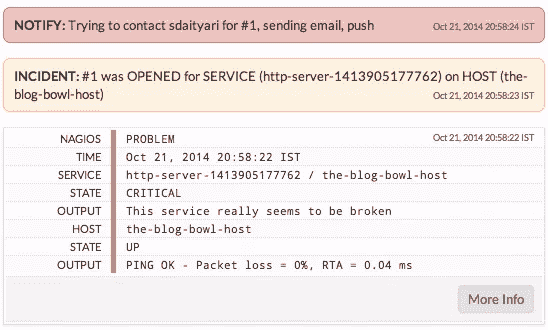
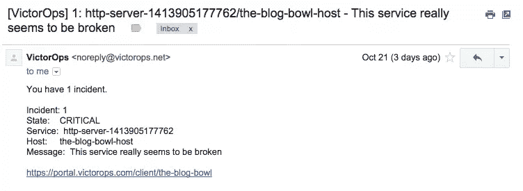
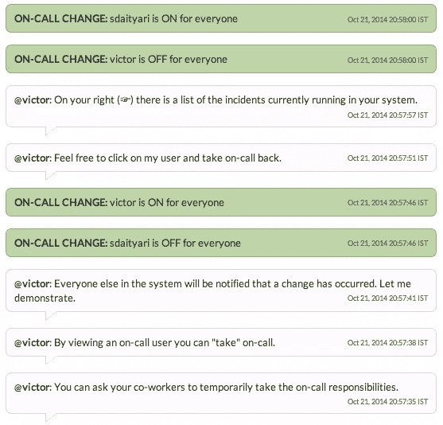
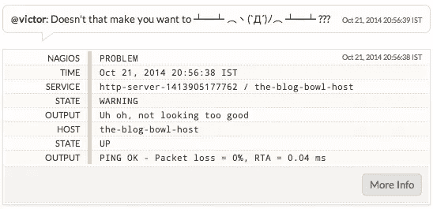
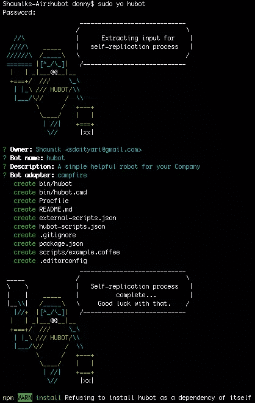
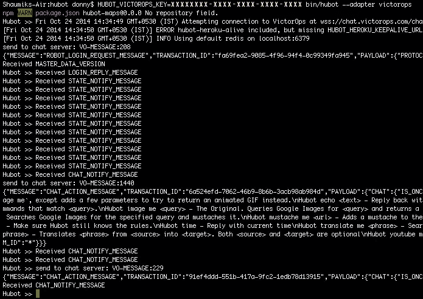

# ChatOps 简介:Devops 遇上 IM

> 原文：<https://www.sitepoint.com/introduction-chatops-devops-meets-im/>

*本文由 [VictorOps](http://victorops.com/?utm_source=Online%20Advertising&utm_medium=SitePoint%203rd%20party%20content&utm_campaign=SitePoint) 赞助。感谢您对使 SitePoint 成为可能的赞助商的支持！*

开发人员经常使用电子邮件作为他们的主要沟通方式。无论是停机警报、500 个错误还是存储库提交，所有这些都会被重定向到您的电子邮件帐户，以便可以在一个位置找到所有内容。

但是电子邮件真的不适合这种任务。电子邮件使实时交流变得困难，谈话很容易变得笨拙，长时间的延迟和缺乏即时性，特别是当你与不同时区的人交流时。

另一方面，聊天为解决问题提供了更直接的方式。你可以看到谁在特定时刻在线，你可以与多人分享信息以快速接收反馈，你甚至可以通过与 GitHub 的 Hubot 等服务的集成，在聊天客户端中执行操作。

从雅虎、美国在线和微软信使的时代开始，我们已经走过了漫长的道路。聊天不再仅仅是两个人之间基于文本的互动——它已经发展成更多的东西，更富有成效的东西。

本文将涵盖 ChatOps 的新兴趋势，概述在 devops 环境中聊天的一些流行用法，然后解释如何通过与 [VictorOps](http://victorops.com/?utm_source=Online%20Advertising&utm_medium=SitePoint%203rd%20party%20content&utm_campaign=SitePoint) 的高级集成来进一步发展 ChatOps。

## 我们聊聊吧

由 GitHub 推广的 ChatOps 正在将工具放在对话的中间。由于开发团队通常分布在全球各地，因此需要一个集中的通信系统，该系统还可以自动化某些过程，如连续部署。GitHub 以他们的机器人 [Hubot](https://hubot.github.com/) 开启了这一潮流。

科技行业中有许多流行的聊天应用程序。我最近写了关于使用 Slack 进行工作场所协作的文章，但是 T2 hip chat 也很受欢迎。大多数最好的聊天客户端都提供直接消息传递、针对不同主题或领域的多个通道，以及高级的文件共享和集成能力。

这些应用程序能够对开发周期产生巨大的影响。对于不同的任务，有不同的基于聊天的工具和命令，例如启动虚拟机的新实例、发送时事通讯或将代码部署到您的主服务器。传统上，这些任务中的每一项都需要使用不同的工具，但使用可编程聊天机器人，这些任务可以通过聊天应用程序上运行的简单命令来执行。

想象一下，连接 Amazon Web Services，只需一个聊天命令就可以弹出实例，或者借助 GitHub 集成将最新提交部署到服务器。或者通过分析系统检查你的网站有多少访问者？也许你只是乐于在你选择的聊天应用程序中通过 Trello 或 Asana 查看你的团队的进展？

ChatOps 可以提高团队的效率，节省原本会浪费在冗余流程上的时间。

一个标准的聊天应用程序在改善开发者交流方面肯定是有用的。但是，当涉及到帮助开发团队管理事件时，与像 [VictorOps](http://victorops.com/?utm_source=Online%20Advertising&utm_medium=SitePoint%203rd%20party%20content&utm_campaign=SitePoint) 这样的随叫随到的警报和管理平台的集成就更好了。

## 维多利亚时代和“随叫随到”的乐趣

随叫随到的概念是从医学领域借用来的。医生和护士需要随时待命来处理紧急情况，所以他们通常会按照名单行事，以确保有人随时待命。类似地，在 devops 世界中，当您睡觉时，您的站点或服务可能会发生错误或停机，尤其是用户位于不同时区的服务。到目前为止，您可能已经指派了一名团队成员来处理此类错误，当出现问题时，他们会通过电子邮件收到警报。

VictorOps 的目标是让这个过程变得更加优雅，提供一个集中的系统来解决实际问题，与团队成员交流，然后在危机过去后从错误中吸取教训。


在继续讨论如何将该服务与现有聊天应用 HipChat 集成之前，我们先来看看 VictorOps 如何处理危机管理以及发送传出通知和传入警报。

### VictorOps 中的错误报告

如果您在 VictorOps 中为特定站点或应用程序指派了待命人员，事件也会显示在 VictorOps 时间线上，如下所示:



还会向相关方发送电子邮件。



如果你不在，一个同事可以为你承担随叫随到的责任。当你回到船上，你可以把它们带回去。VictorOps 机器人 Victor，稍后会正式介绍给你，当你第一次参观时，他会很好地解释这一点。



如果您不满足于在事件创建时仅向某人发送一封电子邮件，请不要失望。VictorOps 支持 webhooks，它允许您通过来自 VictorOps 的回调来执行自定义操作。

### 传出通知— Webhooks

您可能已经习惯了 webhooks，尤其是如果您熟悉[持续集成](https://www.sitepoint.com/php-continuous-integration-travis-ci/)的话。使用 webhooks，当事件被报告给不同的应用程序时，您可以指定来自 VictorOps 应用程序的回调。这个回调可用于执行各种功能——启动或停止服务器上的进程、发送一堆电子邮件、发布状态页面或您想到的任何其他功能。

一个`POST`请求从 VictorOps 发送到您的应用程序，包含一个事件、摘要和一条消息。它由 HTTP 头`X-Victorops-Signature`识别和认证。

例如，如果您正在运行一个用核心 PHP 编写的应用程序，并且发生了 MySQL 错误，错误跟踪可能会显示在网页上。您可以通过使用 webhook 来避免这种情况，它会在您修复问题时临时显示一个错误页面。

关于使用 webhooks 的更多信息，请阅读[文档](http://victorops.force.com/knowledgebase/articles/Getting_Started/WebHooks/)，其中详细列出了生成和认证的步骤。

### 传入警报— REST 端点

现在你知道 webhooks 是如何工作的了，如果你想反转信息流并告诉 [VictorOps](http://victorops.com/?utm_source=Online%20Advertising&utm_medium=SitePoint%203rd%20party%20content&utm_campaign=SitePoint) 一些事情呢？这就是 REST 端点出现的地方。

VictorOps 通过`HTTPS`请求接受来自任何来源的警报。您可以使用这些请求生成警报。

这里有更多关于 REST 端点和[的](https://www.sitepoint.com/integrating-victorops-salesforce-using-rest-endpoint/)[信息，以及设置 VictorOps 集成](http://victorops.force.com/knowledgebase/articles/Integration/Alert-Ingestion-API-Documentation/)的指南。

## 将 HipChat 与 VictorOps 集成

现在，您已经对一些 [VictorOps](http://victorops.com/?utm_source=Online%20Advertising&utm_medium=SitePoint%203rd%20party%20content&utm_campaign=SitePoint) 开箱即用的功能有所了解，让我们看看如何将其集成到您现有的聊天应用中。

VictorOps 目前提供了与 HipChat 的简单集成，尽管 Slack 集成也即将推出。这种集成将您的 VictorOps 时间线与 HipChat 上的特定聊天室联系起来。HipChat 上发布的任何内容都会立即传输到 VictorOps，反之亦然。

要设置 HipChat 集成，您只需遵循几个简单的步骤。

*   在您的 VictorOps 集成中，启用 HipChat 集成以生成唯一的 URL。您可以在首选项下选择要发送的消息类型以及它们的显示方式
*   在您的 HipChat 设置中，选择要整合的聊天室，并将生成的 URL 添加为新的私人整合。

真的就那么简单。一旦你完成了，HipChat 上的消息就会被转移到 VictorOps 上，反之亦然。您可以从您最喜欢的聊天应用程序中管理 VictorOps 时间表，将两者的功能结合在一起。有关集成截图的详细教程，请查看 [VictorOps 文档](http://victorops.force.com/knowledgebase/articles/Integration/HipChat-Integration/)。

让我们来测试一下。这是我在 HipChat 上发的一条消息。


移至 VictorOps 查看效果。


让我们试试相反的方法，我将向 VictorOps 时间线发布一条消息。


这就是 HipChat 上的。


无论你打开哪个应用程序，你都不会错过任何东西！

## Hubot 集成



虽然 VictorOps 提供了一个聊天机器人`@victor`，它非常友好，可以帮助你第一次设置东西，但你可能希望将 GitHub 自己的 [Hubot](https://hubot.github.com/) 带到 VictorOps 时间轴上，以获得一些高级功能和一点乐趣。

为此，你需要按照[的指示来设置 Hubot](https://github.com/github/hubot/tree/master/docs) ，然后是[将 VictorOps](https://github.com/victorops/hubot-victorops) 集成到 Hubot 中。大致来说，您需要完成以下步骤(假设您已经安装了 NodeJS)。

*   从 GitHub 安装 Hubot 发电机。

    ```
    npm install -g yo generator-hubot 
    ```

*   将 hubot 安装在服务器上它自己的目录中。

    ```
    yo hubot 
    ```



*   通过编辑文件`package.json`并运行`npm install`，将 VictorOps 适配器添加到 Hubot 的依赖项中。

    ```
    ...
    "dependencies": {
      "hubot-victorops": ">=0.0.2",
      ...
    }
    ... 
    ```

*   从您的 VictorOps 仪表板的 integrations ( `https://portal.victorops.com/dash/your-company-slug/#/advanced`)下获取 VictorOps 密钥。

*   使用带有密钥的 VictorOps 适配器运行 Hubot。

    ```
    HUBOT_VICTOROPS_KEY=xxxxxxxx-xxxx-xxxx-xxxx-xxxxxxxxxxxx bin/hubot --adapter victorops 
    ```



一旦它启动并运行，您就可以在您的时间线中使用它！对于生产，考虑将`HUBOT_VICTOROPS_KEY`存储为环境变量。如果您需要定制功能，您可以在`scripts`目录下的 CoffeeScript 中创建您的脚本。默认提供一个基本示例供您参考。

您可以从基本的`help`命令开始，帮助您查看一个列表，您可以用它来尝试一些不同的事情。包括一些稍微低效的活动！


## 最后的想法

ChatOps 提供了传统通信方式无法比拟的诸多优势。我们已经为您提供了这一概念的基本概述、将它带到您自己的组织中的建议，以及通过随叫随到的警报和管理平台 [VictorOps](http://victorops.com/?utm_source=Online%20Advertising&utm_medium=SitePoint%203rd%20party%20content&utm_campaign=SitePoint) 和 Hubot(高级的，偶尔还有点恶作剧！)聊天机器人。

如果您想了解更多关于 ChatOps 的信息，VictorOps 将举办一场现场“ [ChatOps Unplugged](http://victorops.com/chatops-webinar/) ”网络研讨会，他们将在会上介绍 ChatOps，解释 ChatOps 的优势，可以做什么的具体示例，可以用来完成这些任务的工具(包括 Hubot)，以及如何开始。

## 分享这篇文章