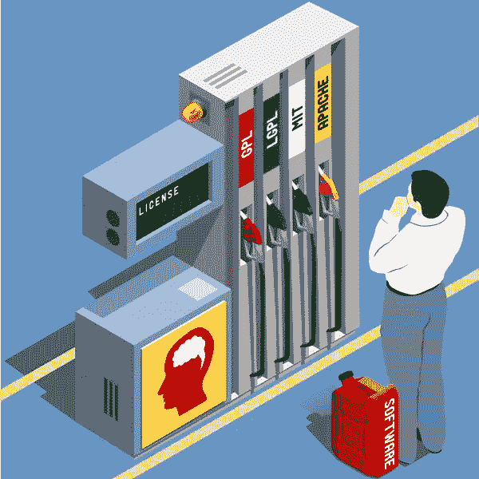
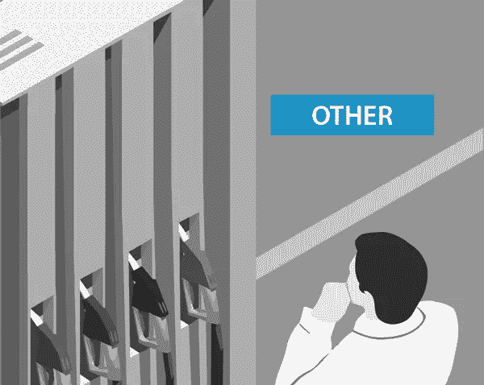

# 开放源码许可简介

> 原文：<https://www.sitepoint.com/introduction-to-open-source-licenses/>

网络社区以乐于分享而闻名。我们不仅分享经验、提供建议并在项目中互相帮助，而且我们还分享数量惊人的代码——从小片段到整个框架和应用程序。

我们日常使用的许多软件都是开源的——从操作系统和服务器到我们用来交易的应用程序。

在所有这些共享中，出现了版权和许可的问题。如果你正在使用别人的免费软件，或者如果你正在分享你自己的作品，考虑这些问题是很重要的。

## 标准版权

当你创作一个软件时，它自动受到版权保护。这意味着您保留对您的源代码的所有权利，其他任何人不得复制、分发或从您的作品中创建衍生作品。

这也可能导致没有人*使用*你的代码——这显然违背了共享它的目的。

因此，如果你真的想分享你的作品，但也想以某种方式保护它，考虑许可你的作品的可用选项是很重要的。

## 选择许可证

有各种各样的、公认的许可可以应用到你的作品中，让人们清楚地知道他们可以用你的代码做什么。但是每个许可证都有特定的侧重点，所以应该选择哪个呢？

在本文中，我将简要介绍几种最常用的许可证。您选择哪一个将取决于您想要实现什么以及您的代码应该如何分发。

*免责声明:以下概述仅提供每个许可证所包含内容的一般概念。要完全理解每个许可证，你需要做更多的阅读。*

## [麻省理工学院许可证](http://opensource.org/licenses/MIT)

麻省理工学院的许可证允许人们对你的代码做任何他们想做的事情，只要他们把归属权还给你，并且如果出了问题，不要追究你的责任。它被像 [jQuery](https://jquery.com/) 和 [Rails](http://rubyonrails.org/) 这样的项目所使用。

### 对你有什么要求

您需要在代码中包含版权声明以及许可证的副本。(只需在自述文件中添加一个许可文件。)

### 你是如何被覆盖的

许可证声明代码是按原样<q>提供的，你对损害不承担责任。</q>

### 评论

如果你想把你的孩子从互联网上带走，这可能是最好的选择。

话虽如此，但您应该准备好看到您的作品在没有源代码的情况下被用于其他地方，这意味着您可能无法将更改应用到上游(是的，基本上有人可以从您的开源软件中创建专有软件)。

如果你不想让其他人有太多的自由来使用你的代码，考虑另一个许可可能会更好。

## [Apache 2.0 许可证](http://www.apache.org/licenses/LICENSE-2.0.html)

Apache 许可证类似于 MIT 许可证，但是它也提供了贡献者对用户的专利权的明确授予。

这比麻省理工学院的许可证要长得多，主要是因为专利权的授予，但也因为它明确禁止在衍生作品中使用商标。

这个许可证被 Apache 和 Google(Android 操作系统)使用。

### 对你有什么要求

在代码中，您需要包含版权声明，以及许可证的副本。如果你正在创建一个对代码有重大改变的衍生作品，这些也需要被指出。

### 你是如何被覆盖的

代码是按原样提供的<q>，作为创建者，您不承担损害赔偿责任。此外，虽然这可能隐含地适用于所有许可证，但是 Apache 许可证明确声明软件的用户不得**而不是**在他们自己的衍生作品中使用贡献者的名称、徽标或商标。</q>

### 评论

尽管比 MIT 许可证更严格，Apache 许可证使代码的创建者更容易跟踪变更——通过要求那些创建衍生产品的人指出代码的重大变更。

不过，请记住，在 Apache 许可下授权的代码最终可能会成为专有软件。

## [GNU 通用公共许可证 v3 (GPL3)](http://www.gnu.org/licenses/gpl-3.0.txt)

GNU 通用公共许可证(简称 GPL)是一个 <q>copyleft</q> 许可证。

<q>Copyleft</q> 是对<q>版权</q>的一种玩法，适用于要求代码的副本和修改版本带有与原件相同的许可条件的许可。因此，举例来说，如果你在你的作品上放置一个 GPL 许可，你是在要求那些发布你的代码的他们自己版本的人使用相同的许可。

将 GPL 许可证放在您的作品上意味着，如果有人拿走了您的代码并对其进行了改进，您可以将他们的更改合并回您的原始项目中。

这个许可证被像 Linux，Git 和 WordPress 这样的公司使用。

### 对你有什么要求

您需要在代码中包含版权声明以及许可证的副本。当您发布软件时，您还必须提供源代码。

### 你是如何被覆盖的

代码是按原样提供的<q>，作为创建者，您不承担损害赔偿责任。您作品的用户不能授予再许可，以修改和向许可中未包括的第三方分发软件。</q>

### 评论

基本上，如果你的代码是 GPL 许可的，它不允许在任何专有软件中使用(除非在某些特殊情况下)。

你可以找到很多关于 GPL 的东西，比如 GPLv3 和 GPLv2 之间的区别，以及 GPL 的许多变体——比如 **Affero 通用公共许可证**，它涵盖了像软件即服务(SaaS)这样的东西。

## 其他许可证

虽然上面的三种许可证是你最常遇到的，也是你最有可能选择的，但是还有很多其他的。我将简单列举几个。

### [艺术](http://www.perlfoundation.org/attachment/legal/artistic-2_0.txt)

Perl 社区特别喜欢它，它与 MIT 许可证有一些相似之处，但是要求软件的修改版本不能阻止用户运行标准版本。

此外，虽然这可能隐含地适用于所有许可证，但艺术许可证明确声明您可以**而不是**使用贡献者的名称、徽标或商标(类似于 Apache 许可证)。

如果你正在创建一个对代码有重大改变的衍生作品，这些也需要被指出。

### [月食](http://www.eclipse.org/legal/epl-v10.html)

商业友好的 copyleft Eclipse 许可证提供了商业许可二进制文件的能力；现代的、免版税的专利许可授权；以及链接作品使用其他许可的能力，包括商业许可。

软件发布时需要公开完整的源代码。

### [BSD](http://opensource.org/licenses/BSD-3-Clause)

一个许可性的许可证，允许人们在没有保证的情况下，通过正确的归属对你的代码做任何事情。

### [Mozilla 公共许可证(MPL)](https://www.mozilla.org/MPL/2.0/)

MPL 2.0 由 Mozilla 维护。它试图在许可的 BSD 许可和对等的 GPL 许可之间达成妥协。

### [知识共享(CC)](http://creativecommons.org)

知识共享提供了一系列[许可](http://creativecommons.org/examples)来完善你的版权条款。例如，有了 CC0 许可证，你可以彻底放弃所有的版权要求，从而将你的作品完全公开。(然而，请注意，CC [建议](https://wiki.creativecommons.org/wiki/Frequently_Asked_Questions#Can_I_apply_a_Creative_Commons_license_to_software.3F)对软件使用像 MIT、Apache 和 GNU 这样的许可证，因为 CC 许可证不能解决许多与代码相关的问题。)

## 包扎

希望这个简短的概述已经让你想到了许可证，并回答了你的一些问题。

你可以做大量的阅读来了解每一个许可证。但是，如果这看起来让人不知所措，在大多数情况下，即使上面的简要描述也足以帮助您决定哪个许可证适合您。

最后，这里有一些进一步阅读的链接:

*   [ChooseALicense.com](http://choosealicense.com)提供许多不同许可证的便捷信息。
*   [GNU.org](http://www.gnu.org/licenses/license-list.en.html)还列出并解释了许多许可选项。
*   维基百科一如既往地提供了[一份有用的开源许可摘要](https://en.wikipedia.org/wiki/Comparison_of_free_and_open-source_software_licenses)
*   [开源倡议](http://opensource.org/licenses)也回答了许多关于开源许可的问题。

*您是否需要选择软件许可证？你选择了哪一个，是什么决定了你的选择？你还在为你的项目选择哪个许可证而困惑吗？请在评论中告诉我们。*

另外，你知道吗，SitePoint 论坛有一个[展示区](https://community.sitepoint.com/c/showcase)，邀请你分享你的代码，谈论你的开源项目。

## 分享这篇文章