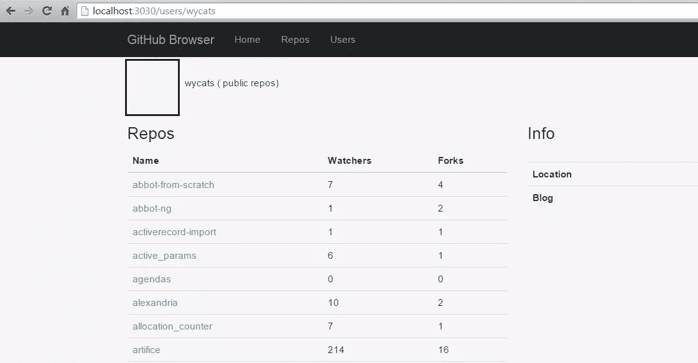
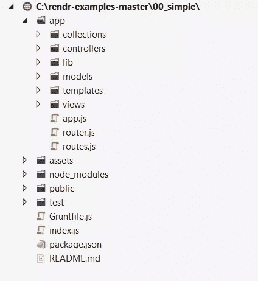
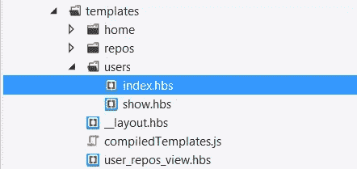

# Rendr 简介

> 原文：<https://www.sitepoint.com/introduction-to-rendr/>

同构 JavaScript 框架和库最近获得了很多关注。同构 JavaScript 应用程序是用 JavaScript 编写的应用程序，既可以在客户端运行，也可以在服务器端运行。因此，您可以编写一次代码，然后在服务器端执行它来呈现静态页面，在客户端执行它来实现快速交互。

在本文中，我们将探索并开始使用 [Rendr](http://rendrjs.github.io/) ，这是一个由 [Airbnb](https://www.airbnb.com/) 团队开发的开源库。该库最初的目标是支持该公司在 [Backbone.js](http://backbonejs.org/) 和 [Node.js](https://nodejs.org/en/) 上运行的移动应用。后来公司把它变成了一个开源项目，这让这个项目获得了很多关注。

## Rendr 是什么

Rendr 背后的基本思想是，通过为客户机和服务器编写通用代码，允许在客户机和服务器上呈现 Backbone.js 应用程序。这使得网页内容可以在浏览器中执行 JavaScript 代码之前通过服务器呈现。一旦初始页面加载完成，浏览器加载了所有客户端框架，应用程序的进一步路由将由客户端的 Backbone.js 处理。Rendr 不是一个完整的框架，它有以下设计目标:

*   编写与环境无关的应用程序逻辑
*   减少`if(server) { ... } else { ... }`结构
*   像任何其他主干应用程序一样与 RESTful APIs 通信
*   隐藏库的复杂性
*   排除服务器端 DOM

在本教程中，我们将探索一个简单的 Rendr 应用程序，使用 GitHub 浏览器通过 GitHub REST API 获取存储库和用户的数据。这个小应用程序是 Rendr 示例的一部分。你可以从 GitHub 库下载这些例子。在这里，我们将探索基本的“00_simple”应用程序。

在深入这个主题之前，让我们了解一下我们的应用程序是什么样子的。它将包括以下几个部分:

*   **Repos 列表视图:**存储库列表部分将获取并列出一些 GitHub 存储库
*   **回购视图**:点击一个特定的仓库，打开其信息页面
*   **用户列表视图**:用户列表部分获取并列出 GitHub 用户
*   **用户视图**:点击一个特定的用户，打开用户档案视图，显示一些基本的用户信息和他们的存储库

下面的截图显示了我们的用户视图的样子



## 如何安装 Rendr

Rendr 需要安装 Node.js 服务器作为先决条件。如果需要安装，可以[从 Node.js 主页](https://nodejs.org/)下载。在这之后，我们必须安装 [Grunt](http://gruntjs.com/) ，这是一个 JavaScript 任务运行器，允许自动化重复的任务，如缩小、编译、单元测试等等。您可以通过运行以下命令来安装它:

```
npm install -g grunt-cli
```

如果你想了解更多关于 Grunt 的知识，我建议你阅读以下发表在 SitePoint 上的文章:

*   [如何咕噜咕噜地实现工作流自动化](https://www.sitepoint.com/how-to-grunt-and-gulp-your-way-to-workflow-automation/)
*   [使用 Grunt 自动执行周期性任务](https://www.sitepoint.com/automate-recurring-tasks-grunt/)
*   [5 项提高网站性能的繁重任务](https://www.sitepoint.com/5-grunt-tasks-improve-performance-website/)

现在，运行以下命令来安装项目的所有依赖项:

```
npm install
```

最后，运行 web 服务器，通过执行以下命令启动项目:

```
grunt server
```

一旦服务器启动，应用程序将在默认端口 3030 上运行，您可以通过在浏览器中打开`localhost:3030`来访问它。现在让我们了解一下这个应用程序是如何设计的。

## 应用程序结构

在您选择的 IDE 中打开“00_simple”应用程序，看看它的结构。您会注意到，它与任何 Backbone.js 应用程序非常相似，有些约定来自 Express 和 Rails，如下图所示。



至于 Rendr 应用程序的各个组件，它有五个基本部分:主页、用户视图、用户列表视图、回购视图和回购列表视图。应用程序中的每个文件夹(模型、视图、控制器、集合等等)都将包含所有这些部分的代码。然而，我们将主要关注用户列表视图，这是我们将详细讨论的唯一模型。

### 初始化客户端/服务器路由配置

现在我们知道了 Rendr 应用程序的基本结构，让我们看看初始化客户机和配置服务器需要做些什么。关于请求、控制器和要路由的动作(或方法)的信息包含在一个名为`routes.js`的文件中:

```
module.exports = function(match) { 
  match('', 'home#index'); 
  match('repos', 'repos#index'); 
  match('repos/:owner/:name', 'repos#show'); 
  match('users' , 'users#index'); 
  match('users/:login', 'users#show'); 
initi};
```

上面的代码初始化了请求 URL 输入和这个请求应该被路由到的控制器/动作之间的映射。例如，一个空白的 URL 输入将被路由到 home 控制器的`index`方法，而具有这种结构`repos/:owner/:name`的 URL 输入将被路由到 repos 控制器的`show`方法，分别使用`match('', 'home#index')`和`match('repos/:owner/:name', 'repos#show')`匹配。

### 初始化配置

在本节中，我们将了解如何使用`index.js`或`server.js`来初始化`dataAdapterConfig`、`apiPath`、`dataAdapter`或`defaultEngine`等配置。例如，在我们的应用程序中，调用 GitHub API 所需的配置可以在`index.js`的`dataAdapterConfig`部分找到。

```
var dataAdapterConfig = { 
  'default': { 
    host: 'api.github.com', 
    protocol: 'https' 
  } 
};
```

然后将这个`dataAdapterConfig`对象传递给`rendr.createServer()`方法，使用下面的示例代码初始化 Rendr 服务器。

```
var server = rendr.createServer({
  dataAdapterConfig: dataAdapterConfig
});
```

此应用程序模型还执行启动服务器、初始化获取器、modelUtils、定义模板适配器和模板引擎的任务，以使用配置的定义值。

### 引导数据并初始化客户端路由器

如果您查看布局文件`app/templates/_layout.hbs`，您会发现下面的代码引导默认的应用程序数据，并使用`App.start()`启动客户端路由器。

```
var App = window.App = new (require('app/app'))({{json appData}}); 
App.bootstrapData({{json bootstrappedData}}); 
App.start();
```

### 已初始化模板适配器和模板引擎

默认情况下，Rendr 附带了[handle . js](http://handlebarsjs.com/)作为模板适配器和模板引擎。然而，您可以通过在`app.js`文件中配置它们来使用其他适配器和引擎。

比如 Rendr 支持[徽. js](http://emblemjs.com/) 作为另一个模板适配器。因此，如果希望使用 Emblem.js 而不是默认的 HandleBar.js，则需要在`App.js`中进行如下配置。

```
module.exports = BaseApp.extend({
  defaults: {
    templateAdapter: 'rendr-emblem'
  }
});
```

类似地，如果您想使用特定的模板引擎，您可以在`App.js`文件中用下面的配置对其进行配置:

```
module.exports = BaseApp.extend({
  defaults: {
    templateEngine: 'handlebars'
  }
});
```

## 视图

Rendr 视图扩展了 Backbone.js 视图。从下图中可以看到，我们的应用程序中的`views`文件夹结构包含 home、users 和 repos 文件夹。它还包含了`base.js`和`user_repos_view.js`视图文件。


要查看显示用户列表的视图，请打开`app/views/index.js`文件。在这里，您可以找到以下代码:

```
var BaseView = require('../base'); 
module.exports = BaseView.extend({ className: 'users\_index_view' }); 
module.exports.id = 'users/index';
```

上面的代码显示了如何扩展 Rendr 基本视图，进而扩展 Backbone.js 视图。视图还需要导出一个标识符，该标识符将用于在这些视图中获取和显示数据。在我们的例子中，这个标识符是`users/index`。

请注意，这是一个非常基本的视图显示示例。Rendr 中的视图能够跨客户端和服务器呈现内容，提高性能，延迟加载，并支持各种方法，如`attach()`、`getAttributes()`、`getHTML()`、`getInnerHTML()`等等。

## 模板

Rendr 模板用于定义要在视图上呈现的数据结构。模板引擎(如下划线、把手、小胡子等。)编译脚本，用 JSON 对象中的真实数据替换变量，并将 HTML 代码注入指定的位置。下图显示了我们的应用程序中的`templates`文件夹的结构，其中包含默认的`_layout.hbs`文件夹以及 home、repos 和 users 文件夹。



如果您打开`app/templates/users/index.hbs`文件，您会看到它为我们的用户列表视图定义了模板。该文件遍历模型中的所有用户，并将他们显示为超链接。

```
<ul>
{{#each models}}
  <li>
    <a href="/users/{{login}}">{{login}}</a>;
  </li>
{{/each}}
</ul>
```

## 控制器

现在我们已经有了视图和模板，我们将看看应用程序的另一个重要方面:控制器。控制器定义了当 URL 被访问时路由器将调用的功能。它们遵循“name_controller.js”的命名约定。包含主页、回购和用户的控制器文件的`controllers`文件夹的结构如下所示。


如果您打开`users_controller.js`文件，您会发现下面的代码片段:

```
index: function(params, callback) { 
  var spec = { 
    collection: {collection: 'Users', params: params} 
  }; 

  this.app.fetch(spec, function(err, result) { 
    callback(err, result); 
  }); 
}
```

上面的代码定义了索引方法。这里，`spec`变量指定从用户的集合中获取数据(我们一会儿会看到什么是集合，但是现在把它看作一组模型),然后这个`spec`对象被传递给`app.fetch`方法。

## 模型

Rendr 模型扩展了 Backbone.js 模型，可以在客户机和服务器上运行。如果您在我们的应用程序中查看`models`的文件夹结构，它包含 repo、user 和 base 的模型文件。


打开`user.js`文件(`app/models/user.js`)，该文件包含从 GitHub API 获取用户数据所需的以下代码:

```
var Base = require('./base'); 
module.exports = Base.extend({ url: '/users/:login', idAttribute: 'login' }); 
module.exports.id = 'User';
```

上面的代码扩展了基本模型类，并定义了 URL(类似于 Backbone 的`model.url`),从中可以获取模型数据。在我们的例子中，当我们点击用户列表视图上的特定用户链接时，这个模型用于获取数据。

## 收集

Rendr 集合(派生自 Backbone.js 集合)是模型的有序集合，用于为一组模型委派事件，监听从集合中添加或删除的模型，并将这些集合与服务器同步。除了 Backbone.js 集合的特性之外，Rendr 还有两个新特性，在这两个特性中，它的作用就像一个集合存储，并且能够在客户机或服务器上以相同的方式同步集合。我们的应用程序中的 collections 文件夹由 base、repository 和 users' collection 组成。

打开包含以下代码的`users.js`集合:

```
var User = require('../models/user') , Base = require('./base'); 
module.exports = Base.extend({ model: User, url: '/users' }); 
module.exports.id = 'Users';
```

这段代码首先扩展基本集合，然后定义这个集合的模型(用户模型)，最后指定可以从中提取数据的 URL。在我们的例子中，集合通过以`{API-URL/users}`格式传递 URL 从 GitHub REST API 获取数据。

## 结论

在本文中，我们介绍了 Rendr，这是最流行的同构 JavaScript 库之一。在一个基本入门示例的帮助下，我们看了一个典型 Rendr 应用程序的设计、组件和流程。虽然我们触及了 Rendr 的大部分重要概念，但还有其他有趣的东西可以深化。然而，由于目前其有限的产品文档，在 Rendr 上探索更多的最好地方仍然是它的 GitHub 参考和我们下载的其他高级示例。如果您有任何问题或建议，请随时尝试 Rendr 并分享您的评论。

本教程详细概述了开始开发 Rendr 应用程序所需的所有基本概念，以及它的各个组件是如何结合在一起的。我们已经创建了一个绑定到模板的视图，并了解如何将它们组合起来在应用程序中显示数据。

发出请求时，路由器设置会根据 URL 输入定义要调用的控制器和方法。这个控制器和方法定义了可以从中提取数据的模型或集合。模型或集合执行实际的数据交互，并通过 API 或数据库获取数据。最后，从这个模型或集合返回的数据将被绑定到我们在第一步中创建的模板。

## 分享这篇文章