# iOS 开发人员 Watchkit 简介

> 原文：<https://www.sitepoint.com/introduction-watchkit-ios-developers/>

Watchkit 是苹果的一个框架，允许你为 iWatch 创建应用程序。基于 Watchkit 的应用是使用 Swift 或 Objective-C 在 Xcode 中创建的。

编写过 iOs 应用程序的人应该对创建手表应用程序的过程很熟悉。Watchkit 应用程序使用故事板，并具有可以与控制器类连接的控制器 ui，用于自定义代码。但是我将在本文中分享这两个平台之间的一些不同之处。

## Watchkit 应用程序的架构

与 iOS 应用相比，Watchkit 应用在 Xcode 中的结构有所不同。关于用户界面能完成什么，有几个限制。当涉及到 UI 限制时，界面生成器是一个很好的指南，它有助于演示 Watchkit 应用程序 UI 的适当界限。

Watchkit 应用程序不会自己运行，至少目前不会，该功能可能会在今年秋天(2015 年)推出。苹果要求任何手表应用程序都必须与 iOS 应用程序相关联，从而使手表应用程序成为 iOS 应用程序的扩展。

手表应用有两个主要部分，扩展和应用。应用程序被推送到 iWatch，而扩展程序作为 iOS 应用程序包的一部分保留在 iPhone 上。

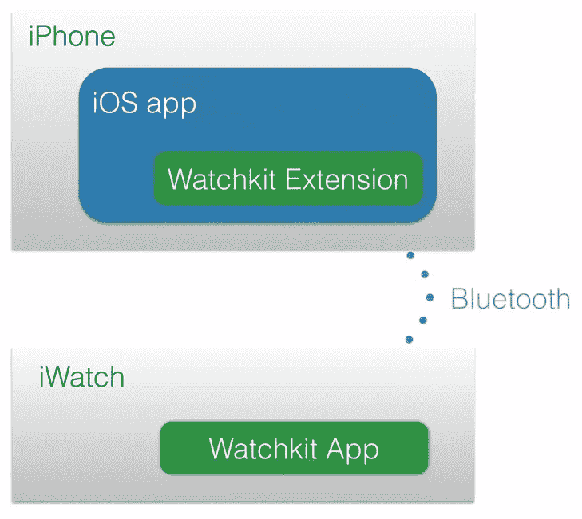

扩展是手表应用程序的主力，业务逻辑就在其中。因为扩展是 iOS 应用程序的一部分，这意味着 iPhone 必须存在才能运行手表应用程序。

手表应用程序端基本上只是 UI，它显示 UI 元素并发送回用户的任何交互。它接收来自扩展的交互，并且 UI 基于这两种类型的交互而改变。手表扩展和手表应用之间的这种分离有助于节省 iWatch 的电池寿命。手表应用程序通过蓝牙与 iPhone 上的手表扩展进行通信。

iPhone 会检查 iWatch 是否可用，如果可用，任何具有关联手表应用的应用都可以将其手表应用推送到 iWatch。

## 眼神和通知

### 反光

Watchkit 有一个 iOS 应用没有的新功能，叫做 glances。扫视对用户来说是只读的，并根据应用程序中发生的事件以一定的间隔出现。它们向用户显示摘要信息，设计用于在几秒钟内阅读。

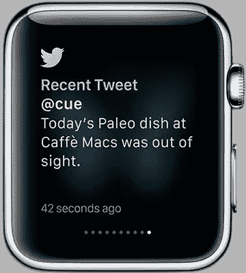

Glances 在故事板中有有限的定制选项，它们是基于模板的，并且这些模板不能被修改。有两个可定制的区域。上部和下部，如下所示，在属性检查器中。

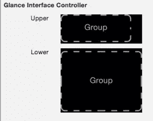

单击其中一个将显示可用的模板。

## 通知

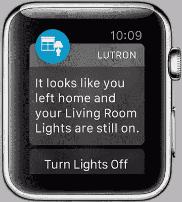

通知类似于 iOS 应用程序中的通知。如果 iOS 应用程序发送通知，发送到 iWatch 的通知不需要 Watchkit 应用程序，它们将自动得到支持。但是如果没有手表应用，你就不能自定义你的通知。通知使用项目中名为*pushnotificationpayload . apns*的 JSON 文件。您可以在这里设置通知标题、正文、按钮文本和其他选项。通知有两种风格——**静态**和**动态**。

静态通知是默认的，如果没有关联的手表应用程序，就会出现这些通知。当有关联的 Watch 应用程序时，如果让动态通知出现有问题，静态通知可能仍会用来代替动态通知。他们对用户界面布局有限制。虽然不像扫视那样受限制，但是你仍然不能通过故事板添加按钮。

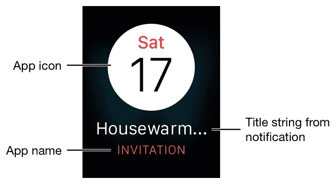

动态通知确实提供了更多的用户界面定制，并允许更多的用户交互。

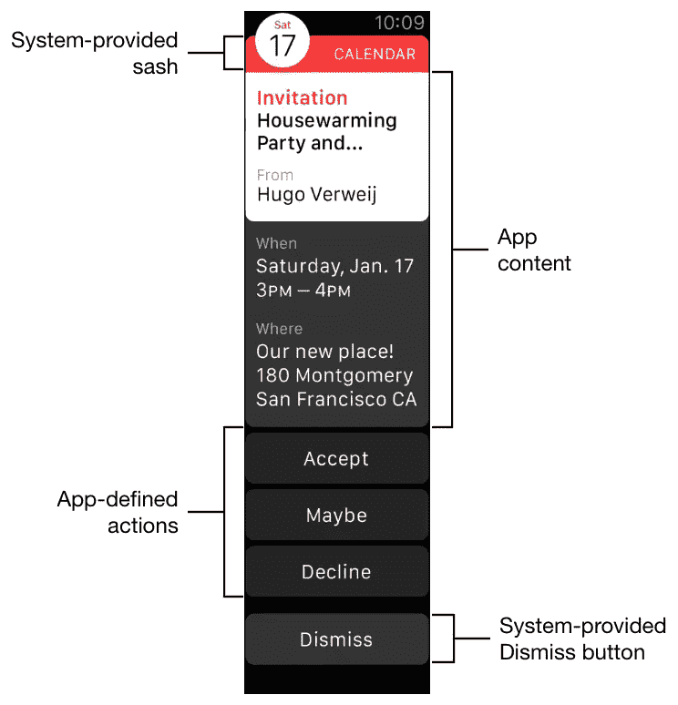

## 在 Xcode 里是什么样子的？

要将 iWatch 应用程序添加到现有的 iOS 应用程序中，请在 Xcode 中点击项目目标窗格中的加号图标，并在 *iOS* 部分下选择 *Watchkit 应用程序*。

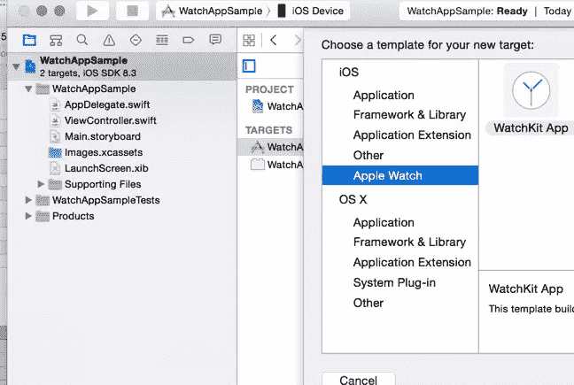

接下来，如果需要这些选项，检查*通知*和*扫视场景*。默认情况下会选择通知。

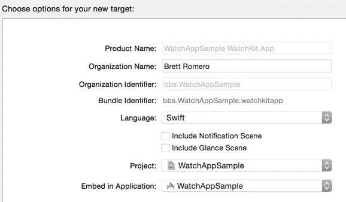

下一个屏幕将询问您是否要接受新的 Watchkit 方案。点击*激活*按钮接受。

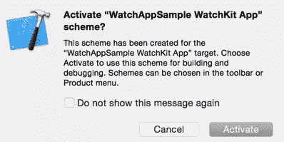

现在我们已经有了开始创建 Watchkit 应用程序所需的所有代码。Xcode 中有几个新文件夹，包括:

*   Watchkit 应用程序的测试文件夹
*   X Watchkit 扩展
*   X Watchkit 应用程序

其中“X”是 iOS 应用程序名称。我将重点介绍最后两个文件夹， *Watchkit 扩展*和 *Watchkit 应用*。在下面的截图中，三个新文件夹都是可见的。

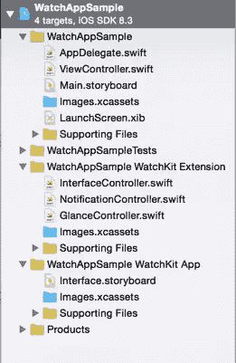

在这个项目中，iOS 应用的名字是 *WatchAppSample* 。Watchkit 扩展和应用程序继承了这个名称。自定义代码将被写入*interface controller . swift*文件。

注意故事板中的通知和浏览 UI 对象。

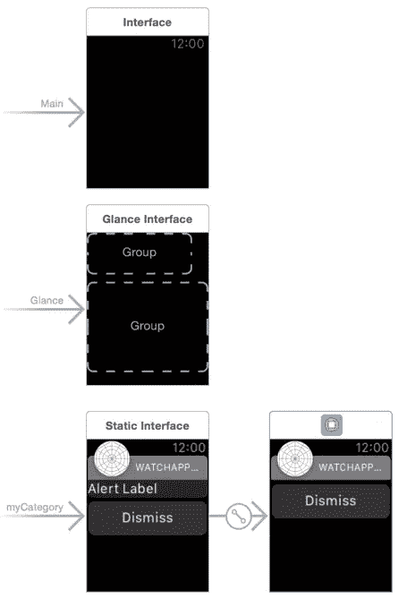

首先是静态通知，然后是动态通知。这确保了静态通知优先，并可用作后备。

## iOS 应用程序 vs Watchkit 应用程序

以下是 iOS 应用程序和 Watchkit 应用程序之间的一些框架对比:

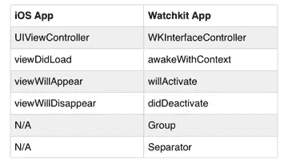

两者之间有许多相似之处，允许从 iOS 应用程序创建到 Watchkit 应用程序创建的大量知识转移。名字变了，但概念没变。

*组*是 Watchkit 的新功能，用于故事板。Watchkit 中的 UI 元素必须在一个组中，这样手表就知道如何使用水平或垂直规则来布置它们。

## 什么会被部署到应用商店？

当 Watchkit 应用程序部署到 App Store 时，会随着 Watchkit 代码打包到 iOS 应用程序包中而部署一个 iOS 应用程序。一旦在 iPhone 上，如果检测到 iWatch，Watchkit 应用程序就会通过蓝牙部署到 iWatch 上。

## 摘要

如果你已经熟悉开发 iOS 应用程序，那么开发 Watchkit 应用程序并没有太大的学习曲线。苹果在保持熟悉方面做得很好。我希望你喜欢这个 Watchkit 的介绍，在下一个教程中，我们将编写一个真正的应用程序。

## 分享这篇文章