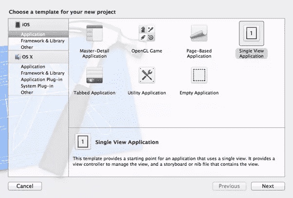
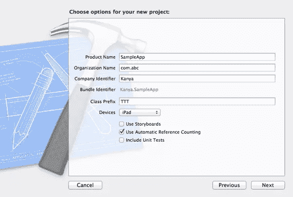
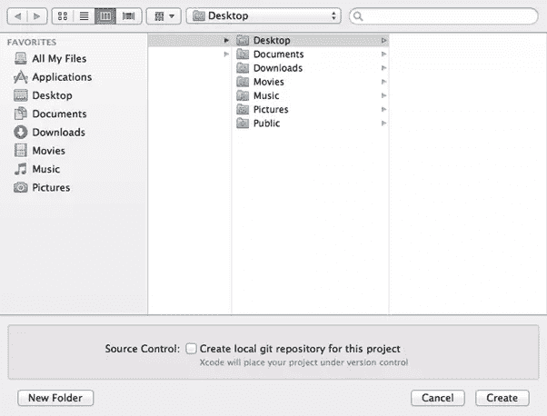
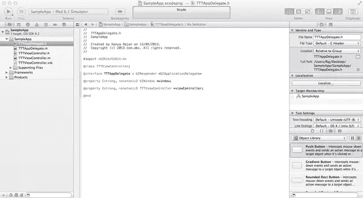
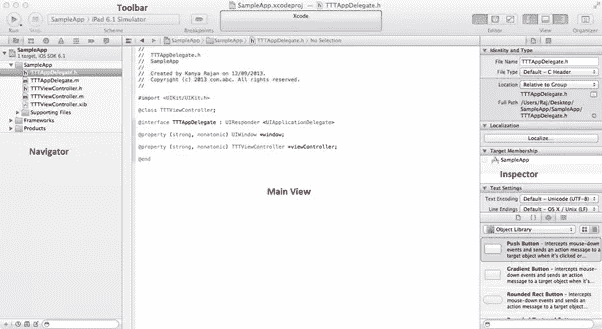
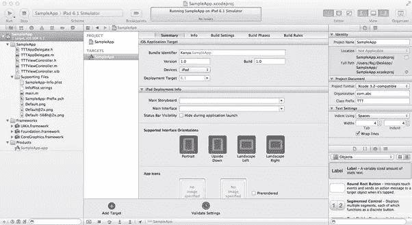
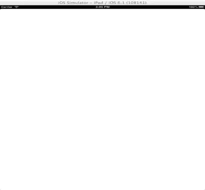
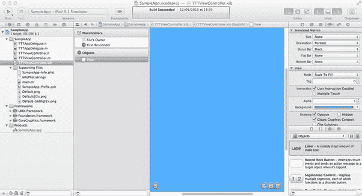
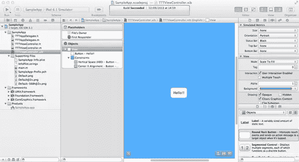
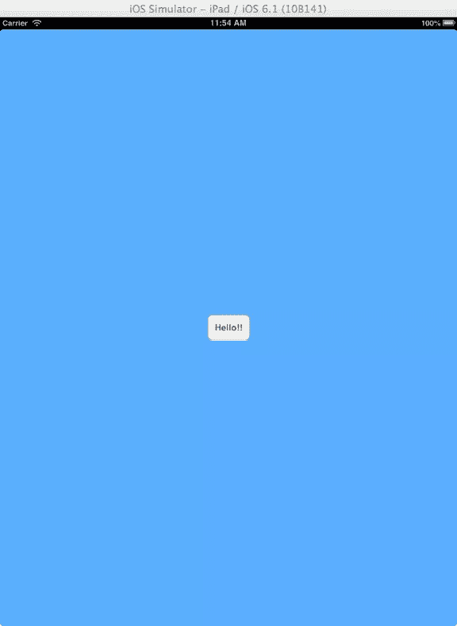

# iPhone 应用程序开发–入门

> 原文：<https://www.sitepoint.com/ios-application-development-getting-started/>

开发 iOS 应用程序变得非常简单，因为我们有许多工具可以使整个开发过程变得更容易。我向你保证，当你开发一个 iOS 应用程序并将其部署在 Appstore 中时，你会兴奋不已。

本教程将帮助你从头开始开发 iOS 应用程序。它还将有助于理解 Xcode IDE，并将涵盖 iOS 编程中的一些基本概念。

## 如何设置开发环境

在 MacBook 或 iMac 上，从 Appstore 安装 Xcode。这种设置足以在模拟器中开发和运行应用程序。如果您想要在设备中部署您开发的应用程序，或者在 Apple AppsStore 中分发您的应用程序，请注册 Apple Developer program。

现在，让我们通过创建一个简单的 iOS 应用程序来学习 Xcode 和 iOS 编程的基础知识。

## 创建 Xcode 项目:

1.打开 Xcode，选择文件->新建项目

2.从 Xcode 模板中选择单视图应用程序，然后单击“下一步”。Xcode 中有各种模板可用。尝试探索所有的模板。在本教程中，我们将坚持使用单视图应用程序模板。



3.下面的屏幕允许您配置一些项目设置。



*   **产品名称:**您的应用程序名称
*   **组织名称:**可以是您的姓名，也可以是您所在组织的名称。这个名字将被添加到每个源文件的版权声明中。
*   **公司标识符**:用于创建捆绑包标识符的唯一字符串。为了使其独一无二，Apple 建议遵循相反的命名惯例，例如 com.companyname
*   **捆绑包标识符:**带有产品名称的公司标识符构成了捆绑包标识符。
*   **类前缀:**这里给出的名称将以您创建的新类的名称为前缀。这样做是为了避免现有类和创建的自定义类之间的名称冲突。
*   **设备:**指定您是否将此应用程序用于 iPhone、iPad 或两者。在这个例子中，我们选择 iPad。
*   **使用故事板:**你的应用流程的概念性表示。对于我们的简单示例应用程序，我们不要担心这个问题。禁用此选项。
*   **使用自动参考计数:**选择此选项。在 iOS 5 之前，开发者应该手动管理内存。通过启用此选项，内存管理将被自动处理。
*   **包含单元测试:**禁用此选项。启用此功能有助于开发人员执行单元测试。

完成上述设置后，选择“下一步”。

4.指定要保存项目的路径。启用“为此项目创建本地 git 存储库”选项会将您的项目置于版本控制之下。在本教程中，我们将禁用该选项。当您实际处理一些 App Store 项目时，请启用此选项。探索并尝试获得版本控制方面的专业知识。



5.最后，单击“创建”按钮。



## 了解 Xcode IDE



Xcode 窗口有以下组件

1.**顶部工具栏。**工具栏中的运行按钮使您能够运行/停止应用程序。工具栏右侧的编辑器和视图按钮改变了 Xcode 用户界面本身的外观。试着了解每个按钮的功能。
2。**导航视图左侧的**显示您项目的源文件。
3。**中间的主视图**显示导航器中所选文件的内容。这是编辑器视图，您可以在其中编写代码和配置构建设置。
4。**右侧的检查器视图**给出了主视图中正在选择或显示的内容的额外细节和配置设置。

在导航器中选择项目。项目详细信息将显示在主视图中。



主视图包含两个部分

*   项目是指构建产品所需的源文件、资源和数据的存储库
*   目标是指实际的构建/产品。

选择项目或目标会在右侧显示其设置，如果需要，可以进行配置。

## 运行项目

单击工具栏中的运行按钮。工具栏左侧显示的目标/产品将在工具栏中指定的模拟器/设备上运行。

由于我们没有修改代码，您应该能够在模拟器中看到一个空白屏幕。



## 了解项目中的文件

1.  **接口文件:**这里是声明任何类的变量和方法的地方。

结尾是。h 扩展

3.  **实现文件:**方法的实际实现在这里完成。结尾是。m 扩展
4.  **界面构建器文件:**顾名思义，这个文件有助于构建应用程序的用户界面。结尾是。xib 扩展。(Xcode 的界面生成器)
5.  **预编译头文件**:这些文件被编译并存储在缓存中。在编译期间，它会自动包含在每个源文件中。结尾是。pch 分机。您可以在。pch 文件。
6.  **框架:**开发应用所需的库。默认情况下，会添加以下库。如果需要，我们可以包括其他 iOS 框架。我们也可以创建自己的框架，并将它们包含在项目中。

    *UIKit framework*

    *Foundation framework*

    *Coregraphics framework*

7.  **Plist:** 信息属性列表文件包含可执行文件的配置信息。
8.  **Infoplist.strings:** 存储特定本地化的值。

## 应用程序的入口点是什么？

任何 C 程序都以一个主函数开始，Objective C 也不例外，因为它是 C 的超集。

main.m 文件中提供了 main 函数。

```
#import <uikit /UIKit.h>

#import "TTTAppDelegate.h"

int main(int argc, char *argv[])
{
    @autoreleasepool {
        return UIApplicationMain(argc, argv, nil, NSStringFromClass([TTTAppDelegate class]));
    }
}
```

`autorelease pool` 帮助对应用程序中创建的对象进行自动内存管理。

`UIApplicationmain`函数接受四个参数。前两个表示可以忽略的命令行参数的数量和变量列表。第三个参数指定应该为其创建实例的应用程序类。如果此参数为 nil， `UIApplication` class 将作为默认值。

第四个参数指定应用程序委托实例应该是什么类。`UIApplicationMain`将此实例作为应用程序实例的委托(第三个参数)。这意味着每当`UIApplication`实例达到某些状态，如应用程序变为活动状态、应用程序进入后台状态等，这个委托对象都会得到通知。

现在`UIApplicationmain`将开始调用一些委托方法。应用程序一启动，就调用`application:didFinishLaunchingWithOptions:`，它负责向用户显示初始视图。

应用程序现在已经启动，`UIApplicationmain`仍将运行并维护事件循环，当用户动作发生时，它将响应用户动作。

## AppDelegate 启动方法

如前所述，`pplication:didFinishLaunchingWithOptions:`是应用程序启动后调用的第一个方法。

它创建一个 UIWindow 对象来管理设备屏幕上显示的视图。UIWindow 对象位于视图层次结构的顶部。

它还创建了一个视图控制器对象，并将其添加为窗口对象的 rootviewcontroller。它在设备屏幕上显示 viewcontrollers 的视图。

```
- (BOOL)application:(UIApplication *)application didFinishLaunchingWithOptions:(NSDictionary *)launchOptions
{
    self.window = [[UIWindow alloc] initWithFrame:[[UIScreen mainScreen] bounds]];
    // Override point for customization after application launch.
    self.viewController = [[TTTViewController alloc] initWithNibName:@"TTTViewController" bundle:nil];
    self.window.rootViewController = self.viewController;
    [self.window makeKeyAndVisible];
    return YES;
}
```

## 界面生成器

让我们来玩界面生成器。

在导航器面板中选择 *TTTViewController.xib* 文件。

在**主视图**中选择视图对象。视图对象将显示在主视图中。

点击顶部的属性检查器。

检查背景颜色属性，并将其更改为您最喜欢的颜色。



选择检查器面板底部的“对象库”。

在视图中拖放一个按钮对象。

通过单击按钮内部向其添加一些文本。



在模拟器中运行您的应用程序。



现在是时候让自己熟悉界面构建器了

## 结论

现在，您应该能够创建静态用户界面了。你的 iOS 之旅已经开始，并将继续。

## 分享这篇文章