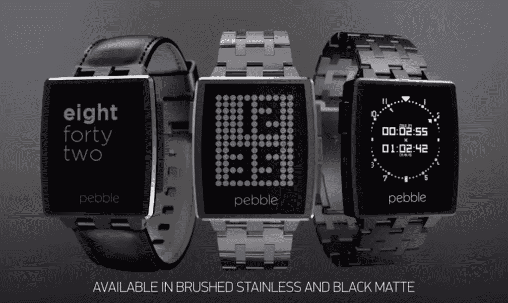
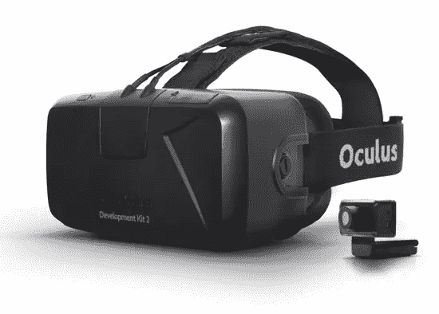
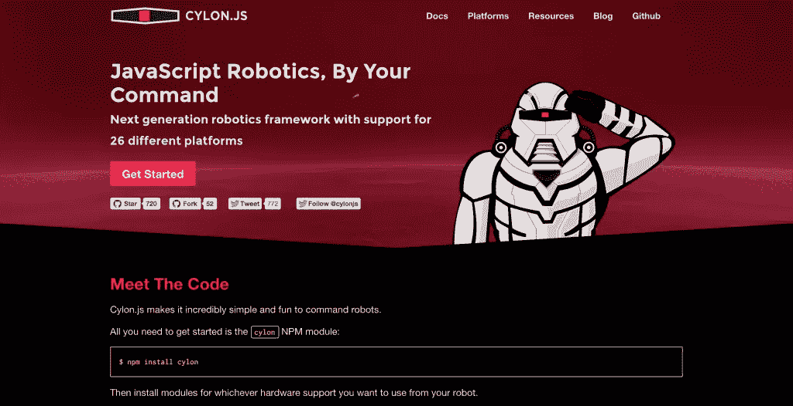
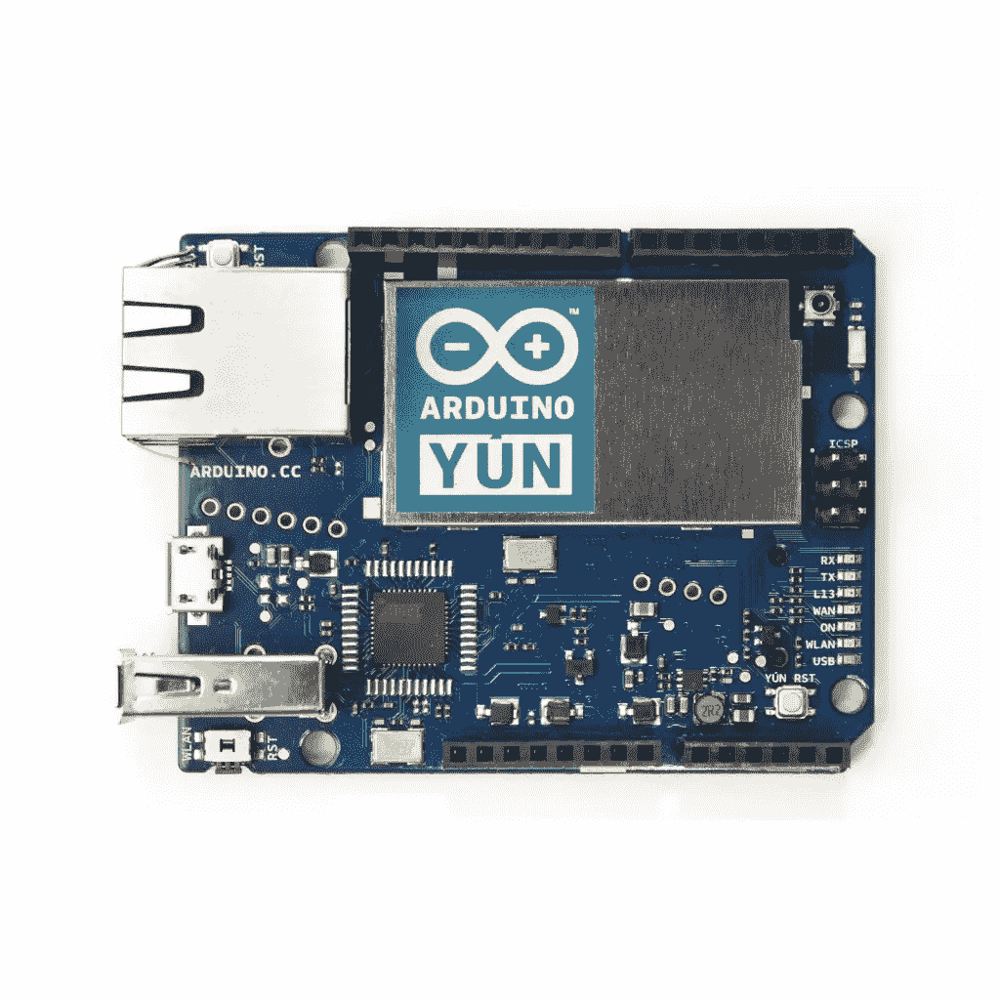
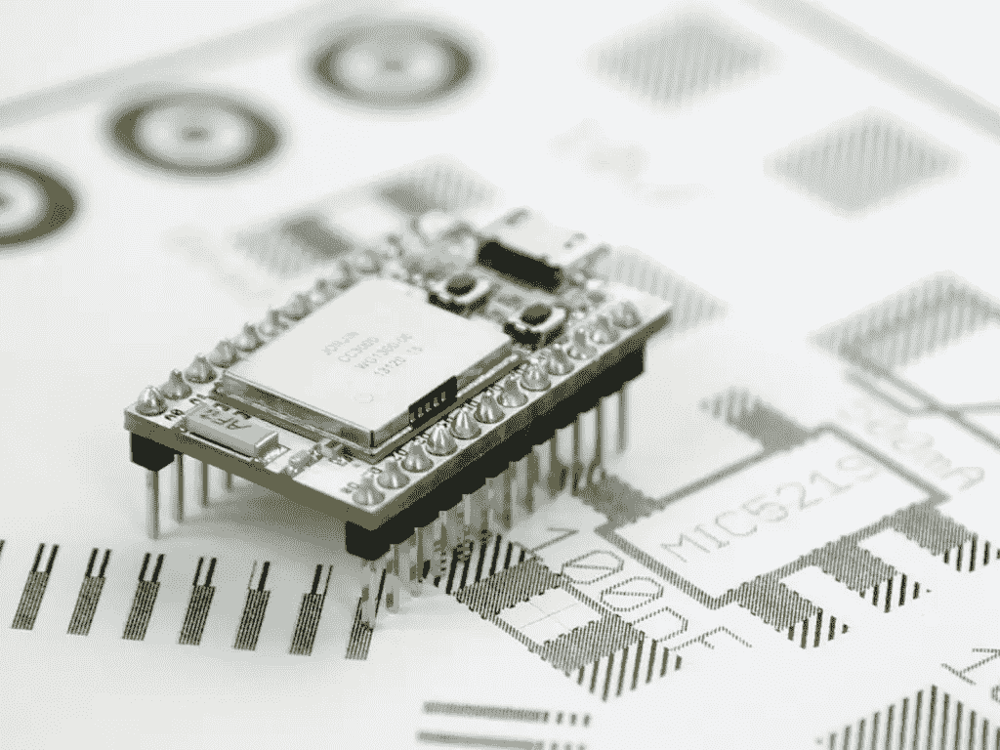
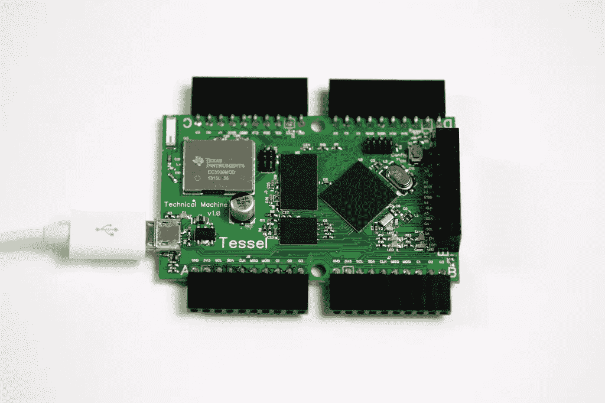
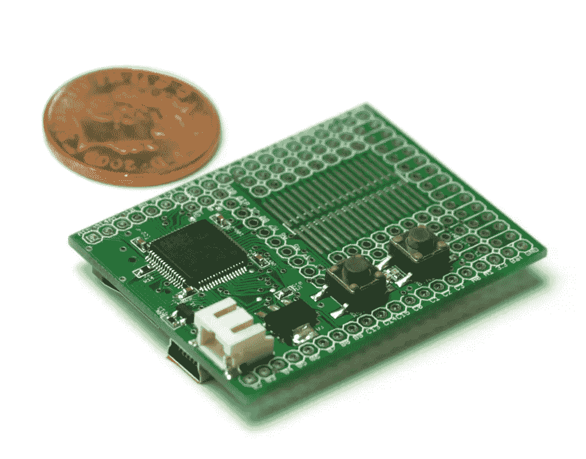
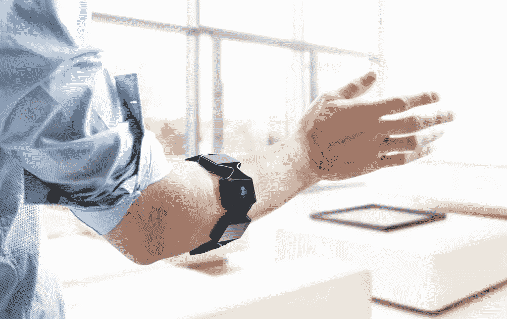
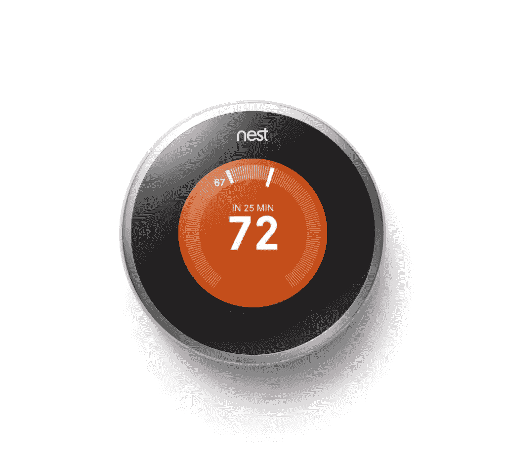

# 2014 年超越 Web 的 JavaScript

> 原文：<https://www.sitepoint.com/javascript-beyond-web-2014/>

JavaScript 的发展已经远远超出了它在 90 年代 DHTML 网站中的作用。它正迅速成为物联网(IoT)通用语言的主要竞争者。虽然现在说 JavaScript 是否真的会摘得桂冠还为时过早，但我相信 JavaScript 确实会在这个不断扩大的物联网领域发挥作用。

去年，我写了一篇 JavaScript 开发人员可能会涉足的技术概述——[超越 Web 的 JavaScript](https://www.sitepoint.com/javascript-beyond-web/)。从那以后，出现了许多新的设备和可能性，所以我想写一篇后续文章，涵盖 2014 年 JavaScript 和互联设备领域的变化。

可以通过 JavaScript 进行通信的设备列表每个月都在增加。我们既有设备制造商发布的官方 JavaScript APIs，也有社区推动的将 JavaScript 功能带给其他人的努力。

## 忍者球

 *图片来源:忍者积木公司*

忍者球是来自世界忍者积木团队的下一代家庭自动化产品。忍者球正在取代最初的[忍者积木套件](http://shop.ninjablocks.com/collections/all/products/ninja-blocks-kit)，并拥有一系列新功能，现在支持蓝牙智能设备和 [ZigBee 框架](http://en.wikipedia.org/wiki/ZigBee)。它基本上与大量新设备兼容，看起来像科幻电影中光滑发光的科技球，甚至还有手势控制。

### 通过 JavaScript 参与进来

*   [Ninja Sphere Node.js 库](https://developers.ninja/libraries/nodejs.html)–Ninja Sphere 的应用程序都是使用其官方 Node.js 库进行编程的。甚至球体的驱动程序和设备定义都在 JavaScript 文件中。这是 JavaScript 和物联网狂热分子的梦想。

## 跳跃运动

*图片来源:飞跃运动公司*

[Leap Motion](https://www.leapmotion.com/) 是一项非常棒的技术，允许你使用手势控制应用程序和设备。它可以追踪双手和所有十个手指，为开发人员提供了典型键盘和鼠标的未来替代方案。

自去年以来，在跳跃运动的世界里，事情已经发展到一些令人兴奋的新的可能性。他们有他们的手跟踪 V2 测试版，微调跟踪使其更加可靠。他们现在可以追踪每个手指上的骨头了！

V2 还为 Leap Motion 提供了一个令人兴奋的新用途——虚拟现实。尽管虚拟现实令人兴奋，但看不到自己的手还是有点令人不快。带上 [Leap Motion 的新 Oculus mount](https://www.leapmotion.com/product/vr) ，你可以将 Leap Motion 连接到 Oculus VR 耳机上，允许你用手与虚拟世界互动。

从 JavaScript 的角度来看，Leap Motion 团队提供了一个相当高标准的 JavaScript SDK，其中包含大量文档和示例——已经更新了许多 V2 功能。

### 通过 JavaScript 参与进来

*   [Leap Motion JavaScript 框架](https://developer.leapmotion.com/documentation/skeletal/javascript/index.html)–这为 web 应用和节点带来了几乎所有的 Leap Motion 功能。大量的 V2 测试版已经可供你用 JavaScript 开发，我们只是在等待虚拟现实的头戴式跟踪功能，希望很快就会到来。

## 鹅卵石手表

*照片来源:卵石*

哦， [Pebble 手表](http://getpebble.com/) …不要让我开始谈论这个设备有多棒。我是一个直言不讳的 Pebble 爱好者，我已经就为什么人们应该得到一个 Pebble 做了完整的演讲！在 Apple watch 和 Android Wear 出现之前的时代，Pebble 团队正在开发一款功能强大、易于使用的智能手表，它可以通过蓝牙与 iPhones 和 Android 设备配对。它使用电子纸显示屏，便于在阳光直射下阅读，电池续航时间可持续约一周。

今年发布了 Pebble SDK 的 2.0 版本，带来了 Pebble Appstore、一系列新功能以及最令人兴奋的 PebbleKit JavaScript 框架。

### 通过 JavaScript 参与进来

*   [PebbleKit JavaScript 框架](https://developer.getpebble.com/2/guides/javascript-guide.html)–该框架允许您在手机上运行 JavaScript，从网络上获取数据，在您的手表和应用上构建丰富的网络增强体验。它还可以从你的手机上获取位置数据，因此可以创建基于位置的 web API 应用程序。应用程序开发仍然需要为 watch 应用程序本身编写一些 C 代码，但对于那些没有太多 C 经验的人来说，你可以拿一个样本 watchface，做一些不需要太多 C 知识的小改动，然后用 JavaScript 构建大多数令人兴奋的功能！如果你热衷于 Pebble 开发，我在下面两篇 SitePoint 文章中介绍了如何从 JavaScript 角度开始 Pebble 应用程序开发。
*   [用 JavaScript 开发 Pebble Watch](https://www.sitepoint.com/pebble-watch-development-javascript/)——我的第一篇文章涵盖了所有基础知识。
*   [高级 Pebble 手表配置](https://www.sitepoint.com/advanced-pebble-watch-configuration/)–如何使用 JavaScript 框架为 Pebble 应用程序添加配置选项。
*   [Pebble . js](https://github.com/pebble/pebblejs)–虽然仍处于测试阶段，但这是一个完全用 JavaScript 构建 Pebble 应用程序*的官方框架*！在接下来的几个月里，请密切关注此事。

## Oculus 裂缝

*图片来源:Oculus VR，LLC*

Oculus Rift 耳机让我们比以往任何时候都更接近易于访问的虚拟现实。[开发者套件 2](http://www.oculus.com/dk2/) 最近于今年发货，耳机的新版本即将面世——[“新月湾”原型](http://www.oculus.com/blog/oculus-connect-2014/)和使用三星 Galaxy Note 4 的[三星 Gear VR 耳机](http://www.oculus.com/blog/introducing-the-samsung-gear-vr-innovator-edition/)。

虽然 Oculus Rift 还没有官方的 JavaScript API，但有几个选项可以创建 JavaScript 驱动的 Oculus 体验。

### 通过 JavaScript 参与进来

*   [Oculus bridge](https://github.com/Instrument/oculus-bridge)——一个桌面应用和 JavaScript 库，允许基于 Three.js 的 Oculus Rift web 体验。它同时安装了 Windows 和 Mac OSX，可以在 Chrome 28、Safari 6 和 Firefox 22 上运行。没有提到 IE，所以不确定是否支持。这是我在 Macbook 上相对容易使用的 JS 库。
*   [VR . js](https://github.com/benvanik/vr.js/)——Chrome 和 Firefox 的一个插件，提供对 Oculus Rift 耳机的访问，但是它使用的是 NPAPI，而 [Chrome 正在对 NPAPI 进行贬值](http://blog.chromium.org/2014/05/update-on-npapi-deprecation.html)，所以这可能不是一个好的长期解决方案。我一直在用 OculusBridge 做实验。
*   [Babylon.js 和 IE11](https://github.com/BabylonJS/Babylon.js/wiki/Using-Oculus-Rift-with-Babylon.js)——如果你有一台装有 IE11 的电脑，你可以使用 [Babylon.js](http://www.babylonjs.com/) 创建一个 3D 环境，然后用一行代码和一个驱动程序，获取设备方向。由此你就有了 Oculus Rift 的 VR 体验！它显然还不能在 Chrome 上运行，但是希望很快就能实现。

## 赛昂人

*图片来源:混合组*

一个非常有用的 JavaScript API 是 [Cylon.js](http://cylonjs.com/) ，这是一个用于机器人和物联网的 JavaScript 框架。通过允许您使用相同的 API 结构对一系列设备进行编程，它在使 JavaScript 能够弥合设备之间的差距方面取得了一些重大进展。它以一种易于理解的方式完成所有这些工作，使设备编程变得非常简单。Cylon.js 通过提供多个模块来支持不断扩展的设备列表，包括 Leap Motion、Pebble watch、Arduinos、Raspberry Pis 等。

### Arduino 云

*图片来源:Arduino*

现在，我们已经能够通过 Node 以多种不同的方式从远程节点服务器向 Arduinos 发出命令。他们一直依赖 Arduino 运行自己的 C 代码，该代码理解如何与节点服务器通信。今年推出了一款新的 Arduino——[Arduino YUN](http://arduino.cc/en/Main/ArduinoBoardYun)。这款 Arduino 是第一款在主板上运行 Linux 的产品，因此您可以在 Arduino 上设置并运行一个 web 服务器，它可以与 Arduino 本身进行对话，从而消除了在其他地方使用主服务器来发布命令的需要。

### 通过 JavaScript 参与进来

*   [在 Arduino 云上安装 node . js](http://www.appsaloon.be/blog/node-js-arduino-yun/)——对于 JS 开发者来说，这种 Linux 安装意味着你可以在 Arduino 本身上安装 Node.js，将大量的运行代码保存在主板本身上。基本上——你的 Arduino 可以运行 JavaScript！
*   Cylon.js 模块——它也有一个自己的 Cylon.js 模块，可以安装在 YUN 上。

## 踢我们

*图片来源:星火*

[Spark OS](https://www.spark.io/) 是云中的一个操作系统，允许支持互联网的设备进行通信。它们有 Spark 内核，这是一种支持 Wi-Fi 的微控制器板，类似于 Arduinos(但比 Arduino Uno 小得多)。你可以将它们连接到 WiFi 网络，并通过他们的云平台向 Spark 核心板发送命令。这是我经历过的最简单的物联网设备设置过程，也是每次连接和使用最可靠的过程。

### 通过 JavaScript 参与进来

*   官方的 Spark JavaScript SDK–Spark 有他们自己的 JavaScript SDK，很容易上手，下面还有各种第三方库。
*   spark-io-voodootikigod 的一个模块，他也设计了 [Johnny-Five](https://github.com/voodootikigod/johnny-five) Arduino 节点模块。
*   一个非常简单的 Node.js 库。
*   [Cylon.js 模块](http://cylonjs.com/documentation/platforms/spark/)

## 特塞尔

*图片来源:Tessel*

这一年也是 [Tessel](https://tessel.io/) 运往世界的一年。Tessel 是一个类似 Arduino 和 Spark 内核的微控制器，但它是专门为 JavaScript 开发人员构建的，因为主板本身运行 JavaScript。它与成千上万的 Node.js 包兼容(但不运行 Node 本身)，开发的最终目标是利用 JavaScript 生态系统和 JavaScript 开发人员的所有现有潜力。

### 通过 JavaScript 参与进来

*   [官方 Tessel 文档](https://tessel.io/docs)——在文档的模块部分有一堆例子来展示如何通过 JavaScript 与每种类型的模块进行通信。
*   [Cylon.js 模块](http://cylonjs.com/documentation/platforms/tessel)

## 埃斯普罗伊诺

*图片来源:Pur3 Ltd*

今年早些时候，另一款运行 JavaScript 的微控制器——[Espruino](http://www.espruino.com/)发布。这种板很小，在单个芯片上运行，非常节能，显然可以靠电池供电运行多年。它并不真正运行节点模块等，而是通过一个基于事件的系统工作，在这个系统中，设备可以实时运行您的 JavaScript 命令。您可以从您的计算机上运行设备上的代码，然后当您满意时，您可以在 Espruino 上运行一个命令来保存当前的功能和配置。这与在 Arduino 和 Tessel 上为每次更改上传代码是完全不同的模型。

### 通过 JavaScript 参与进来

*   官方 Espruino 文档——快速入门指南，随后是更深入的内容。
*   [Node-espruino](https://www.npmjs.org/package/node-espruino)–第三方节点库，用于通过 Node.js 与 Espruino 接口。

## 英特尔伽利略系统

*图片来源:英特尔公司*

英特尔 Galileo 板是一种微控制器板，使用英特尔自己的组件，但遵循 Arduino Uno 引脚结构，因此可以使用现有的 Arduino 屏蔽。就像 Arduino YUN 一样，Galileo 在船上运行 Linux。然而，所使用的 Linux 映像显然相当有限，因此可以通过插入 SD 卡来安装更大的 Linux 映像。这个完全成熟的 Linux 包含 Node.js 及其所有 JavaScript 功能(以及许多其他非 js 功能)。

### 通过 JavaScript 参与进来

*   [node . js 的“更大”Linux 镜像](https://learn.sparkfun.com/tutorials/galileo-getting-started-guide/bigger-linux-image)——来自 SparkFun 的 SD 卡 Linux 选项入门指南。绝对是最强大、最有潜力的选择。它没有涵盖如何使用 Node.js 服务器，因为它具有 Python 焦点，但它是起点。
*   [使用 JavaScript 和 Node.js 进行英特尔 Galileo 编程](http://bocoup.com/weblog/intel-galileo-javascript-nodejs/)——本文详细介绍了如何在主板上使用 Node，展示了如何将 Johnny-Five 模块安装到主板上。
*   Cylon–如果你的 SD 卡上安装了全功能的 Linux，Cylon 的模块可以工作。
*   [Johnny-Five 的 Galileo-IO 模块](https://github.com/rwaldron/galileo-io)–就像使用 Johnny-Five 模块控制 Arduinos 一样，JavaScript 控制是通过 Galileo 板外部的节点服务器进行的，而不是安装在板上。

## 谷歌纸板

*图片来源:谷歌公司*

在今年的谷歌 I/O 大会上，一个非常奇怪却又强大的概念被引入——[谷歌纸板](https://developers.google.com/cardboard/)。它们是一副由纸板制成的 DIY 虚拟现实眼镜，你可以将 Android 设备连接到它，以获得相当便宜的 VR 体验。他们的文档侧重于原生 Android 开发，然而也有 Chrome 实验显示了 JavaScript 支持的基于网络的虚拟现实的潜力。

### 通过 JavaScript 参与进来

*   Cardboard Chrome 实验——包括一系列演示和一个代码示例。查看演示中的源代码，了解它是如何工作的。

## Myo 臂章

*图片来源:Thalmic Labs Inc .*

[Myo 臂带](https://thalmic.com/en/myo/)利用你肌肉中的电活动，通过手势完全无线地控制应用程序。这是一款相对较新的产品，目前才刚刚交付预购订单。我们将有一群新的开发人员在今年尝试这一技术，我们将看到这款新设备的效果如何。我急切地等待着我的。这项技术肯定有巨大的潜力。

### 通过 JavaScript 参与进来

*   MyoJS-Myo 的非官方 JavaScript 框架。遗憾的是，目前还没有官方支持。

## 筑巢

*图片来源:鸟巢实验室*

Nest 团队现在有两个智能设备，Nest 恒温器和 Nest Protect(烟雾和一氧化碳报警器)。今年，他们向公众开放了他们的 Nest 开发者计划和 Nest API。虽然他们没有特定的 JavaScript API，但他们在两个示例中提供了如何通过 JavaScript 访问嵌套 API 的示例。

### 通过 JavaScript 参与进来

*   [Nest 恒温器的官方样品 JS](https://developer.nest.com/documentation/control)
*   [鸟巢保护官方样品 JS](https://developer.nest.com/documentation/alert)
*   到目前为止，Cylon.js 模块似乎专注于恒温器功能。

## 结论

如您所见，以某种方式支持 JavaScript 的设备数量正在增长。在一篇合理大小的文章中，我无法列出更多的内容！世界上尚未尝试物联网设备的 JavaScript 开发人员，在您的技能组合中有一系列尚未开发的潜力——为自己买一台设备并开始尝试吧！

## 分享这篇文章