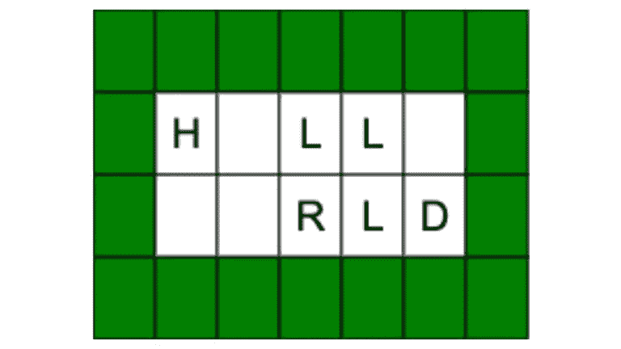
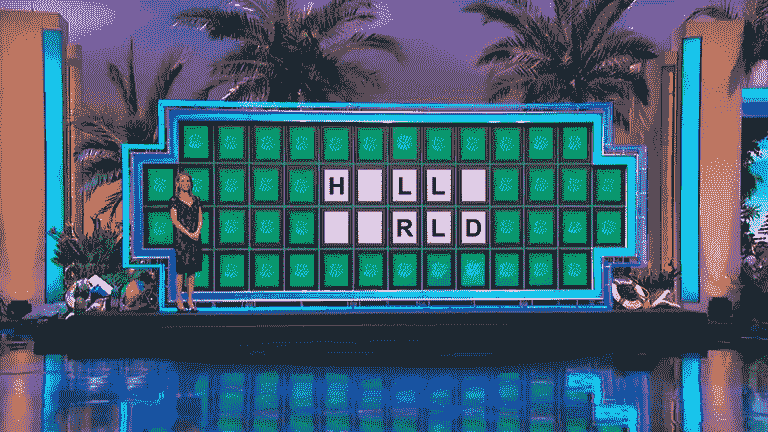
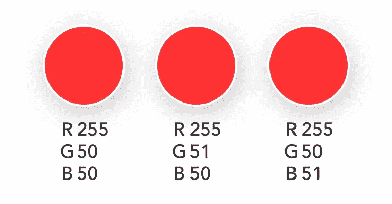

# 我是如何为我的 Zoom 小组构建幸运之轮 JavaScript 游戏的

> 原文：<https://www.sitepoint.com/javascript-game-zoom-group/>

在这篇文章中，我描述了我如何开发一个 JavaScript“幸运之轮”游戏，在全球疫情期间通过 Zoom 使在线会议更有趣。

当前的疫情迫使许多社交活动走向虚拟化。例如，我们当地的世界语小组现在在网上(而不是面对面)为我们每月的语言学习聚会聚会。作为该组织的组织者，由于冠状病毒，我不得不重新考虑我们的许多活动。以前，我可以在我们的混合活动中加入看电影，甚至在公园里散步，以避免疲劳(不断的语法练习不鼓励重复参加)。

我们新的幸运轮游戏很受欢迎。当然，SitePoint 是一个技术博客，所以我将在我们的在线会议上展示一个关于构建游戏初级版本的概述。我将讨论我在这一过程中所做的一些权衡，以及强调一些改进的可能性和我事后应该采取不同做法的事情。

## 重要的事情先来

如果你来自美国，你可能已经熟悉[幸运之轮](https://en.wikipedia.org/wiki/Wheel_of_Fortune_%28American_game_show%29)，因为它是历史上最长的美国游戏节目。(即使你不在美国，你也可能熟悉该节目的一些变体，因为它已经被改编并在 40 多个国际市场播出。)这个游戏本质上是 Hangman:参赛者试图通过猜测字母来解决一个隐藏的单词或短语。每一个正确字母的奖金数额是通过旋转一个巨大的轮盘赌式的轮盘来决定的，轮盘上有美元数额和可怕的破产点。一名参赛者转动轮盘，猜一个字母，谜题中的任何字母都会显示出来。正确的猜测为参赛者赢得另一次旋转和猜测的机会，而不正确的猜测则让下一位参赛者继续游戏。当参赛者成功猜出单词或短语时，谜题就解决了。多年来，游戏的规则和各种元素一直在调整，你当然可以根据玩家的需要修改自己的版本。

对我来说，当务之急是决定我们如何在物理上(虚拟地)玩游戏。我只在一两次会议上需要这个游戏，我不愿意投入大量时间来构建一个成熟的游戏平台，所以将应用程序构建为一个网页，我可以在本地加载并与他人分享屏幕也没问题。我会主持活动，并根据玩家的需要用各种击键来驱动游戏。我还决定用铅笔和纸来记录分数——这是我后来会后悔的事情。但最终，我只需要简单的 JavaScript、一点画布、一些图片和音效文件就能完成这个游戏。

## 游戏循环和游戏状态

虽然我设想这是一个“快速和肮脏”的项目，而不是遵循每个已知的最佳实践的一些出色的编码杰作，但我的第一个想法仍然是开始构建一个游戏循环。一般来说，游戏代码是维护变量等的状态机，用一些附加的额外代码来表示游戏的当前状态，以处理用户输入，管理/更新状态，并用漂亮的图形和声音效果来呈现状态。被称为游戏循环的代码反复执行，触发输入检查、状态更新和渲染。如果你要正确地构建一个游戏，你很可能会遵循这个模式。但是我很快意识到我不需要持续的状态监控/更新/渲染，所以我放弃了游戏循环，转而支持基本的事件处理。

就维护状态而言，代码需要知道当前的谜题，哪些字母已经被猜出，以及要显示哪个视图(谜题板或纺车)。这些对于任何回调逻辑都是全局可用的。当处理按键时，游戏中的任何活动都会被触发。

核心代码开始看起来是这样的:

```
(function (appId) {
  // canvas context
  const canvas = document.getElementById(appId);
  const ctx = canvas.getContext('2d');

  // state vars
  let puzzles = [];
  let currentPuzzle = -1;
  let guessedLetters = [];
  let isSpinning = false;

  // play game
  window.addEventListener('keypress', (evt) => {
    //... respond to inputs
  });
})('app'); 
```

## 游戏板和拼图

幸运之轮的游戏板本质上是一个网格，每个单元格处于三种状态之一:

*   空的:在拼图中没有使用空的单元格(绿色)
*   空白:单元格代表拼图中隐藏的字母(白色)
*   可见:单元格显示了拼图中的一个字母

编写游戏的一种方法是使用一个表示游戏棋盘的数组，每个元素作为一个处于这些状态之一的单元，呈现该数组可以通过几种不同的方式来完成。这里有一个例子:

```
let puzzle = [...'########HELLO##WORLD########'];

const cols = 7;
const width = 30;
const height = 35;

puzzle.forEach((letter, index) => {
  // calculate position
  let x = width * (index % cols);
  let y = height * Math.floor(index / cols);

  // fill
  ctx.fillStyle = (letter === '#') ? 'green' : 'white';
  ctx.fillRect(x, y, width, height);

  // stroke
  ctx.strokeStyle = 'black';
  ctx.strokeRect(x, y, width, height);

  // reveal letter
  if (guessedLetters.includes(letter)) {
      ctx.fillStyle = 'black';
      ctx.fillText(letter, x + (width / 2), y + (height / 2));
  }
}); 
```

这种方法遍历拼图中的每个字母，计算起始坐标，根据索引和其他细节(如一行中的列数以及每个单元格的宽度和高度)为当前单元格绘制一个矩形。它检查字符并相应地给单元格着色，假设`#`用于表示空单元格，字母表示空白。猜中的字母被画在单元格上以显示出来。



另一种方法是预先为每个谜题准备一个静态的棋盘图像，它将被绘制到画布上。这种方法会增加拼图准备的工作量，因为您需要创建额外的图像，可能需要确定每个字母在自定义板上的位置，并将所有信息编码到适合呈现的数据结构中。代价是更好看的图形和更好的字母定位。

这是遵循第二种方法的拼图的样子:

```
let puzzle = {
  background: 'img/puzzle-01.png',
  letters: [
    {chr: 'H', x: 45,  y: 60},
    {chr: 'E', x: 75,  y: 60},
    {chr: 'L', x: 105, y: 60},
    {chr: 'L', x: 135, y: 60},
    {chr: 'O', x: 165, y: 60},
    {chr: 'W', x: 45,  y: 100},
    {chr: 'O', x: 75,  y: 100},
    {chr: 'R', x: 105, y: 100},
    {chr: 'L', x: 135, y: 100},
    {chr: 'D', x: 165, y: 100}
  ]
}; 
```

为了提高效率，我建议包含另一个数组来跟踪匹配的字母。只有`guessedLetters`数组可用，您需要重复扫描字谜的字母以找到多个匹配。相反，您可以设置一个数组来跟踪已解决的字母，并在玩家进行猜测时将匹配的定义复制到数组中，如下所示:

```
const solvedLetters = [];

puzzle.letters.forEach((letter) => {
  if (letter.chr === evt.key) {
    solvedLetters.push(letter);
  }
}); 
```

渲染这个谜题看起来是这样的:

```
// draw background
const imgPuzzle = new Image();
imgPuzzle.onload = function () {
  ctx.drawImage(this, 0, 0);
};
imgPuzzle.src = puzzle.background;

// reveal letters
solvedLetters.forEach((letter) => {
  ctx.fillText(letter.chr, letter.x, letter.y);
}); 
```



根据记录，我在编写游戏时采用了第二种方法。但是这里重要的一点是，同一个问题通常有多种解决方案。每个解决方案都有自己的优点和缺点，决定一个特定的解决方案将不可避免地影响程序的设计。

## 旋转车轮

乍一看，旋转轮盘似乎很有挑战性:渲染一圈带有奖金数额的彩色部分，制作旋转的动画，并在随机奖金数额时停止动画。但是一点点创造性的思考使这成为整个项目中最简单的任务。

不管你用什么方法来编码谜题和渲染游戏板，轮子可能是你想要使用图形的东西。旋转图像比用文本画一个分段的圆(并制作动画)要容易得多；使用图像消除了前面的大部分复杂性。然后，旋转滚轮就变成了计算一个大于 360°的随机数，并重复旋转图像多次:

```
const maxPos = 360 + Math.floor(Math.random() * 360);
for (let i = 1; i < maxPos; i++) {
  setTimeout(() => {
    ctx.save();
    ctx.translate(640, 640);
    ctx.rotate(i * 0.01745); // radians
    ctx.translate(-640, -640);
    ctx.drawImage(imgWheel, 0, 0);
    ctx.restore();
  }, i * 10);
} 
```

我通过使用`setTimeout`来安排轮换，创建了一个粗糙的动画效果，每个轮换都被安排在越来越遥远的未来。在上面的代码中，第一个 1 度旋转被安排在 10 毫秒后渲染，第二个在 20 毫秒后渲染，依此类推。净效应是转轮大约每 360 毫秒旋转一周。确保初始随机数大于 360 可以保证我至少做一次完整的旋转。

值得一提的一点是，您可以随意使用提供的“神奇值”来设置/重置画布旋转的中心点。根据图像的大小，以及您是希望看到整个图像还是只看到轮子的顶部，精确的中点可能不会产生您想要的效果。可以调整这些值，直到获得满意的结果。超时乘数也是如此，您可以修改它来更改旋转的动画速度。

<video class="wp-video-shortcode" id="video-181149-1" width="1242" height="698" preload="metadata" controls=""><source type="video/mp4" src="https://uploads.sitepoint.com/wp-content/uploads/2021/02/1613528981wheel-of-fortune.mp4?_=1">[https://uploads.sitepoint.com/wp-content/uploads/2021/02/1613528981wheel-of-fortune.mp4](https://uploads.sitepoint.com/wp-content/uploads/2021/02/1613528981wheel-of-fortune.mp4)</video>

## 破产

我想当一个玩家破产时，我们都会有一点幸灾乐祸的经历。看着一个贪婪的参赛者旋转轮盘来获得更多的字母是很有趣的，当他们显然已经知道谜题的答案时——却失去了一切。还有有趣的破产音效！没有它，幸运之轮游戏就不完整。

为此，我使用了 Audio 对象，它使我们能够在 JavaScript 中播放声音:

```
function playSound(sfx) {
  sfx.currentTime = 0;
  sfx.play();
}

const sfxBankrupt = new Audio('sfx/bankrupt.mp3');

// whenever a spin stops on bankrupt...
playSound(sfxBankrupt); 
```

但是是什么触发了音效呢？

一种解决方案是按下一个按钮来触发效果，因为我已经在控制游戏了，但是更希望游戏自动播放声音。由于破产楔形体是轮盘上仅有的黑色楔形体，因此只需查看像素颜色就可以知道轮盘是否在破产时停止:

```
const maxPos = 360 + Math.floor(Math.random() * 360);
for (let i = 1; i < maxPos; i++) {
  setTimeout(() => {
    ctx.save();
    ctx.translate(640, 640);
    ctx.rotate(i * 0.01745); // radians
    ctx.translate(-640, -640);
    ctx.drawImage(imgWheel, 0, 0);
    ctx.restore();

    if (i === maxPos - 1) {
      // play bankrupt sound effect when spin stops on black
      const color = ctx.getImageData(640, 12, 1, 1).data;
      if (color[0] === 0 && color[1] === 0 && color[2] === 0) {
        playSound(sfxBankrupt);
      }
    }
  }, i * 10);
} 
```

在我的代码中，我只关注破产，但是这种方法也可以扩展到确定奖金数额。尽管多个金额共享相同的楔形颜色——例如，600 美元、700 美元和 800 美元都出现在红色楔形上——您可以使用稍微不同的阴影来区分金额:`rgb(255, 50, 50)`、`rgb(255, 51, 50)`和`rgb(255, 50, 51)`人眼无法分辨，但应用程序很容易识别。事后看来，这是我应该进一步追求的东西。我发现在按下按键和运行游戏的同时手动记录分数是一种精神负担，额外的自动记录分数的努力绝对是值得的。



## 摘要

如果你好奇，可以在 [GitHub](https://github.com/tboronczyk/pendumilo) 上找到我的代码。它不是缩影和最佳实践，并且有许多错误(就像在生产环境中运行的许多真实世界的代码一样！)但它达到了目的。但这篇文章的最终目的是启发你，并邀请你批判性地思考你自己的权衡选择。

如果你在构建一个类似的游戏，你会做出怎样的取舍？你认为哪些特征是关键的？也许你会想要合适的动画，记分，或者你甚至会使用网络插座，这样参赛者可以在他们自己的浏览器上一起玩，而不是通过共享主持人的屏幕。

除了这个例子，你在日常工作中还面临着哪些选择？您如何平衡业务优先级、适当的编码实践和技术债务？什么时候追求完美的愿望会成为运输产品的障碍？在推特上让我知道[。](https://twitter.com/zaemis)

## 分享这篇文章