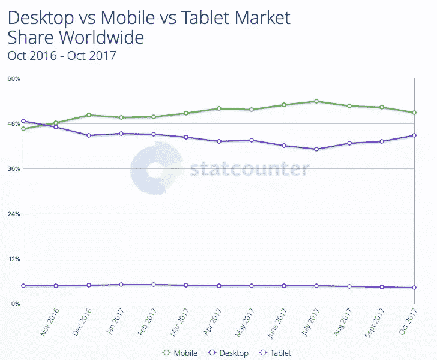
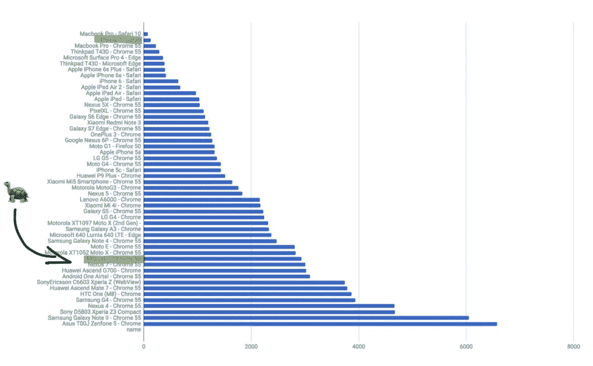
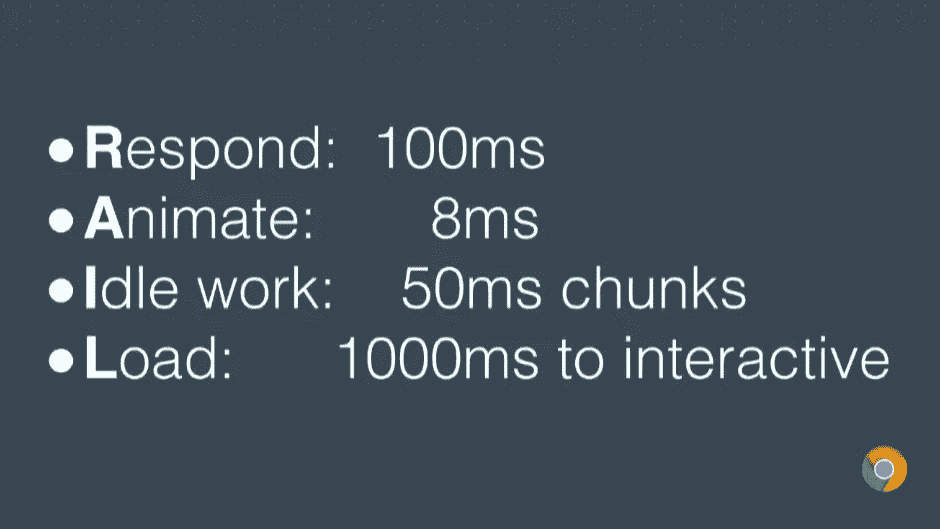
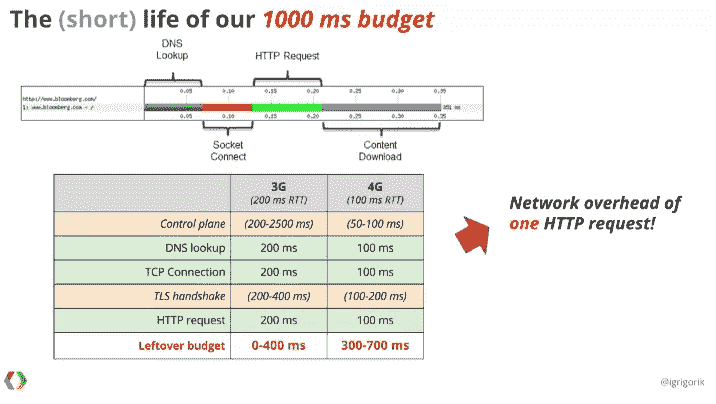
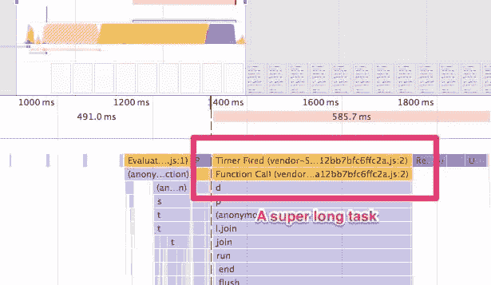

# JavaScript 性能优化技巧:概述

> 原文：<https://www.sitepoint.com/javascript-performance-optimization-tips-an-overview/>

在这篇文章中，有很多内容要涵盖广阔而多变的世界。这也是一个每个人都喜欢的话题:本月的 JS 框架。

我们将努力坚持“工具，而不是规则”的口号，并将 JS 流行语保持在最低限度。因为我们不可能在一篇 2000 字的文章中涵盖与 JS 性能相关的所有内容，所以请务必阅读参考资料，并在之后进行自己的研究。

但是在我们深入细节之前，让我们通过回答以下问题来获得对这个问题的更广泛的理解:什么被认为是高性能 JavaScript，它如何适应更广泛的 web 性能度量范围？

## 搭建舞台

首先，让我们弄清楚以下情况:如果你只在你的桌面设备上测试，你就排除了超过 50%的用户。



这一趋势只会继续增长，因为新兴市场的首选网络网关是低于 100 美元的 Android 设备。桌面作为访问互联网的主要设备的时代已经结束，下一个十亿互联网用户将主要通过移动设备访问您的网站。

在 Chrome DevTools 的设备模式下进行测试并不能有效替代在真实设备上进行测试。使用 CPU 和网络节流有所帮助，但这是一个根本不同的野兽。在真实设备上测试。

即使你正在真正的移动设备上进行测试，你也可能是在你崭新的 600 美元的旗舰手机上进行测试。问题是，这不是你的用户拥有的设备。中型设备类似于 Moto G1——内存不足 1GB，CPU 和 GPU 非常弱。

让我们看看当[解析一个普通的 JS 包](https://docs.google.com/spreadsheets/d/1wHcNNQea28LhwQ_amFamT33d5woVrJfJy53Z1k6V090/edit?usp=sharing)时，它是如何堆叠起来的。



Addy Osmani: [花费在 JS 解析&评估平均 JS](https://docs.google.com/spreadsheets/d/1wHcNNQea28LhwQ_amFamT33d5woVrJfJy53Z1k6V090/edit?usp=sheets_home&ths=true) 上的时间。

哎哟。虽然这张图片只涵盖了 JS 的解析和编译时间(稍后会详细介绍),而不是总体性能，但是它与 JS 的性能密切相关，可以作为总体 JS 性能的一个指标。

引用布鲁斯·劳森的话，“这是万维网，而不是富裕的西方网络”。因此，你的网络性能目标是一台比你的 MacBook 或 iPhone 慢**~ 25 倍**的设备。让那件事过去一段时间。但情况变得更糟了。让我们看看我们真正的目标是什么。

## Performant JS 代码到底是什么？

现在我们知道了我们的目标平台是什么，我们可以回答下一个问题:什么是*performant JS 代码？*

虽然没有定义性能代码的绝对分类，但是我们有一个以用户为中心的性能模型可以作为参考:[RAIL 模型](https://developers.google.com/web/fundamentals/performance/rail)。



萨姆·萨科内:[表演策划:PRPL](https://www.youtube.com/watch?v=RWLzUnESylc)

### 作出反应

如果你的应用程序在 100 毫秒内对用户的操作做出响应，用户会立刻感觉到响应。这适用于可点击的元素，但不适用于滚动或拖动时。

### 有生命的

在 60Hz 的显示器上，我们希望动画和滚动时的目标是恒定的每秒 60 帧。这导致每帧大约 16 毫秒。在 16 毫秒的预算中，实际上你有 8-10 毫秒的时间来完成所有的工作，剩下的时间由浏览器内部和其他变量占用。

### 无功

如果你有一个昂贵的、持续运行的任务，一定要把它分成小块，让主线程对用户输入做出反应。你不应该有一个延迟用户输入超过 50 毫秒的任务。

### 负荷

您应该将页面加载时间控制在 1000 毫秒以内。任何事情结束了，你的用户就会开始焦躁不安。这是一个很难在移动设备上实现的目标，因为它涉及到页面的交互性，而不仅仅是在屏幕上显示和滚动。实际上，它甚至更少:



[默认快速:现代加载最佳实践(Chrome Dev Summit 2017)](https://www.youtube.com/watch?v=_srJ7eHS3IM)

在实践中，以 5s 的互动时间为目标。这是 Chrome 在他们的[灯塔审计](https://developers.google.com/web/tools/lighthouse/audits/time-to-interactive)中使用的。

现在我们知道了指标，[让我们看看一些统计数据](https://storage.googleapis.com/doubleclick-prod/documents/The_Need_for_Mobile_Speed_-_FINAL.pdf):

*   如果移动网站加载时间超过三秒，53%的访问会被放弃
*   1/2 的人希望在不到 2 秒的时间内加载页面
*   77%的移动网站在 3G 网络上的加载时间超过 10 秒
*   19 秒是 3G 网络上移动网站的平均加载时间。

[还有一点，由 Addy Osmani](https://medium.com/reloading/javascript-start-up-performance-69200f43b201) 提供:

*   桌面上的应用程序在 8 秒钟内(使用有线电视)变得互动，移动上的应用程序在 16 秒钟内(通过 3G 的 Moto G4)变得互动
*   在中间值，开发者为他们的页面发送了 410KB 的 gzipped JS。

感到非常沮丧？很好。让我们开始工作，修复网络。✊

## 背景就是一切

你可能已经注意到主要的瓶颈是加载你的网站的时间。具体来说，JavaScript 的下载、解析、编译和执行时间。除了加载更少的 JavaScript 和更智能地加载之外，别无他法。

但是除了启动网站之外，你的代码做的实际工作是什么呢？性能肯定会有所提高，对吧？

在你开始优化你的代码之前，考虑一下你在构建什么。你是在建立一个框架还是一个 VDOM 图书馆？你的代码需要每秒做上千次运算吗？你是否在做一个时间关键的库来处理用户输入和/或动画？如果没有，你可能想把你的时间和精力转移到更有影响力的地方。

这并不是说编写高性能代码不重要，但是它通常对大计划没有什么影响，尤其是在谈到微优化的时候。因此，在你通过比较 JSperf.com 的结果而陷入关于`.map` vs `.forEach` vs `for`循环的堆栈溢出争论之前，请确保看到森林而不仅仅是树木。50k ops/s 可能听起来比 1k ops/s 好 50 倍，但在大多数情况下不会有什么不同。

## 解析、编译和执行

从根本上说，大多数非性能 JS 的问题不在于运行代码本身，而在于在代码开始执行之前必须采取的所有步骤。

我们在这里讨论的是抽象层次。你计算机中的 CPU 运行机器代码。您在计算机上运行的大多数代码都是编译后的二进制格式。(我说*代码*而不是*程序*，考虑到现在所有的电子应用程序。)也就是说，抛开所有操作系统级的抽象，它直接在你的硬件上运行，不需要任何准备工作。

JavaScript 不是预编译的。它以可读代码的形式(通过相对较慢的网络)到达您的浏览器，实际上，浏览器是您的 JS 程序的“操作系统”。

这些代码首先需要被解析——也就是说，被读取并转换成可用于编译的计算机可索引结构。然后它被编译成字节码，最后是机器码，然后才能被你的设备/浏览器执行。

另一件非常重要的事情是 JavaScript 是单线程的，运行在浏览器的主线程上。这意味着一次只能运行一个进程。如果你的 DevTools 性能时间线充满了黄色的峰值，以 100%的速度运行你的 CPU，你将会有很长的/丢失的帧，不规则的滚动和所有其他令人讨厌的东西。



保罗·刘易斯:[当一切都重要的时候，什么都不重要！](https://aerotwist.com/blog/when-everything-is-important-nothing-is/)。

因此，在您的 JS 开始工作之前，需要完成所有这些工作。在 Chrome 的 V8 引擎中，解析和编译占据了 JS 执行总时间的 50%。


Addy Osmani: [JavaScript 启动性能](https://medium.com/reloading/javascript-start-up-performance-69200f43b201)。

从这一部分中，您应该了解两件事:

1.  虽然不一定是线性的，但是 JS 解析时间与包的大小成比例。出货的 JS 越少越好。
2.  你使用的每一个 JS 框架(React、Vue、Angular、Preact……)都是另一个层次的抽象(除非是预编译的，比如 [Svelte](https://github.com/sveltejs/svelte) )。这不仅会增加包的大小，还会降低代码的速度，因为您不是直接与浏览器对话。

有一些方法可以减轻这种情况，比如使用服务工作者在后台和另一个线程上完成工作，使用 asm.js 编写更容易编译成机器指令的代码，但这完全是另一个话题。

然而，你能做的是避免在任何事情上使用 JS 动画框架，并且[仔细阅读什么触发了绘画和布局](https://csstriggers.com/)。只有当完全没有办法使用常规 CSS 过渡和动画来实现动画时，才使用这些库。

即使他们可能使用 CSS 转换、复合属性和`requestAnimationFrame()`，他们仍然在 JS 中运行，在主线程上。他们基本上只是每隔 16 毫秒就用内联样式敲打你的 DOM，因为他们没什么别的事可做。你需要确保你所有的 JS 在每帧 8 毫秒内完成，以保持动画流畅。

另一方面，CSS 动画和过渡是在主线程之外运行的——在 GPU 上，如果高效地实现，不会导致重新布局/重排。

考虑到大多数动画要么在加载过程中运行，要么在用户交互过程中运行，这可以给你的 web 应用程序提供急需的空间。

Web 动画 API 是一个即将到来的特性集，它将允许你在主线程之外做高性能的 JS 动画，但是现在，坚持 CSS 过渡和像[翻转](https://aerotwist.com/blog/flip-your-animations/)这样的技术。

## 包的大小决定一切

如今，一切都与捆绑包有关。Bower 和结束`</body>`标签之前的几十个`<script>`标签的时代已经一去不复返了。

现在，你可以在 NPM 找到任何闪亮的新玩具，用 Webpack 把它们打包成一个 1MB 的 JS 文件，让你的用户的浏览器爬行，同时关闭他们的数据套餐。

少运 JS 试试。你的项目可能不需要整个 Lodash 库。你真的*需要*才能使用 JS 框架吗？如果是，你有没有考虑过使用 react 以外的东西，比如 [Preact](https://github.com/developit/preact) 或者 [HyperHTML](https://viperhtml.js.org/) ，它们的大小不到 React 的 1/20？你需要 [TweenMax](https://greensock.com/tweenmax) 来制作那个滚动到顶部的动画吗？npm 和框架中独立组件的便利带来了一个缺点:开发人员对问题的第一反应是扔更多的 JS。当你只有一把锤子时，一切看起来都像钉子。

当你修剪完杂草，少运送一些 JS，试着更聪明地运送它。在您需要的时候运送您需要的东西。

Webpack 3 拥有*惊人的*特性，叫做[代码拆分](https://webpack.js.org/guides/code-splitting/)和[动态导入](https://webpack.js.org/guides/code-splitting/#dynamic-imports)。它可以使用`import()`语法自动分割代码并异步加载，而不是将所有 JS 模块捆绑成一个整体的`app.js`包。

您也不需要使用框架、组件和客户端路由来获得它的好处。假设您有一段复杂的代码来支持您的`.mega-widget`，它可以在任意数量的页面上。您可以在主 JS 文件中简单地编写以下内容:

```
if (document.querySelector('.mega-widget')) {
    import('./mega-widget');
} 
```

如果您的应用程序在页面上找到小部件，它将动态加载所需的支持代码。否则，一切都好。

此外，Webpack 需要自己的运行时才能工作，它将运行时注入到所有的。它生成的 js 文件。如果您使用`commonChunks`插件，您可以使用下面的代码[将运行时提取到它自己的块](https://medium.com/connect-the-dots/caching-assets-long-term-with-webpack-5ad24a4c39bd):

```
new webpack.optimize.CommonsChunkPlugin({
  name: 'runtime',
}), 
```

它将把运行时从所有其他块中剥离出来，放到自己的文件中，在本例中命名为`runtime.js`。只要确保在主 JS 包之前加载它。例如:

```
<script src="runtime.js">
<script src="main-bundle.js"> 
```

然后是 transpiled 代码和 polyfills 的话题。如果您正在编写现代(ES6+) JavaScript，您可能会使用 Babel 将其转换成 ES5 兼容代码。传输文件不仅因为冗长而增加了文件大小，还增加了复杂性，而且与原生 ES6+代码相比，它通常会有[性能退化](https://github.com/babel/babel/pull/6748)。

除此之外，你可能正在使用`babel-polyfill`包和`whatwg-fetch`来修补旧浏览器中缺失的特性。然后，如果你使用`async/await`编写代码，你也可以使用包含`regenerator-runtime`的生成器来传输它…

关键是，为了支持较旧的浏览器，您向 JS 包中添加了近 100 千字节，这不仅具有巨大的文件大小，而且具有巨大的解析和执行成本。

然而，惩罚使用现代浏览器的人是没有意义的。我使用的一种方法是创建两个独立的包并有条件地加载它们，Philip Walton 在本文的[中也提到了这种方法。Babel 用`babel-preset-env`让这变得简单。例如，你有一个支持 IE 11 的包，另一个没有为最新版本的浏览器提供 polyfills。](https://philipwalton.com/articles/deploying-es2015-code-in-production-today/)

一种肮脏但有效的方法是将以下内容放在内联脚本中:

```
(function() {
  try {
    new Function('async () => {}')();
  } catch (error) {
    // create script tag pointing to legacy-bundle.js;
    return;
  }
  // create script tag pointing to modern-bundle.js;;
})(); 
```

如果浏览器不能评估一个`async`函数，我们假设它是一个旧的浏览器，并且只发布多填充的包。否则，用户得到的是简洁而现代的变体。

## 结论

我们希望您从这篇文章中得到的是，JS 是昂贵的，应该谨慎使用。

确保在真实的网络条件下，在低端设备上测试网站的性能。你的网站应该加载速度快，并且尽可能具有交互性。这意味着运输更少的 JS，并通过任何必要的手段加快运输速度。只要有可能，你的代码应该总是被精简、分割成更小的、可管理的包并异步加载。在服务器端，确保它启用了 HTTP/2 以实现更快的并行传输，并启用了 gzip/Brotli 压缩以显著减小 JS 的传输大小。

说到这里，我想以下面这条推特来结束我的演讲:

> 所以我花了很多时间才走到这一步。但是严肃地说，是时候扔掉你的框架，看看浏览器能有多快了。
> 
> —亚历克斯·罗素(@ slightlyllate)[2016 年 9 月 15 日](https://twitter.com/slightlylate/status/776498573332451328?ref_src=twsrc%5Etfw)