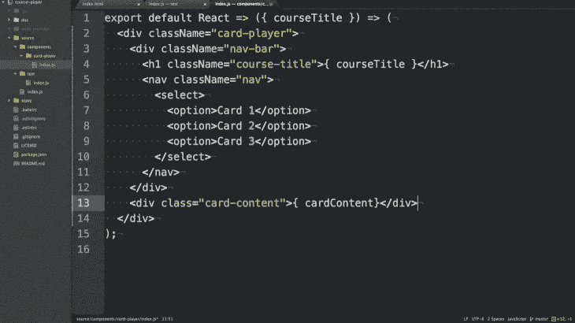

# JavaScript 测试:单元测试 vs 功能测试 vs 集成测试

> 原文：<https://www.sitepoint.com/javascript-testing-unit-functional-integration/>

单元测试、集成测试和功能测试都是自动化测试的类型，它们构成了连续交付的重要基础，这是一种开发方法，允许您在几天或几小时而不是几个月或几年内安全地将变更交付到生产中。

自动化测试通过在软件到达最终用户之前捕捉更多的错误来增强软件的稳定性。它们提供了一个安全网，允许开发人员进行更改，而不用担心他们会在过程中不知不觉地破坏某些东西。

## 忽视测试的代价

与流行的直觉相反，维护一个质量测试套件可以通过立即捕捉错误来极大地提高开发人员的生产力。没有它们，最终用户会遇到更多的错误，这会导致对客户服务、质量保证团队和错误报告的依赖增加。

测试驱动的开发需要更多的时间，但是到达客户的 bug 在很多方面花费更多:

*   它们会中断用户体验，这会让你在销售、使用指标上付出代价，它们甚至会让客户永久流失。
*   每个 bug 报告都必须经过 QA 或开发人员的验证。
*   Bug 修复是导致高成本上下文切换的中断。每一次中断可能会浪费 20 分钟的时间，这还不包括实际的修复。
*   错误诊断发生在功能开发的正常环境之外，有时是由不熟悉代码及其周围含义的不同开发人员进行的。
*   机会成本:开发团队必须等待错误修复，然后才能继续进行计划的开发路线图。

一个 bug 进入生产环境的成本比一个自动化测试套件捕获的 bug 的成本高很多倍。换句话说，TDD 具有压倒性的正 ROI。

## 不同类型的测试

关于不同类型的测试，你需要了解的第一件事是它们都有自己的工作要做。它们在持续交付中发挥着重要作用。

不久前，我在咨询一个雄心勃勃的项目，在这个项目中，团队很难构建一个可靠的测试套件。因为它很难使用和理解，所以很少被使用或维护。

我观察到的现有测试套件的一个问题是，它混淆了单元测试、功能测试和集成测试。他们之间完全没有区别。

结果是测试套件并不特别适合任何事情。

## 测试在持续交付中的作用

每种测试都有其独特的作用。你不能在单元测试、功能测试和集成测试之间进行选择。使用所有的测试套件，并确保每种类型的测试套件都可以独立运行。

大多数应用程序都需要单元测试和功能测试，许多复杂的应用程序也需要集成测试。

*   **单元测试**确保应用程序的各个组件按预期工作。断言测试组件 API。
*   **集成测试**确保组件协作按预期工作。断言可以测试组件 API、UI 或副作用(如数据库 I/O、日志记录等)
*   **功能测试**从用户的角度来看，确保应用程序按预期工作。断言主要测试用户界面。

您应该将单元测试、集成测试和功能测试相互隔离，以便您可以在不同的开发阶段轻松地分别运行它们。在持续集成过程中，测试经常以三种方式使用:

*   **开发期间**，供开发者反馈。单元测试在这里特别有用。
*   **在准备环境**中，检测问题并在出错时停止部署过程。通常，所有测试类型的完整套件都在这个阶段运行。
*   **在生产环境**中，运行称为冒烟测试的生产安全功能测试子集，以确保在部署过程中不会破坏任何关键功能。

你应该使用哪种测试类型？全部都是。

为了理解不同的测试如何适应您的软件开发过程，您需要理解每种测试都有其工作要做，这些测试大致分为三大类:

*   用户体验测试(最终用户体验)
*   开发人员 API 测试(开发人员体验)
*   基础设施测试(负载测试、网络集成测试等)

用户体验测试从用户的角度检查系统，使用实际的用户界面，通常使用目标平台或设备。

开发人员 API 测试从开发人员的角度检查系统。我说的 API 不是指 HTTP APIs。我指的是一个单元的表面区域 API:开发者用来与模块、函数、类等交互的接口…

## 单元测试:实时开发人员反馈

单元测试确保各个组件相互独立地工作。单元通常是模块、函数等…

例如，您的应用程序可能需要将 URL 路由到路由处理程序。可以针对 URL 解析器编写单元测试，以确保正确解析 URL 的相关组件。另一个单元测试可能确保路由器为给定的 URL 调用正确的处理程序。

然而，如果您想测试当一个特定的 URL 被发送到时，一个相应的记录被添加到数据库中，这将是一个集成测试，而不是一个单元测试。

在开发过程中，单元测试经常被用作开发人员的反馈机制。例如，我对每个文件更改运行 lint 和单元测试，并在开发控制台中监控结果，该控制台在我工作时为我提供实时反馈。



为了更好地工作，单元测试必须运行得非常快，这意味着在单元测试中应该避免诸如网络和文件 I/O 之类的异步操作。

由于集成测试和功能测试非常频繁地依赖于网络连接和文件 I/O，当有大量测试时，它们往往会显著降低测试运行的速度，这会将运行时间从毫秒延长到分钟。对于非常大的应用程序，完整的功能测试可能需要一个多小时。

单元测试应该是:

*   非常简单。
*   快如闪电。
*   一份好的 bug 报告。

我说的“好的错误报告”是什么意思？

我的意思是，无论您使用什么测试运行器和断言库，失败的单元测试应该一眼就能告诉您:

1.  哪个组件在测试中？
2.  预期的行为是什么？
3.  实际结果如何？
4.  预期的结果是什么？
5.  行为是如何再现的？

前四个问题应该可以在故障报告中看到。最后一个问题在测试的实现中应该是清楚的。一些断言类型不能回答失败报告中的所有问题，但是大多数`equal`、`same`或`deepEqual`断言应该能够回答。事实上，如果这些是任何断言库中仅有的断言，大多数测试套件可能会更好。简化。

下面是一些使用[磁带](https://medium.com/javascript-scene/why-i-use-tape-instead-of-mocha-so-should-you-6aa105d8eaf4)的真实项目中的简单单元测试示例:

```
// Ensure that the initial state of the "hello" reducer gets set correctly
import test from 'tape';
import hello from 'store/reducers/hello';

test('...initial', assert => {
  const message = `should set { mode: 'display', subject: 'world' }`;

  const expected = {
    mode: 'display',
    subject: 'World'
  };

  const actual = hello();

  assert.deepEqual(actual, expected, message);
  assert.end();
}); 
```

```
// Asynchronous test to ensure that a password hash is created as expected.
import test from 'tape',
import credential from '../credential';

test('hash', function (t) {
  // Create a password record
  const pw = credential();

  // Asynchronously create the password hash
  pw.hash('foo', function (err, hash) {
    t.error(err, 'should not throw an error');

    t.ok(JSON.parse(hash).hash,
      'should be a json string representing the hash.');

    t.end();
  });
}); 
```

## 集成测试

集成测试确保各种单元正确地协同工作。例如，节点路由处理程序可能将日志记录器作为依赖项。集成测试可能命中该路由，并测试连接是否被正确记录。

在这种情况下，我们有两个测试单元:

1.  路由处理器
2.  伐木工

如果我们对日志记录器进行单元测试，我们的测试就不会调用路由处理程序，或者对它一无所知。

如果我们对路由处理程序进行单元测试，我们的测试将会存根日志记录器，并忽略与它的交互，只测试路由是否适当地响应了伪造的请求。

让我们更深入地看看这个问题。路由处理程序是一个工厂函数，它使用依赖注入将记录器注入到路由处理程序中。让我们看看签名(参见 [rtype docs](https://github.com/ericelliott/rtype) 帮助阅读签名):

```
createRoute({ logger: LoggerInstance }) => RouteHandler 
```

让我们看看如何测试这一点:

```
import test from 'tape';

import createLog from 'shared/logger';
import routeRoute from 'routes/my-route';

test('logger/route integration', assert => {
  const msg = 'Logger logs router calls to memory';

  const logMsg = 'hello';
  const url = `http://127.0.0.1/msg/${ logMsg }`;

  const logger = createLog({ output: 'memory' });
  const routeHandler = createRoute({ logger });

  routeHandler({ url });

  const actual = logger.memoryLog[0];
  const expected = logMsg;

  assert.equal(actual, expected, msg);
  assert.end();
}); 
```

我们将更详细地介绍重要的部分。首先，我们创建记录器，并告诉它在内存中记录日志:

```
const logger = createLog({ output: 'memory' }); 
```

创建路由器并传入记录器依赖项。这就是路由器访问记录器 API 的方式。请注意，在您的单元测试中，您可以隔离日志记录器和测试路由:

```
const routeHandler = createRoute({ logger }); 
```

用一个假的请求对象调用路由处理程序来测试日志记录:

```
routeHandler({ url }); 
```

记录器应该通过将消息添加到内存日志中来做出响应。我们现在需要做的就是检查消息是否存在:

```
 const actual = logger.memoryLog[0]; 
```

类似地，对于写入数据库的 API，您可以连接到数据库并检查数据是否被正确更新，等等…

许多集成测试测试与服务的交互，如第三方 API，可能需要访问网络才能工作。出于这个原因，集成测试应该总是与单元测试分开，以便让单元测试尽可能快地运行。

## 功能测试

功能测试是自动化的测试，它确保你的应用程序从用户的角度做它应该做的事情。功能测试向用户界面提供输入，并对输出做出断言，以确保软件以应有的方式做出响应。

功能测试有时被称为端到端测试，因为它们测试整个应用程序及其硬件和网络基础设施，从前端 UI 到后端数据库系统。从这个意义上说，功能测试也是一种集成测试的形式，确保机器和组件协作按预期工作。

功能测试通常会对“快乐路径”进行彻底的测试，以确保关键的应用程序功能，如用户登录、注册、购买工作流以及所有关键的用户工作流都按预期运行。

功能测试应该能够在云中运行在诸如[酱实验室](https://saucelabs.com/)的服务上，这些服务通常通过 Selenium 这样的项目使用 [WebDriver API](https://www.w3.org/TR/2016/WD-webdriver-20160120/) 。

那需要一点技巧。幸运的是，有一些很棒的开源项目让这变得相当容易。

我最喜欢的是 [Nightwatch.js](http://nightwatchjs.org/) 。下面是一个简单的 Nightwatch 功能测试套件的样子，这个例子来自 Nightwatch 文档:

```
module.exports = {
  'Demo test Google' : function (browser) {
    browser
      .url('http://www.google.com')
      .waitForElementVisible('body', 1000)
      .setValue('input[type=text]', 'nightwatch')
      .waitForElementVisible('button[name=btnG]', 1000)
      .click('button[name=btnG]')
      .pause(1000)
      .assert.containsText('#main', 'Night Watch')
      .end();
  }
}; 
```

如您所见，功能测试触及了真实的 URL，无论是在试运行环境中，还是在生产环境中。他们通过模拟最终用户可能采取的行动来实现他们在应用程序中的目标。他们可以点击按钮，输入文本，等待页面上的事情发生，并通过查看实际的 UI 输出做出断言。

### 烟雾测试

在您将一个新版本部署到生产环境中之后，立即发现它在生产环境中是否按预期工作是很重要的。你不希望你的用户在你之前发现错误——它可能会赶走他们！

维护一套自动化的功能测试是很重要的，就像对新部署的版本进行冒烟测试一样。测试应用程序中的所有关键功能:大多数用户在典型会话中都会遇到的东西。

冒烟测试不是功能测试的唯一用途，但在我看来，它们是最有价值的。

## 什么是持续交付？

在持续交付革命之前，软件是使用瀑布过程发布的。软件会经历以下步骤，一次一个。在进入下一步之前，必须完成每一步:

1.  需求收集
2.  设计
3.  履行
4.  确认
5.  部署
6.  维护

之所以称之为瀑布，是因为如果你用从右到左的时间来绘制它，它看起来就像瀑布一样从一项任务流向下一项任务。换句话说，理论上，你不能真的同时做这些事情。

理论上。实际上，随着项目的开发，大量的项目范围被发现，范围蔓延经常导致灾难性的项目延迟和返工。不可避免的是，业务团队也希望在交付后进行“简单的变更”,而不需要再次经历整个昂贵、耗时的瀑布过程，这经常导致变更管理会议和生产热修复的无休止循环。

一个干净的瀑布过程可能是一个神话。我的职业生涯很长，为数百家公司提供过咨询，但我从未见过理论上的瀑布在现实生活中发挥应有的作用。典型的瀑布发布周期可能需要数月或数年。

## 持续交付解决方案

持续交付是一种开发方法，它承认范围是随着项目的进展而暴露的，并鼓励在短周期内对软件进行增量改进，以确保软件可以在任何时候发布而不会引起问题。

通过连续交付，变更可以在几个小时内安全交付。

与瀑布方法相比，我已经看到连续交付过程在几十个组织中顺利运行——但是我从来没有看到它在没有一系列高质量的测试套件的地方工作，这些测试套件包括单元测试和功能测试，并且经常包括集成测试。

希望现在您已经拥有了开始持续交付基础的一切。

## 结论

正如你所看到的，每种类型的测试都有重要的作用。快速开发人员反馈的单元测试，覆盖组件集成所有角落情况的集成测试，以及确保最终用户一切正常的功能测试。

你如何在你的代码中使用自动化测试，它如何影响你的信心和生产力？请在评论中告诉我。

## 分享这篇文章