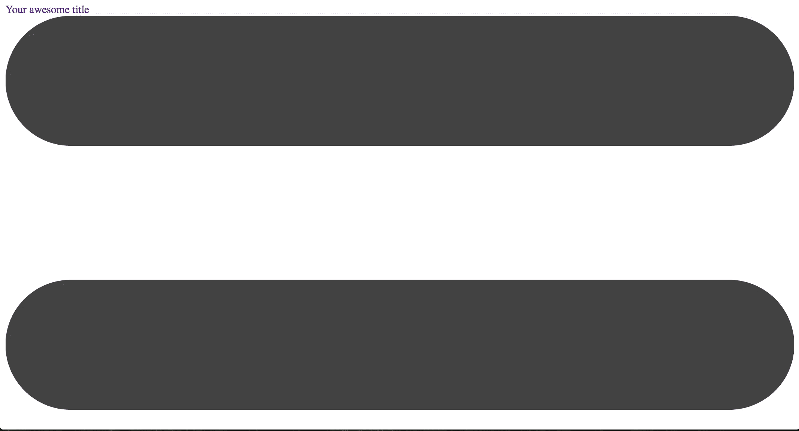
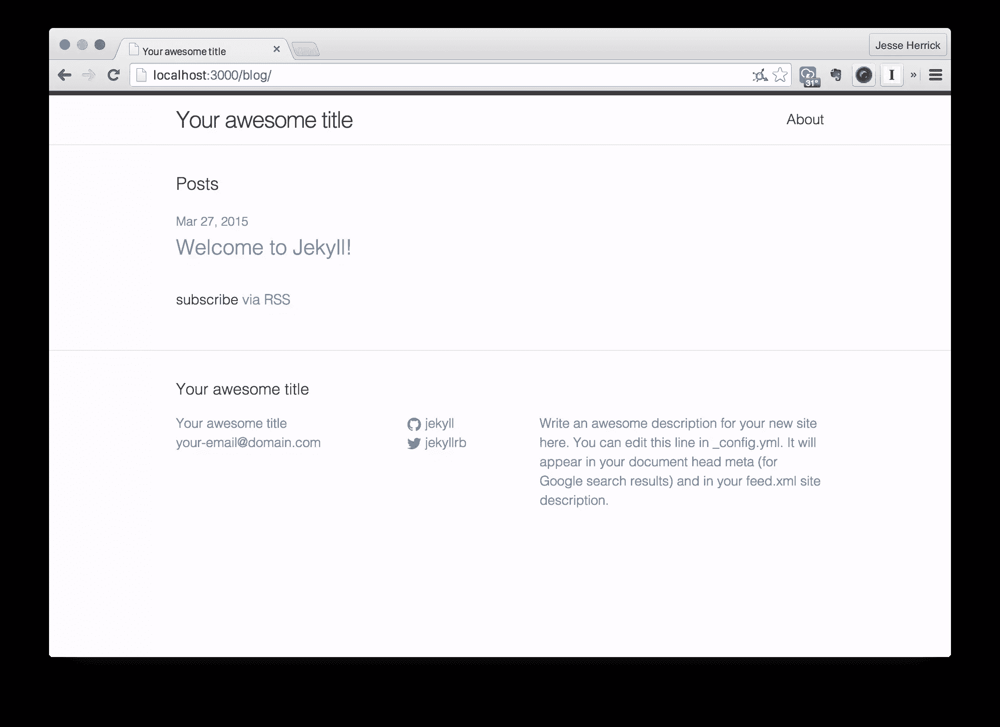

# 铁轨上的哲基尔

> 原文：<https://www.sitepoint.com/jekyll-rails/>


我们都很欣赏 Ruby on Rails 给我们带来的快速构建优秀 web 应用程序的能力。我们也可以欣赏 Jekyll 将 Markdown 和 templating 变成一个漂亮的静态站点的惊人能力。

如果我们能把这两者结合起来会怎么样？在本文中，我将这样做。

## 为什么？

结合 Jekyll 和 Rails 的最实际的场景是当你不想把你的主应用和你的博客分开的时候。如果你只是想给你的网站增加一些动态性，你*不应该*这样做([中间人](https://middlemanapp.com/)更适合这一点)。但是不管是什么原因，让我们开始吧！

## 步骤 1:应用程序

在最有可能的情况下，你可能已经有一个应用程序，你想添加一个博客。然而，为了统一起见，让我们为我们的目的生成一个:

```
$ rails new jekyll-on-rails
$ cd jekyll-on-rails
```

现在我们在应用程序中，我们需要为我们的 Jekyll 博客设置它。首先，我们应该将 Jekyll 添加到应用程序中:

```
# 'Gemfile'
gem 'jekyll', '2.5.3'

# Terminal
$ bundle install
```

一旦这个命令完成，我们可以开始添加我们的博客到 Jekyll。

## 步骤 2:博客

假设，所有 Jekyll 需要运行的是一个模板文件和一个 Markdown 文件。但是我们有比这更复杂的博客。每个博客都是(并且应该是)不同的，但是我们需要一个统一的博客来演示，所以让我们使用默认的。

首先，让 Jekyll 生成我们的博客。

```
$ bundle exec jekyll new blog
```

这将创建一个简单的博客示例，其文件结构如下:

```
.
├── _config.yml
├── _includes
│   ├── footer.html
│   ├── head.html
│   └── header.html
├── _layouts
│   ├── default.html
│   ├── page.html
│   └── post.html
├── _posts
│   └── 2015-03-27-welcome-to-jekyll.markdown
├── _sass
│   ├── _base.scss
│   ├── _layout.scss
│   └── _syntax-highlighting.scss
├── about.md
├── css
│   └── main.scss
├── feed.xml
└── index.html
```

我们将把其中的大部分留在原处，但是我们将把`_config.yml`移到 Rails `config`目录中，并将其重命名为更具体的名称:

```
$ cd blog
$ mv _config.yml ../config/jekyll.yml
$ cd ..
```

这才是真正有趣的地方，**配置博客！**

## 步骤 3:配置博客

如果你现在尝试进入博客并运行`jekyll serve`，它仍然可以工作，但是你会得到一个错误，没有配置文件。这显然是因为我们刚刚移动了它，所以在生成我们的博客时，我们必须使用特殊的配置。

我们希望每次重新生成 Rails 应用程序时都构建 Jekyll 站点，因此我们需要向应用程序添加一个初始化器:

```
#config/initializers/blog.rb

Rails.application.config.after_initialize do
  Rails.logger = Logger.new(STDOUT)
  begin
    # make a spot for the site
    dest = Rails.root.join('public/blog')

    # generate the site
    Jekyll::Site.new(
      Jekyll.configuration({
        "config" => Rails.root.join('config', 'jekyll.yml').to_s,
        "source" => Rails.root.join('blog').to_s,
        "destination" => dest.to_s
      })
    ).process

                # the strange codes give the output color
    Rails.logger.info "\e[0;32;49mJekyll site built!\e[0m]]"
  rescue => e
    Rails.logger.error "\e[0;31;49mJekyll site build failed.\e[0m\n\e[0;33;49mError:\e[0m #{e}"
  end
end
```

这段代码为我们做了几件事:
*它在 Rails 应用程序启动时生成 Jekyll 站点
*它为站点定义了一个路径(`http://localhost:3000/blog/`)–要更改这个路径，修改`dest`变量
*它使用智能错误处理来确保我们知道站点构建何时成功，何时失败。这也确保了即使站点构建失败，应用程序也不会失败，从而允许在 Jekyll 和 Rails 之间分离代码错误

这个文件告诉 Jekyll 获取我们的站点(在`blog/`中)并将其移动到(`public/blog/`)。这只是因为 Rails 在其`public/`目录中托管静态文件。

现在我们终于可以启动我们的 Rails 应用程序了，看看它是如何工作的！

```
$ bundle exec rails server
=> Booting WEBrick
=> Rails 4.2.0 application starting in development on http://localhost:3000
=> Run `rails server -h` for more startup options
=> Ctrl-C to shutdown server
Configuration file: /Users/jesseherrick/Dropbox/Drafts/jekyll-on-rails/config/jekyll.yml
I, [2015-03-27T16:08:02.591221 #56341]  INFO -- : Jekyll site built!
[2015-03-27 16:08:02] INFO  WEBrick 1.3.1
[2015-03-27 16:08:02] INFO  ruby 2.2.0 (2014-12-25) [x86_64-darwin14]
[2015-03-27 16:08:02] INFO  WEBrick::HTTPServer#start: pid=56341 port=3000
```

但是有一个问题，CSS 没有正确加载！



稍加研究，您会注意到 HTML 使用绝对路径(即`/css/main.css`)。这意味着任何被请求的资产都将返回 404，因为我们的博客位于子目录中。幸运的是，Jekyll 站点模板足够智能，在配置中有一个`baseurl`选项，它允许为资产加载定义子目录。为了快速解决这个问题，我们可以像这样更改我们的配置:

```
# ... other config not shown ...
baseurl: "/blog"
# ... other config not shown ...
```

我们使用`/blog`是因为它是我们站点生成的目录。一旦我们重新启动服务器，一切似乎都工作正常。



现在你有了它，一个 Rails 应用程序和 Jekyll 网站无缝协作。如果你愿意，你现在可以停止阅读，但还有更酷的东西在后面。

## 额外:使用类似 Rails 的资产

不幸的是，目前还没有办法将 Rails 资产轻松链接到 Jekyll。但是如果你仍然喜欢 Rails 资产管道(拜托，谁不喜欢呢？)，[有一个插件可以解决这个问题！](https://github.com/jekyll-assets/jekyll-assets)

Jekyll-Assets 是一个非常棒的 Jekyll 插件，它可以为你做很多事情，比如:
*编译 CoffeeScript、Sass 萨斯、Less 和 ERB
*需要内部资产的依赖(使用链轮)
*硬缓存和软缓存破坏(`main-bbd8a1c8b716f90cfaf9493cbb3868dc.css` vs `main.css?cb=bbd8a1c8b716f90cfaf9493cbb3868dc` )
*压缩你的资产
*以及其他一些事情

太棒了，对吧？让我们把它添加到我们的 Jekyll 网站。

首先，我们将`gem 'jekyll-assets'`添加到`Gemfile`和`bundle install`中。接下来，我们需要确保 Jekyll 在生成站点时包含这个插件。为此，我们只需将`jekyll-assets`添加到`config/jekyll.yml`的插件列表中，就像这样:

```
# 'config/jekyll.yml`
plugins:
  - jekyll-assets

# ... other config ...
```

现在插件已经添加到 Jekyll 中，我们可以开始使用它了。但是首先，我们应该为我们想要的特性配置它。所以再次打开`config/jekyll.yml`并输入:

```
# 'config/jekyll.yml'

# assets
 assets:
    dirname: assets # _assets
    baseurl: /blog/assets/
    sources: # asset subdirectories
        - _assets/stylesheets
        - _assets/javascripts
        - _assets/images
    cachebust: hard
    js_compressor: uglifier # included by rails
    css_compressor: sass # included by rails

# ... other config ...
```

太棒了，但是现在我们必须实际使用这个插件。为此，我们需要转移我们的资产:

```
# make a place for the assets
$ cd blog
$ mkdir _assets
$ mkdir _assets/stylesheets
$ mkdir _assets/javascripts
$ mkdir _assets/images

# move around assets
$ mv _sass/* _assets/stylesheets/ && rmdir _sass
$ mv css/* _assets/stylesheets/ && rmdir css
```

如果我们碰巧有 JavaScript/CoffeeScript 文件和/或图像，我们也会将它们移动到各自的文件夹中。

就像在 Rails 中一样，Jekyll-Assets 使用双重(有时是三重)文件扩展名来转换文件。出于我们的目的，我们应该将`main.scss`重命名为`main.css.scss`,因为我们希望我们的文件被解析为 SCSS，然后转换为 CSS。你应该对你想让 Jekyll-Assets 转换的任何文件都这样做(*例如* `main.js.coffee`)。

如果我们再看一下我们的博客，你会注意到一个问题。样式表又变成 404ing 了。要解决这个问题，我们只需要实现 Jekyll-Assets 将样式表(和脚本)链接到 HTML 的方法。

Jekyll-Assets 提供了几个液体标签和生成器来正确地实现缓存破坏和资产路径处理。我们不会在这里一一介绍，所以如果你有兴趣的话，可以看看这一页。

要链接我们的样式表，我们只需要将它添加到我们的 HTML `:`

```
<!-- 'blog/_includes/head.html' -->

```

现在我们可以删除任何旧的`<link>`标签，因为它们只会抛出 404。如果我们重新启动应用程序，您会看到样式表再次被加载。

为什么我们费尽周折才得到同样的结果？

虽然这看起来是多余的，但我们实际上为自己建立了一个非常好的系统。让我们添加一些 CoffeeScript 来演示这一点。

比方说，我想将 [FitText.js](http://fittextjs.com/) 添加到我的 Jekyll 站点，这样使用 JavaScript 时标题的响应性就会非常好。问题是这个脚本的功能依赖于 jQuery，出于性能原因，我不想在我的 HTML 中进行大量的`script`调用。Jekyll-Assets 让这变得非常容易。

首先，我们需要打开 Jekyll 配置，并在 JavaScript assets 文件夹中添加一个新的子目录:

```
# 'config/jekyll.yml'

assets:
  # ... other config not shown ...
        sources:
          - _assets/stylesheets
          - _assets/javascripts
          - _assets/javascripts/vendor # added
          - _assets/images
        # ... other config not shown ...
```

现在我们需要创建供应商目录，并将 jQuery 和 FitText.js 下载到其中:

```
# create the directory
$ cd blog/_assets/javascripts
$ mkdir vendor
$ cd vendor

# download the assets
$ wget https://raw.githubusercontent.com/davatron5000/FitText.js/master/jquery.fittext.js -O fittext.js
$ wget https://code.jquery.com/jquery-2.1.3.min.js -O jquery.js
```

合并文件，这样就不会有对 javascript 的多个请求:

```
# 'blog/_assets/javascripts/main.js.coffee
#= require vendor/jquery
#= require vendor/fittext

# and then actually use the plugin
$('h1.page-heading').fitText()
```

最后，请求 HTML 中的一个脚本:

```
<!-- bottom of '_layout/default.html' -->

```

现在，如果我们重新加载页面，我们会得到一个漂亮的大响应标题:


这只是你能用杰基尔资产做什么的开始。

Jekyll 有一个很棒的社区，可以制作很棒的插件，但是如果你想创建自己的插件，Jekyll 也有相关的文档。

## 额外:自动化

你可能注意到了，每次我们想预览站点的时候，我们都必须重启 Rails。如果我们只是对 Jekyll 网站做一些改动，这没什么，但如果我们是做网页设计，这可能会变得相当烦人。幸运的是，我们可以自动化这一点！

首先，为 Rails 生成一个新的 Rake 任务。

```
$ rails generate task jekyll
```

该命令创建一个名为`lib/tasks/jekyll.rake`的文件。使用 Jekyll 的 API，我们可以以编程方式构建站点，同时提供服务(使用线程)。

```
namespace :jekyll do
  dest = Rails.root.join('public/blog')

  options = {
    'baseurl' => '/blog',
    'config' => Rails.root.join('config', 'jekyll.yml').to_s,
    'watch' => true,
    'port' => 3000,
    'source' => Rails.root.join('blog').to_s,
    'destination' => dest.to_s
  }

  build = Thread.new { Jekyll::Commands::Build.process(options) }
  serve = Thread.new { Jekyll::Commands::Serve.process(options) }

  commands = [build, serve]
  commands.each { |c| c.join }
end
```

现在，`rake jekyll`将在`http://localhost:3000/blog/`启动服务器，并在检测到文件更改时重新加载自身。

## 结论

Jekyll 和 Rails 的可能性是无限的。这对看似对立的组合可以完美地合作，打造一个伟大的、全面的网站。你可以在 [GitHub](https://github.com/JesseHerrick/jekyll-on-rails) 上找到这个项目的源码。如果您有任何问题或如何改进这种方法的建议，我很乐意在下面听到您的意见。

## 分享这篇文章`