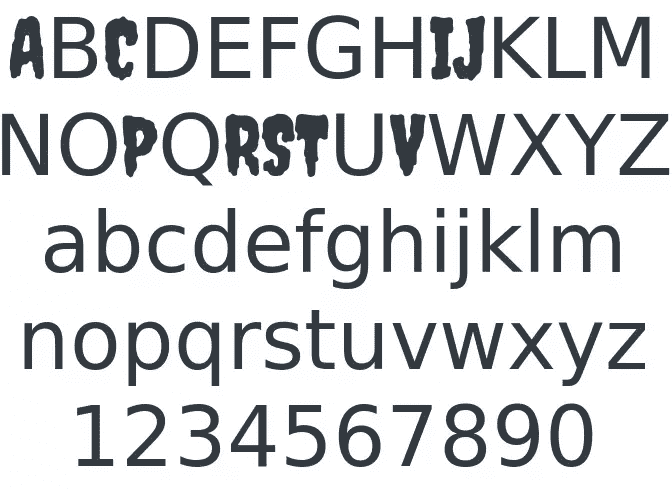

# 子集的快乐:杂交网络字体

> 原文：<https://www.sitepoint.com/joy-of-subsets-web-fonts/>

95%的网页设计都是排版。剩下的 5%花在尝试修复无限任务运行器递归和骂人上。然而，当我们说“网页排版”时，我们很少指类型*设计*。选择、配对和设置字体是更普通的活动，而**字体设计**被认为是更专业和深奥的职业。

因此，当我发表了我的关于“字体黑客”的入门文章时，大部分的兴趣都集中在所描述的方式上,**字体子集**可以在[字体栈](http://css-tricks.com/snippets/css/font-stacks/)中混合和匹配字符集。

```
body {
    font-family: Punctuation Font, Alphanumeric Font, Fallback Font;
}
```

不幸的是，实际上“子集化”一种字体(将其固有字符集减少到你希望呈现的那些字符)需要使用**字体设计软件**，这是*贵得令人瞠目结舌的*、*中的一种，在你的平台上没有*或*可能会在这个讨厌的东西安装后的瞬间填满你的骂人配额*。

**直到现在**。多亏了我在使用谷歌字体时发现的“一个奇怪的技巧”,我现在可以为你提供一种创造性地使用子集的方法，而不需要手动解构那些字体。都是关于谷歌字体的 URL `text`参数。

## 日本航空公司

不，不需要 JavaScript 来实现这一点(我不会对你这样做)。我说的是*弦* `javascript`。为了重新设计 [Neontribe](http://www.neontribe.co.uk/) 网站，我决定使用迅速流行的 [Ghost 博客平台](https://ghost.org/)，它是基于 JavaScript 构建的。因为我是个爱开玩笑的人，所以我认为用一种可怕的字体渲染“JavaScript”这个词来宣传这个事实会很有趣。你看到了吗？


现在，我意识到这不是一个很好的笑话——如果你能称之为笑话的话。然而，如果我只是为了这个印刷上的奇思妙想而取一个 150 个或更多字符的字体，那就更没意思了。

相反，我这样做了:

```
<link type="text/css" rel="stylesheet" href="http://fonts.googleapis.com/css?family=Creepster&amp;text=JAVSCRIPT">
```

注意前面提到的`text`参数。这告诉**谷歌字体**你只对提供的字符集感兴趣(是的，第二个“A”不见了；我们只需要在参数中引用一个)。它提示 Google 动态构建一个`Creepster`字体的子集版本并发送给我。注意下面的`kit`参数。

```
@font-face {
    font-family: "Creepster";
    font-style: normal;
    font-weight: 400;
    src: local("Creepster"), local("Creepster-Regular"), url("http://themes.googleusercontent.com/licensed/font?kit=qZohWPV4p-yb_ujchMXyh1S856IudzFr_gkPycOOILA") format("woff");
}
```

当我打开 Chrome 的开发者工具并预览字体时，这是我所看到的——令人高兴的。缓存之前只需要 2.9KB。



使用`text`参数当然会阻止臭名昭著的性能斗士来敲你的门，但是当你把字体栈带入图片时，它变得更有趣。如果我们用一种字体去堵住另一种字体留下的字符洞会怎么样？

## Ampersandwich

让我描述一个简单的例子，其中有一个 [CodePen 演示](http://codepen.io/SitePoint/pen/viBGh)。假设我们的样式指南规定字体[](http://www.google.com/fonts/specimen/Bevan)*应该用于二级标题(`<h2>` s)。矮胖！问题是，我们更希望任何与号的实例使用更优雅字体的字母形式，比如 [*Lobster 2*](http://www.google.com/fonts/specimen/Lobster+Two) 。这真的只是细微差别，但我们喜欢细微差别。*

 *这看起来是这样的:


我们想要避免的是不得不添加任何标记。这要么会使编辑过程变得复杂(我们更希望在 Markdown 中完成)，要么需要加入一些可怕的内容解析 JavaScript。

```
/* No, thank you */
<h2>Rock <span class="amp">&amp;</span> Roll</h2>

/* Yes, please */
## Rock &amp; Roll
```

相反，我们将再次使用 Google Fonts 的`text`参数来获取一个*龙虾 2* 符号。那只是 2KB，对你来说；完整的*龙虾 2* 有 78.8KB！我们必须对“&”进行 URL 编码，因此有了`%26`。

```
@import url(http://fonts.googleapis.com/css?family=Lobster+Two&amp;text=%26);
```

我们也进口*比万*，但整个字体。如果是为了标题，您可能想将其子集化为[基本拉丁语](http://en.wikipedia.org/wiki/Basic_Latin_%28Unicode_block%29)，但是为了简洁起见，我在代码示例中把整个内容都拉了进来。

```
@import url(http://fonts.googleapis.com/css?family=Bevan);
```

最后，我们用`<h2>`元素的字体堆栈编辑 **CSS** 文件:

```
h2 {
    font-family: Lobster 2, Bevan, serif;
}
```

由于字体堆栈的继承， *Lobster 2* 将覆盖任何与号的实例。对于所有剩余的字符，我们遵从*比万*，然后——只是为了确保——一个通用的系统字体。没有标记添加，没有 JavaScript 和没有 FontForge。

## 关注点的分离

这里我们看到的是 **W3C** 的[“关注点分离”](https://www.w3.org/TR/html-design-principles/#separation-of-concerns)设计原则的不同寻常的表现。通过让*区分*CSS 及其导入字体文件的&符号，我们消除了改变底层文档的必要性。这不仅使文档更清晰、更易于维护，而且——通过使`<span class="amp" />`过时——使非技术内容贡献者能够更容易地编写文本。

```
## Rock &amp; Roll
/* or */
h2\. Rock &amp; Roll
/* or simply in a text input... */
Rock &amp; Roll
```

如果你想仔细看看，下面是 CodePen 演示:

通过 [CodePen](http://codepen.io) 上的 SitePoint ( [@SitePoint](http://codepen.io/SitePoint) )看笔 [viBGh](http://codepen.io/SitePoint/pen/viBGh/) 。*