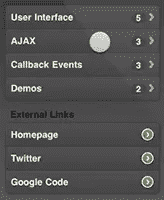

# jQTouch 让 iPhone 和 iPod Touch 上的网络开发变得轻而易举

> 原文：<https://www.sitepoint.com/jqtouch-makes-web-development-on-the-iphone-and-ipod-touch-a-snap/>

[**jQTouch 在**](http://jqtouch.com/) **网站上被描述为一个用于 iPhone 和 iPod Touch 上的 web 开发的 jQuery 插件。但它不仅仅是一个插件；其简化的开发方法可以帮助您创建和主题化 web 应用程序的各种屏幕，并在它们之间应用动画过渡。**

它在各方面都会有帮助，但是如果你遵循一个简单的方法，使用 jQTouch 开发应用程序会很快。您创建一系列的`div`元素(应用程序中的每个屏幕一个)，给每个元素一个`id`，并给主屏幕一个`current`类。然后在主屏幕中放置一个无序列表`div`。在每个列表项中，放置一个带有`href`的锚标记，链接到其他`div`中的一个

只需这个简单的配方，jQTouch 将隐藏除主屏幕之外的所有`div`,并以吸引人的渐变显示你的列表作为主菜单。它还将连接点击动作，这样点击列表项之一将使主屏幕滑动，链接的`div`元素滑动。这与默认菜单的风格非常相似。

绝对值得一探究竟。 [Campaign Monitor 最近透露](http://www.campaignmonitor.com/blog/post/3029/campaign-monitor-for-your-iphone/)他们在他们最近的 iPhone 应用上使用了 jQTouch，并且[在 jQTouch 网站上有一个演示](http://jqtouch.com/preview/demos/main/)也可以在桌面 Safari 上使用。

随着 RIM 宣布它已经为 Blackberry 设备开发了一个基于 WebKit 的浏览器，可能不难想象这个库最终可以用于为 iPhone、iPod Touch、Android 和 BlackBerry 开发。

## 分享这篇文章