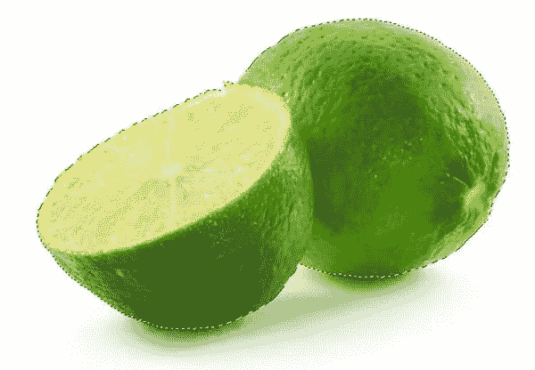
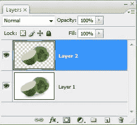
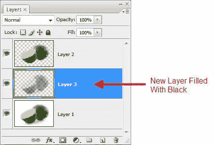
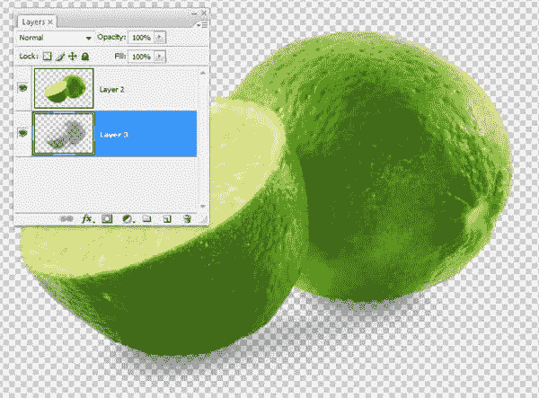
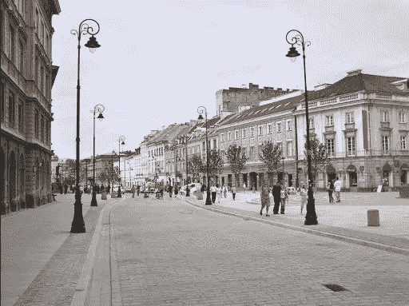
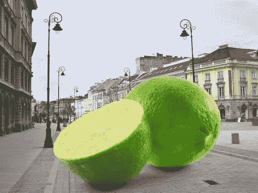

# 在 Photoshop 中更改背景时保持对象的阴影不变

> 原文：<https://www.sitepoint.com/keep-an-objects-shadows-intact-while-changing-background-in-photoshop/>

本 Photoshop 教程向您展示了如何在白色背景上拍摄带有阴影的对象，并将其放置在不同的背景上，同时保持阴影的透明度。为此，我们将使用 Photoshop 中的亮度通道。对于更一般的编辑技巧，学习如何[去除背景](https://www.sitepoint.com/remove-background-photoshop/)。

1.打开要保持其阴影完整的对象的图像。在这个例子中，我使用了 straymuse 的几个酸橙的图片，可以从 [Stock Xchng](http://www.sxc.hu/photo/1232723) 免费下载。

2.在酸橙周围创建选区。确保只选择了石灰，没有阴影。使用任何你觉得最舒服的选择工具，但是要确保它是一个干净的选择。

3.按 Ctrl + J (windows)或 Cmd + J (Mac)在新图层上复制石灰。

4.再次选择您的原始图像层。我们现在要加载亮度。基本上这意味着选择了高光。按 Ctrl + Alt + ~ (windows)或 Cmd + Opt + ~ (mac)。虽然我们对高光不感兴趣，但我们在寻找阴影，所以我们需要反转选择。按 Ctrl + Shift + I (windows)或 Cmd + Shift + I (mac)。看起来可能不是所有的阴影都被选中了，但是不要担心，比你想象的更多的阴影被选中了。

5.选择仍然在原地，添加一个新层以上的原始层和石灰层以下。

6.通过按键盘上的 D 键，确保你的前景色设置为黑色。然后通过按 Alt + Backspace (windows)和 Option + Delete (mac)用黑色填充新图层。这只能填充阴影。它将看起来像一个轻微的幽灵层。

7.再次点击原来的背景层，选择所有并点击删除，以摆脱背景层。在这个阶段，你应该只有石灰层和阴影。

8.通过按 Ctrl + E (windows)或 Cmd + E (mac)来合并剩余的两个图层。现在你已经准备好把你的物体和阴影放到另一个背景上了。

9.我又选了一张街景图，来自 [Stock Xchng](http://www.sxc.hu/photo/1200552) 。在 Photoshop 中打开此图像，然后将合并的石灰图像拖到顶部。如果要将石灰放置在街道场景的正中心，请在拖动时按住 Shift 键。

如果酸橙的边缘看起来太参差不齐，你可以用模糊工具(R)轻轻地刷它们的边缘。

为什么街中间会有巨大的酸橙？嗯，不会有，但嘿，这就是 Photoshop 的乐趣所在，重点是在不同的场景中向你展示带有半透明阴影的酸橙。

## 分享这篇文章