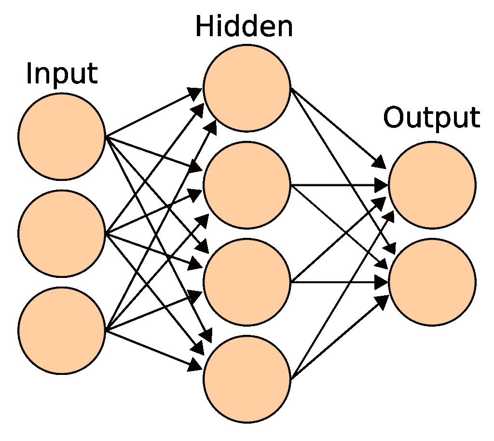
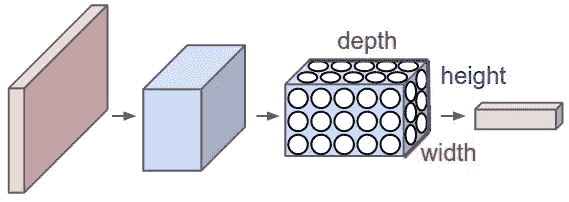
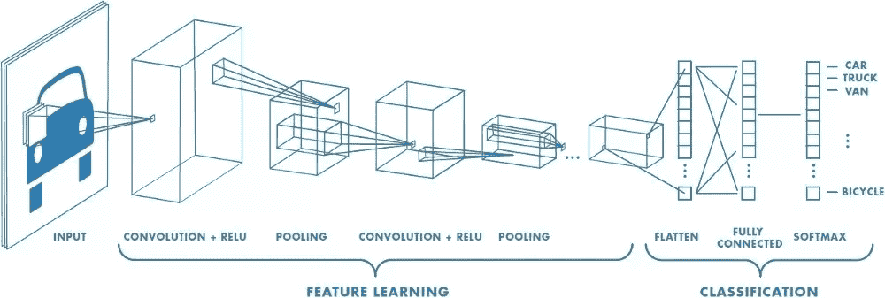
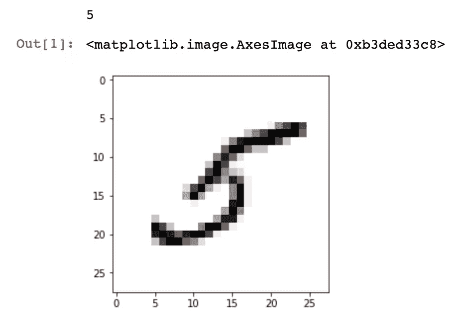
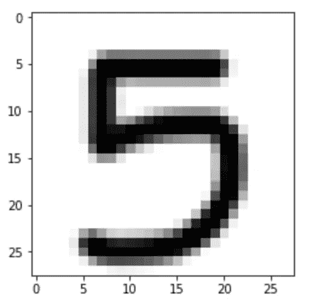

# Keras 入门指南:30 分钟数字识别

> 原文：<https://www.sitepoint.com/keras-digit-recognition-tutorial/>

在过去的十年中，人工神经网络(ann)的使用显著增加。人们已经在[医疗诊断](http://ijsetr.org/wp-content/uploads/2014/01/IJSETR-VOL-3-ISSUE-1-94-99.pdf)中使用人工神经网络，在[预测比特币价格](https://towardsdatascience.com/bitcoin-price-prediction-using-lstm-9eb0938c22bd)，以及制作[假奥巴马视频](https://www.youtube.com/watch?v=AmUC4m6w1wo)！关于深度学习和人工神经网络的所有嗡嗡声，你不是一直想为自己创造一个吗？在本教程中，我们将创建一个识别手写数字的模型。

在本教程中，我们将使用 [Keras](https://keras.io/) 库来训练模型。Keras 是 Python 中的一个高级库，它是对 [TensorFlow](https://github.com/tensorflow/tensorflow) 、 [CNTK](https://github.com/Microsoft/cntk) 和 [Theano](https://github.com/Theano/Theano) 的包装。默认情况下，Keras 默认使用 TensorFlow 后端，我们将使用相同的来训练我们的模型。

## 人工神经网络

[Source](https://upload.wikimedia.org/wikipedia/commons/thumb/e/e4/Artificial_neural_network.svg/1920px-Artificial_neural_network.svg.png)

**人工神经网络**是一种数学模型，通过若干个隐含层将一组输入转换为一组输出。人工神经网络使用隐藏层，每一层都是与概率相关联的瞬态形式。在典型的神经网络中，一层的每个节点都将前一层的所有节点作为输入。一个模型可能有一个或多个隐藏层。

人工神经网络接收一个输入层，通过隐藏层对其进行变换。通过向隐藏层的每个节点分配随机权重和偏差来初始化 ANN。当训练数据被输入到模型中时，它使用每一步产生的误差来修改这些权重和偏差。因此，我们的模型在浏览训练数据时“学习”模式。

## 回旋神经网络

在本教程中，我们将识别数字，这是图像分类的一个简单版本。图像本质上是点或像素的集合。像素可以通过其成分颜色(RGB)来识别。因此，图像的输入数据本质上是像素的 2D 阵列，每个像素代表一种颜色。

如果我们要训练一个基于图像数据的常规神经网络，我们必须提供一长串输入，每个输入都将连接到下一个隐藏层。这使得该工艺难以扩大规模。

[Convolutional Neural Network Architecture](https://cs231n.github.io/convolutional-networks/)

在**回旋神经网络** (CNN)中，各层排列成 3D 阵列(X 轴坐标、Y 轴坐标和颜色)。因此，隐藏层的节点将仅连接到相应输入层附近的小区域，使得该过程比传统的神经网络更有效。因此，CNN 在处理图像和视频时很受欢迎。

[Convolutional Neural Network Layers](https://miro.medium.com/max/2000/1*5A4b1qOZIr4Q6SKceqGn7w.jpeg)

CNN 中各种类型的层如下:

*   **卷积层**:这些通过特定的过滤器运行输入，过滤器识别图像中的特征
*   **池层**:这些层结合了卷积特性，有助于减少特性
*   **展平图层**:将一个 N 维图层转换成 1D 图层
*   **分类层**:最后一层，告诉我们最终的结果

现在让我们来研究一下这些数据。

## 探索 MNIST 数据集

您可能已经意识到，我们需要标记数据来训练任何模型。在本教程中，我们将使用手写数字的 [MNIST 数据集](http://yann.lecun.com/exdb/mnist/)。该数据集是 Keras 包的一部分。它包含 60，000 个示例的训练集和 10，000 个示例的测试集。我们将在训练集上训练数据，并根据测试数据验证结果。此外，我们将创建一个我们自己的图像来测试模型是否能够正确预测它。

首先，让我们从 Keras 导入 MNIST 数据集。`.load_data()`方法返回训练和测试数据集:

```
from keras.datasets import mnist

(x_train, y_train), (x_test, y_test) = mnist.load_data() 
```

让我们尝试将数据集中的数字可视化。如果你正在使用 Jupyter 笔记本，使用下面的神奇功能来显示内联 [Matplotlib 图](https://www.sitepoint.com/plot-charts-python-matplotlib/):

```
%matplotlib inline 
```

接下来，从`matplotlib`导入`pyplot`模块，使用`.imshow()`方法显示图像:

```
import matplotlib.pyplot as plt

image_index = 35
print(y_train[image_index])
plt.imshow(x_train[image_index], cmap='Greys')
plt.show() 
```

打印图像的标签，然后显示图像。



让我们验证一下训练和测试数据集的大小:

```
print(x_train.shape)
print(x_test.shape) 
```

请注意，每个图像的尺寸都是 28 x 28:

```
(60000, 28, 28)
(10000, 28, 28) 
```

接下来，我们可能还希望探究因变量，存储在`y_train`中。让我们打印所有标签，直到我们上面看到的数字:

```
print(y_train[:image_index + 1]) 
```

```
[5 0 4 1 9 2 1 3 1 4 3 5 3 6 1 7 2 8 6 9 4 0 9 1 1 2 4 3 2 7 3 8 6 9 0 5] 
```

## 清理数据

现在我们已经看到了数据的结构，让我们在创建模型之前进一步处理它。

为了使用 Keras API，我们需要将每张图像重新整形为`(M x N x 1)`的格式。我们将使用`.reshape()`方法来执行这个动作。最后，通过将每个像素值除以 255 来归一化图像数据(因为 RGB 值的范围可以是 0 到 255):

```
# save input image dimensions
img_rows, img_cols = 28, 28

x_train = x_train.reshape(x_train.shape[0], img_rows, img_cols, 1)
x_test = x_test.reshape(x_test.shape[0], img_rows, img_cols, 1)

x_train /= 255
x_test /= 255 
```

接下来，我们需要将整数形式的因变量转换为二进制类矩阵。这可以通过`to_categorical()`功能实现:

```
from keras.utils import to_categorical
num_classes = 10

y_train = to_categorical(y_train, num_classes)
y_test = to_categorical(y_test, num_classes) 
```

我们现在准备创建模型并训练它！

## 设计一个模型

模型设计过程是最复杂的因素，对模型的性能有直接影响。对于本教程，我们将使用 Keras 文档中的[设计。](https://keras.io/api/datasets/mnist/)

为了创建模型，我们首先初始化一个顺序模型。它创建一个空的模型对象。第一步是添加一个卷积层，它获取输入图像:

```
from keras.models import Sequential
from keras.layers import Dense, Dropout, Flatten, Conv2D, MaxPooling2D

model = Sequential()
model.add(Conv2D(32, kernel_size=(3, 3),
     activation='relu',
     input_shape=(img_rows, img_cols, 1))) 
```

一个 **relu** 激活代表“整流线性单位”，取一个值的最大值或零。接下来，我们添加另一个卷积层，然后是一个池层:

```
model.add(Conv2D(64, (3, 3), activation='relu'))
model.add(MaxPooling2D(pool_size=(2, 2))) 
```

接下来，我们添加一个“辍学”层。虽然神经网络是在大型数据集上训练的，但可能会出现过拟合的问题。为了避免这个问题，我们在训练过程中随机丢弃单元和它们的连接。在这种情况下，我们将减少 25%的单位:

```
model.add(Dropout(0.25)) 
```

接下来，我们添加一个展平层，将之前的隐藏层转换为 1D 数组:

```
model.add(Flatten()) 
```

一旦我们将数据展平到 1D 数组中，我们就可以添加一个密集的隐藏层，这对于传统的神经网络来说是正常的。接下来，在添加对数据进行分类的最终密集图层之前，添加另一个丢弃图层:

```
model.add(Dense(128, activation='relu'))
model.add(Dropout(0.5))
model.add(Dense(num_classes, activation='softmax')) 
```

当我们想要将数据分类到一些预先决定的类别中时，使用 **softmax** 激活。

## 编译和训练模型

在模型设计过程中，我们创建了一个没有目标函数的空模型。我们需要编译模型，并指定一个损失函数、一个优化函数和一个度量来评估模型性能。

我们需要使用一个`sparse_categorical_crossentropy()`损失函数，以防我们有一个整数相关变量。对于基于向量的因变量，比如作为每个测试用例输出的十位数组，使用`categorical_crossentropy`。在这个例子中，我们将使用 [`adam`优化器](https://arxiv.org/abs/1412.6980v8)。该指标是评估我们模型性能的基础，尽管它仅供我们判断，并不用于培训步骤:

```
model.compile(loss='sparse_categorical_crossentropy',
      optimizer='adam',
      metrics=['accuracy']) 
```

我们现在准备使用`.fit()`方法训练模型。在训练模型时，我们需要指定一个时期和批量大小。一个时期是所有训练示例的一个向前传递和一个向后传递。批次大小是一次向前或向后传递中训练样本的数量。

最后，在训练完成后保存模型，以便在稍后阶段使用其结果:

```
batch_size = 128
epochs = 10

model.fit(x_train, y_train,
          batch_size=batch_size,
          epochs=epochs,
          verbose=1,
          validation_data=(x_test, y_test))
score = model.evaluate(x_test, y_test, verbose=0)
print('Test loss:', score[0])
print('Test accuracy:', score[1])
model.save("test_model.h5") 
```

当我们运行上面的代码时，模型运行时会显示以下输出。运行 Jupyter 笔记本的 2018 Macbook Air 大约需要十分钟:

```
Train on 60000 samples, validate on 10000 samples
Epoch 1/10
60000/60000 [==============================] - 144s 2ms/step - loss: 0.2827 - acc: 0.9131 - val_loss: 0.0612 - val_acc: 0.9809
Epoch 2/10
60000/60000 [==============================] - 206s 3ms/step - loss: 0.0922 - acc: 0.9720 - val_loss: 0.0427 - val_acc: 0.9857
...
Epoch 9/10
60000/60000 [==============================] - 142s 2ms/step - loss: 0.0329 - acc: 0.9895 - val_loss: 0.0276 - val_acc: 0.9919
Epoch 10/10
60000/60000 [==============================] - 141s 2ms/step - loss: 0.0301 - acc: 0.9901 - val_loss: 0.0261 - val_acc: 0.9919
Test loss: 0.026140549496188395
Test accuracy: 0.9919 
```

在最终历元结束时，测试数据集的准确率为 99.19%。很难评论精确度需要多高。对于一次试运行来说，准确率超过 99%就很不错了。然而，通过调整模型参数，还有很大的改进空间。Kaggle 上的数字识别竞赛提交了一份达到 99.7%准确率的申请。

## 用手写数字测试

现在模型已经准备好了，让我们使用一个定制的图像来评估模型的性能。我在 Imgur 上主持过[一个定制的 28×28 数字。首先，让我们使用`imageio`库来读取图像，并探索输入数据的外观:](https://imgur.com/a3Rql9C)

```
import imageio
import numpy as np
from matplotlib import pyplot as plt

im = imageio.imread("https://i.imgur.com/a3Rql9C.png") 
```

接下来，将 [RGB 值转换成灰度](https://stackoverflow.com/questions/41971663/use-numpy-to-convert-rgb-pixel-array-into-grayscale)。然后我们可以使用上面探索的`.imshow()`方法来显示图像:

```
gray = np.dot(im[...,:3], [0.299, 0.587, 0.114])
plt.imshow(gray, cmap = plt.get_cmap('gray'))
plt.show() 
```



接下来，调整图像的形状并对值进行归一化，以使其可以用于我们刚刚创建的模型中:

```
# reshape the image
gray = gray.reshape(1, img_rows, img_cols, 1)

# normalize image
gray /= 255 
```

使用`load_model()`函数从保存的文件中加载模型，并使用`.predict()`方法预测数字:

```
# load the model
from keras.models import load_model
model = load_model("test_model.h5")

# predict digit
prediction = model.predict(gray)
print(prediction.argmax()) 
```

该模型正确预测了图像中显示的数字:

```
5 
```

## 最后的想法

在本教程中，我们使用 TensorFlow 后端创建了一个带有 Keras 的神经网络来对手写数字进行分类。虽然我们达到了 99%的准确率，但仍有改进的机会。我们还学习了如何对自定义手写数字进行分类，这些数字不属于测试数据集。然而，本教程仅仅触及了人工神经网络领域的表面。神经网络有无穷无尽的用途，只是受到我们想象力的限制。

你能提高模型的准确性吗？你还能想到用什么技巧？在推特上让我知道[。](https://twitter.com/ds_mik)

## 分享这篇文章