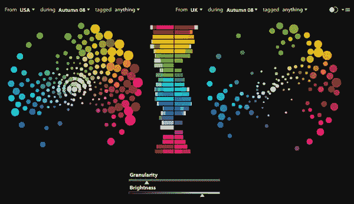

# Kuler 增加了很酷的数据可视化

> 原文：<https://www.sitepoint.com/kuler-adds-cool-data-visualization/>

Adobe 的 [Kuler](http://kuler.adobe.com/) ，这是一个设计师创建和分享颜色主题的社区网站，今天增加了一个整洁的新功能，叫做[社区脉动](http://kuler.adobe.com/#pulse)。我们最近在我们的 15 个设计灵感网站列表中提到了 Kuler，但没有将其称为“必须收藏”的目的地——这个新功能可能会让我们重新考虑。Community Pulse 是一个数据可视化工具，显示经过位置、时间和标签过滤的 Kuler 下载信息。

更酷的是，Community Pulse 可以并排显示两种不同的可视化效果，这意味着用户可以跨地点或时间段比较数据。“社区脉动”真正展示的是颜色的使用在全球和一年中的不同时间是如何变化的。例如，下图比较了 2008 年秋季美国和英国的色彩使用情况。

根据下载量，较大的圆圈代表更受欢迎的颜色范围(取决于您的粒度级别，一个圆圈实际上可能代表多种颜色)。目前，Kuler 只有美国、英国、德国、巴西、法国和日本的数据，以及 2008 年四个季度的数据。然而，根据该网站的常见问题，该计划是将不同的数据集纳入社区脉动功能——这甚至可能意味着除了位置、时间和标签之外，还有不同的过滤器选项。

数据可视化还具有一个直方图，它按色调显示颜色使用情况，条越长，色调越受欢迎。直方图在比较两个数据集时非常有用，因为它非常清楚地显示了不同地理区域或一年中不同时间哪种颜色更受欢迎。因为直方图保留了色轮所不能保留的极值(因为它最终会导致一些颜色簇掩盖其他颜色簇)，所以它是比较数据集之间颜色的更好工具。

我们在 Kuler 的 Community Pulse 中注意到的一个小问题是时间过滤器在语义上不明确。因为不同半球的季节不同，所以很难说出“夏天”到底指的是什么。例如，在 SitePoint 的总部，每个人都在享受初夏的时光。另一方面，我正准备迎接本周末的另一场暴风雪，并进入冬季最寒冷的部分。(SitePoint 总部在澳大利亚，而我在美国东北部。)由于 Adobe 是一家美国公司，我们假设他们指的是北半球的季节。

Kuler 网站需要 Adobe Flash Player 10。

## 分享这篇文章