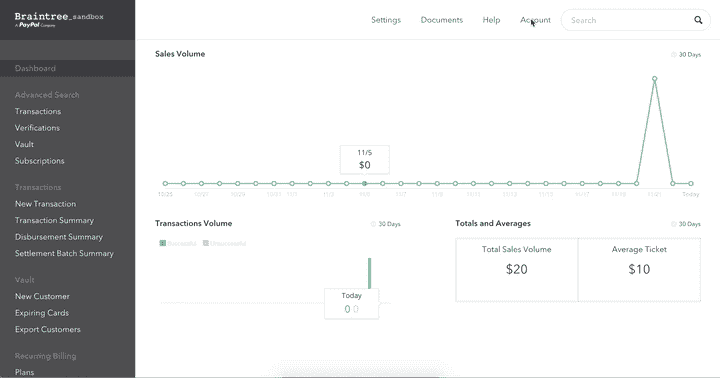
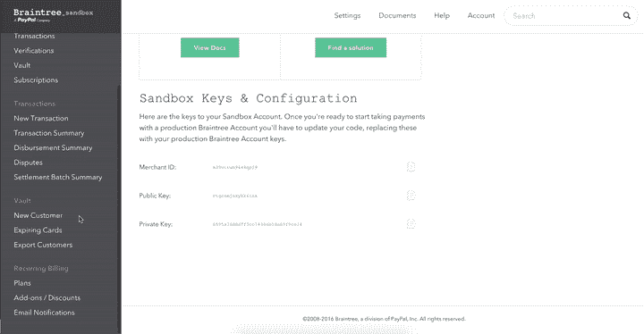
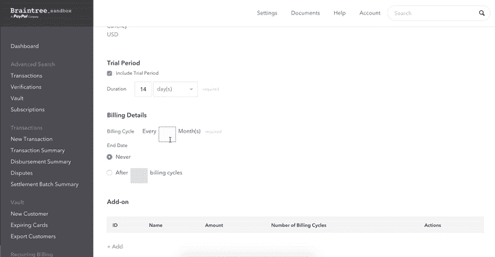
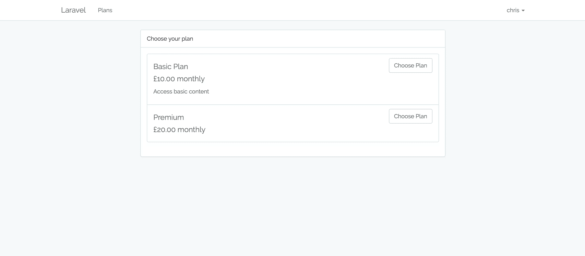
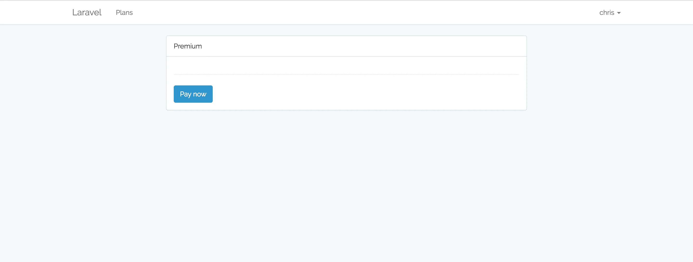
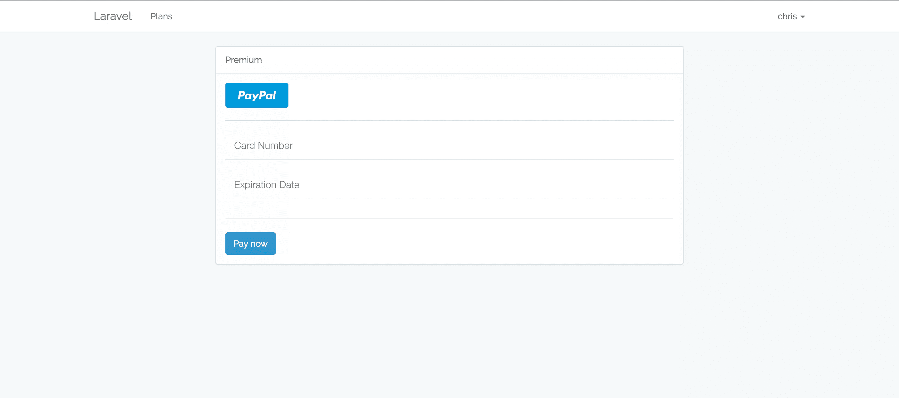
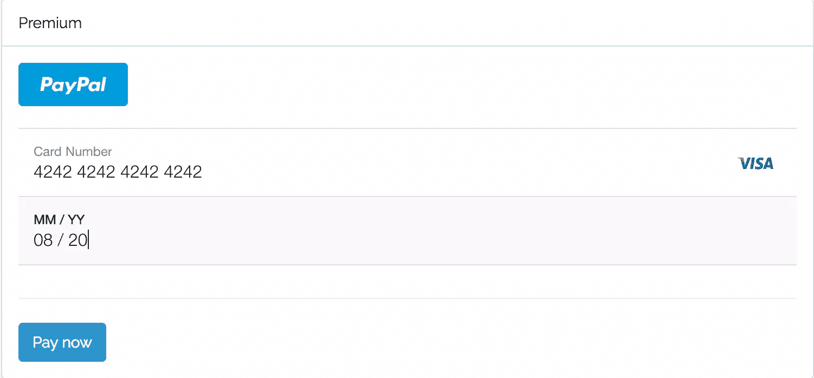

# 拉勒维尔和布伦特里，坐在树上…

> 原文：<https://www.sitepoint.com/laravel-and-braintree-sitting-in-a-tree/>

*这篇文章由[尤尼斯·拉菲](https://www.sitepoint.com/author/yrafie)和[沃恩·安切塔](https://www.sitepoint.com/author/wancheta)进行了同行评审。感谢 SitePoint 的所有同行评审员使 SitePoint 的内容尽可能做到最好！*

* * *

订阅在线服务是非常常见的事情——从订阅音乐流媒体服务到访问优质内容的教程网站。

在 Laravel 5 中，我们看到了 Laravel Cashier 的引入，这是一个官方的 Laravel 包，可以帮助开发人员管理 Stripe 和 Braintree 的订阅计费服务，而无需编写大部分样板订阅计费代码。

*Stripe 和 Braintree 是支付平台，可让您在应用程序或网站中轻松接受支付。*

在本教程中，我们将建立一个虚拟课程网站与[布伦特里](https://www.braintreepayments.com/)订阅。在这个过程中，我们将学习如何使用`Cashier`提供的各种方法。


在这个由两部分组成的系列的第一部分中，我们将:

*   设置 Laravel 收银台
*   注册 Braintree 沙盒(对于生产应用程序，我们使用主要的 Braintree 服务)
*   在布伦特里创建计划
*   创建一个 artisan 命令，将在线计划与我们的数据库同步
*   允许用户订阅计划

在第二部分中，我们将:

*   增加交换计划的能力
*   基于订阅状态创建中间件来保护一些路由
*   使用基本订阅保护高级课程免受用户访问
*   了解如何取消和恢复订阅
*   通过 webhooks 向应用程序的各种事件添加 Braintree 通知

第一部分的完整代码可以在[这里](https://github.com/sitepoint-editors/lara-billable-part1)找到。

## 创建应用程序

我们将从全新的 Laravel 装置开始。

```
composer create-project laravel/laravel lara-billable 
```

### 准备数据库

接下来，我们必须在运行任何迁移之前设置数据库。让我们使用 MySQL——它易于使用，易于配置，并且包含在像 [Homestead Improved](https://www.sitepoint.com/quick-tip-get-homestead-vagrant-vm-running/) 这样的良好开发环境中。建立数据库后，我的`.env`文件如下所示:

```
DB_HOST=localhost
DB_DATABASE=homestead
DB_USERNAME=homestead
DB_PASSWORD=secret 
```

### 脚手架授权

下一步是向我们的应用程序添加身份验证。

Laravel 在 5.2 版本中引入了一个内置的身份验证模块，这使得这变得非常容易。

```
php artisan make:auth 
```

通过运行该命令，将为我们生成与身份验证相关的所有内容，即视图、控制器和映射到控制器操作的路由。

为了能够注册和登录，我们需要有表来保存用户数据。如果我们看一下`database/migrations`，我们会注意到生成的 Laravel 应用程序附带了创建`users`和`password_resets`表的迁移。让我们运行这些迁移:

```
php artisan migrate 
```

如果我们导航到`/register`，我们现在可以注册新用户。注册和登录的链接也显示在导航栏中。

## 设置收银台

有了用户表，我们现在可以添加收银员了。因为我们将在本教程中使用 Braintree，所以我们需要`braintree-cashier`包:

```
composer require laravel/cashier-braintree 
```

然后，我们将`Laravel\Cashier\CashierServiceProvider`注册到我们的`config/app.php`中:

```
'providers' => [
    // Other service providers...
    Laravel\Cashier\CashierServiceProvider::class,
], 
```

接下来，我们必须在`User`模型中引入`Billable`特征，以便能够调用用户的各种收银方法:

```
[...]
use Laravel\Cashier\Billable;
[...]
class User extends Authenticatable
{
    use Billable;
    [...]
} 
```

然后，我们将额外的列添加到`users`表中，用于计费目的。我们还将创建一个`subscriptions`表来处理我们所有的订阅:

```
php artisan make:migration add_billable_columns_to_users_table --table=users 
```

打开新生成的迁移，将`up`方法改为:

```
public function up()
    {
        Schema::table('users', function (Blueprint $table) {
            $table->string('braintree_id')->nullable();
            $table->string('paypal_email')->nullable();
            $table->string('card_brand')->nullable();
            $table->string('card_last_four')->nullable();
            $table->timestamp('trial_ends_at')->nullable();
        });
    } 
```

现在让我们创建`subscription`模型和迁移:

```
php artisan make:model Subscription -m 
```

打开迁移，将 up 方法调整为:

```
public function up()
{
    Schema::table('subscriptions', function (Blueprint $table) {
        $table->increments('id');
        $table->integer('user_id'); // A subscription belongs to a user
        $table->string('name');  // The name of the subscription
        $table->string('braintree_id'); //id for the subscription
        $table->string('braintree_plan'); // The name of the plan
        $table->integer('quantity');
        $table->timestamp('trial_ends_at')->nullable();
        $table->timestamp('ends_at')->nullable();
        $table->timestamps();
  });
} 
```

设置完成后，运行`migrate` Artisan 命令创建`subscriptions`表，并将额外的列添加到`users`表中:

```
php artisan migrate 
```

在这一点上，我们已经设置好了我们的 Laravel 端。是时候把布伦特里那边的东西连接起来了。我们将使用布伦特里沙盒，因为这不是一个生产应用程序。没有沙盒账号的，在这里注册[，然后登录。](https://www.braintreepayments.com/sandbox)

进入仪表板后，生成一个新的 API 密钥，以便能够在我们的应用程序中使用 Braintree 的 API:



生成密钥后，我们还得到`Public Key`、`Environment Key`和`Merchant ID`。有了这些，我们需要在我们的 Laravel 应用程序中设置配置，以便我们可以与 Braintree API 通信。打开您的`.env`文件，并在相应的值旁边设置密钥。我的`.env`文件是这样的:

```
BRAINTREE_ENV=sandbox
BRAINTREE_MERCHANT_ID=xxxxxxxxxxxxxx
BRAINTREE_PUBLIC_KEY=xxxxxxxxxxxxxx
BRAINTREE_PRIVATE_KEY=xxxxxxxxxxxxxx 
```

然后，我们将布伦特里配置添加到我们的`config/services.php`文件中:

```
'braintree' => [
        'model' => App\User::class, //model used to processs subscriptions
        'environment' => env('BRAINTREE_ENV'),
        'merchant_id' => env('BRAINTREE_MERCHANT_ID'),
        'public_key' => env('BRAINTREE_PUBLIC_KEY'),
        'private_key' => env('BRAINTREE_PRIVATE_KEY'),
], 
```

作为与 Braintree 的 API 通信之前的最后一步，让我们将以下 Braintree SDK 调用添加到我们的`AppServiceProvider`服务提供者的`boot`方法中。我们将使用`env`助手来获取我们在`.env`文件中设置的值。注意，我们还必须将`Braintree_Configuration`类导入到我们的`AppServiceProvider`中，否则我们将无法从`Braintree_Configuration`类中调用各种方法:

```
[...]
use Braintree_Configuration;
[...]
public function boot()
{
    Braintree_Configuration::environment(env('BRAINTREE_ENV'));
    Braintree_Configuration::merchantId(env('BRAINTREE_MERCHANT_ID'));
    Braintree_Configuration::publicKey(env('BRAINTREE_PUBLIC_KEY'));
    Braintree_Configuration::privateKey(env('BRAINTREE_PRIVATE_KEY'));
    // Cashier::useCurrency('eur', '€');
} 
```

默认的收银员货币是美元。我们可以通过从一个服务提供者的`boot`方法中调用`Cashier::useCurrency`方法来更改默认货币。`useCurrency`方法接受两个字符串参数:货币和货币符号。在本教程中，我们将只坚持美元。我有一个注释掉的代码行，举例说明如何转换成欧元。

我必须承认，设置收银台花了一些时间，但一旦完成，我们发现自己可以开始处理支付和管理订阅。

## 创建计划并将它们同步到我们的数据库

我们的下一步是创建计划。在本教程中，我们将创建两个计划:基本计划和保费计划。让我们到布伦特里仪表盘去做吧。注意试用期是可选的，但我将我的试用期设置为 14 天:



延续:



重复相同的过程创建一个保费计划，但将金额设置为 20 美元的订阅。

在 Braintree 上创建计划后，我们可以创建一个计划表来本地存储计划。让我们生成一个`Plan`模型和一个迁移:

```
php artisan make:model Plan -m 
```

将迁移中的`up`方法更新为:

```
[...]
public function up()
    {
        Schema::create('plans', function (Blueprint $table) {
            $table->increments('id');
            $table->string('name');
            $table->string('slug')->unique(); //name used to identify plan in the URL
            $table->string('braintree_plan');
            $table->float('cost');
            $table->text('description')->nullable();
            $table->timestamps();
        });
    }
[...] 
```

通过运行迁移创建`plans`表:

```
php artisan migrate 
```

### 同步计划

接下来，我们想用我们在 Braintree 上设置的数据填充`Plans`表。将计划硬编码到我们的表格中是允许的，但我觉得这有点乏味，尤其是当在线计划信息不断变化时。为了简化流程，我们将创建一个 artisan 命令来与计划在线同步并更新我们的数据库:

```
php artisan make:command SyncPlans 
```

对于未安装 Laravel 5.3 以上版本的用户:

```
php artisan make:console SyncPlans 
```

在`app/Console/Commands/SyncPlans.php`中，我们需要更改签名值，并为命令添加描述:

```
[...]
protected $signature = 'braintree:sync-plans';
protected $description = 'Sync with online plans on Braintree';
[...] 
```

然后，我们将该命令注册到内核，以便能够从终端运行它:

```
class Kernel extends ConsoleKernel
{
    [...]
    protected $commands = [
        Commands\SyncPlans::class,
    ];
    [...]
} 
```

如果我们现在运行`php artisan`，计划同步命令将从可用命令列表中可见:


接下来的大问题是，运行这个命令后会发生什么？该命令应该清除`plans`表中的数据，然后用在线可用的计划数据填充该表。这个逻辑应该放在`app/Console/Commands/SyncPlans.php`里面的`handle`方法中:

```
[...]
use Braintree_Plan;
use App\Plan;
[...]
class SyncBraintreePlans extends Command
{
    [...]
    public function handle()
    {
        // Empty table
        Plan::truncate();

        // Get plans from Braintree
        $braintreePlans = Braintree_Plan::all();

        // uncomment the line below to dump the plans when running the command
        // var_dump($braintreePlans);

        // Iterate through the plans while populating our table with the plan data
        foreach ($braintreePlans as $braintreePlan) {
            Plan::create([
                'name' => $braintreePlan->name,
                'slug' => str_slug($braintreePlan->name),
                'braintree_plan' => $braintreePlan->id,
                'cost' => $braintreePlan->price,
                'description' => $braintreePlan->description,
            ]);
        }
    }
} 
```

注意，我们必须引入`Braintree_Plan`和`App\Plan`名称空间，以便能够从这些类中静态调用方法。

然后，我们应该导航到`Plan`模型，并将`name`、`slug`、`braintree_plan`、`cost`和`description`添加到质量可分配属性列表中。如果我们不这样做，我们将在尝试更新属性时得到一个`MassAssignmentException`:

```
class Plan extends Model
{
    [...]
    protected $fillable = ['name', 'slug', 'braintree_plan', 'cost', 'description'];
    [...]
} 
```

然后，我们可以运行我们的命令，看看是否一切都按预期运行:

```
php artisan braintree:sync-plans 
```

对于那些计划将应用推向生产的人来说，在同步计划之前将网站设置为维护模式总是一个好主意，然后在同步过程结束后启动网站。在这种情况下，我会这样做:

```
php artisan down
php artisan braintree:sync-plans
php artisan up 
```

### 显示计划

现在让我们在页面上显示计划。我们将首先创建一条路线:

*routes/web.php*

```
[...]
Route::get('/plans', 'PlansController@index'); 
```

然后，我们创建一个`PlansController`并添加一个`index`动作:

```
php artisan make:controller PlansController 
```

索引操作应该返回一个列出所有计划的视图:

*app/Http/Controllers/plans controller . PHP*

```
[...]
use App\Plan;
[...]
class PlansController extends Controller
{
    public function index()
    {
        return view('plans.index')->with(['plans' => Plan::get()]);
    }
} 
```

现在让我们设置视图。在创建`index`视图之前创建一个计划文件夹:

```
mkdir resources/views/plans
touch resources/views/plans/index.blade.php 
```

在视图中，粘贴以下代码:

*resources/views/plans/index . blade . PHP*

```
@extends('layouts.app')

@section('content')
<div class="container">
    <div class="row">
        <div class="col-md-8 col-md-offset-2">
            <div class="panel panel-default">
                <div class="panel-heading">Choose your plan</div>

                <div class="panel-body">
                    <ul class="list-group">
                        @foreach ($plans as $plan)
                            <li class="list-group-item clearfix">
                                <div class="pull-left">
                                    <h4>{{ $plan->name }}</h4>
                                    <h4>${{ number_format($plan->cost, 2) }} monthly</h4>
                                    @if ($plan->description)
                                        <p>{{ $plan->description }}</p>
                                    @endif
                                </div>

                                <a href="#" class="btn btn-default pull-right">Choose Plan</a>

                            </li>
                        @endforeach
                    </ul>
                </div>
            </div>
        </div>
    </div>
</div>
@endsection 
```

我们使用了`number_format`助手来帮助我们显示两位小数的金额。按照现在的情况，`Choose Plan`按钮没有任何作用，但是我们马上会解决这个问题。如果我们现在参观`/plans`，所有的计划都会显示出来。更新导航栏以包含指向计划的链接:

*resources/views/layouts/app . blade . PHP*

```
[...]
<ul class="nav navbar-nav navbar-left">
    <li><a href="{{ url('/plans') }}">Plans</a></li>
</ul>
<div class="collapse navbar-collapse" id="app-navbar-collapse">
[...] 
```

您的视图现在应该是这样的:


我们的下一步是创建支付表单，用户将在订阅计划之前填写他们的信用卡详细信息。

## 卡支付形式

为此，我们将使用 Braintree 的嵌入式 UI。更多关于如何定制插件 UI 的文档可以在[这里](https://developers.braintreepayments.com/guides/drop-in/javascript/v2)找到。

首先，我们创建一条指向视图的路线。我们还希望只有经过身份验证的用户才能执行涉及订阅的操作。让我们创建一个路由组并添加授权中间件。指向订阅相关活动的所有路线都属于该组:

*routes/web.php*

```
[...]
Route::group(['middleware' => 'auth'], function () {
    Route::get('/plan/{plan}', 'PlansController@show');
}); 
```

然后在我们的`PlansController`中创建`show`动作:

```
class PlansController extends Controller
{
    [...]
    public function show(Plan $plan)
    {
        return view('plans.show')->with(['plan' => $plan]);
    }
} 
```

因为我们想在 URL 中传递 slug 值，而不是*计划 ID* ，我们必须覆盖雄辩模型上的`getRouteKeyName`方法。默认情况下，在 Laravel 中使用[路由模型绑定](https://www.sitepoint.com/laravel-quick-tip-model-route-binding/)时，返回的是`id`。让我们更改它，这样我们就可以返回 slug 值:

*app/Plan.php*

```
public function getRouteKeyName()
{
  return 'slug';
} 
```

“show”URL 现在应该是这样的格式:`/plan/{slug}`。我们创建包含付款表单的视图的时间:

*resources/views/plans/show . blade . PHP*

```
@extends('layouts.app')

@section('content')
  <div class="container">
    <div class="row">
      <div class="col-md-8 col-md-offset-2">
        <div class="panel panel-default">
          <div class="panel-heading">{{ $plan->name }}</div>
          <div class="panel-body">
            ....
          </div>
        </div>
      </div>
    </div>
  </div>
@endsection 
```

我们可以通过访问`/plan/premium`或`/plan/basic`进行测试，这取决于计划名称。让我们也让计划索引页面中的按钮指向`show`视图:

*resources/views/plans/index . blade . PHP*

```
[...]
<a href="{{ url('/plan', $plan->slug) }}" class="btn btn-default pull-right">Choose Plan</a>
[...] 
```

此时，该视图非常基本，不允许客户输入信用卡详细信息。要加载 Braintree 的插件 UI，我们需要在内容部分后添加`braintree.js`:

*resources/views/plans/show . blade . PHP*

```
@section('braintree')
    <script src="https://js.braintreegateway.com/js/braintree-2.30.0.min.js"></script>
@endsection 
```

然后确保应用程序中加载了脚本:

*资源/视图/计划/布局/app.blade.php*

```
[...]
<!-- Scripts -->
<script src="/js/app.js"></script>
@yield('braintree')
[...] 
```

更新显示视图以包含一个窗体。这需要使用`CLIENT-TOKEN-FROM-SERVER`,但我们稍后会处理:

*resources/views/plans/show . blade . PHP*

```
@extends('layouts.app')

@section('content')
  <div class="container">
    <div class="row">
      <div class="col-md-8 col-md-offset-2">
        <div class="panel panel-default">
          <div class="panel-heading">{{ $plan->name }}</div>
          <div class="panel-body">
            <form>
              <div id="dropin-container"></div>
              <hr>

              <button id="payment-button" class="btn btn-primary btn-flat" type="submit">Pay now</button>
            </form>
          </div>
        </div>
      </div>
    </div>
  </div>
@endsection

@section('braintree')
    <script src="https://js.braintreegateway.com/js/braintree-2.30.0.min.js"></script>

    <script>
  braintree.setup('CLIENT-TOKEN-FROM-SERVER', 'dropin', {
    container: 'dropin-container'
  });
    </script>
@endsection 
```

如果我们访问`/plans/{slug-value}`或点击计划列表页面中的`Choose Plan`按钮，我们将看到如下所示的视图:



然而，我们不希望在付款表单还没有加载时出现`Pay Now`按钮。为了实现这一点，我们将向按钮添加一个隐藏的类，然后在付款表单出现时移除隐藏的类:

*resources/views/plans/show . blade . PHP*

```
<form>
     [...]
     <button id="payment-button" class="btn btn-primary btn-flat hidden" type="submit">Pay now</button>
     [...]
</form> 
```

现在让我们创建一个负责生成令牌的新控制器。然后，我们将使用 ajax 将生成的令牌设置为`CLIENT-TOKEN-FROM-SERVER`值。请注意，`braintree.js`需要一个由 Braintree 服务器 SDK 生成的客户端令牌来加载支付表单:

```
php artisan make:controller BraintreeTokenController 
```

然后，在控制器内部，我们创建一个`token`动作，该动作返回一个包含令牌的 JSON 响应:

*app/Http/Controllers/braintreetokencontroller . PHP*

```
[...]
use Braintree_ClientToken;
[...]
class BraintreeTokenController extends Controller
{
    public function token()
    {
        return response()->json([
            'data' => [
                'token' => Braintree_ClientToken::generate(),
            ]
        ]);
    }
} 
```

不要忘记将`Braintree_ClientToken`名称空间拉入这个控制器；否则，负责创建令牌的`generate`方法将出错。

然后我们更新我们的路由，这样我们就可以访问包含来自`token`方法的 JSON 响应的 URL:

*routes/web.php*

```
Route::group(['middleware' => 'auth'], function () {
    Route::get('/plan/{plan}', 'PlansController@show');
    Route::get('/braintree/token', 'BraintreeTokenController@token');
}); 
```

尝试访问`/braintree/token`，页面上会显示一个代币值。我们的下一步是使用 AJAX 将这个令牌值拉入显示视图。更新布伦特里部分的代码:

*resources/views/plans/show . blade . PHP*

```
@section('braintree')
    <script src="https://js.braintreegateway.com/js/braintree-2.30.0.min.js"></script>

    <script>
        $.ajax({
            url: '{{ url('braintree/token') }}'
        }).done(function (response) {
            braintree.setup(response.data.token, 'dropin', {
                container: 'dropin-container',
                onReady: function () {
                    $('#payment-button').removeClass('hidden');
                }
            });
        });
    </script>
@endsection 
```

在上面的代码块中，我们向`braintree/token` URL 发出请求，以获得包含令牌的 JSON 响应。这个令牌就是我们后来设置的`CLIENT-TOKEN-VALUE`。一旦支付表单加载，我们从`Pay Now`按钮中移除隐藏的类，使其对我们的客户可见。

准备好之后，我们可以尝试重新加载页面，我们应该会看到一个付款表单，如下所示:



是时候让表单变得生动了，这样用户就可以订阅计划了。让我们更新我们的表单:

*app/resources/views/plans/show . blade . PHP*

```
[...]
<form action="{{ url('/subscribe') }}" method="post">
  <div id="dropin-container"></div>
  <input type="hidden" name="plan" value="{{ $plan->id }}">
  {{ csrf_field() }}
  <hr>
  <button id="payment-button" class="btn btn-primary btn-flat hidden" type="submit">Pay now</button>
</form>
[...] 
```

该表单将向`/subscribe` URL 发出一个 POST 请求——我们还没有创建一个路由和一个控制器动作来处理它。我们还在表单中添加了一个隐藏输入。这将有助于`SubscriptionsController`了解我们正在订阅的计划。然后，为了保护用户在提交表单时免受[跨站点请求伪造](https://en.wikipedia.org/wiki/Cross-site_request_forgery)，我们使用了 Laravel 的`csrf_field`助手来生成一个 CSRF 令牌。

让我们创建负责订阅用户的路由和控制器:

```
Route::group(['middleware' => 'auth'], function () {
    [...]
    Route::post('/subscribe', 'SubscriptionsController@store');
}); 
```

```
php artisan make:controller SubscriptionsController 
```

在控制器内部，添加一个`store`动作。这是负责创建和向数据库添加新订阅的操作:

*app/Http/Controllers/subscription controller . PHP*

```
[...]
use App\Plan;
[...]
class SubscriptionController extends Controller
{
    public function store(Request $request)
    {
          // get the plan after submitting the form
          $plan = Plan::findOrFail($request->plan);

          // subscribe the user
          $request->user()->newSubscription('main', $plan->braintree_plan)->create($request->payment_method_nonce);

          // redirect to home after a successful subscription
          return redirect('home');
    }
} 
```

我们在方法内部所做的是从我们在隐藏输入中传递的值中获取计划。一旦我们得到计划，我们就对当前登录的用户调用`newSubscription`方法。这个方法带有我们在`User`模型中需要的`Billable`特征。传递给`newSubscription`方法的第一个参数应该是订阅的名称。对于这个应用程序，我们只提供每月订阅，因此称为我们的订阅`main`。第二个参数是用户订阅的特定的 Braintree 计划。

`create`方法接受我们从 Braintree 生成的`payment_method_nonce`作为它的参数。这是`create`方法，它将开始订阅，并使用客户 ID 和其他相关的计费信息更新我们的数据库。

订阅用户后，我们将他们重定向到主页。稍后，我们将为通知实现基本的 flash 消息传递。

我们现在可以通过用测试卡填写表单来确认一切正常，然后导航到 Braintree 仪表板来查看该卡是否已计费。对于卡号，使用`4242 4242 4242 4242`并将日期设置为未来日期。大概是这样的:



如果一切按预期进行，新的付款应该会反映在你的布伦特里仪表板上。一条新记录也将被添加到订阅表中。

## 结论

我们已经走了很长一段路才走到这一步，但用户现在有能力订阅计划。我们介绍了基本的 Braintree 与 Laravel 的集成、计划创建、构建用于同步和获取令牌的命令等等——您开始订阅 Braintree 所需的一切。

在下一部分中，我们将防止用户两次注册同一个计划。敬请关注。

## 分享这篇文章