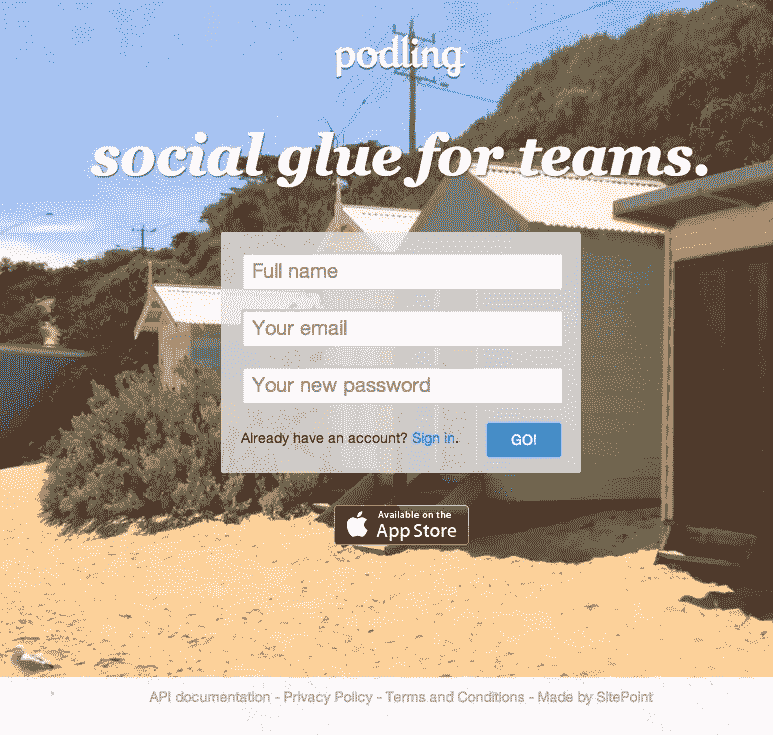
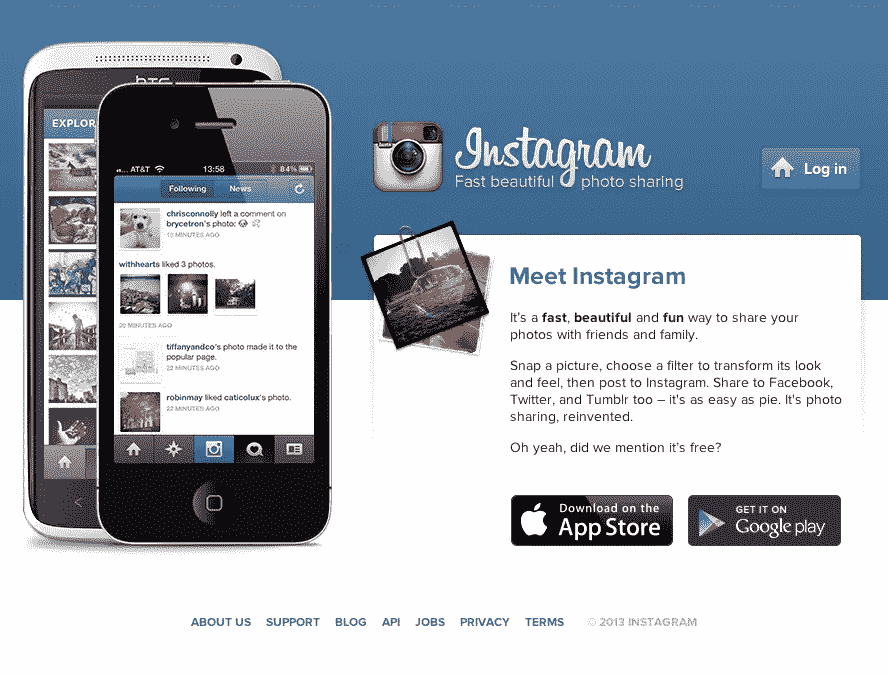

# 推出 MVP？你需要的不仅仅是一个 MVW

> 原文：<https://www.sitepoint.com/launching-an-mvp-youll-need-more-than-an-mvw/>

与我交谈过的许多开发商、企业主和企业家都陷入了“我建造的这个东西会自我出售”的陷阱。然后他们想知道为什么没有人下载他们的新产品，或者注册他们的新服务。然后他们叫来一名文案。

这里有什么问题？如果你问我，创业公司对 MVP 的强烈关注没有帮助。

最小可行产品的焦点是你的团队日以继夜的工作来运输产品。他们到了发布日期，并意识到他们真的没有任何产品信息——如果你愿意的话，可以说是抵押品——来支持发布。

因此，他们一起点击注册或下载页面，在 App store 中列出他们的应用程序并播放，然后在推特上发布。方法是:造出有用的东西，把它拿出来，看看它能不能飞起来。

但是如果这就是你要做的一切，那么竞相推出 MVP 又有什么意义呢？MVP 可能有商业意义。没有的是跟进一个 MVW——一个最低可行的网站。

在这篇文章中，我们将看到如何通过一个智能登录页面来*轻松地*支持你的下一个产品或服务发布——如果你的发布预算不允许的话，不用文案。

让我们来看看最近发布的一个离家很近的新应用:SitePoint 自己的 podling。

## 行动中的 MVW

伴随最近发布的 [podling](http://podling.com/) 的网站实际上只是一个有四个字的登陆页面。

要了解这项服务的任何信息，你需要去*非现场*，去[苹果商店](http://itunes.apple.com/us/app/podling/id602974070?mt=8&ign-mpt=uo%3D4)上的 podling 页面，在那里你可以获得该应用的简要描述和一个屏幕截图。

许多苹果应用程序开发人员会辩称，苹果商店上的页面是主要游戏，网站无关紧要。但是如果你真的要在第一波创新者之后发展你的市场，你需要的不仅仅是苹果商店页面。

什么是创新者？在任何受众中，都有五种类型的客户:创新者、早期采用者、早期多数、后期多数和落后者。这些群体中只有一个——敢于冒险、热爱技术的创新者——会去下载一个应用程序，看看它能做什么，并想出它能如何帮助他们。只有一小部分人会费心去做。毕竟，现在有很多应用程序。他们为什么要下载你的呢？

那么这里的解决方案是什么呢？你的 MVP 需要一个成熟的网站吗？不，但是如果你想给你的产品或服务最好的机会来吸引观众的注意力，你可能会说，你需要的不仅仅是 MVW。

让我们看看另一个增加赌注的例子。

## Instagram:基础，做的不错

Instagram 网站在展示应用方面做得非常好。虽然 Instragram 不是 MVP，但这种网站是任何初创公司或小企业都可以实现的。

像波德林一样，这个登陆页面包含品牌名称和四个字的标语。它也有苹果商店和播放的链接——下载提供一系列截图和应用程序细节的页面。

但是 Instragam 的网站上有一些额外的资产。

第一个是一个小广告，包含来自[品牌词汇](https://www.sitepoint.com/tell-the-story-of-your-brand-service-or-product-with-a-brand-vocabulary/)的关键词，它与类别(摄影)词汇紧密相关:滤镜、分享、帖子和照片。

为什么*不*用快速、友好的电梯推销介绍你的新产品或服务？当然，写一个快速、友好的电梯间推介，说明*对用户来说意味着什么*，说起来容易做起来难。但这是可行的。

Instagram 用来促进下载的其他资产？帮助内容和博客链接。

很少有创业公司在产品发布时会有博客来指引用户。那很好。我希望，一旦你拥有了这两项资产，从登陆页面链接到你的博客是一件很容易的事情。

但是 FAQ 呢？Instagram 在其 IA 中将此称为“支持”，但在源头将其称为“帮助中心”。

就像 Instagram 所做的那样，你可以从你的登陆页面页脚链接到你的 FAQ。这个:

*   显示你的关心。你有常见问题的事实表明你关心你的用户，而不仅仅是你辉煌的技术。
*   **说明你了解用户。**您知道，不是每个人都想注册或下载来了解您的产品。你的常见问题是为那些想要它的人提供的免费信息。
*   **表明你是认真的。**常见问题表明你对产品或服务的承诺。不可靠的人不会费心去创造常见问题，是吗？不，但你已经做到了，因为你正在建立一个比应用程序更大的东西——你正在建立一个业务，以及与真实的人的关系:你的用户。
*   **不是“在你脸上”根据推理，如果用户想要更多信息，他们可能会四处寻找。如果他们没有——如果他们乐于下载——他们甚至不会注意到你有 FAQ。如果你需要，它们就在那里，如果你不需要，它们很可能不会被注意到。**

请注意，您的常见问题不需要像这些一样广泛，您可以在发布时提出几个关键问题，并随着时间的推移不断完善。没什么大不了的。

想想看:我们大多数人都知道 Instagram 是什么，是做什么的。然而，企业提供了所有这些信息。另一方面，无数没有权威或品牌存在的新上市应用程序几乎不告诉用户关于他们自己的任何信息。

不要希望用户会费心下载你的应用程序来了解它的功能。这不是建立用户群的方法。

取而代之的是，专注于为他们提供对所有内容资产的访问权——你拥有的关于你的新产品的所有*信息*,这些信息可能会引起他们的兴趣。用你所拥有的来讲述你的产品或服务故事。

不，用户可能不需要全部。但是不同的用户寻找不同的信息和不同类型的保证。如果你的 MVP 要吸引 MVA，你的登陆页面需要尽可能多地解决这些问题。

## 更进一步

好了，要启动您的 MVP，您需要一个包含以下内容的登录页面:

*   您的品牌名称和口号
*   关于产品或服务为用户做了什么的一些信息
*   根据需要下载的注册表格或链接
*   支持或常见问题的链接，为需要的人提供更多信息。

如果你的产品或服务比 Instagram 更复杂一点呢？你打算怎么处理你放在 YouTube 上的演示视频，这样你就可以在推特上发布了？你从你所在行业的一位有影响力的人那里得到的推荐怎么样？

向 Evernote 学习:他们聪明地将这些元素——连同精选的 FAQ 和博客帖子——整合到他们的登陆页面中。

Evernote 甚至加入了“产品指南”的链接，详细介绍了每个平台每个版本的技术特点。

您可能没有这种级别的用户友好文档。但是，假设你写了一份白皮书或电子书，解释你的产品，鼓励人们注册你的服务。你能在你的产品登陆页面上永久提供下载吗？

你能嵌入你的 YouTube 演示吗？你能把业内权威人士对你的品牌的评论作为特色引用吗？

这些问题的答案将取决于您手边的内容资产的性质以及您的受众。当然，目标不仅仅是在你的登陆页面上塞满一大堆东西。

但是如果你正在启动一个 MVP，并且你有任何可以展示给潜在客户的内容资产,看看它们。看看有什么值得包括在内，以及哪里有你需要填补的信息空白。

## “越轻越好”…或者是这样吗？

我听到的对这种立场的一个反对意见是“太多了”。在这种立场中，你提供关于你的新产品或服务的信息，而不是期望人们通过使用它来了解它

“太多的信息让人不知所措，”人们说。“这是个简单的产品！这么简单！它不需要一堆单词围着它。我宁愿让应用程序自己说话。”

快讯:如果你的登陆页面不能说服用户下载你的产品或注册你的服务，它就没有机会为自己说话。

还记得 Instagram 的例子吗？你很难说登陆页面上有太多的信息。

当你推出一项产品或服务时，更少的信息可能并不意味着更多的顾客。在你的登陆页面上包含或链接精心选择的、有针对性的支持内容是销售你的新产品或服务的更明智的方式。

你的产品或服务登陆页面是什么样的？它使用你的品牌词汇中的关键词吗？它是否为用户提供了足够的信息来激起他们的兴趣——并下载或注册？请在评论中告诉我们。

## 分享这篇文章