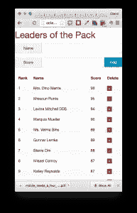
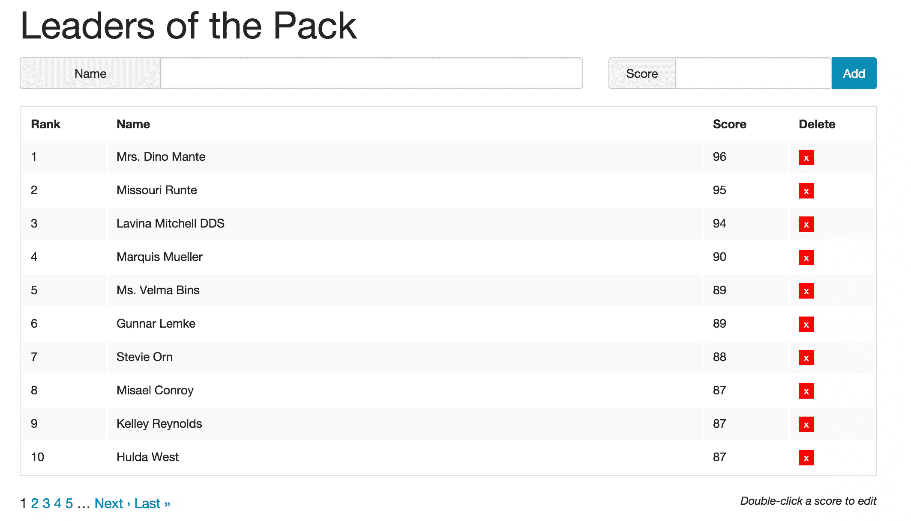

# Rails 上的排行榜

> 原文：<https://www.sitepoint.com/leaderboards-rails/>



最近，我有理由创建一个简单的排行榜 Rails 应用程序。我的约束如下:

*   在黑板上接受一个新条目的名字和分数。如果名称已经存在，用新值更新分数。
*   返回所提供名称的 JSON 表示，包括排名和分数。
*   支持排行榜上所有条目的 HTML 和 JSON 表示。包括指定页码(默认为 0)和偏移量(默认为 10)的能力。
*   不要允许为一个请求返回超过 100 条记录。
*   允许从排行榜中删除指定的名字。

总而言之，需求非常简单。基本上，允许用户在排行榜上创建、更新和删除条目。此外，以 HTML 或 JSON 格式返回按排名排序的当前条目。

快速搜索了一两次后，我知道我想使用 Redis。[这篇文章](http://www.agoragames.com/blog/2011/01/01/creating-high-score-tables-leaderboards-using-redis/)真正阐明了 Redis 的功能如何很好地支持排行榜。即 Redis 数据类型[排序集](http://redis.io/topics/data-types#sorted-sets)被*制作*为排行榜。以下是将使用的一些[排序集合命令](http://redis.io/commands#sorted_set):

*   [ZADD](http://redis.io/commands/zadd) :向集合中添加一个或多个具有指定分数的成员。`ZADD myzset 2 "two" 3 "three"`将增加 2 名成员。
*   [ZREVRANGEBYSCORE](http://redis.io/commands/zrevrangebyscore) :返回排行榜中在所提供的*最小值*和*最大值*之间找到的所有成员。这用于从最高到最低显示成员。
*   [ZSCORE](http://redis.io/commands/zscore) 和 [ZRANK](http://redis.io/commands/zrank) 分别允许通过分数和排名检索成员。

我不是唯一一个认为 Redis 在这个用例中运行良好的人。Github 用户 [agoragames](http://github.com/agoragames) 创造了一个 Ruby gem 来使它变得更加容易。 [`leaderboard`宝石](http://github.com/agoragames/leadeboard)不仅使使用 Redis 排行榜变得容易，它还在上面添加了大量功能。如果排行榜宝石有排行榜的话，`leaderboard`会排在最前面。

## 应用

在本文中，我将向您展示一个非常简单的、受 Rails 支持的排行榜。虽然一些前端行为(如分页)是 Rails 特有的，但排行榜操作不是。如果你愿意的话，你应该可以很容易地把排行榜专用位从中取出来，毫无困难地用在 Sinatra 或 Volt 或 Padrino 应用程序中。正如您将看到的，我已经将所有涉及排行榜的代码放入一组服务对象中。我这样做是出于爱。

排行榜本身可以是任何东西。我将使用 [Faker](https://github.com/stympy/faker) gem 来填充名字。这使我们可以在板上看到许多条目，并演示当我们添加新条目或更新现有条目时会发生什么。当我们到达这一步时，我将分享创建条目的 Ruby 脚本。

这个排行榜应用程序的代码是[这里是](https://github.com/ruprict/ccleader)，应用程序的演示是[这里是](http://ccleader.herokuapp.com/)。

我不打算介绍应用程序的设置，因为您可以查看代码。这是一个非常普通的 Rails 应用程序，添加了以下精华:

*   我们在这里谈论的宝石。
*   [`faker`](https://github.com/stympy/faker) :宝石生成假/测试值。它在这里用于为我们的成员生成名称。
*   [`cells`](https://github.com/apotonick/cells) :“查看轨道的组件”。基本上，查看 Rails 的模型。排行榜没这个必要，但是我喜欢他们。
*   [`kaminari`](https://github.com/amatsuda/kaminari) :著名的 Rails 分页宝石。排行榜将被分页。

我还使用了 RSpec 和 PostgreSQL，所以这些必要的 gem 也在 gem 文件中。这些规范并不是 100%完整，但它们确实涵盖了快乐之路。PostgreSQL 基本上根本不用，我就是懒得拆。这个应用程序的下一步将包括身份验证，我很可能会使用 PostgreSQL 并为此进行设计。

### 路线和视图

我们排行榜应用的路线非常简单:

```
Prefix Verb   URI Pattern                 Controller#Action
 not_found GET    /not_found(.:format)        errors#not_found
   entries GET    /entries(.:format)          entries#index
           POST   /entries(.:format)          entries#create
 new_entry GET    /entries/new(.:format)      entries#new
edit_entry GET    /entries/:id/edit(.:format) entries#edit
     entry GET    /entries/:id(.:format)      entries#show
           PATCH  /entries/:id(.:format)      entries#update
           PUT    /entries/:id(.:format)      entries#update
           DELETE /entries/:id(.:format)      entries#destroy
      root GET    /                           leaderboards#show
```

基本上有一个排行榜，所以它得到一个`show`方法。排行榜由条目组成，`Entry`是一个[全轨资源](http://guides.rubyonrails.org/routing.html#resource-routing-the-rails-default)。可以通过发送到收集路线来创建条目。所有的条目都可以通过获取集合来获得。单个条目遵循标准的 Rails RESTful 路线。为了完整起见，我添加了一条“未找到”的路线。

需要注意的是，应用程序中唯一真正的 HTML 视图是显示排行榜。其他一切都将通过 AJAX 完成。我用 [Angular](https://angularjs.org/) 来表示(*数百名 ReactJS 用户哄笑的声音*)。最后，对于风格和布局，我使用的是 [Zurb Foundation](http://foundation.zurb.com/) ( *数百名 Bootstrap 用户哄笑的声音*)。

### 董事会服务

如前所述，我已经隔离了所有排行榜代码。`Boards`模块有几个模块级的方法来保存默认值:

```
module Boards
  DEFAULT_BOARD = 'ccleaders'

  def self.default_leaderboard
    Leaderboard.new(
      DEFAULT_BOARD,
      default_options,
      redis_connection: Redis.current
    )
  end

  def self.default_options
    Leaderboard::DEFAULT_OPTIONS.merge(
      page_size: 10
    )
  end
end
```

`default_leaderboard`返回应用程序使用的排行榜。服务方法将默认为这样，除非他们明确提供了一个排行榜。`default_options`保存页面大小以及来自`leaderboard` gem 本身的[默认选项](https://github.com/agoragames/leaderboard#defining-leaderboard-options)。你应该点击阅读排行榜宝石的各种选项。

为了满足应用要求，我们需要:

*   获取所有条目
*   获得单个条目
*   创建/更新条目
*   删除条目

完成这项工作的类解释如下。

#### `GetAllService`

获取排行榜条目。可以提供选项，如`page`和`page_size`。

```
module Boards
  class GetAllService < Boards::Base
    def execute(options = {})
      leaderboard.leaders(
        page(options),
        page_size: page_size(options)
      )
    end

    private

    def page(options)
      options[:page] || 1
    end

    def page_size(options)
      options[:page_size] || 10
    end
  end
end
```

`GetAllService`调用`leaderboard.leaders`方法，传入页面选项。这将返回排行榜中的条目。`leaderboard`方法在`Boards::Base`类上，看起来像:

```
class Base
  def leaderboard
    @leaderboard ||= Boards.default_leaderboard
  end

  def member_exists?(name)
    leaderboard.check_member?(name)
  end
end
```

在这个例子中，我只支持一个排行榜，但是处理多个排行榜也很容易

#### `GetService`

根据姓名在排行榜中获得一个条目。

```
module Boards
  class GetService < Boards::Base
    def execute(options = {})
      return unless member_exists?(options[:name])
      leaderboard.score_and_rank_for(options[:name])
    end
  end
end
```

伙计，宝石让这变得如此简单。快速检查一个条目是否存在(`member_exists?`在`Boards::Base`类中)，然后返回该条目的分数和排名。

#### `UpdateService`

在排行榜中为给定的姓名和分数创建或更新条目。这也将根据排行榜页面大小返回条目所在的页面。

```
module Boards
  class UpdateService < Boards::Base
    def execute(entry_params)
      name = entry_params[:name]
      score = entry_params[:score].to_i
      leaderboard.rank_member(name, score)
      member = leaderboard.score_and_rank_for(name)
      member[:page] = leaderboard.page_for(name, leaderboard.page_size)
      member
    end
  end
end
```

从参数中获取分数和名称，然后调用`rank_member`。我在这个方法的末尾添加了一些额外的东西，以根据排行榜页面大小获得新条目(或更新的条目)所在的页面。当操作完成时，我用它把用户带到那个页面。

另外，这个类用于创建和更新条目，所以没有`CreateService`。

#### `DeleteService`

根据提供的名称从排行榜中删除一个条目。

```
module Boards
  class DeleteService < Boards::Base
    def execute(options = {})
      return unless member_exists?(options[:name])
      leaderboard.remove_member(options[:name])
    end
  end
end
```

只需用名字简单调用`remove_member`。很简单。

你可能想知道我是否后悔在这些类的名字中加入了`Service`。我知道。

控制器将基于用户请求使用这些对象和方法来执行操作。

### 排行榜控制器和视图

`LeaderboardController`有一个单独的动作:`show`。这项动作会取得排行榜目前页面的项目。

```
class LeaderboardsController < ApplicationController
  before_action :query_options

  def show
    @lb = Boards.default_leaderboard
    @entries = entry_service.execute(query_options)
    respond_to do |format|
      format.html do
        paginate
      end
      format.json do
        render json: @entries
      end
    end
  end

  private

  def query_options
    @limit = [params.fetch(:limit, 10).to_i, 100].min
    @page = params.fetch(:page, 1).to_i
    { page: @page, limit: @limit }
  end

  def paginate
    pager = Kaminari.paginate_array(
      @entries,
      total_count: @lb.total_members)

    @page_array = pager.page(@page).per(@limit)
  end

  def entry_service
    Boards::GetAllService.new
  end
end
```

`show`方法非常简单。它抓取默认排行榜并调用`Boards::GetAllService`来获取条目。如果我们正在渲染 HTML，`paginate`方法使用了非常有用的`Kaminari.paginate_array`方法。我们甚至会得到总页数，因为排行榜知道它是`total_members`。我原以为分页会比这更可怕，但是 Ruby 社区再次支持了我。

`show`视图如下所示:

```
<h1><%= t('leaderboard.subtitle') %></h1>
<%= render_cell :leaderboard, :new_entry_form %>
<table style='width: 100%'>
  <tr>
    <th><%= t('entries.rank') %></th>
    <th><%= t('entries.name') %></th>
    <th><%= t('entries.score') %></th>
    <th><%= t('labels.delete') %></th>
  </tr>
  <% @entries.each do |entry|  %>
    <%= render_cell :entry, :show, entry: entry %>
  <% end %>
</table>
<span style='font-size: small; font-style:italic; float:right'><%= t('labels.edit_help') %></span>
<%= paginate @page_array %>
```

我使用`t`(T1 的缩写)方法将字符串从本地文件中取出。参赛作品将以表格的形式展示出来(*100 个 CSS 学究的哄笑声*)。

如前所述，我正在使用`cells`宝石，因为我真的很喜欢它。这个视图有两个单元格:排行榜新条目表单和一个在表格中呈现单个条目的单元格。新的条目表单单元格如下所示:

```
<%= form_tag controller: 'entries'  do %>
  <div class="row">
    <div class="large-8 columns">
      <div class="row collapse prefix-radius">
        <div class="small-3 columns">
          <span class="prefix"><%= t('entries.name') %></span>
        </div>
        <div class="small-9 columns">
          <%= text_field_tag :name, nil, {name: 'entry[name]'}  %>
        </div>
      </div>
    </div>
    <div class="large-4 columns">
      <div class="row collapse prefix-radius">
        <div class="small-3 columns">
          <span class="prefix"><%= t('entries.score') %></span>
        </div>
        <div class="small-7 columns">
          <%= number_field_tag :score, nil, {name: 'entry[score]'} %>
        </div>
        <div class="small-2 columns ">
          <%= submit_tag 'Add', class: 'button postfix' %>
        </div>
      </div>
    </div>
  </div>
<% end %>
```

这只是一个添加新条目的简单表单。它需要一个名字和一个分数。

条目单元格更有趣一些:

```
<tr>
  <td style='width: 10%'><%= @rank %></td>
  <td><%= @name %></td>
  <td style='width: 10%'>
    <entry-form entry='<%= @entry.to_json %>'></entry-form>
  </td>
  <td style="width: 10%"><%= render_cell :entry, :delete_form, entry: @entry %></td>
</tr>
```

该单元格呈现一个表格行，其中包含条目名称、一个名为`entry-form`的东西和另一个单元格。我们将回到那个奇怪的`entry-form`组件，让我们看看`delete_form`单元，很快的:

```
<%= form_tag "/entries/#{@entry[:member]}", controller: 'entries',  method: 'DELETE' do %>
    <%= submit_tag "x", style: 'color: #fff; background: #F00; border:none;cursor: pointer' %>
<% end %>
```

删除表单使用 HTTP DELETE 发送到特定条目。这也是我喜欢细胞的原因之一。我得到了视图中可测试的焦点部分。

那么，入口单元格中的`entry-form`是什么？我的朋友们，那是一个角度方向或分量。角度指令是 javascript 行为的可重用部分。该指令允许用户双击分数进行编辑。它在这里，在所有的荣耀中:

```
var App = angular.module('App', [])
.directive('entryForm', function (){

  return {
    restrict: 'E',
    scope: {
      entry: '=entry'
    },
    templateUrl: "<%=asset_path 'templates/entry_form.html'%>",
    link: function(scope, elem, attrs) {
      var input = elem.find('input'),
          form = elem.find('form');
      scope.editing = false;

      elem.bind('dblclick', function(){
        scope.editing = true;
        input.select();
        scope.$apply();
      });

      input.bind('keydown', function(e) {
        switch(e.which) {
          case 13: //Enter
            form.submit();
          case 27: //Esc
            scope.editing = false;
        }
        scope.$apply();
      });
    }
  };
})
```

如果你了解角度指令(或者，如果你不了解的话)，这个很简单。我正在通过 ERb 运行 javascript 文件(意思是，它是一个. js.erb 文件)来获取`asset_path`，这是一个有问题的做法。该模板包含将替换页面上的`entry_form`组件的 HTML:

```
<span ng-hide='editing'>{{entry.score}}</span>
<form method='post' action='/entries' ng-show='editing' csrf>
  <input style='display:none' type='text' name='entry[name]' value='{{entry.member}}'/>
  <input style='width:100%' ng-show='editing' name='entry[score]' value='{{entry.score}}' />
</form>
```

该指令绑定到几个事件，一个在 score 元素上(`dblclick`)，另一个在 input 上(`keyDown`)。`scope.editing`布尔开关切换输入的开和关。

你们当中更精明的 Rails 开发人员可能会问:“那个表单是如何绕过 CSRF 保护的？我没看到`authenticity_token`！”好问题。你看到`entry_form`模板中`form`的`csrf`属性了吗？你猜怎么着？又是一个指令！WHEEEE！它看起来是这样的:

```
....entry-form directive...
.directive('csrf', function(){
  return {
    restrict: 'A',
    compile: function(tElement, tAttrs, transclude) {
      var input = $("<input/>", {type: 'hidden', name:'authenticity_token', value: $("meta[name='csrf-token']").attr("content") });
      tElement.append(input);
    }
  };
});
```

将`csrf`放在那个`form`标签上会导致一个带有`csrf-token`的隐藏的`input`被附加到表单上。漂亮。

这就是单个 HTML 页面、样式和行为的全部内容。哦，看起来是这样的:



### 入口控制器

`EntriesController`是完成业务的地方:

```
class EntriesController < ApplicationController
  def show
    entry = retrieve_service.execute(name: params[:id])
    return not_found unless entry
    respond_to do |format|
      format.html do
      end
      format.json do
        render json: entry, status: :ok
      end
    end
  end

  def create
    result = create_service.execute(entry_params)
    respond_to do |format|
      format.html do
        redirect_to root_path(page: result[:page])
      end
      format.json do
        render json: { status: :ok }
      end
    end
  end

  def index
    @entries = retrieve_service.execute(query_options)
    return not_found if @entries.blank?
    respond_to do |format|
      format.html do
      end
      format.json do
        render json: @entries
      end
    end
  end

  def destroy
    result = delete_service.execute(name: params[:id])
    return not_found unless result
    respond_to do |format|
      format.html do
        redirect_to root_path
      end
      format.json do
        render json: { status: 'ok' }, status: 200
      end
    end
  end

  private

  def create_service
    Boards::UpdateService.new
  end

  def retrieve_service
    Boards::GetService.new
  end

  def delete_service
    Boards::DeleteService.new
  end

  def entry_params
    (params[:entry] || {}).slice(:name, :score)
  end
end
```

这里我不打算逐一介绍每个方法，因为它们都遵循相同的模式:调用正确的服务对象，传入适当的参数，然后根据格式进行呈现。这里有一些重构，我会作为作业给你们。`destroy`方法重定向到根路径，这是粗略的。你的任务是让它充满活力。

## 但是等等，还有更多

此处展示的应用程序仅涉及 leaderboard gem 提供的部分功能。Github 页面有所有的信息，但是我想指出几个特性。

### 成员数据

gem 允许您为条目提供额外的成员数据。这是回购的例子:

```
require "json"
lb.rank_member('Scout', 9001, {level: "over 9000"}.to_json)
```

此时，呼叫:

```
JSON.parse(lb.member_data_for("Scout")) => {level: 'over 9000'}
```

如果你的排行榜条目有额外的数据可以携带，这可能会非常有用。

### 在我周围

获取条目周围的条目很简单:

```
lb.around_me('Scout')
=> [...a bunch of entries...{member: "Vegeta", score: 8999, rank: 9000}, {member:"Scout", score: 9001, rank: 9001},...a bunch of entries...]
```

### 其他类型的排行榜

排行榜有 3 种(谁知道？):默认、`TieRankingLeaderboard`和`CompetitionRankingLeadeboard`。不同之处在于如何处理相同分数的条目。

*   默认按字典顺序排列。
*   `TieRankingLeaderboard`:分数相等的给一个等次，后续分数取下一个值。示例:1，1，2，3，4，4，5
*   `CompetitionRankingLeadeboard`:相等的分数被赋予相等的等级，后续分数为每个相等的成员跳过一个值。示例:1，1，3，4，4，7

### 有条件地排列条目

可以定义一个 lambda 来决定一个条目是否会被排名。以下是来自 Github 页面的示例:

```
highscore_check = lambda do |member, current_score, score, member_data, leaderboard_options|
  return true if current_score.nil?
  return true if score > current_score
  false
end

highscore_lb.rank_member_if(highscore_check, 'david', 1337)
highscore_lb.score_for('david')
 => 1337.0
highscore_lb.rank_member_if(highscore_check, 'david', 1336)
highscore_lb.score_for('david')
 => 1337.0
highscore_lb.rank_member_if(highscore_check, 'david', 1338)
highscore_lb.score_for('david')
 => 1338.0
```

酷毙了。

## 生成条目的脚本

正如我所承诺的，这是我用来在排行榜中生成一些条目的脚本:

```
100.times do |i|
  params = {name: Faker::Name.name, score: Random.rand(100)}
  Boards::UpdateService.new.execute(params)
end
```

## 前进并排列

现在，您已经掌握了创建自己排行榜的知识。从现在开始，我想你会为所有事情创建排行榜。当你得到名为“关于 Ruby 的文章和排行榜”的排行榜时，请告诉我，这样我就可以为这篇文章投票了。

## 分享这篇文章