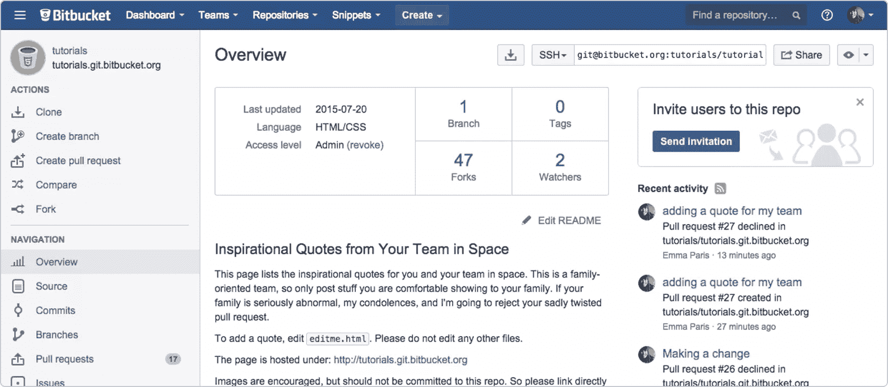
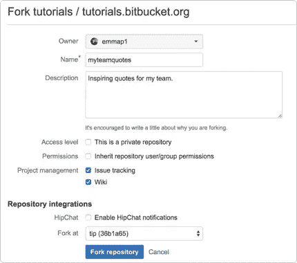
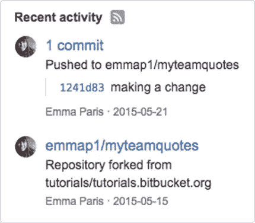
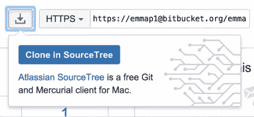
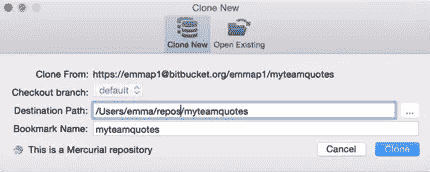
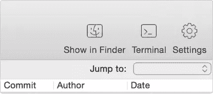
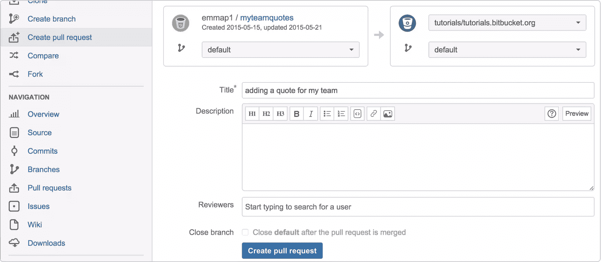
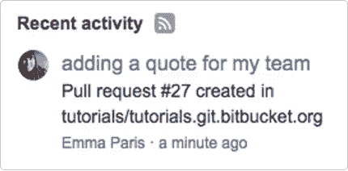
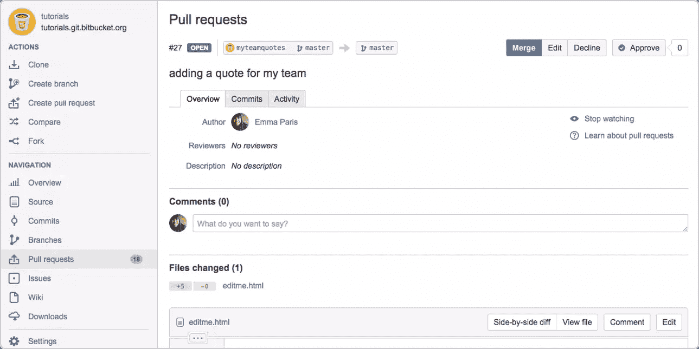

# 了解 Bitbucket Cloud 中的代码评审

> 原文：<https://www.sitepoint.com/learn-about-code-review-in-bitbucket-cloud/>

*本文由 [Bitbucket](https://bitbucket.org/product?utm_source=sitepoint&utm_medium=paid-content&utm_content=learn-code-review-with-bitbucket&utm_campaign=bitbucket_adexp-bbtofu_sitepoint-syn-content) 赞助。感谢您对使 SitePoint 成为可能的赞助商的支持。*

## 目标

通过向团队成员的存储库中添加启发性的引用，学习如何使用 Git 的代码审查拉请求。

## 任务简介

您已经开始通过自己的存储库掌握 Git。但是，如果您的团队正在世界各地旅行，而您希望能够在同一个回购上进行合作，该怎么办呢？完成本教程，学习代码审查的诀窍。

涵盖的主题:

*   派生队友的存储库，创建拉请求，并贡献给队友的存储库。

| 时间 | 观众 | 先决条件 |
| --- | --- | --- |
| 15 分钟 | 您有一些使用 Bitbucket Cloud 的经验。如果没有，试试我们的初学者教程。 | [你已经安装了 Git](https://www.atlassian.com/git/tutorials/install-git?utm_source=sitepoint&utm_medium=paid-content&utm_content=learn-code-review-with-bitbucket&utm_campaign=bitbucket_adexp-bbtofu_sitepoint-syn-content) |
|   |   | [您有一个比特币账户](https://bitbucket.org/account/signup/?utm_source=sitepoint&utm_medium=paid-content&utm_content=learn-code-review-with-bitbucket&utm_campaign=bitbucket_adexp-bbtofu_sitepoint-syn-content) |

### 关于分叉

当您使用另一个用户的公共位存储库时，通常您对代码具有读取权限，但没有写入权限。这就是分叉概念的由来。它是这样工作的:

*   分叉存储库以将其复制到您自己的帐户。
*   将分叉的存储库从 Bitbucket 克隆到您的本地系统。
*   对本地存储库进行更改。
*   将更改推送到 Bitbucket 上分叉的存储库。
*   从您分叉的原始存储库中创建一个 pull 请求，以添加您所做的更改。
*   等待存储库所有者接受或拒绝您的更改。

如果存储库所有者接受拉请求，Bitbucket 会将您的代码更改合并到原始存储库中。建议您使用 fork 和 pull 请求，即使存储库所有者授予您对公共存储库的写访问权限。虽然 pull 是 Git 和 Mercurial 工作流的一部分，但是 pull 请求和 forks 是仅由存储库托管服务使用的概念，比如 Bitbucket。

## 分叉一个队友的仓库

由于您团队中的每个人并不是同时都在 Bitbucket 空间站，因此您的一名团队成员决定收集一些任何人都可以参考的鼓舞人心的报价，无论他们是为土星环上的新空间站制定计划还是冒险前往新的太阳系，这都是一个不错的主意！你的队友建立了一个知识库，认为任何人都可以贡献和激励。您决定要添加一个报价。

在这个例子中，您将派生出一个属于名为`tutorials`的用户的公共存储库。

1.  根据您使用的 DVCS 工具，使用 Bitbucket 右上角的搜索字段查找以下存储库之一:
    *   对于 Git，搜索[tutorials/tutorials . Git . bit bucket . org](https://bitbucket.org/tutorials/tutorials.git.bitbucket.org?utm_source=sitepoint&utm_medium=paid-content&utm_content=learn-code-review-with-bitbucket&utm_campaign=bitbucket_adexp-bbtofu_sitepoint-syn-content)存储库。
    *   For Mercurial, search for the [tutorials/tutorials.bitbucket.org](https://bitbucket.org/tutorials/tutorials.git.bitbucket.org?utm_source=sitepoint&utm_medium=paid-content&utm_content=learn-code-review-with-bitbucket&utm_campaign=bitbucket_adexp-bbtofu_sitepoint-syn-content) repository.

        

2.  From the repository you open, click **Fork** on the left side of the screen. The system displays the fork page.

    

3.  例如，将**名称**更改为`myteamquotes`。
4.  在**描述**字段中，输入`Inspiring quotes for my team`。
5.  取消选中**继承存储库用户/组权限**。
6.  按下**叉库**。

## 复制您的分支并对存储库进行更改

你想好要和你的队友分享什么建议了吗？让我们在您的本地系统中获得一个分叉存储库的副本，以便您可以添加它。

### 我用的是 Git！

#### 第一步。将您的分叉克隆到您的本地系统

1.  From the **Overview** page of the forked repository in Bitbucket, click **Clone** on the left side. The system displays a pop-up clone dialog. By default, the clone dialog sets the protocol to **HTTPS** unless you have already set up SSH for Git.

    

2.  从弹出的克隆对话框中，复制突出显示的克隆命令。
    *   从您的终端窗口，将目录更改为您的`repositories`目录。

        ```
        $ cd ~/repos

        ```

    *   将从 Bitbucket 中复制的命令粘贴到命令行上，按**回车键**。
    *   Enter your Bitbucket password when the terminal asks for it. This is the password you entered when you created your Bitbucket account. If you created an account by linking to Google or Facebook, use your password for that account. At this point, your terminal window should look similar to this:

        ```
        $ cd ~/repos $ git clone https://emmap1@bitbucket.org/emmap1/myteamquotes.git Cloning into 'myteamquotes'... Password remote: Counting objects: 15, done. remote: Compressing objects: 100% (15/15), done. remote: Total 15 (delta 4), reused 0 (delta 0) Unpacking objects: 100% (15/15), done. Checking connectivity... done.

        ```

        现在，您的本地系统上有了分叉的存储库。

#### 第二步。对存储库源进行更改

该存储库包含一个具有`editme.html`文件的网站。这个文件列出了激励你的太空队友的名言。现在，轮到你录一段鼓舞人心的话了…或者只是一段最喜欢的话。请执行以下操作来添加到此存储库中:

1.  使用谷歌或其他搜索引擎找到你最喜欢的报价。
2.  导航到包含您的存储库文件的目录文件夹(类似于~/repos/myteamquotes)。
3.  用文本编辑器打开 editme.html 文件。
4.  Go ahead and add a quote of your choosing. You can add an image link to your quote if you like, just place it above the <blockquote> tag.

    下面是一个添加内容的示例:

    ```
    <!-- Please don't edit above or below this line. To add a quote, copy the div below and paste it at the bottom of the file. Then populate it with your quote and attribution. <div class="quote"> <blockquote>Your quote goes here</blockquote> <cite>Attribution</cite> </div> You can add an optional image tag. The image must be linked from an external site and not be in the repository.  <!--Please don't edit above this line.> <div class="quote">  <blockquote>Put a dent in the universe.</blockquote> <cite>Steve Jobs</cite> </div> 

    ```

    如果您不确定要做什么，您可以复制文件顶部的示例标记，将它们粘贴到页面上最后一个引号的下面，然后用您的引号修改它们，如前面的示例所示。

5.  保存并关闭文件。
6.  在您的终端窗口中，将目录更改为`myteamquotes`。

    ```
    $ cd ~/repos/myteamquotes

    ```

7.  Display the status of the repository with `git status`.

    ```
    $ git status On branch master Your branch is up-to-date with 'origin/master'. Changes not staged for commit: (use "git add <file>..." to update what will be committed) (use "git checkout -- <file>..." to discard changes in working directory) modified: editme.html no changes added to commit (use "git add" and/or "git commit -a") 

    ```

    如果您添加了图像文件，您也会看到该文件。

8.  使用`git add` :

    ```
    $ git add editme.html

    ```

    在本地添加您的更改
9.  使用`git commit` :

    ```
    $ git commit -m "Making a change" [master 83bc100] Making a change 1 file changed, 10 insertions(+), 5 deletions(-)

    ```

    在本地提交您的更改
10.  输入`git push`将更改推送至您的 Bitbucket fork，并输入您的密码以完成推送更改。

    ```
    $ git push origin master Counting objects: 3, done. Delta compression using up to 8 threads. Compressing objects: 100% (3/3), done. Writing objects: 100% (3/3), 340 bytes | 0 bytes/s, done. Total 3 (delta 2), reused 0 (delta 0) To https://emmap1@bitbucket.org/emmap1/myteamquotes.git 7479b42..83bc100 master -> master Branch master set up to track remote branch master from origin. 

    ```

11.  Log into your Bitbucket repository and notice you can see your push in the activity stream.

    

### 我在用 SourceTree！

#### 第一步。将您的分叉克隆到您的本地系统

1.  From the **Overview** page of the forked repository in Bitbucket, click the **Clone in SourceTree** icon.

    

2.  从出现的弹出菜单中单击源树中的**克隆**按钮。
3.  From the **Clone New** window, update the **Destination Path** to `<local directory>/repos/myteamquotes/`. This destination path refers to the repos directory you just previously created for repositories.

    

4.  点击**克隆**按钮。

#### 第二步。对存储库源进行更改

该存储库包含一个具有`editme.html`文件的网站。这个文件列出了激励你的太空队友的名言。现在，轮到你录一段鼓舞人心的话了…或者只是一段最喜欢的话。请执行以下操作来添加到此存储库中:

1.  使用谷歌或其他搜索引擎找到你最喜欢的报价。
2.  From SourceTree, click the `Show in Finder` button.

    

3.  用文本编辑器打开`editme.html`文件。
4.  Go ahead and add a quote of your choosing. You can add an image link to your quote if you like, just place it above the `<blockquote>` tag.

    *下面是一个加法的示例:*

    ```
    <!-- Please don't edit above or below this line. To add a quote, copy the div below and paste it at the bottom of the file. Then populate it with your quote and attribution. <div class="quote"> <blockquote>Your quote goes here</blockquote> <cite>Attribution</cite> </div> You can add an optional image tag. The image must be linked from an external site and not be in the repository.  <!--Please don't edit above this line.> <div class="quote">  <blockquote>Put a dent in the universe.</blockquote> <cite>Steve Jobs</cite> </div> 

    ```

    如果您不确定要做什么，您可以复制文件顶部的示例标记，将它们粘贴到页面上最后一个引号的下面，然后用您的引号修改它们，如前面的示例所示。

5.  保存并关闭文件。
6.  Open SourceTree and notice that your repository has **Uncommitted changes**.

    

7.  Click the Commit button at the top to commit the file.

    

8.  在提供的空白处输入以下提交消息:“添加新报价。”
9.  点击消息框下的**提交**按钮。当您切换回视图时，您会看到文件已经被提交，但是没有被推送到 Bitbucket 存储库。
10.  在 SourceTree 中，单击**按钮**来推送您提交的更改。
11.  在出现的对话框中，单击 **OK** 将提交推送到存储库。
12.  登录到您的 Bitbucket 存储库，注意您可以在活动流中看到您的推送。

## 创建拉式请求

为了用智慧的话语来激励你的队友，你可以请求将你的变更添加到原始存储库中。为此，您需要创建一个拉取请求。

### 第一步。把你的叉子和原来的比较一下

当您正在添加报价时，另一个团队成员可能已经对原始存储库进行了更新。在这一点上，你可以检查，并决定是否需要相应地调整你的叉子。执行以下操作，将您的更改与存储库进行比较:

1.  登录 Bitbucket 并导航到您的`myteamquotes`存储库。分叉库有一个特殊的小部件，可以让您将分叉工作与原始工作进行比较。
2.  Click the **Compare** link on the left side of the page. The **Compare** section has a specialized view that is available only in forked repositories.

    

3.  Press the **Compare** button to compare your forked repository to the original repository.

    

4.  If someone has made changes to the original repository since you forked it, you will see that your forked repository is one or more commits behind the original. If that is the case, to update your repository, click **Sync now** and then **Sync** on the popup that appears. If you want to see the differences between your current repository and the original repository, click the **Diff** tab to compare changes. If there are multiple commits, you see their cumulative changes by file in this section. Click the **Side-by-side diff** button to see changes displayed side-by-side. Or press the **View file** button to view the full file in Bitbucket.

    

5.  切换回 **Commits** 选项卡，查看从您的本地存储库推送到 Bitbucket 中的 fork 的提交列表。要单独查看特定提交的内容，请单击一个**提交**链接，Bitbucket 会将您带到**提交**页面。

### 第二步。创建拉式请求

现在是时候请求将您的报价添加到原始存储库中以供所有人查看了！从 Bitbucket 中的`myteamquotes`存储库中，执行以下操作:

1.  按**创建拉动请求**。系统显示请求表单。
2.  Complete the form. For your purposes today, you only have to add a **Title**. When you are done it will look something like this:

    

3.  按**创建拉动请求**。系统在**教程**账号的*原始库*的**拉取请求**页面打开你的最新请求。要查看针对此回购的所有拉动请求列表，请单击**拉动请求**选项卡。

创建拉取请求后，您不能删除它。如果您在发出请求后删除了 fork，接收者只能拒绝您的请求，因为从中提取的存储库已经不存在了。

### 第三步。了解您的拉动式请求会发生什么情况

您必须等待存储库所有者接受您的 pull 请求。当最初的存储库所有者登录到 Bitbucket 时，该用户的新闻提要显示了几天前的 pull 请求和 fork，如下图所示。



当回购所有者点击你的拉请求时，用户可以**合并**、**编辑**，或者**拒绝**它。除了所有者之外，任何能够访问存储库的人都可以**批准**请求，这意味着那个人审查了拉请求中的变更。



### 您已经为存储库做出了贡献！

当您的拉取请求被接受或拒绝时，您会收到一封电子邮件。如果你想在等待的时候尝试一下 Bitbucket 中的其他东西，可以看看如何[启用问题跟踪器](https://confluence.atlassian.com/bitbucket/enable-an-issue-tracker-223216498.html?utm_source=sitepoint&utm_medium=paid-content&utm_content=learn-code-review-with-bitbucket&utm_campaign=bitbucket_adexp-bbtofu_sitepoint-syn-content)、[建立维基](https://confluence.atlassian.com/bitbucket/enable-a-wiki-223216500.html?utm_source=sitepoint&utm_medium=paid-content&utm_content=learn-code-review-with-bitbucket&utm_campaign=bitbucket_adexp-bbtofu_sitepoint-syn-content)，或者[添加用户权限](https://confluence.atlassian.com/bitbucket/repository-privacy-permissions-and-more-221449716.html?utm_source=sitepoint&utm_medium=paid-content&utm_content=learn-code-review-with-bitbucket&utm_campaign=bitbucket_adexp-bbtofu_sitepoint-syn-content)。

## 分享这篇文章