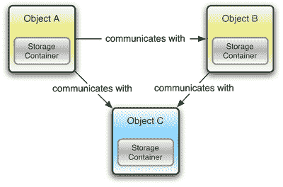

# 学习 Ruby on Rails:终极初学者教程

> 原文：<https://www.sitepoint.com/learn-ruby-on-rails-1/>

*这篇文章写于 2011 年，至今仍是我们最受欢迎的帖子之一。如果你热衷于学习更多关于 Ruby 和 Rails 框架的知识，你可能想直接进入源代码——[Ruby source，也就是](https://www.sitepoint.com/)——你可能会发现这篇[关于 Ruby 和 Sass](https://www.sitepoint.com/an-introduction-to-sass-in-rails/) 的最新文章很有意思。*

虽然本教程肯定没有试图为 Ruby 语言编写一个完整的指南，但是它将向您介绍一些 Ruby 的基础知识。我们将快速完成面向对象编程的速成课程，一路上涵盖该语言更常见的特性，而将 Ruby 更晦涩的方面留给专门的参考指南。我还将指出在开发 Web 应用程序时，Ruby 相对于其他语言的一些优势。读完这篇文章后，你就可以进入我们专门的 Ruby 网站了，www.rubysource.com

一些 Rails 开发人员建议，不先学习 Ruby 基础知识也可以学习和使用 Rails，但就我而言，在深入了解 Rails 之前，了解一点 Ruby 是非常有益的。事实上，如果你先花时间学习 Ruby 基础知识，你会自然而然地成为一名更好的 Rails 程序员。

这就是本教程的内容。事实上，这些信息摘自我的新书《构建你自己的 Ruby On Rails Web 应用程序》 ,现在可以通过 sitepoint.com 获得。这里介绍的两个章节直接涉及 Ruby 和 Rails 的优点。如果您需要安装和其他设置说明，[下载样本 PDF，其中包含第 1 章到第 4 章](https://www.sitepoint.com/books/rails2/samplechapters.php?SID=b475e2b873db8d423ac7a2835af31ab4)。

## Ruby 是一种脚本语言

一般来说，编程语言分为两类:编译语言或脚本语言。让我们探索一下这些术语的含义，并理解它们之间的区别。

## 编译语言

你写应用程序的语言实际上不是你的计算机能理解的。你的代码需要被翻译成你的计算机可以执行的位和字节。这个翻译的过程叫做编译，任何需要编译的语言都被称为编译语言。编译语言的例子包括 C、C#和 Java。

对于编译语言，实际的编译是开发过程的最后一步。你调用一个编译器——将你最终手写的、人类可读的代码翻译成机器可读的代码的软件程序——编译器创建一个可执行文件。这个最终产品能够独立于原始源代码执行。

因此，如果您对代码进行了更改，并且希望将这些更改合并到应用程序中，则必须停止正在运行的应用程序，重新编译它，然后再次启动应用程序。

## 脚本语言

另一方面，像 Ruby、PHP 或 Python 这样的脚本语言一直依赖于应用程序的源代码。脚本语言本身没有编译器或编译阶段；相反，他们使用一个解释器——一个在网络服务器上运行的程序——将手写代码动态翻译成机器可执行代码。正在运行的应用程序和您手工编写的代码之间的链接永远不会被切断，因为脚本代码在每次被调用时都会被翻译——换句话说，对于您的应用程序呈现的每个网页。

正如您可能已经从名称中推断出的那样，使用解释器而不是编译器是脚本语言和编译语言之间的主要区别。

## 伟大的性能辩论

如果您来自编译语言背景，您可能会关心所有这些关于动态翻译代码的讨论——它如何影响应用程序的性能？

这些担心是有道理的——每次需要的时候在 web 服务器上翻译代码，从性能方面来说，肯定比执行预编译的代码更昂贵，因为这需要机器的处理器付出更多的努力。好消息是有方法可以加速脚本语言，包括代码缓存和持久解释器等技术。然而，这两个主题都超出了本书的范围。

就性能而言，脚本语言还有一个优点——即开发应用程序时的性能。

假设您刚刚编译了一个闪亮的新 Java 应用程序，并第一次启动它…然后您注意到欢迎屏幕上有一个打字错误。要修复它，您必须停止您的应用程序，回到源代码，修复错别字，等待代码重新编译，并重新启动您的应用程序以确认它已被修复。如果你发现另一个错别字，你需要再次重复这个过程。起泡，冲洗，重复。

在脚本语言中，您可以修复输入错误，只需在浏览器中重新加载页面——无需重启，无需重新编译，什么都不用做。就这么简单。

## Ruby 是一种面向对象的语言

Ruby 从一开始就是作为一种遵循面向对象编程(OOP)原则的编程语言而构建的。在深入 Ruby 细节之前，我想向您介绍一些 OOP 的基本概念。现在我知道，对于那些渴望开始编码的人来说，理论可能有点枯燥，但我们将在这一小段中涵盖很多内容，所以不要跳过它。相信我，这次讨论对你有好处。

OOP 是一种编程范式，最早出现于 20 世纪 60 年代，但直到 20 世纪 80 年代才随着 C++的出现而流行起来。其背后的核心思想是，程序应该由单独的实体或对象组成，每个实体或对象都有能力与其周围的其他对象进行通信。此外，每个对象都可以在内部存储数据，如图 3.1 所示。


*图 3.1。对象之间的通信*

OOP 应用程序中的对象通常是基于现实世界中的对象建模的，所以即使非程序员也能识别对象所扮演的基本角色。

而且，就像现实世界一样，OOP 将具有相似特征的对象定义为属于同一个类。类是为相似的对象定义属性并为它们配备功能的构造。例如，一个名为 Car 的类可能会为其对象定义属性颜色和里程，并为它们分配功能，如“打开行李箱”、“启动引擎”和“换档”这些不同的动作被称为方法，尽管您经常会看到 Rails 爱好者将控制器的方法称为“动作”——您可以放心地认为这两个术语是可以互换的。

理解一个类和它的对象之间的关系对于理解 OOP 是不可或缺的。例如，一个对象可以调用另一个对象的功能，并且这样做不会影响同一类的其他对象。因此，如果一个汽车对象被指示打开其后备箱(想想 80 年代经典电视节目“霹雳游侠”中会说话的汽车 KITT，如果这有助于隐喻的话)，那么它的后备箱会打开，但其他汽车的后备箱会保持关闭。同样，如果我们的高科技会说话的汽车被指示改变颜色为红色，那么它会这样做，但其他汽车不会。(《霹雳游侠》是 20 世纪 80 年代的一部热门剧集，剧中有现代牛仔迈克尔·奈特(大卫·霍索夫饰演)和他那只固执己见、会说话的黑色庞蒂亚克火鸟凯特。看过这个节目对理解面向对象编程并不重要？只要知道这辆车会说话就够了！)

当我们在 OOP 中创建新的对象时，我们把它建立在一个现有的类上。从一个类创建新对象的过程称为实例化。图 3.2 说明了这个概念。


*图 3.2。类别和对象*

正如我提到的，对象可以相互通信，并调用其他对象上的功能(方法)。调用对象的方法可以被认为是向对象提出一个问题，并得到一个回答。

再次考虑我们著名的会说话的汽车的例子。假设我们要求会说话的汽车对象报告它当前的里程数。这个问题并不含糊——对象给出的答案被称为返回值，如图 3.3 所示。


*图 3.3。问一个简单的问题*

在某些情况下，问答类比不太合适。在这些情况下，我们可以重新表述类比，把问题看作是一个指令，而答案是一个状态报告，表明指令是否被成功执行。这可能类似于图 3.4 中的图表。


*图 3.4。发送指令*

有时我们需要更多的指令灵活性。例如，如果我们想告诉我们的汽车换挡，我们不仅需要告诉它换挡，还需要告诉它换到哪个挡位。提出这类问题的过程被称为向方法传递参数。

参数是提供给方法的输入值。参数有两种用法:

*   影响一个方法如何操作
*   影响方法操作的对象

图 3.5 显示了一个例子，其中的方法是“换档”，而汽车必须换到的档位号(二)是自变量。


*图 3.5。传递参数*

对所有这些不同类型的对象间通信的更一般的看法是:调用一个对象的方法是通过向它发送消息来完成的。正如人们所料，发送消息的对象称为发送方，接收消息的对象称为接收方。

有了这些关于面向对象编程的基础知识，让我们来看看一些 Ruby 的细节。

## 读写 Ruby 代码

学习一门新语言的句法有可能导致偶尔打哈欠。因此，为了让事情变得更有趣，我将以一种实用的方式向您展示，让您可以在家里玩:我们将使用交互式的 Ruby shell。

## 交互式 Ruby Shell (irb)

您可以通过在终端窗口中输入 irb 来启动交互式 Ruby shell。

*不是标准的 DOS 框！*
*Windows 用户，不要忘记使用 Instant Rails 控制面板中的打开 Ruby 控制台选项，以确保您使用的环境包含正确的设置。*

irb 允许您交互式地发出 Ruby 命令，一次一行。这对于玩语言很好，对于调试也很好，我们将在第 11 章调试、测试和基准测试中看到。

关于 irb 输出的几点，您将在本章中看到:

*   以 Ruby shell 提示符(irb >)开头的行由您(和我)输入。
*   以= >开头的行显示已经输入的命令的返回值。

我们从一个非常简单的例子开始:

```
irb> 1
=> 1
```

在这个例子中，我只是在 Ruby shell 中抛出了数字 1，并得到了看起来完全相同的数字。

然而，外表可能具有欺骗性——它实际上并不是同一个数字。我们得到的实际上是一个全功能的 Ruby 对象。

还记得我们在上一节中关于面向对象编程的讨论吗？在 Ruby 中，所有的东西都被当作一个我们可以与之交互的对象——每个对象都属于一个特定的类，因此每个对象都能够以方法的形式存储数据和功能。

为了找到我们的数字所属的类，我们调用数字的`class`方法:

```
irb> 1.class
=> Fixnum
```

我们前面谈到了发送者和接收者。在这个例子中，我们已经将类消息发送给了`1`对象，因此`1`对象是接收者(没有发送者，因为我们是从交互式命令行而不是从另一个对象发送消息)。我们调用的方法返回的值是`Fixnum`，这是表示整数值的 Ruby 类。

由于 Ruby 中的所有东西(包括类)都是对象，我们实际上可以向`Fixnum`类发送完全相同的消息。正如我们所料，结果是不同的:

```
irb> Fixnum.class
=> Class
```

这一次，返回值是`Class`，这多少让人放心——毕竟，我们确实在类名上调用了它。

注意方法`class`都是小写的，然而返回值`Class`以大写字母开始。Ruby 中的方法总是小写，而类的首字母总是大写。

**Go to page:** [1](https://www.sitepoint.com/learn-ruby-on-rails-1/) | [2](https://sitepoint.com/learn-ruby-on-rails-2/) | [3](https://sitepoint.com/learn-ruby-on-rails-3/) | [4](https://sitepoint.com/learn-ruby-on-rails-4/) | [5](https://sitepoint.com/learn-ruby-on-rails-5/) | [6](https://sitepoint.com/learn-ruby-on-rails-6/) | [7](https://sitepoint.com/learn-ruby-on-rails-7/) | [8](https://sitepoint.com/learn-ruby-on-rails-8/) | [9](https://sitepoint.com/learn-ruby-on-rails-9/) | [10](https://sitepoint.com/learn-ruby-on-rails-10/)

## 分享这篇文章