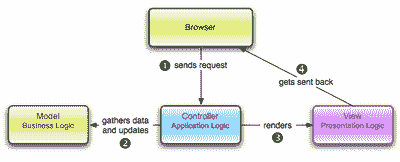
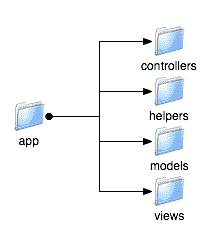

# 学习 Ruby on Rails:终极初学者教程

> 原文：<https://www.sitepoint.com/learn-ruby-on-rails-8/>

## 模型-视图-控制器体系结构

我们在《第 1 章，介绍 Ruby on Rails》中第一次遇到的模型-视图-控制器(MVC)架构并不是 Rails 独有的。事实上，它比 Rails 和 Ruby 语言都要早很多年。然而，Rails 确实将应用程序的数据、用户界面和控制逻辑分离到了一个全新的层次。

让我们看看使用 MVC 架构构建应用程序背后的概念。一旦我们有了合适的理论，我们将看到它如何转化为我们的 Rails 代码。

## 理论上的 MVC

MVC 是软件应用程序架构的一种模式。它将应用程序分为以下三个部分:

*   模型，用于处理数据和业务逻辑
*   控制器，用于处理用户界面和应用程序逻辑
*   视图，用于处理图形用户界面对象和表示逻辑

这种分离导致用户请求被如下处理:

1.  客户端上的浏览器向服务器上的控制器发送页面请求。
2.  控制器从模型中检索它需要的数据，以便响应请求。
3.  控制器呈现页面并将其发送给视图。
4.  视图将页面发送回客户端供浏览器显示。

这个过程如图 4.3 所示。

*图 4.3。在 MVC 架构中处理页面请求*

将软件应用程序分成这三个不同的组件是一个好主意，原因有很多，包括:

*   它提高了可伸缩性(应用程序增长的能力):例如，如果您的应用程序因为数据库访问缓慢而开始遇到性能问题，您可以升级运行数据库的硬件，而不会影响其他组件。
*   它使维护变得更容易:因为组件之间的依赖性很低，所以对一个组件进行更改(修复错误或更改功能)不会影响另一个组件。
*   它促进了重用:一个模型可以被多个视图重用，反之亦然。
*   它使得应用程序是可分布的:组件之间代码的明显分离意味着如果必要的话，每个组件都可能驻留在单独的机器上。

如果你还没有完全理解 MVC 的概念，不要担心。现在，重要的是记住您的 Rails 应用程序被分成三个不同的组件。如果你以后需要参考，跳回图 4.3。

## MVC 的发展之路

Rails 实现了这样一个概念，即模型、视图和控制器应该通过将每个元素的代码作为单独的文件存储在单独的目录中来保持完全分离。

*图 4.4。`app`子目录*

这就是我们在第 2 章《入门》中创建的 Rails 目录结构发挥作用的地方。现在是我们在这个结构中探索一下的时候了。如果你看一下图 4.4 中描述的`app`目录，你会看到一些文件夹，它们的名字可能听起来很熟悉。

正如您所看到的，模型-视图-控制器架构的每个组件在`app`子目录中都有自己的位置——分别是`models`、`views`和`controllers`子目录。(我们将在第 6 章，助手、表单和布局中讨论`helpers`目录。)

这种分离在组成框架本身的代码中继续存在。构成 Rails 核心功能的类位于以下模块中:

*   `ActiveRecord`–`ActiveRecord`是处理业务逻辑和数据库通信的模块。它在我们的 MVC 架构中起着模型的作用。虽然`ActiveRecord`的名字中没有“模型”这个词看起来很奇怪，但这是有原因的:活动记录也是一个著名的设计模式的名字——这个组件实现这个模式是为了在 MVC 世界中扮演它的角色。此外，如果它被称为 ActionModel，它听起来会更像一个高薪的好莱坞明星，而不是一个软件组件…
*   `ActionController`–`ActionController`是处理浏览器请求并促进模型和视图之间通信的组件。您的控制器将从该类继承。它构成了`ActionPack`库的一部分，这是一个 Rails 组件的集合，我们将在第 5 章“模型、视图和控制器”中深入探讨。
*   `ActionView`–`ActionView`是处理返回给客户端的页面的组件。视图继承自这个类，它也是`ActionPack`库的一部分。

让我们依次仔细看看这些组件。

## `ActiveRecord`(模型)

`ActiveRecord`旨在处理与数据库相关的所有应用任务，包括:

*   建立与数据库服务器的连接
*   从表中检索数据
*   在数据库中存储新数据

它还有其他一些巧妙的技巧。现在让我们来看看其中的一些。

## 数据库抽象

`ActiveRecord`附带大量数据库适配器，可连接到各种流行的数据库服务器包，如 MySQL、PostgreSQL、Oracle 和 Microsoft SQL Server。

`ActiveRecord`模块基于数据库抽象的概念。正如我们在第 1 章《Ruby on Rails 简介》中提到的，数据库抽象是一种编写应用程序的方式，它不依赖于任何一个数据库。特定于特定数据库服务器的代码被安全地隐藏在`ActiveRecord`中，并在需要时被调用。结果是，Rails 应用程序没有绑定到任何特定的数据库服务器软件。如果以后需要更改底层数据库服务器，应该不需要对应用程序代码进行任何更改。

不同供应商的代码差异很大，而`ActiveRecord`对这些代码进行了抽象，包括:

*   登录到数据库服务器的过程
*   日期计算
*   布尔(真/假)数据的处理

不过，在我向你展示`ActiveRecord`的神奇之处之前，我们需要做一点家务。

**Go to page:** [1](https://sitepoint.com/learn-ruby-on-rails-1/) | [2](https://sitepoint.com/learn-ruby-on-rails-2/) | [3](https://sitepoint.com/learn-ruby-on-rails-3/) | [4](https://sitepoint.com/learn-ruby-on-rails-4/) | [5](https://sitepoint.com/learn-ruby-on-rails-5/) | [6](https://sitepoint.com/learn-ruby-on-rails-6/) | [7](https://sitepoint.com/learn-ruby-on-rails-7/) | [8](https://sitepoint.com/learn-ruby-on-rails-8/) | [9](https://sitepoint.com/learn-ruby-on-rails-9/) | [10](https://sitepoint.com/learn-ruby-on-rails-10/)

## 分享这篇文章