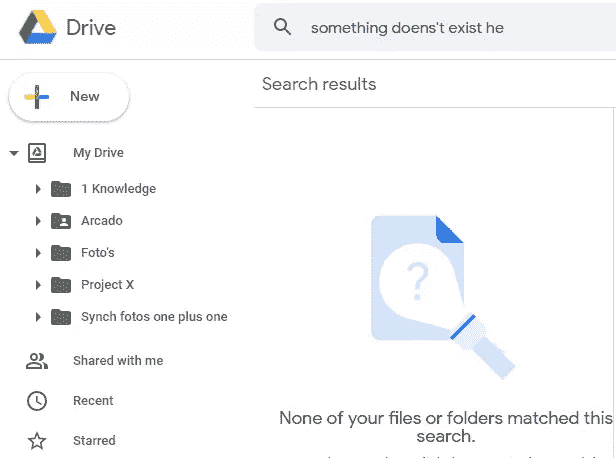
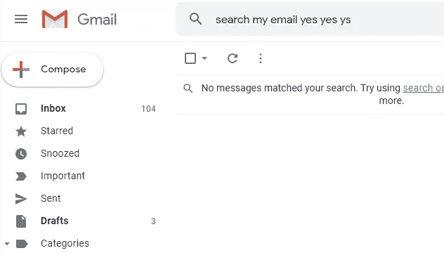
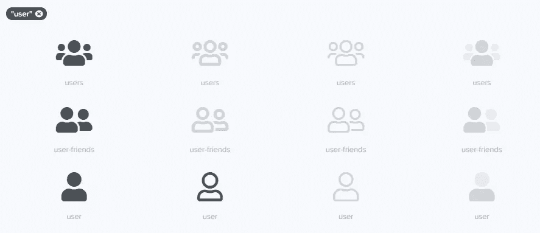

# 网页设计的可学性:5 个最佳实践

> 原文：<https://www.sitepoint.com/learnability-in-web-design/>

你有没有考虑过提高你的产品或网站的可学性？也许这是你第一次读到可学性的概念。建立一个可学习的网站不是一件容易的事情，因为它需要一些实验和 A/B 测试。

可学性的目标是设计一个清晰的界面，用户可以很快学会并理解。理想情况下，不需要文档来教育你的用户如何使用你的产品。

幸运的是，有很多技术可以创建一个可学的界面。本文向您展示了五个最佳实践，您可以用它们来为您的用户提供一个更容易学习的界面。

1.  一致性
2.  反馈
3.  坚持使用已知的 UI 元素
4.  熟悉
5.  分层

但是首先，让我们弄清楚为什么可学性很重要。

## 为什么可学性很重要？

现在，为什么可学性很重要？有各种各样的原因让你应该考虑提供一个更容易学习的用户界面。

首先，用户可以更快地采用新的界面。因此，他们可以使用您的工具更快地实现他们的目标。换句话说，他们可以从你的工具中获得更多的价值。此外，几乎不需要文档或广泛的支持中心。您的目标是通过提供清晰的界面来减少支持请求的数量。

还没完呢！想想客户体验。一个能快速学会你的工具的用户会有更好的体验。最终，用户希望在尽可能短的时间内获得价值。他们不想花很多时间去学习一种新工具。

最后，可学性对你的保持率很重要。复杂的界面会吓到用户。通常，他们会寻找更容易的替代品，为他们提供相同的价值。

现在我们已经理解了可学性的重要性，让我们来探索五个提高可学性的最佳实践。

## 1.一致性

首先，我们来讨论一下一致性的重要性。谷歌通过其材料设计实现了一致性，使其所有产品都具有相似的外观。因此，当用户在谷歌的产品之间切换时，就更容易理解新产品的工作原理。

为什么？用户以前见过这种设计，知道如何与之交互。我们来对比一下 Google Drive 和 Gmail 的界面。请注意搜索栏、菜单和操作按钮等元素在位置上的相似性。

例如，Google Drive 有一个大的“行动号召”按钮，上面有文本“新建”来创建新的文件或文件夹。如果我们将其与 Gmail 进行比较，我们会发现创建新邮件的操作按钮“撰写”是相同的。这使得不熟悉 Gmail 但经常使用 Google Drive 的用户能够快速理解这个大按钮的用途。

简而言之，一致的接口是可预测的接口。这种可预测性导致了可学习的模式。这适用于一切，从侧边栏菜单到图标用法，甚至链接颜色。

## 2.反馈

反馈是你在每本 UI 设计书中都能找到的关键词之一。反馈的最基本形式之一是超链接反馈。

超链接可以有三种不同的状态。首先，超链接处于正常状态。当用户将光标悬停在超链接上时，链接颜色会发生变化，或者用户会看到一个小的过渡动画。这个小小的反馈时刻告诉用户这个元素是可以点击的。单击超链接后，您将看到它的活动状态。同样，这是一种反馈形式，告诉用户点击请求已经收到并正在处理中。

反馈可能非常微妙。我们称之为微观互动。微交互可以采取以下形式:

*   动画或过渡效果
*   颜色变化
*   被选中的复选框

这些微交互是至关重要的，因为用户需要证据证明他们所做的影响了页面。想象一下，你点击一个按钮来提交一个表单，但是这个按钮没有提供任何反馈。换句话说，页面保持静态。我打赌你会第二次点击提交按钮，因为你没有收到任何关于你行为的证据。

因此，请友好地向您的用户提供反馈。这会让他们的体验更美好，更少困惑。

## 3.不要多此一举

与其重新发明轮子，不如利用现有的设计解决方案来增加你对设计的熟悉度。例如，汉堡包菜单是在移动设备上隐藏菜单的最佳解决方案之一。然而，没有必要设计汉堡菜单的替代品，因为每个人都知道它们是如何工作的，它们的目的是什么。

让我们来看看[里法耶特·乌代](https://dribbble.com/shots/4112206-Hamburger-Filter-Transition)的设计(如下图)。虽然不同的汉堡设计看起来很美，并且没有给原始设计增加太多的变化，但坚持原始的汉堡菜单设计仍然更好。你想避免混淆你的用户。

因此，坚持行业最佳实践。这同样适用于网站布局。坚持使用有效的和已经反复使用的方法。例如，购物车位于网站的右上角。不要大惊小怪，把你的购物车放在左下角。这只会让用户感到困惑。

重要的是要明白，当用户不理解你的界面设计时，他们通常会放弃你的网站，或者寻找能给他们提供更好用户体验的替代网站。

## 4.熟悉

熟悉度允许用户在先前知识的基础上更快地学习新界面。换句话说，熟悉利用了心智模型。用户可以将他们对一个产品的心智模型转移到一个新产品上。这意味着他们可以使用类似接口的现有知识来更快地采用新接口。

> 心智模型代表了一个人对事物如何运作的思考过程。心智模型是基于不完整的事实、过去的经验，甚至是直觉。它们有助于塑造行动和行为，影响人们在复杂情况下的注意力，并定义人们如何处理和解决新问题或界面。— Susan Carey，1986 年发表于“[认知科学与科学教育](https://psycnet.apa.org/record/1987-08644-001)”杂志的文章

此外，熟悉感创造了可靠性，帮助用户在探索和使用不熟悉的界面时感到自信。例如，如果你将谷歌的材料设计语言应用到你的网站上，用户可以识别元素，并知道如何与它们进行交互。因此，他们不害怕点击特定的按钮，因为他们知道会发生什么。对于用户来说，可靠性是消除探索新工具的恐惧的关键。

提示:使用一组常见的图标，如[字体、超棒的](https://fontawesome.com/icons?d=gallery)来增加你界面的熟悉度。

## 5.故事化

有时你想发布一个全新的产品，它需要一个颠覆性的用户界面。在这里，我们不能仅仅依靠前面的小技巧来加快学习过程。

在这种情况下，你可以通过讲故事来加快这个过程。讲故事能让你分享的信息更容易理解和记忆。更好的是，你应该使用视觉叙事而不是基于文本的叙事。用户不想通过阅读大段文字来了解一个界面。

这里什么最有效？设计一个交互式的视觉故事，引导用户通过所有重要的界面元素。尽量保持你的故事简短，只关注用户需要开始的初级元素。不需要解释高级用例。这些主题可以在其他指南中介绍。我们不想用新信息淹没用户，因为这对学习过程有相反的影响。

*注:你可以了解更多关于[故事和设计中的讲故事](https://uxdesign.cc/stories-and-storytelling-in-design-bfae7694f12a)。*

## 结论:可学性和模式识别

有许多技巧可以提高用户界面的易学性。然而，重要的是要知道以上所有的最佳实践都依赖于模式识别。因此，在设计界面时，你应该利用用户以前的知识，这样他们就能发现你界面中的模式。允许用户检测这些模式有助于他们快速学习一个不熟悉的界面。

我希望你已经认识到实现可学习性的真正价值。个人认为，关注可学性最重要的方面是改善用户体验。如今的产品是以用户为中心开发的。那么，你为什么要开发一个不考虑界面可学性因素的产品呢？你可以有一个惊人的产品，但有一个复杂的用户界面。

因此，投资一些时间来提高用户界面的可学性。你可能会惊讶于对用户体验的积极影响。

## 分享这篇文章