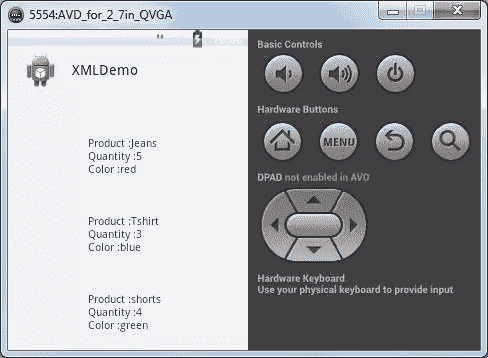

# 学习在 Android 应用程序中解析 XML 数据

> 原文：<https://www.sitepoint.com/learning-to-parse-xml-data-in-your-android-app/>

## 介绍

在我们所处的时代，通常情况下，应用程序不能完全孤立地工作，也没有完成工作所需的所有数据。它通常必须与其他一些应用程序通信(可能通过互联网),并向其读取或发送一些数据。

但是，您的应用程序与之通信的应用程序可能不是使用与您相同的技术开发的。为了在你的应用程序和其他应用程序之间顺畅地交换数据，你可以用一种开放的格式交换数据，比如可扩展标记语言或 XML。

XML 文档是人类可读的文本文档，它包含一些开始和结束标记，这些标记中包含属性和数据。大多数语言和平台都支持在其中解析和创建 XML 文档。Android 还为我们提供了 API，这样我们就可以在我们的应用程序中轻松灵活地处理 XML 文档。在本文中，我们将了解如何在 Android 应用程序中有效地处理 XML 文档。

## Android 中用于 XML 解析的类

我们可以在 Android 平台上使用各种 XML 解析器。对于 XML，Android 推荐使用`XMLPullParser`。Android 给出了`XMLPullParser`的多种实现，你可以在你的程序中使用其中的任何一种。根据您创建`XMLPullParser`的方式，将选择解析器的实现。

## 实例化您的解析器

如上所述，在 Android 中有多种方法可以创建一个`XMLPullParser`。第一种方法是使用 Xml 类，如下所示:

```
xmlpullparser parser = Xml.newPullParser();
```

你只需要调用`newPullParser`，它将返回一个对`XMLPull`解析器的引用。或者你可以从如下所示的`XmlPullParserFactory`获得参考。

```
XmlPullParserFactory pullParserFactory;
		try {
			pullParserFactory = XmlPullParserFactory.newInstance();
			XmlPullParser parser = pullParserFactory.newPullParser();
		} catch (XmlPullParserException e) {

			e.printStackTrace();
		}
```

## 解析 XML

一旦我们有了解析器引用，现在就可以用它来解析 XML 了。我们将使用下面的 XML 作为要解析的 XML。现在，在 assets 文件夹中创建一个名为`temp.xml`的文件，内容如下:

```
<?xml version="1.0" encoding="UTF-8"?>
<products>
	<product>     
		<productname>Jeans</productname>
		<productcolor>red</productcolor>
		<productquantity>5</productquantity>
	</product>
	<product>     
		<productname>Tshirt</productname>
		<productcolor>blue</productcolor>
		<productquantity>3</productquantity>
	</product>
	<product>     
		<productname>shorts</productname>
		<productcolor>green</productcolor>
		<productquantity>4</productquantity>
	</product>
</products>
```

要读取和解析的活动代码如下:

```
class Product
{

	public String name;
	public String quantity;
	public String color;

}
public class XMLDemo extends Activity {

	@Override
	protected void onCreate(Bundle savedInstanceState) {
		super.onCreate(savedInstanceState);
		setContentView(R.layout.main);

		XmlPullParserFactory pullParserFactory;
		try {
			pullParserFactory = XmlPullParserFactory.newInstance();
			XmlPullParser parser = pullParserFactory.newPullParser();

			    InputStream in_s = getApplicationContext().getAssets().open("temp.xml");
		        parser.setFeature(XmlPullParser.FEATURE_PROCESS_NAMESPACES, false);
	            parser.setInput(in_s, null);

	            parseXML(parser);

		} catch (XmlPullParserException e) {

			e.printStackTrace();
		} catch (IOException e) {
			// TODO Auto-generated catch block
			e.printStackTrace();
		}

	}

	private void parseXML(XmlPullParser parser) throws XmlPullParserException,IOException
	{
		ArrayList<product> products = null;
        int eventType = parser.getEventType();
        Product currentProduct = null;

        while (eventType != XmlPullParser.END_DOCUMENT){
            String name = null;
            switch (eventType){
                case XmlPullParser.START_DOCUMENT:
                	products = new ArrayList();
                    break;
                case XmlPullParser.START_TAG:
                    name = parser.getName();
                    if (name == "product"){
                        currentProduct = new Product();
                    } else if (currentProduct != null){
                        if (name == "productname"){
                            currentProduct.name = parser.nextText();
                        } else if (name == "productcolor"){
                        	currentProduct.color = parser.nextText();
                        } else if (name == "productquantity"){
                            currentProduct.quantity= parser.nextText();
                        }  
                    }
                    break;
                case XmlPullParser.END_TAG:
                    name = parser.getName();
                    if (name.equalsIgnoreCase("product") && currentProduct != null){
                    	products.add(currentProduct);
                    } 
            }
            eventType = parser.next();
        }

        printProducts(products);
	}

	private void printProducts(ArrayList</product><product> products)
	{
		String content = "";
		Iterator</product><product> it = products.iterator();
		while(it.hasNext())
		{
			Product currProduct  = it.next();
			content = content + "nnnProduct :" +  currProduct.name + "n";
			content = content + "Quantity :" +  currProduct.quantity + "n";
			content = content + "Color :" +  currProduct.color + "n";

		}

		TextView display = (TextView)findViewById(R.id.info);
		display.setText(content);
	}

	@Override
	public boolean onCreateOptionsMenu(Menu menu) {
		// Inflate the menu; this adds items to the action bar if it is present.
		getMenuInflater().inflate(R.menu.main, menu);
		return true;
	}

}
```

在上面的代码中，我们创建了一个名为 Product 的小类，它有三个成员:name、quantity 和 color。

在活动中，我们首先获取`XMLPullParser`实例，然后将`temp.xml`作为`inputstream`打开。一旦完成，我们设置`inputstream`作为解析器的输入。然后我们在函数`parseXML`中解析 xml。

在函数`parseXML`中，我们创建了一个`ArrayList`,其中存储了我们将从 XML 解析的所有产品。一旦完成，我们就创建一个循环，它将一直工作到文档结束。

在文档的开始，我们创建了产品的`ArrayList`。如果标签开始，如果标签是产品，我们知道现在它是一个新产品，所以我们创建一个新产品实例。然后，如果读取了其他标签，我们将只读取并添加产品实例中的值。

产品标签结束后，我们将产品添加到`ArrayList`。一旦添加了所有产品，我们就调用函数`printProducts`，在函数中我们迭代`ArrayList`，然后在屏幕上打印值。

如果我们现在运行该活动，我们将看到如下输出:



## 用于 XML 的其他解析器

### 数字正射影像图

还有其他解析器可以用来解析 Android 中的 XML。可以使用 DOM 解析器来创建 XML 的完整内存模型，并且可以用来创建或解析 XML。DOM 解析器通常会消耗大量内存。

您可以获得一个`DOMBuilder`的实例，如下所示

```
		try {
			DocumentBuilderFactory DOMfactory = DocumentBuilderFactory.newInstance();
			DocumentBuilder DOMbuilder = DOMfactory.newDocumentBuilder();

		} catch (ParserConfigurationException e) {

			e.printStackTrace();
		}
```

### sax 解析器

`SAXParsers`也可以用来解析 XML，比 DOM 解析器消耗更少的内存。`SAXParsers`只能用来解析 XML，而不能用来创建 XML。你可以得到一个`SAXParser`的引用，如下图所示:

```
SAXParserFactory SAXfactory = SAXParserFactory.newInstance();
        try {
            SAXParser SAXParserObj = SAXfactory.newSAXParser();

        } catch (Exception e) {
        	e.printStackTrace();
        }
```

## 结论

XML 文档正在成为通过互联网在应用程序之间交换数据的标准方式。随着我们的 Android 应用变得越来越智能，您的 Android 应用可能有必要通过互联网在不同应用之间进行通信和交换数据。Android 提供了一组丰富的 API 来处理 Android 应用程序中的 XML 文档。

借助这些 API，您可以轻松地将 XML 整合到您的 Android 应用程序中。XML 解析器完成解析 XML 的繁琐工作，我们只需编写代码从其中获取适当的信息并存储起来以供进一步处理。

所以，祝你在下一个 Android 应用程序中处理 XML 愉快。

如果你喜欢读这篇文章，你会爱上[可学的](https://learnable.com?utm_source=sitepoint&utm_medium=link&utm_campaign=learnablelink)；向大师们学习新技能和技术的地方。会员可以即时访问 SitePoint 的所有电子书和互动在线课程，如[开始 Android 开发](https://learnable.com/courses/beginning-android-development-1678?utm_source=sitepoint&utm_medium=link&utm_campaign=learnablelink%22)。

对这篇文章的评论已经关闭。有关于开发应用程序的问题吗？为什么不在我们的[论坛](https://www.sitepoint.com/forums/forumdisplay.php?340-Developing-For-Mobile-Devices?utm_source=sitepoint&utm_medium=link&utm_campaign=forumlink)上问呢？

## 分享这篇文章