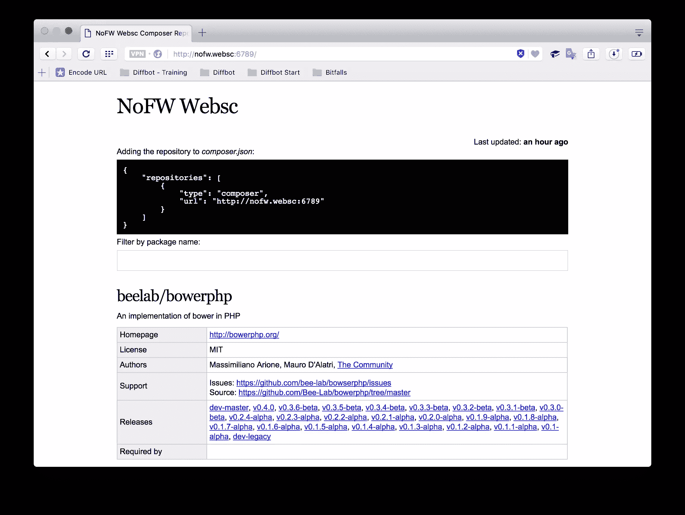
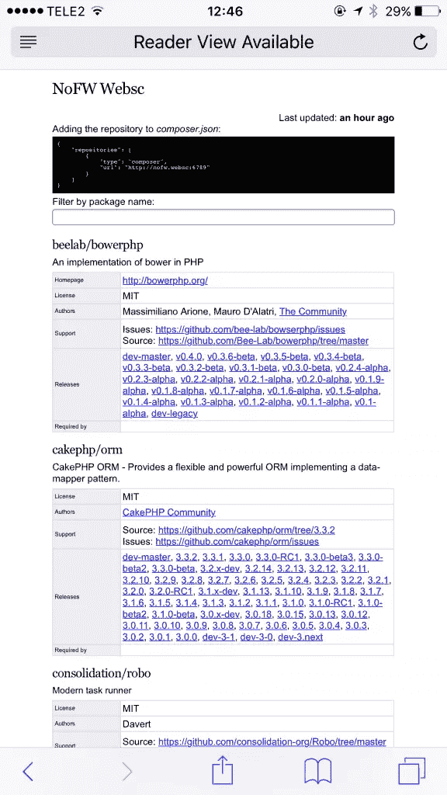
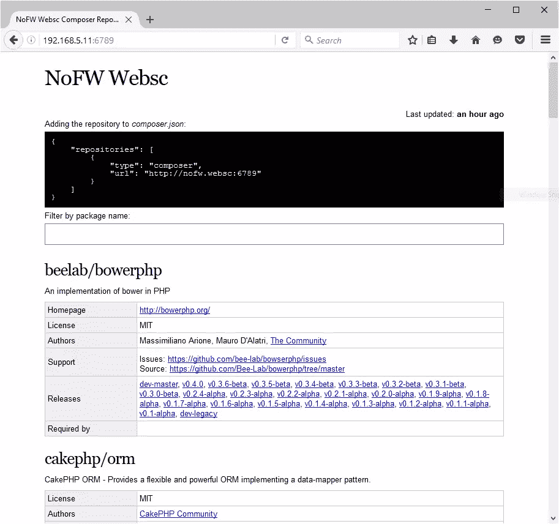

# 适合所有人的本地作曲家！一个会议友好的 Satis 设置

> 原文：<https://www.sitepoint.com/local-composer-for-everyone-a-conference-friendly-satis-setup/>

当我为网络夏令营准备技术材料时，我意识到我的工作室将依赖于一个相当稳定的互联网连接，因为我们有很多地方要覆盖，有很多软件包要安装。我选择了另一条路线，而不是依赖现场演示的神，或者预装所有东西并破坏体验。

在这篇文章中，我将向您展示如何设置一个本地 Satis 实例，并让它在当前所在的网络上托管包，这样每个连接到它的人都可以将地址放入`composer.json`作为自定义的存储库源，并在本地从您的机器上检索所有包——不需要互联网连接！


## 先决条件

由于**从来不**在我的主操作系统上安装编程相关软件的习惯(更多关于此处[的](https://www.sitepoint.com/re-introducing-vagrant-right-way-start-php/)，我照常使用[家园改进版](https://www.sitepoint.com/quick-tip-get-homestead-vagrant-vm-running/)。如果你在你的主机上安装了 PHP，或者更喜欢 Docker 或者类似的东西，请随意使用。然而，请注意，为了跨平台友好和简单起见，本教程将针对 [Homestead 改进版](https://www.sitepoint.com/quick-tip-get-homestead-vagrant-vm-running/)。

在启动虚拟机之前，请确保共享一个任意端口。这可以通过编辑`Homestead.yaml`的底部来完成。我选择 6789，这样我的本地“打包者”将被托管在`IP:6789`上，其中 IP 将是我的主机的 IP 地址。

## 萨蒂斯

在 VM 内部，在您选择的任意位置(我选择了`/home/vagrant/Code/`)安装一个新的 Satis 项目，包含:

```
composer create-project composer/satis --stability=dev --keep-vcs 
```

这将创建子文件夹`satis`。

### Satis 如何工作

Satis 接受一个`satis.json`文件，该文件告诉它要下载哪些存储库，下载这些存储库的哪些版本，下载后将它们放在哪里，等等。关于在`satis.json`中可以使用的所有选项的更全面的概述，请参见[文档](https://getcomposer.org/doc/articles/handling-private-packages-with-satis.md#options-explained)。

让我们在之前创建的`Code/satis`文件夹中创建`satis.json`。然后，在`satis.json`内部，我们放置我们需要的包。例如:

```
{
    "name": "NoFW Websc",
    "homepage": "http://nofw.websc:6789",
    "repositories": [
        { "type": "vcs", "url": "https://github.com/twigphp/Twig" },
        { "type": "vcs", "url": "https://github.com/sitepoint/Rauth" },
        { "type": "vcs", "url": "https://github.com/PHP-DI/PHP-DI" },
        { "type": "vcs", "url": "https://github.com/nikic/FastRoute" },
        { "type": "vcs", "url": "https://github.com/guzzle/guzzle" },
        { "type": "vcs", "url": "https://github.com/Respect/Validation" },
        { "type": "vcs", "url": "https://github.com/doctrine/annotations" },
        { "type": "vcs", "url": "https://github.com/thephpleague/glide" },
        { "type": "vcs", "url": "https://github.com/tamtamchik/simple-flash" },
        { "type": "vcs", "url": "https://github.com/Seldaek/monolog" },
        { "type": "vcs", "url": "https://github.com/cakephp/orm" },
        { "type": "vcs", "url": "https://github.com/Bee-Lab/bowerphp" },
        { "type": "vcs", "url": "https://github.com/markstory/mini-asset" },
        { "type": "vcs", "url": "https://github.com/natxet/CssMin" },
        { "type": "vcs", "url": "https://github.com/linkorb/jsmin-php" },
        { "type": "vcs", "url": "https://github.com/consolidation-org/Robo" },
        { "type": "vcs", "url": "https://github.com/symfony/var-dumper" },
        { "type": "vcs", "url": "https://github.com/consolidation-org/Robo" },
        { "type": "vcs", "url": "https://github.com/twigphp/Twig-extensions" }
    ],
    "require-all": true,
    "require-dependencies": true,
    "require-dev-dependencies": true,
    "archive": {
        "directory": "dist"
    }
} 
```

如您所见，这个列表很重要。根据会议连接，在一个 50 人的房间里下载所有这些内容确实过于乐观，特别是考虑到我的研讨会只是在同一互联网连接上同时举行的三个研讨会之一，还不包括酒店客人。请记住，为了定位 VCS 回购(它们可以是任何类型的)，需要它们回购的完整 URL——这就是为什么我们在这里使用 Github URLs，而不是像在典型的`require`中那样使用包名。

`require-*`值意味着所有版本及其所有依赖项都将被安装。`archive`部分确保软件包的发行版被下载到`dist`中，以便完全离线访问。

注意，我使用了一个真实的主机名作为 URL，而不是我的机器的 IP。我可以使用一个 IP，它会工作，但只在家里-在会议上，我的机器的 IP 会改变，东西会坏。你应该总是用主机名而不是 IP 来定义 URL。

一旦我们列出了我们需要的所有东西，我们就用以下内容构建本地回购:

```
php bin/satis build satis.json web/ 
```

这将读取`satis.json`文件并将所有所需版本的所有包保存到`web/`(取决于包的数量和所需版本，这可能需要一段时间)。你可能需要 Github 令牌来通过下载限制。如果是这样，请按照屏幕上的说明进行操作。

*注意，上面的设置在安装时间上绝对是**残酷的**，因为 Satis 将下载并安装所有软件包的所有版本，以及它们所有的二进制发行版。这在修改/开发这些包时很方便，但在日常使用中并不方便。我建议您定义您需要的软件包的确切版本，而不是要求“全部”。*

### 主办；主持

既然已经下载了包，我们需要将服务器指向`web`文件夹，这样就可以通过网络访问它。Composer 将通过 HTTP 从它那里下载包，所以需要安装一些基本的 web 主机。这不需要很健壮，所以一个简单的 PHP 内置 webserver 实例就可以了:

```
cd web
php -S 0.0.0.0:6789 
```

服务器现在是活动的，应该可以从主机上访问索引页面。例如，如果您添加了一个类似于`nofw.websc`的`etc/hosts`条目(这是我的会议主持人条目)，您应该能够像这样打开它:



该屏幕列出了所有已安装软件包的已安装版本，并允许您搜索它们。

如果你有一个手机连接到你的无线网络，你应该可以通过使用你的主机的 IP 地址访问同一个屏幕。在写这篇文章的时候，我的 Macbook 的 IP 地址是`192.168.5.11`，所以我可以通过`192.168.5.11:6789`访问它:



不过，这不是很有用，所以让我们试着从另一台机器上访问它，以确保它能正常工作。我试试我的 Windows 10 笔记本电脑:



果然有效。

### 使用

最后，让我们尝试在 Windows 机器上引入一些包。自然地，我也在那里使用流浪者。我将假设您已经设置了一个新的 [Homestead 改进的](https://www.sitepoint.com/quick-tip-get-homestead-vagrant-vm-running/)实例来进行试验。

一旦它启动并运行，我们需要修改虚拟机的`etc/hosts`文件，以包含我们的 repo 的“地址”——对应于`satis.json`中的地址。对我来说，那就是:

```
192.168.5.11 nofw.websc 
```

然后，按照我们的 Satis repo 主页上的说明，我们将`repositories`键添加到我们想要从我们的 Satis 服务器中提取的项目的`composer.json`文件中:

```
{
    "repositories": [
        {
            "type": "composer",
            "url": "http://nofw.websc:6789"
        }
    ],
    "config": {
        "secure-http": false
    }
} 
```

我们必须使用`secure-http: false`,因为我们从一个本地服务器提供服务，一个没有 SSL 证书的服务器。默认情况下，Composer 不允许我们通过 HTTP 安装任何东西。

现在，我们可以像往常一样要求那个项目中的包:

```
composer require twig/twig beelab/bowerphp 
```

Composer 现在应该考虑我们的新回购地址，并从那里提取:


## 解决纷争

本节将列出一些常见问题及其解决方案。

### Windows 不会打开“intranet”(192.168 . x . x)网站

这个问题可能是一个模仿主网络的 WiFi 扩展器-它复制 SSID 和密码，以允许整个房子的无缝连接。问题是，如果这些设备没有连接到同一个设备(都在路由器上，或者都在扩展器上)，这种内部网通信就不能工作。

要解决该问题，请确保所有设备都连接到同一个路由器/扩展器，例如关闭扩展器的电源。

### 连接被拒绝

确保您打开了`Homestead.yaml`中的端口，就像这样:

```
ports:
     - send: 6789
       to: 6789 
```

如果你使用的是另一个没有这个简单设置程序的 travel box，就直接修改 travel file 中的端口。

### 为什么不用 Ngrok 或者 Localtunnel？

因为 [Ngrok](https://www.sitepoint.com/use-ngrok-test-local-site/) 和 Localtunnel 需要上网，需要稳定的连接。他们只是为了与公众共享本地服务器，而不是通过 WiFi 分享东西。

## 结论

在本教程中，我们看到了在本地托管您自己所需的 Composer 包是多么容易，这样，在脱机环境或 internet 连接不稳定的环境中，每个人仍然可以连接和下载所有包。这不仅对会议有用，也是公司的“打包备份”——当 Github 停机时不会再停机！

另一个想法是用完全相同的装置组装一个小的树莓派盒子，并随身携带。这样，你就不需要承载一个沉重的流浪者形象，你仍然拥有所有你需要的包——随时准备与任何连接到你的 Wifi 的人分享。在火车上或飞机上开发，并希望与另一位同事分享您的工作成果？没问题！只要启动 RasPi 托管您的 Satis，它就可以开始了！

## 分享这篇文章