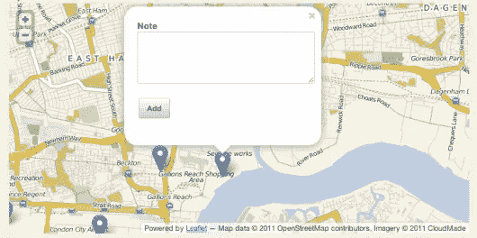
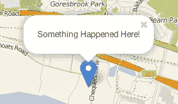

# 位置:气泡图事件

> 原文：<https://www.sitepoint.com/loccasions-bubbly-map-events/>

我希望这将是这个系列的最后一个代码(即使它可能会使用更多的代码)，我将重点放在对地图事件的反应上。在这种情况下，正在讨论的地图事件是用户与地图交互以添加事件。具体来说，我希望用户能够通过点击地图来添加一个场合。我将使用一个很酷的 map bubble 来呈现该事件的属性表单，一旦用户提交了表单，我们将把新的事件发送回服务器。很简单，对吧？

## 响应地图点击

我们需要做的第一件事是响应用户点击地图。所有这些新奇的 javacript 地图框架让这变得轻而易举。
回到第一篇文章，我已经将传单地图框架抽象为一个提供者对象。为了允许代码为地图点击事件设置一个处理程序，我将向该提供者对象添加一个`addClickHandler`事件。因为它所做的只是将调用委托给传单，所以我不打算为它写一个测试。

```
// in app/assets/lib/leafletMapProvider.js.coffee
...
addClickHandler: (map, callback) ->
  map.on('click', callback)
```

这个方法将在我们的地图视图的 render 方法中被调用:

```
// the test
// in spec/javascripts/views/mapView_spec.js
describe("render", function() {
    beforeEach(function() {
      this.mock = this.mapProviderSpy
    });
    it("should add a click handler to the map", function() {
      this.view.render();
      expect(this.mapProviderSpy.addClickHandler).toHaveBeenCalled();
    });
  });
```

```
// in app/assets/javascripts/views/map_view.js.coffee
...
render: ->
    @map = new @mapFactory.Map(@el.id)
    @mapFactory.addClickHandler(@map,@newOccasion.bind(@))
    @addBaseLayer()
    @setInitialView()
```

我们的方法变得相当繁忙，但我可以忍受。您可以看到我作为处理程序传入了一个`newOccasion`方法。这个函数将接收我们的地图事件，据我估计，它需要做两件事:

1)在地图上点击发生的位置放置一个标记。
2)展示新的场合形式。

以下是我们的测试:

```
// in spec/javascripts/views/map_view.js.coffee
describe("When a new Occasion is requested", function() {
    beforeEach(function() {
      var e = {
        latlng: {lat: 100.00, lng: 100.00}
      };
      this.view.newOccasion(e);
    });

    it("should have a form", function() {
      expect($("#new_occasion_form").length).toEqual(1);
    });

    it("should add a marker to the map", function () {
      expect(this.mapProviderSpy.addNewOccasionMarker).toHaveBeenCalled();
    });
});
```

代码是:

```
// in app/assets/javascripts/views/mapView.js.coffee
newOccasion: (e) ->
    @mapFactory.addNewOccasionMarker(@map, e)
```

我忽略了向您展示传单地图提供者上的`addNewOccasionMarker`的实现，所以它在这里:

```
// in app/assets/lib/leafletMapProvider.js.coffee
...
addNewOccasionMarker: (map, e) ->
    ll = new L.LatLng(e.latlng.lat,e.latlng.lng)
    marker = new L.Marker(ll)
    map.addLayer(marker)
```

在这一点上，如果你去一个特定的活动页面，你应该能够点击地图和标记将显示在你点击的地方。有点意思，不是吗？

添加新场合的第二部分是展示表单。我们已经有了一个在页面上创建事件的表单，但是我们不希望它出现在那里。我们希望表单出现在我们精美的地图泡泡中。为了实现我们的地图泡泡梦，我做了以下事情:

### 更改事件显示视图

事件#显示 HAML 模板当前有:

```
%div.clear
%div#edit_occasion{ :style => "display:none"}
  = form_for [@event, current_user.events.find(@event.id).occasions.build()] do |f|
    %div.coordinate_input
      = f.label :latitude
      = f.text_field :latitude
    %div.coordinate_input
      = f.label :longitude
      = f.text_field :longitude
    %div.date_field
      = f.label :occurred_at
      = f.text_field :occurred_at
    %div.note_field
      = f.label :note
      = f.text_area :note
    = f.submit "Add"
```

我将表单的 id 从“edit_occasion”更改为“edit_occasion”类。换句话说，将“#”改为“.”。

### 从 EventRouter 中删除 CreateOccasionView 调用

我在我们的 EventRouter 中创建了一个 CreateOccasionView。我不想再那样做了，所以把那个电话拿出来。

```
App.EventRouter = Backbone.Router.extend
  routes:
    ""      : "index"
  index: ->
    @occasionListView = new App.OccasionListView
      collection: window.occasionCollection or= new App.OccasionsCollection() 
    @occasionListView.render()
    @createOccasionView = new App.CreateOccasionView() # REMOVE THIS LINE
    if $('#map').length > 0
      @mapView = new App.MapView(App.MapProviders.Leaflet)
      @mapView.render()
```

### 单击地图时创建 CreateOccasionView

因为我希望视图在地图点击时显示，所以我们可以调用在创建标记的相同位置显示该视图。

```
// in app/assets/javascripts/view/mapView.js
newOccasion: (e) ->
    view = new App.CreateOccasionView()
    view.render()
    @mapFactory.addNewOccasionMarker(@map, e,view.el )
```

我将事件和视图渲染传递给地图提供者，因为我不想让我的 mapView 知道任何关于事件内容的信息。`addNewOcccasionMarker`函数将处理获取坐标和填充表单输入。诚然，这有点乱，但是我们在一个假的最后期限。

因为我们在用户每次单击时都显示表单，所以我将克隆原始表单，并将其用作每个 CreateOccasionView 的模板。

```
//in app/assets/javascripts/views/createOccasionsView.js.coffee

<p>App.CreateOccasionView = Backbone.View.extend(
  initialize: ->
    @template = $(".edit_occasion").clone().children("form").end()
    $(@el).append(@template)
    $(@el).find('div').show()
    @form = $(@el).find("form")
...
```

现在，我可以用地图事件中的纬度和经度填充表单。

```
//in app/assets/javascripts/lib/leafletMapProvider.js.coffee
...
addNewOccasionMarker: (map, e, content) ->
    ll = new L.LatLng(e.latlng.lat,e.latlng.lng)
    marker = new L.Marker(ll)
    marker.bindPopup(content)
    map.addLayer(marker)
    marker.openPopup()
    $("#occasion_latitude").val(e.latlng.lat)
    $("#occasion_longitude").val(e.latlng.lng)
    $("#occasion_occurred_at").val(new Date())
```

这个(过于)繁忙的函数正在创建我们的标记并将纬度、经度和发生日期放入表单。我可能应该对用户隐藏这些表单输入，嗯？

```
%div.edit_occasion{ :style => "display:none"}
  = form_for [@event, current_user.events.find(@event.id).occasions.build()] do |f|
    %div.coordinate</em>input
      = f.hidden_field :latitude
    %div.coordinate_input
      = f.hidden_field :longitude
    %div.date_field
      = f.hidden_field :occurred_at
    %div.note_field
      = f.label :note
      = f.text_area :note
    = f.submit "Add"
```

我也把标签拿掉了。这就是我们很酷的新表单的样子:



呜...漂亮的地图形式...

更酷的是，它有效。输入一个注释，然后点击“添加”, blammo！你有一个新的场合出现在地图上和地图旁边的列表中。骨气就是爽。

## 更多家务

我肯定你已经像疯子一样花了 45 分钟创造机会。我不能怪你，真的，这太危险太刺激了。我敢打赌，你至少说过一次，“我希望当我创造这个机会的时候，这个形式会消失。”系好安全带，斯波特，今天是你的幸运日。

让形体消失的问题让我意识到我设计的一部分是，嗯，我该怎么表达这种温柔呢…..，狗吐。首先，MapProvider 是一个 OK 的想法，但是它应该已经用我需要的所有方法返回了一个 Map 对象。当前在 MapProvider 上调用方法并传入 map 的方法是，正如我所说的，呕吐犬。

如果我曾经重构这个应用程序，我可能会从那里开始。就目前的情况而言，我需要使用当前的设计来完成这篇文章。

回到让表单消失。这很容易做到，并且给了我展示一个很酷的主干特性的机会:自定义事件。正如您可能已经猜到的，自定义事件允许您触发自己的命名事件，然后根据需要绑定到它们。我将使用它向 MapView 表明已经创建了一个事件。

CreateOccasionView 负责创建新的事件(duh ),因此我将从该视图中引发一个自定义事件，名为“map:ociocent added”

```
// in app/assets/javascripts/views/createOccasionView.js.coffee
...
createOccasion: ()->
    occasion = new App.Occasion(UTIL.parseFormAttributes(@form, "occasion").occasion)
    has_id = @form.attr("action").match(//occasions/(w*)/)
    if has_id
      occasion.id = has_id[1]
      occasion.save()
    else
      occasionCollection.create(occasion)
      $(this.el).trigger('map:occasionAdded', occasion) //THIS IS THE NEW LINE
```

只需要一行代码，我们就可以用定制事件来烹饪。我将在 MapView 中绑定到这个事件，并告诉 MapProvider (ugh)隐藏弹出窗口。

```
//in app/assets/javascripts/mapView.js.coffee

App.MapView =  Backbone.View.extend
  el: "div#map"
  events:
    "map:occasionAdded" : "handleSubmit"
...
  handleSubmit: ->
    @mapFactory.hidePopup(@map)
```

以及在地图提供程序中调用的方法:

```
// in app/assets/javascripts/lib/leafletMapProvider.js.coffee
...
 hidePopup: (map)->
    map.closePopup()
```

太好了，弹出窗口不见了，宝贝，不见了。然而，我们还有一个问题。如果您单击刚刚创建的标记，它会显示表单。我不想这样，我想让它像其他标记一样显示音符，就像这样:



事情发生了

这个问题让我想到了另一个伪 paus，我没有将地图标记绑定到场合集合。这太愚蠢了，因为这种绑定是使用 Backbone 之类的东西的全部原因。这很容易解决，因为脊椎是蜜蜂的膝盖(我认为这是件好事。)

简而言之，我将 occasionCollection 的‘add’和‘all’事件绑定到 MapView 上的方法。然后，这些方法会根据需要添加新的事件或重新生成所有标记。他们在这里:

```
App.MapView =  Backbone.View.extend
...
  initialize: (mapProvider) ->
    @mapFactory = mapProvider
    @collection = window.occasionCollection
    @collection.bind("add", @addOccasion, this)
    @collection.bind("all", @drawOccasions, this)
  drawOccasions: () ->
    self = this
    @mapFactory.removeAllMarkers(@map)
    window.occasionCollection.each((occ)->
      self.mapFactory.addOccasion(self.map,occ)
    )
  addOccasion: (occ) ->
    @mapFactory.addOccasion(@map, occ)
...
```

现在，当一个事件发生时(他们刚出生时很可爱…)地图会增加一个标记。“all”方法涵盖被删除的事件。

你越敏锐地意识到，现在，增加一个场合会在新的地点留下两个标记。因此，除了在创建事件后隐藏弹出窗口，我们还需要删除用来显示表单的地图标记。还是那句话，不算太糟。

```
App.MapProviders.Leaflet  =
...
  addOccasion: (map,occ) ->
    if not @layerGroup?
      @layerGroup = new L.LayerGroup()
      map.addLayer(@layerGroup)
    ll = new L.LatLng(
      parseFloat(occ.get("latitude")),
      parseFloat(occ.get("longitude"))
    )
    marker = new L.Marker(ll)
    marker.bindPopup(occ.get("note"))
    @layerGroup.addLayer(marker)
  addNewOccasionMarker: (map, e, content) ->
    ll = new L.LatLng(e.latlng.lat,e.latlng.lng)
    @marker = new L.Marker(ll)
    @marker.bindPopup(content)
    map.addLayer(@marker)
    @marker.openPopup()
    $("#occasion_latitude").val(e.latlng.lat)
    $("#occasion_longitude").val(e.latlng.lng)
    $("#occasion_occurred_at").val(new Date())
  hidePopup: (map)->
    map.closePopup()
    map.removeLayer(@marker)
  removeAllMarkers: (map) ->
    if @layerGroup?
      @layerGroup.clearLayers()
```

这里发生了相当多的事情:

1)我已经向提供者添加了一个`layerGroup`属性。层组是一个活页概念，允许您将一堆层(或在这种情况下，标记)组合在一起。传单 API 中的 LayerGroup 对象有一个`clearLayers()`函数，当我想清除所有标记以便重新生成它们时，这就是我所需要的。
2)在`addNewOccasionMarker()`中，我添加了另一个名为`marker`的属性，并存储了表单的“临时”标记。现在，当我想清除它时，我可以把它拿回来。
3)在`hidePopup()`中，我在隐藏弹出窗口后移除了临时标记。正如我之前提到的，清除图层组。

总而言之，这并不可怕，但是那些最后的添加确实显示了我的提供者方法中的设计流程。工厂会更好，它将是第一个重构。

## 基本场合功能

Loccasions 现在拥有我几个月前设想的所有基本功能。这不是开创性的，但它确实展示了一些很好的技术概念，我确实学到了很多。这个系列的最后一篇文章(至少是一段时间)是 next，我计划把它作为一个回顾。我会看看 Loccasions 可以去哪里，我如何可以做得更好。

我相信我会有足够的内容。

## 分享这篇文章