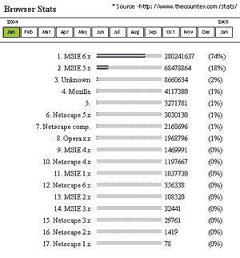

# 日志，该死的日志，和浏览器统计

> 原文：<https://www.sitepoint.com/logs-damn-logs-and-browser-statistics/>

众所周知，网页设计的永恒乐趣之一是不断与不断变化的浏览器环境进行斗争，我们的作品就发布在这个环境中。卡米诺？歌剧 6 还是 7？Safari 0.6？你所说的网景 4 是什么？

最近，[快公司](http://www.fastcompany.com/homepage/index.html)重新设计背后的人丹·塞德霍尔姆，在他的《简单比特》杂志上点燃了[一些热烈的讨论。不要担心网景 4…是时候给 Internet Explorer 5.0 轻轻拍一下肩膀了吗？](http://www.simplebits.com/notebook/2004/12/17/ie5.html)

当然，这个演讲并不是要禁止 IE 5.0，只是简化它的布局——但这在许多圈子里仍然是一个可耻的想法。

如果轶事反馈的交叉样本显示了什么，那就是网站之间令人难以置信的差异——一些评论者报告 IE5 百分比从低至 0.1%到高达 16%(哇！？..).一般来说，1.2%似乎是引用的标准数字，尽管许多人似乎无法将 IE 5.0 与 IE 5.5 区分开来——IE 5.5 是一种性能更好的浏览器。

依我看，对大多数网站来说，答案可能仍然是“不，我们还不能放弃 IE5”，但最终决定应该基于任何描述网站独特的“浏览器缩影”的现有统计数据。

尽管如此，我还是感兴趣地注意到[Counters Web Stats](http://www.thecounter.com/stats/)显示了自去年年中以来远离 IE5+的明显趋势(没有分离 ie5 & IE5.5)。据我所知，TheCounter.com 是从使用基于服务器的网络工具访问第三方网站的用户那里收集数据的——所以我怀疑这些数据特别偏向于懂技术的用户。

这里有一个他们过去 13 个月的快速汇编，以展示他们的 IE5 数字的衰减。

思考的食粮…

## 分享这篇文章