# 用 Macromedia Dreamweaver MX 构建 PHP 应用程序

> 原文：<https://www.sitepoint.com/macromedia-dreamweaver-mx/>

 ****##### 思想的结合** 

你已经听说过 Macromedia Flash，它是高质量网络动画的事实标准。但是 Flash 并不是 Macromedia 的唯一王牌——他们手中还有另一个赢家，他们的 HTML 创作工具，名为 Dreamweaver。该产品的最新版本被重新命名为 Dreamweaver MX，它不仅仅是帮助您创建 HTML 页面，它现在是 Web 开发人员的全功能快速应用程序开发(RAD)工具，它可以大大减少您编写 ASP、JSP 或 PHP 网站的时间。

大多数 RAD 工具对 PHP 的支持非常有限——这使得它们在我的电脑上成了不受欢迎的访客，因为我的大部分工作都与基于 PHP 和 MySQL 的网站有关。但是，当我接触到 Dreamweaver MX 时，我对它的特性集和功能印象深刻。当然，它没有包括我的愿望清单上的所有东西…但是很明显 Macromedia 的人已经在考虑这个问题，并且已经做出了很大的努力来解决他们工具中的 PHP 问题。

在接下来的几页中，我将探索 Dreamweaver MX 中的新 PHP 功能，希望您下次有 PHP 项目要编码时会发现它很有用。进来吧，我们走吧！

##### 勾搭

我们当前的开发环境由 Windows/Linux 网络组成，大多数开发人员在 Windows PCs 上开发代码，并部署到基于 Linux 的服务器上。Dreamweaver MX 支持这种配置，其他排列和组合也是如此，因此将工具与您的环境相匹配应该不是什么大问题。

显然，第一步是为自己准备一份工具。将你自己连接到一台高速连接的个人电脑上，登录到[http://www.macromedia.com/software/](http://www.macromedia.com/software/)，选择合适的版本和平台，参加 Macromedia 的用户调查(嘿，再也没有免费的东西了),然后给自己一份试用版。这个试用版可以工作 30 天，这段时间足够你测试这个工具，并决定它是否物有所值。

这是一个 49 兆字节的下载，所以如果你害怕或有 s-l-o-w 连接，不要尝试这个-相反，从 Macromedia 在线商店订购一份 Macromedia 评估工具包光盘。当然，它会花更长一点的时间到达你那里，但它比看着文件下载时油漆变干要好。

安装轻而易举——单击，接受许可条款(确保您阅读它们),再单击几次，您就完成了！

如果你想知道 MX 代表什么…嘿，加入这个俱乐部，因为似乎连 Macromedia 都不知道。以下是[他们的 FAQ](http://www.macromedia.com/software/mx/faq/) 对这个话题的看法:

“MX 名称不是首字母缩写，也没有直译。MX 指定的产品是主要的新版本，是 Macromedia MX 产品系列的一部分。

那不是很有趣吗？

我在这里假设你的开发机器的其余部分都已经设置好了，有一个 Web 服务器(我用的是 [Apache](http://httpd.apache.org/) )、 [PHP](http://www.php.net/) 和一个数据库服务器(MySQL 很棒，在这里得到它)。如果您没有所有这些，请进行设置，然后翻页进行 Dreamweaver MX 测试。

##### 试车

Dreamweaver MX 的界面可能会让习惯于使用普通文本编辑器进行 PHP 开发的开发人员望而生畏。以下是 Dreamweaver 工作区的快速屏幕截图:

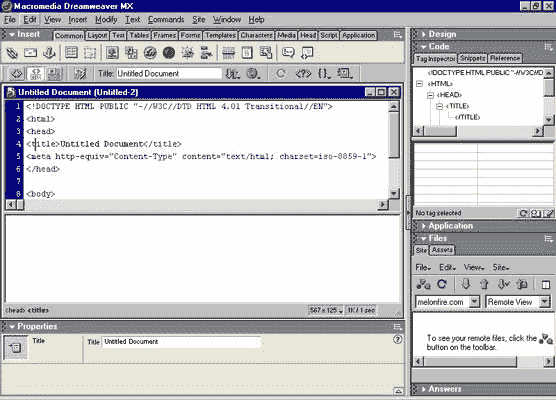

在我们进入使用 Dreamweaver MX 进行 PHP 开发的本质之前，先快速浏览一下界面。顶部是“插入”面板，单击即可插入重要的 HTML 元素，如图像、表格、超链接等。显然，Macromedia 也很小心地在这里包括对其他产品的支持…向 Dreamweaver 中创建的 HTML 文档添加 Fireworks 图像和 Flash 电影等媒体非常非常容易。


Dreamweaver 工作区的右侧包括许多可卷起的面板，每个面板执行一个非常具体的功能:

1.  The "Design" panel allows the developer to add, edit and delete CSS and HTML styles, and add "behaviors" (ready-to-use JavaScript code snippets) to an HTML document.
2.  The "Code" panel provides a handy HTML code inspector that allows you quick access to any section of your HTML document, and also provides you with reference material in case you forget the difference between a `<tr>` and a `<td>`.
3.  The "Application" panel provides you with reusable objects that can be bound to your application, and used to reduce the time you spend on code development. I’ll be talking about this in greater detail a little further down.
4.  The "Files" panel provides you with a convenient file manager to view, edit and manipulate files, on both a local or remote server.
5.  “答案”面板提供了对 Dreamweaver MX 的帮助文件和搜索引擎的快速访问。

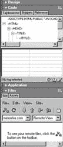

最后，工作区的底部是 Properties 面板，它允许您改变当前正在编辑的元素的属性。为了了解这是如何工作的，请尝试将“插入”面板中的图像添加到您的文档中，并注意所有相关的图像属性是如何出现在工作区底部的，这为您提供了一种更改元素属性的简单方法。


##### 破土动工

Dreamweaver MX 允许您将 Web 应用程序的静态和动态组件组织到一个称为“站点”的实体中，从而使事情变得更加简单。首先，通过 Site-> New Site 菜单创建一个新站点，并向出现的向导问好。

首先，你需要指定网站的工作目录——网站的名称、文件的根文件夹以及查找图像的默认文件夹。这些文件夹可能在您的本地计算机上，也可能在不同的计算机上——Dreamweaver 将这些数据集合称为“本地站点”。

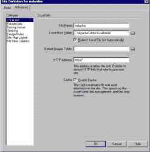

您还可以选择告诉 Dreamweaver 有关“远程站点”的信息，这通常是您的 Web 服务器运行的位置，也是您的文件最终要进行测试和部署的位置。Dreamweaver 还允许您为这样的远程站点指定访问机制 FTP、LAN、SourceSafe 等等。

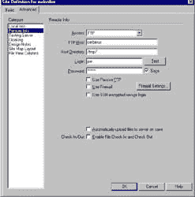

最后，如果您正在开发动态页面，您还应该指定一个“测试服务器”——这是一个 Dreamweaver 可以用来处理您的脚本并从数据库或其他地方动态生成文档的文件夹。在 Apache+PHP+MySQL 环境中，这个文件夹将与 Web 服务器上应用程序的根文件夹相同。您还可以指定一个 URL 前缀，当您尝试通过 Web 浏览器访问应用程序时会用到它。

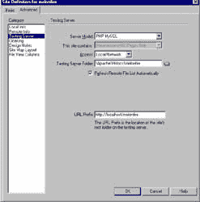

以下是我在 Dreamweaver 中创建示例站点时指定的值列表:

```
Local info:  

Site name: melonfire  

Local root folder: C:Apachehtdocsmelonfire  

Remote info:  

Access: FTP  

FTP Host: cerberus  

Login: me  

Password: **  

Testing server:  

Server model: PHP MySQL  

Access: Local/Network  

Testing server folder: C:Apachehtdocsmelonfire  

URL prefix: http://localhost/melonfire/ 
```

如果你错过了什么，这意味着我将在我的本地机器上的文件夹“C:Apachehtdocsmelonfire”中完成我的所有开发工作(Apache、PHP 和 MySQL 都可以相互交流)，并且还将通过 FTP 将文件的副本上传到一个名为“cerberus”的远程服务器上

##### 命名名称

一旦你的站点建立好了，是时候从一个简单的例子开始了——一个通过`phpinfo()`函数显示 PHP 环境设置的页面。

Dreamweaver 为您提供了一个开始构建 PHP 脚本的简单方法——弹出打开文件->新建菜单，并从预定义的模板中选择“动态页面”和“PHP”。


现在，您可以在此页面中添加对`phpinfo()`的函数调用——使用 View - > code 菜单选项切换到 Code 视图，并在您的文档中键入以下代码:

```
<?php phpinfo(); ?>
```

保存该文件，并让 Dreamweaver 通过工具栏图标(您也可以按 F12 键)为您预览该文件，此时会弹出一个新的浏览器窗口，显示脚本的输出。

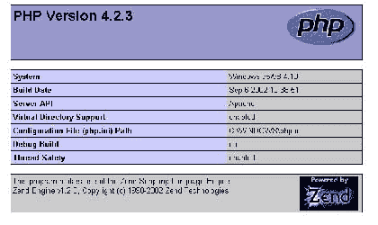

如果你正在使用 PHP，你将会进行大量的表单处理——让我们来看看如何在 Dreamweaver 中加速这个过程。首先，使用“插入”面板上的“表格”和“表单”选项卡的组合创建一个简单的、格式正确的 HTML 表单——该表单应该包含两个文本输入区域，一个名为“姓名”,另一个名为“评论”。


添加几个提交和重置按钮，表单就可以运行了。


代码如下:

```
<html>  

<head>  

<title>Untitled Document</title>  

</head>  

<body>  

<form action="this.php" method="post">  

<table width="75%" border="0">  

  <tr>  

    <td>Name</td>  

    <td><input name="name" type="text"></td>  

  </tr>  

  <tr>  

    <td>Comment</td>  

    <td><textarea name="comment" cols="" rows=""></textarea></td>  

  </tr>  

  <tr>  

    <td><input name="submit" type="submit" value="Submit"></td>  

    <td><input name="Reset" type="reset" value="Reset"></td>  

  </tr>  

</table>  

</form>  

</body>  

</html>
```

现在有趣的部分来了——将 PHP 业务逻辑集成到这个例子中。单击应该出现在“插入”面板上的“PHP”选项卡，看看它提供的功能:


非常简单:您可以插入 PHP 代码来访问 POST、GET、cookie 和会话变量、`include()`和`require()`文件，并附加像“if”和“else”语句这样的编程结构。

现在，您可能已经知道 PHP 表单处理通常是如何工作的。表单处理脚本包含两个逻辑块——一个显示空表单，另一个处理用户提交的输入。因此，首先要做的是在代码顶部插入一个“if”条件语句，只需单击“If”按钮，Dreamweaver 就会为您完成:

```
<?php if  ?>   

// form code
```

接下来，您需要通过“submit”表单变量检查表单是否已经提交。使用“表单变量”按钮，围绕 Dreamweaver 为您插入的内容编写一些代码:

```
<?php if (!$HTTP_POST_VARS['submit']) { ?>   

// form code
```

一旦将空表单包装在条件的“if”分支中，就需要将表单处理逻辑添加到“else”分支中。使用工具栏上的“else”按钮，让 Dreamweaver 为您插入它。

```
<?php } else { ?>
```

这个脚本的“else”分支应该仅仅显示用户输入的数据。您可以通过`echo()`命令来完成，也可以通过 PHP 工具栏上的按钮来访问。

```
<?php echo $HTTP_POST_VARS['name']; ?>
```

这是最终的脚本:

```
<html>   

<head>   

<title>Untitled Document</title>   

<meta http-equiv="Content-Type" content="text/html; charset=iso-8859-1"> </head>   

<body>   

<?php if (!$HTTP_POST_VARS['submit']) { ?>   

<form action="this.php" method="post">   

<table width="75%" border="0">   

  <tr>   

    <td>Name</td>   

    <td><input name="name" type="text"></td>   

  </tr>   

  <tr>   

    <td>Comment</td>   

    <td><textarea name="comment" cols="" rows=""></textarea></td>   

  </tr>   

  <tr>   

    <td><input name="submit" type="submit" value="Submit"></td>   

    <td><input name="Reset" type="reset" value="Reset"></td>   

  </tr>   

</table>   

</form>   

<?php } else { ?>   

<table width="75%" border="1" cellspacing="5" cellpadding="5">   

  <tr>    

    <td width="39%">Name</td>   

    <td width="61%"><?php echo $HTTP_POST_VARS['name']; ?></td>   

  </tr>   

  <tr>    

    <td>Comments</td>   

    <td><?php echo $HTTP_POST_VARS['comment']; ?></td>   

  </tr>   

</table>   

<?php } ?>   

</body>   

</html>
```

现在，如前所述，您可以使用“Preview”按钮轻松测试这段代码。以下是输出结果:

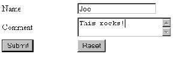


应该注意的是，Dreamweaver 试图使 PHP 脚本编写成为一种点击式的练习，正如上面的例子所展示的那样，并不是完全成功——PHP 工具栏上提供的功能非常有限，大多数开发人员会发现自己键入 PHP 语句比点击 PHP 选项卡上的按钮更有效。不过，不要失望——虽然这个程序在这个任务上失败了，但在构建数据库驱动的动态页面方面它表现出色(下一页将详细介绍)。

一旦您对脚本的工作方式感到满意，您就可以将文件传输到您的远程服务器(在本例中命名为“cerberus”)。打开工作区右侧的“文件”面板，选择“本地视图”，使用箭头按钮将文件从本地站点传输到远程站点。

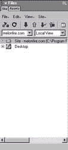

您也可以执行另一个方向的传输，方法是切换到“远程视图”并向/从服务器上传或获取文件。

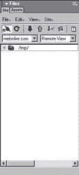

##### 把数据库带进来

Dreamweaver MX 最酷的特性之一是能够构建一个动态数据库驱动的网站，而无需自己编写一行 PHP 代码。在接下来的几页中，我将演示如何让 Dreamweaver 完成编写 PHP 代码的艰苦工作，从而允许您查看、添加和删除 MySQL 表中的记录。

假设我有一个名为“user”的数据库表，如下所示。

```
 mysql> SELECT * FROM user;    

+----+----------+------------------+    

| id | username | password         |    

+----+----------+------------------+    

|  3 | merrill  | 2fda14e52bde1a87 |    

|  4 | pooja    | 0d53926314545f3c |    

|  5 | john     | 2ca0ede551581d29 |    

|  6 | joe      | 7b57f28428847751 |    

|  7 | tom      | 675bd1463e544441 |    

|  8 | bill     | 656d52cb5d0c13cb |    

+----+----------+------------------+    

6 rows in set (0.05 sec)
```

现在，Dreamweaver MX 的内置功能允许您自动执行在表中列出记录、添加新记录、修改现有记录和删除记录的过程，所有这些都只需最少的手工编码。

首先要处理的是数据库连接。Dreamweaver MX 完成了打开、管理和关闭数据库连接的繁重工作——您需要做的只是弹出“应用程序”面板(在工作区的右侧),单击“数据库”选项卡，点击带有加号(+)的按钮，然后从选项列表中选择“MySQL 连接”。

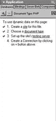

您应该会看到以下对话框:

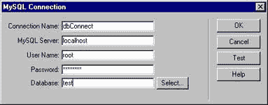

此框允许您指定数据库服务器的访问信息。对于此示例，创建一个名为“dbConnect”的连接，并向 Dreamweaver 提供访问数据库服务器所需的用户名和密码，以及要使用的数据库的名称。

一旦创建了连接，Dreamweaver 将自动向您的站点目录添加一组脚本；这些将用于所有后续的数据库交互。如果连接创建成功，您应该能够在“应用程序”面板的“数据库”选项卡中查看所有的表(以及兼容数据库的视图和存储过程)。

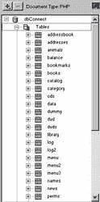

创建了数据库连接后，下一步是编写一个脚本，列出表中的所有记录。使用“应用程序”面板的“绑定”选项卡创建一个“记录集”对象(再次单击带加号的按钮进入该选项)，您将获得一个简单的类似向导的界面，允许您从数据库中检索一组记录。

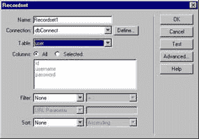

填写完必要的信息后——注意，您还可以对结果进行排序和过滤——点击“测试”按钮，查看是否一切正常。如果是的话，保存你的设置，你会在“应用程序”面板的“绑定”标签中看到一个新的项目，引用你新创建的记录集。

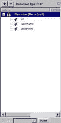

您可以自定义通过该向导中的“高级…”按钮创建的 SQL 查询。

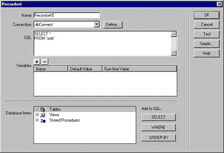

##### 外表决定一切

现在，回到编辑器，决定如何显示记录集中返回的数据。我喜欢保持简单，所以我只创建了一个用户列表，

```
<ul>     

<li></li>     

</ul>
```

然后将列从“应用程序”面板中的记录集对象拖到页面上我希望显示数据的适当位置(Dreamweaver 为我编写了代码)。

```
<ul>     

<li><?php echo $row_Recordset1['username']; ?></li>     

</ul>
```

当您在浏览器中预览它时，您应该会看到类似这样的内容:


很酷吧。我使用简单的点击操作管理所有这些，不需要了解 PHP 的 MySQL API 或记住复杂的函数语法。

当然，这个例子还有些不完整——它只显示了第一条记录。我们真正需要的是 SQL 查询返回的整个记录集。为了满足这一要求和其他要求，Dreamweaver 包含了各种不同的“服务器行为”，可用于为应用程序添加额外的功能。

为了查看这是如何工作的，在编辑器中选择新创建的列表的第一项，

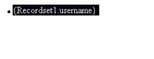

pop 打开“应用”面板的“服务器行为”标签，从下拉选项列表中选择“重复区域”行为，告诉它有多少记录就循环多少次。

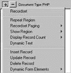


Dreamweaver 将自动插入 PHP 代码，该代码迭代返回的 Recordset 对象并打印返回的整个记录集。这是代码，

```
<ul>     

  <?php do { ?>     

  <li><?php echo $row_Recordset1['username']; ?></li>     

  <?php } while ($row_Recordset1 = mysql_fetch_assoc($Recordset1)); ?> </ul>
```

这是输出结果:

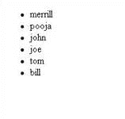

Dreamweaver 附带了一整套其他类似的行为来满足大多数常见的要求，例如，您可以轻松地显示找到的记录总数，使用下一个和上一个链接实现分页，或者根据记录集指针的当前位置动态显示页面的各个部分。

##### 进进出出

好了，这就是显示记录的方法——现在我们来看看插入和删除记录怎么样？

首先，使用 Dreamweaver 编辑器创建一个 HTML 表单，该表单映射到“user”表的列。


准备好表单后，应用“插入记录”服务器行为，您将看到如下对话框:

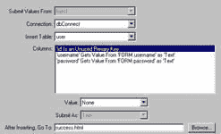

此对话框使得将表单域映射到要插入数据的表格变得非常容易。一旦选择了适当的数据库连接和表，就会显示该表的字段；这些字段可以通过“值”下拉列表映射到表单中的特定字段。Dreamweaver 负责编写将用户在每个字段中输入的数据插入表中相应列所需的 SQL 查询。

将表单域映射到表列后，请记住指定数据成功插入数据库后浏览器将被重定向到的 URL。

完成后，保存 PHP 脚本并通过浏览器访问它。您应该会看到您创建的 HTML 表单:

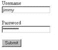

输入一些值并提交表单。Dreamweaver MX 生成的代码会将值插入到“user”表中，然后将浏览器重定向到选定的 URL 所有这一切都无需开发人员编写一行代码！

删除记录也一样简单——创建一个新的 PHP 脚本并使用“删除记录”服务器行为。您将看到下面的对话框，它要求您指定在标识要删除的记录时脚本应该使用的变量。

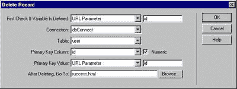

如您所见，在上面的示例中，我已经告诉 Dreamweaver 在 URL 字符串中查找“id”变量，并删除“user”表中与该 ID 对应的记录。保存脚本(我假设它叫做“delete.php”)，并通过您的浏览器访问它(记得将“id”变量值对添加到 URL 字符串中，比如:http://your.server/delete.php?id=15)，对应于所提供的 id 的记录应该从数据库中删除。

显然，现在很容易将上面的三个脚本相互链接起来，从而构建一个原始的、功能齐全的用户管理模块(如果您想知道，是的，Dreamweaver 还提供了一个“更新记录”行为——我将把它留给您去试验。)

##### 我，机器人

除了记录集绑定之外，Dreamweaver 还可以轻松创建到其他变量的绑定——您可以在“应用程序”面板的“绑定”选项卡中注册变量名，然后只需将这些变量名从面板拖放到代码编辑器 wbenever 中，就可以对它们进行操作；Dreamweaver 自动编写 PHP 代码，将变量的当前值回显到标准输出中。

例如，考虑下面的例子，在这个例子中，我向 Dreamweaver 的“Bindings”选项卡添加了三个表单变量、一个会话变量和一个服务器变量。

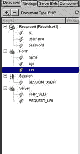

我现在可以在我的 PHP 脚本中访问任何这些变量，只需将它们从“Bindings”选项卡拖到编辑器窗口中——Dreamweaver 自动将 PHP 代码写到屏幕上的变量的当前值。

如果您在应用程序的不同脚本中使用大量的公共变量——会话变量就是一个很好的例子——这种拖放功能可以为您节省大量的重复输入。这总是一件好事。现在，如果 Dreamweaver 能够在我创建变量时自动跟踪它们，并自动将它们添加到“绑定”选项卡，而无需我手动注册它们，该多好啊…

##### 编织网络

关于前几页的示例，值得注意的是，我能够非常快速地执行它们，没有实际的 PHP 函数调用手动编码——Dreamweaver 完成了大部分繁重的工作，我只需点击菜单和对话框。如果您是 PHP 新手，或者只是在寻找一个 RAD 工具来快速开发基本的 PHP 应用程序，Dreamweaver MX 及其内置的行为可能就是让您在尽可能短的时间内启动并运行的入场券。

也就是说，虽然 Dreamweaver MX 代表了 Macromedia 对 PHP 开发人员的支持的一个明确的发展，但该程序肯定不是完美的。在 Dreamweaver MX 中，有助于使 PHP 编码体验更加愉快的东西包括:自动语法检查、自动代码完成、自动变量注册和绑定、更多的内置行为、更强大的 PHP 工具栏功能以及对相关插件应用程序(如 Zend Optimizer)的支持。也许下次吧…

有关 Dreamweaver MX 的更多信息，请访问以下链接:

*   [Macromedia 设计者和开发者中心(PHP 部分)](http://www.macromedia.com/desdev/topics/php.html)
*   【Dreamweaver MX 入门教程
*   《Dreamweaver MX:PHP Web Development》的官方网站，这本书教 Web 专业人员如何使用 Dreamweaver MX 制作 PHP 支持的网站。
*   [扩展 Dreamweaver MX 和 PHP:用于 Dreamweaver MX 的 PHP 登录套件](http://www.dreamweavermxsupport.com/extensions/phploginsuite/)，它包含 16 个服务器行为和 2 个对象，旨在允许您快速、轻松地为网站创建 MySQL 支持的身份验证系统。

下次见…乖！

*注意:本文中的所有示例都已经在 Windows (8 和 Macromedia Dreamweaver MX 试用版上进行了测试。这些示例仅用于说明，并不适用于生产环境。Melonfire 对本文中描述的源代码不提供任何担保或支持。YMMV！*
<font size="1" color="#aaaaaa" face="Verdana,Arial,Helvetica">版权所有[梅龙菲尔](http://www.melonfire.com/)，2000 年。保留所有权利。</font>

## 分享这篇文章**