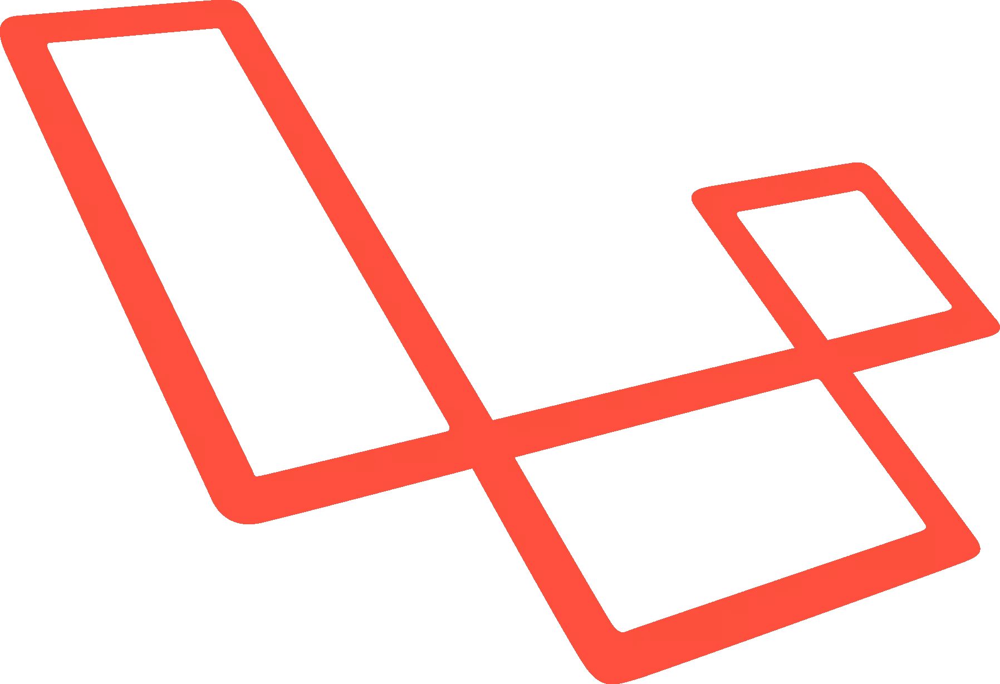
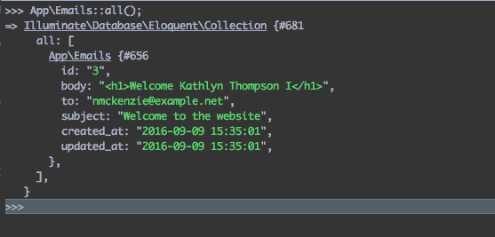

# Laravel 5.3 中的邮件日志:扩展邮件驱动程序

> 原文：<https://www.sitepoint.com/mail-logging-in-laravel-5-3-extending-the-mail-driver/>

*本文由 [Viraj Khatavkar](https://github.com/viraj-khatavkar) 进行了同行评审。感谢 SitePoint 的所有同行评审员使 SitePoint 的内容尽可能做到最好！*

Laravel 提供的许多好处之一是邮寄。您可以通过多种流行的服务轻松配置和发送电子邮件，它甚至包括一个用于开发的日志助手。

```
Mail::send('emails.welcome', ['user' => $user], function ($m) use ($user) {
    $m->to($user->email, $user->name)->subject('Welcome to the website');
}); 
```

这将向网站上使用`emails.welcome`视图的新注册用户发送一封电子邮件。Laravel 5.3 使用[邮件](https://laravel.com/docs/5.3/mail)变得更加简单(但是旧的语法仍然有效)。



这里有一个例子:

```
# Generate a new mailable class
php artisan make:mail WelcomeMail 
```

```
// app/Mail/WelcomeMail.php

class WelcomeUser extends Mailable
{

    use Queueable, SerializesModels;

    public $user;

    public function __construct(User $user)
    {
        $this->user = $user;
    }

    public function build()
    {
        return $this->view('emails.welcome');
    }
} 
```

```
// routes/web.php

Route::get('/', function () {
    $user = User::find(2);

    \Mail::to($user->email)->send(new WelcomeUser($user));

    return "done";
}); 
```

Laravel 还为在开发阶段使用`log`驱动程序发送邮件，以及在生产阶段使用`smtp`、`sparkpost`、`mailgun`等发送邮件提供了一个良好的起点。这在大多数情况下似乎没问题，但它不能涵盖所有可用的服务！在本教程中，我们将学习如何扩展现有的邮件驱动系统来添加我们自己的。

为了让我们的例子简单明了，我们将把我们的电子邮件记录到一个 DB 表中。

## 创建服务提供商

实现这一点的首选方法是创建一个服务提供者，在启动时与我们的应用程序交互并注册我们的服务。让我们从使用 artisan 命令行助手生成一个新的服务提供者开始。

```
php artisan make:provider DBMailProvider 
```

这将在我们的`app/Providers`文件夹中创建一个新类。如果你熟悉 Laravel 服务提供者，你会知道我们扩展了`ServiceProvider`类并定义了`boot`和`register`方法。您可以在[文档](https://laravel.com/docs/5.3/providers)中了解更多关于提供商的信息。

## 使用邮件提供商

我们可以走捷径，扩展现有的`Illuminate\Mail\MailServiceProvider`类，而不是使用父服务提供者类。这意味着`register`方法已经实现。

```
// vendor/Illuminate/Mail/MailServiceProvider.php

public function register()
{
    $this->registerSwiftMailer();

    // ...
} 
```

`registerSwiftMailer`方法将根据`mail.driver`配置值返回适当的传输驱动程序。我们在这里可以做的是在调用`registerSwiftMailer`父方法之前执行检查，并返回我们自己的*传输管理器*。

```
// app/Providers/DBMailProvider.php

function registerSwiftMailer()
{
    if ($this->app['config']['mail.driver'] == 'db') {
        $this->registerDBSwiftMailer();
    } else {
        parent::registerSwiftMailer();
    }
} 
```

## 使用传输管理器

Laravel 解析来自 IOC 的`swift.mailer`实例，IOC 应该返回一个 [SwiftMailer](https://www.sitepoint.com/sending-email-with-swift-mailer/) 的`Swift_Mailer`实例。我们需要将 Swift mailer 实例绑定到容器。

```
private function registerDBSwiftMailer()
{
    $this->app['swift.mailer'] = $this->app->share(function ($app) {
        return new \Swift_Mailer(new DBTransport());
    });
} 
```

您可以将传输对象视为实际的驱动程序。如果您检查`Illuminate\Mail\Transport`名称空间，您会发现每个驱动程序都有不同的传输类(比如:`LogTransport`、`SparkPostTransport`等)。).

`Swift_Mailer`类需要一个`Swift_Transport`实例，我们可以通过扩展`Illuminate\Mail\Transport\Transport`类来满足它。它应该看起来像这样。

```
namespace App\Mail\Transport;

use Illuminate\Mail\Transport\Transport;
use Illuminate\Support\Facades\Log;
use Swift_Mime_Message;
use App\Emails;

class DBTransport extends Transport
{

    public function __construct()
    {
    }

    public function send(Swift_Mime_Message $message, &$failedRecipients = null)
    {
        Emails::create([
            'body'    => $message->getBody(),
            'to'      => implode(',', array_keys($message->getTo())),
            'subject' => $message->getSubject()
        ]);
    }

} 
```

这里我们应该实现的唯一方法是`send`方法。它负责邮件发送逻辑，在这种情况下，它应该将我们的电子邮件记录到数据库中。至于我们的构造函数，我们可以暂时让它为空，因为我们不需要任何外部依赖。

`$message->getTo()`方法总是返回收件人的电子邮件和姓名的关联数组。我们使用`array_keys`函数获取邮件列表，然后将它们分解成一个字符串。

## 将电子邮件记录到数据库

下一步是为我们的数据库表创建必要的迁移。

```
php artisan make:migration create_emails_table --create="emails" 
```

```
class CreateEmailsTable extends Migration
{

    /**
     * Run the migrations.
     *
     * @return void
     */
    public function up()
    {
        Schema::create('emails', function (Blueprint $table) {
            $table->increments('id');
            $table->text('body');
            $table->string('to');
            $table->string('subject');
            $table->timestamps();
        });
    }

    /**
     * Reverse the migrations.
     *
     * @return void
     */
    public function down()
    {
        Schema::dropIfExists('emails');
    }
} 
```

我们的迁移仅包含电子邮件正文、主题和收件人电子邮件，但是您可以添加任意多的详细信息。检查`Swift_Mime_Message`类定义，查看可用字段列表。

现在，我们需要创建一个新的模型来与我们的表进行交互，并将必要的字段添加到可填充数组中。

```
php artisan make:model Emails 
```

```
class Emails extends Model
{

    protected $fillable = [
        'body',
        'to',
        'subject'
    ];
} 
```

## 发送电子邮件

好了，是时候测试一下我们目前的成果了。我们首先将提供者添加到`config/app.php`文件中的提供者列表中。

```
return [
    // ...

    'providers' => [
        // ...

        App\Providers\DBMailProvider::class,

        // ...
    ],

    // ...
]; 
```

然后，我们将邮件驱动程序注册到`config/mail.php`文件中的`db`。

```
return [
    'driver' => 'db',

    // ...
]; 
```

唯一剩下的部分是发送一封测试邮件，并检查它是否被记录到数据库中。当主页网址被点击时，我将发送一封电子邮件。这是代码。

```
// routes/web.php

Route::get('/', function () {
    $user = User::find(2);

    Mail::send('emails.welcome', ['user' => $user], function ($m) use ($user) {
        $m->to($user->email, $user->name)->subject('Welcome to the website');
    });

    return "done";
}); 
```

在到达主路径后，我们可以运行`php artisan tinker`命令来检查 emails 表记录。



## 结论

在本文中，我们看到了如何扩展邮件驱动系统来拦截电子邮件以进行调试。我欣赏 Laravel 的一点是它无与伦比的可扩展性:你可以改变或扩展几乎任何功能，从路由器和 IOC，到邮件等等。

如果您有任何问题或意见，请务必在下面发布，我将尽我所能回答您！

## 分享这篇文章