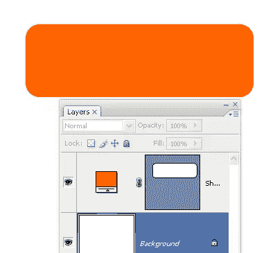
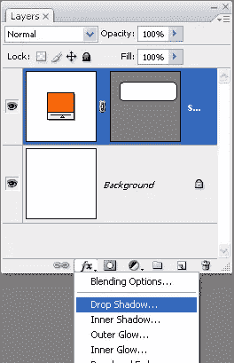
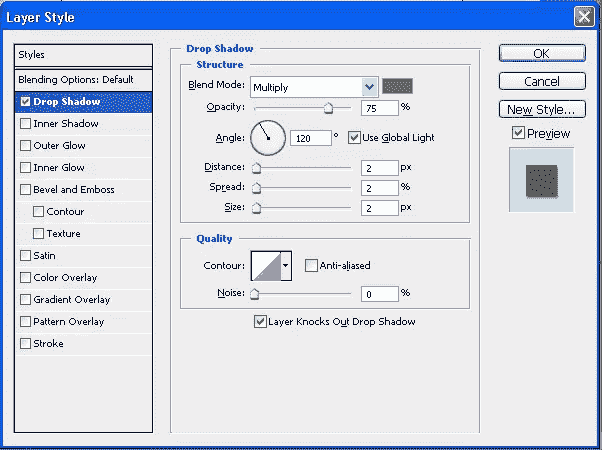
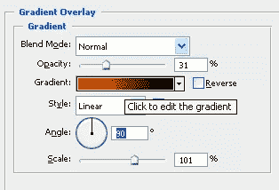
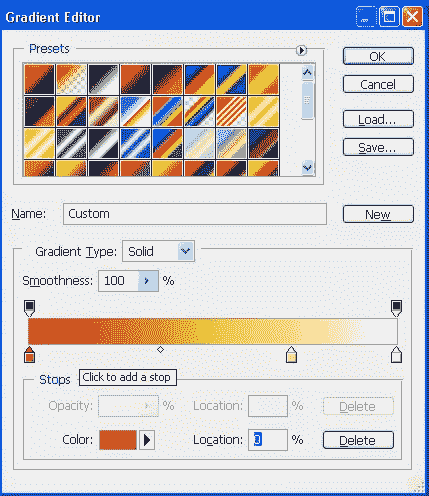
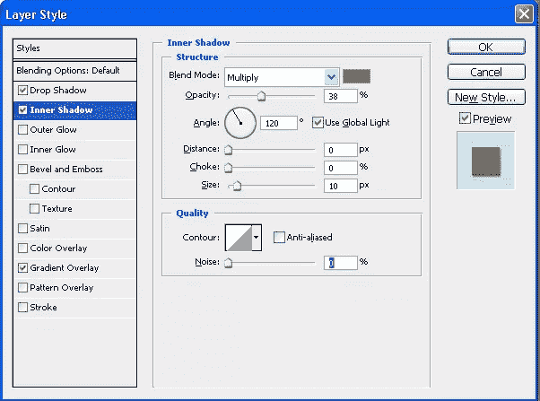
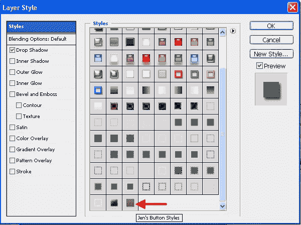
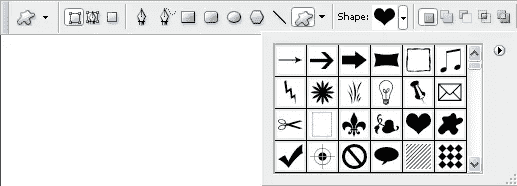

# 在 Photoshop 中制作一个大而漂亮的行动号召按钮

> 原文：<https://www.sitepoint.com/make-a-big-beautiful-call-to-action-button-in-photoshop/>

昨天，我发表了一篇关于[创建行动号召](https://www.sitepoint.com/5-tips-for-creating-an-effective-call-to-action-button)按钮的指南。今天我们要用 Photoshop 做一个。我在这里使用了一些相当明亮的颜色，但是当然你可以改变按钮来适应你自己网站的风格和颜色。让我们开始吧。

1.在 Photoshop 中创建一个新文档，400 x 400 像素。

2.选择圆角矩形形状工具(点击键盘上的 **Shift U** 来循环选择形状工具)，在工具选项栏中选择“形状图层”，设置半径为 20px，选择你喜欢的颜色。

3.画一个长方形。在图层面板中，你会看到一个新图层，上面有一个矩形，旁边有一个矢量蒙版缩略图。

4.我们将添加一些样式到我们的矩形，使它看起来更有趣。确保矩形图层被选中，然后点击图层面板底部的 Fx 图标。从下拉菜单中选择投影。

5.我选择了以下设置。混合模式=乘法，颜色=中灰#666666，距离= 2，扩散= 2，大小= 2。单击“确定”进行应用。

6.再次点击图层面板上的图层样式图标，从下拉菜单中选择渐变叠加。Photoshop 提供了大量预先制作的渐变，但我们将为这个按钮制作自己的渐变。直接点击渐变下拉框(不是三角形)来编辑渐变。

在这种情况下，我为左边的第一个色阶选择了深橙色，为中间选择了黄色，为第三个色阶选择了白色。(要添加色标，只需点击渐变下方。)

此时，按钮看起来像这样。渐变和阴影是微妙的，但已经比我们开始的普通矩形看起来好得多。

7.下一个要添加的样式也很微妙。我们需要一点内部阴影，所以从图层效果对话框中选择。我使用了以下设置:混合模式=乘法，颜色= #666666，距离= 0，大小= 10px，不透明度设置为 35%左右。

按钮现在看起来像这样。

所以我会把它和风格放在一起。你可以添加一个笔触或颜色覆盖，只是玩，直到你找到你喜欢的外观。

重要的东西:如果你已经创建了一个按钮，或者任何其他有许多样式的层，保存这些样式是一个好主意，这样你就可以再次使用它们，而不必经历以上所有的步骤。所以在你点击图层样式对话框上的确定之前，点击新建样式，给你的样式起一个名字并保存它。

****

**当你想再次使用它时，打开图层样式对话框，点击左上角的 word Styles(是的那是一个按钮！)你会在那里看到所有预制的和你自己的风格。**

****

8.好了，现在添加一些文字。选择文字工具，然后选择您喜欢的字体。我用 Avenir 重型，38 码的“现在注册”和 Avenir 中型，18 码跟踪 50 的标语。确保你的文本和按钮都对齐。我给“注册”添加了一个阴影，距离= 1，大小= 5，所以文本现在看起来像这样:

我认为这看起来相当聪明和引人注目。您可以通过添加图像或图标来使按钮更加精致。不过要保持简单。

我喜欢 Firefox 和 Thunderbird 的下载按钮和它们使用的图标，但是我不打算画出来。我会添加一个 Photoshop 的形状。

9.选择自定义形状工具，并从工具选项栏的下拉框中选择所需的形状。我选择了一颗心，因为我爱我网站的所有访问者。

10.将形状拖出，放在按钮的左侧。我将形状颜色设置为浅蓝色，作为橙色按钮的互补色和对比色。我像以前一样添加了阴影和微妙的渐变叠加。现在形状占据了按钮区域的一部分，你需要将文本向右移动一点，给它一些喘息的空间。我的最后一个按钮是这样的。

**相关阅读:**

*   [创建行动号召按钮的 5 个技巧](https://www.sitepoint.com/5-tips-for-creating-an-effective-call-to-action-button)

## 分享这篇文章