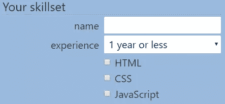

# 使用 Flexbox 让表单变得有趣

> 原文：<https://www.sitepoint.com/make-forms-fun-with-flexbox/>

对深入研究 Flexbox 感到好奇？查看前端开发和大会伦敦教师 Guy Routledge 的 Flexbox 课程中的[主 CSS 布局。它适用于所有 SitePoint 成员。观看我们下面课程的视频样本。](https://www.sitepoint.com/premium/courses/flexbox-2950)

我来澄清一下: *HTML 表单很少有趣*——但它们是 web 开发的必要部分。幸运的是，CSS flexbox 可以缓解一些历史难题。

考虑在没有 flexbox 的情况下，表单通常是如何编码的*。你会对以下字段使用什么 HTML 标记？*



我们通常会这样使用加价:

```
<div>
  <label for="name">name</label>
  <input id="name" name="name" type="text" />
</div>

<div>
  <label for="experience">experience</label>
  <select id="experience" name="experience"><!-- options --></select>
</div>

<div>
  <input id="html" name="html" type="checkbox" />
  <label for="html">HTML</label>
</div>

<div>
  <input id="css" name="css" type="checkbox" />
  <label for="css">CSS</label>
</div>

<div>
  <input id="javascript" name="javascript" type="checkbox" />
  <label for="javascript">JavaScript</label>
</div>
```

当您开始应用 CSS 样式时，会出现许多问题:

1.  标签和字段的 HTML 源代码顺序不一致，取决于类型。标签通常出现在字段之前，但最好出现在复选框和单选按钮之后。如果您更改类型，您必须重新订购您的加价。
2.  一致地对齐和调整输入、文本区域和选择框可能很困难。大多数都有默认的样式，在一些浏览器中很难改变。
3.  将标签与其字段对齐需要反复试验才能获得正确的定位。
4.  (目前)当标签第一次出现时，不可能根据字段的激活或内容状态来设计标签的样式。

Flexbox 可以解决这些问题。我们可以使用干净一致的 HTML，其中标签放在每个字段之后，并且没有必要添加 helper CSS 类。

## 什么是 Flexbox？

Flexbox 是一种在页面上布局多个元素的神奇方式。它们可以相对于其他元素水平对齐、垂直对齐、有序对齐、反转和调整大小。Flexbox 可能会令人困惑，甚至在使用了几个月之后，您还需要不时地查阅文档。然而，支持 flexbox 的最基本的 CSS:

```
.container {
  display: flex;
}
```

就是这样。`.container`的所有子元素现在都是 flexbox 项目，默认情况下，它们将自己调整为一行。

flexbox 和网格系统(比如新的 [CSS 网格模块](https://www.sitepoint.com/introducing-the-css-grid-layout/))的主要区别在于 flexbox 是一维的。Flexbox 项目排成一行，并在必要时进行包装。网格是二维的，具有定义的列和不换行的行。

Flexbox 不如 grid 强大，但是它非常适合布局更小的组件，比如导航菜单、列表和表单域。

Flexbox 工具和资源:

*   [flexbox 在 5 分钟内完成](http://flexboxin5.com/)
*   [Flexbox Froggy](http://flexboxfroggy.com/)
*   [由 Flexbox 解决](https://philipwalton.github.io/solved-by-flexbox/)
*   [Flexbox 游乐场](http://codepen.io/enxaneta/full/adLPwv/)
*   [flexplorer](http://bennettfeely.com/flexplorer/)
*   [使用 CSS 柔性盒的 MDN](https://developer.mozilla.org/docs/Web/CSS/CSS_Flexible_Box_Layout/Using_CSS_flexible_boxes)
*   [z 轴和自动页边距在 Flexbox 中的工作原理](https://www.sitepoint.com/quick-tip-how-z-index-and-auto-margins-work-in-flexbox/)
*   [CSS 网格布局模块一级规范](https://www.w3.org/TR/css-flexbox-1/)

## 为什么不上课？

那些已经接受了 CSS 哲学的人，比如说 [SMACSS](https://smacss.com/) 或者 [BEM](https://bem.info/) 会对本文中缺少类定义感到震惊。HTML 和以标签为目标的 CSS 旨在保持代码整洁，帮助理解而不分散注意力。

你可以考虑将代码作为网站上所有表单的基本样式—*假设你在整个*中有一致的布局。如果您想使用，可以添加类，但对于较小的站点或演示来说，它们可能不是必需的。

## Flexboxing 表单

上图中的代码可以在这里看到:

在 [CodePen](http://codepen.io) 上通过 SitePoint ( [@SitePoint](http://codepen.io/SitePoint) )看到笔 [Flexboxed Forms](http://codepen.io/SitePoint/pen/dpRpQa/) 。