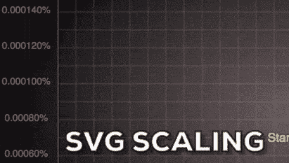
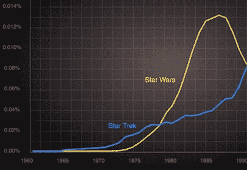

# 制作您自己的响应 SVG 图和信息图

> 原文：<https://www.sitepoint.com/make-responsive-svg-graphs-infographics/>

几周前，我谈到使用免费的[四四方方的 SVG](http://boxy-svg.com/main.html) 矢量编辑器，用 SVG 制作[这个星际迷航对比星球大战图表](https://www.sitepoint.com/svg-vector-effects-non-scaling-strokes)。


我们还讨论了干净、编写良好的 SVG 的威力。今天我想把这个想法更进一步。我知道这是设计和 UX 频道，但有时为了设计更好的东西，我们需要采取“代码级”控制。我们将在 SVG 标记中探索一下，但是会有一个值得的设计回报。

我发现试验 SVG 的最好方法之一是:

1.  在 Boxy SVG 中画一些简单的东西并保存它，
2.  在您最喜欢文本编辑器中打开 SVG 文件([括号](http://brackets.io/)、[原子](https://atom.io/)、Sublime 等等)
3.  将 SVG 代码直接复制并粘贴到 HTML 面板的 [Codepen.io](http://codepen.io/) 处。它应该在结果面板中呈现。

从那里你可以开始改变，看看会发生什么。这是我贴在 Codepen 上的原始[星际迷航对比星球大战图表。](http://codepen.io/SitePoint/pen/gMYrYP?editors=1000#)

## 整洁的 SVG 是快乐的 SVG

回到代码编辑器，让我们看看 SVG 图表的基本结构。在顶部，您会看到一组`<defs>`标记，其中包含了我们在本文档后面会用到的可重用资源，具体来说，您会看到:

*   灰色背景渐变'发光'，以及
*   我们在后面使用的网格图案

在`<defs>`下面，文档的其余部分很容易理解。

1.  发光的背景矩形(`<rect>`)构成背景画布
2.  带有网格图案的图表体(`<rect>`)
3.  图表标题(`<text>`)
4.  《星球大战》黄色图表线(`<path>`)
5.  《星际迷航》蓝色图表线(`<path>`)
6.  2 个图表线标签(`<text>`)
7.  包含 y 轴数字标记(`<text>`)的组(`<g>`)
8.  包含 x 轴数字标记(`<text>`)的组(`<g>`)

没什么大不了的，对吧？

但是如果你仔细观察这两组轴数，你可能会看到很多重复。

```
<text y="430" x="40" style="text-anchor: middle; fill: rgb(103, 102, 102); font-size: 12px;">1960</text>
<text y="430" x="118" style="text-anchor: middle; fill: rgb(103, 102, 102); font-size: 12px;">1965</text>
<text y="430" x="196" style="text-anchor: middle; fill: rgb(103, 102, 102); font-size: 12px;">1970</text>
```

如果这是 HTML，我们不会容忍这么多重复的内联属性——我们会将它们剥离到 CSS 中，并用一个类来替换它们。在 SVG 中没有理由不做完全相同的事情。

在顶部的`<defs>`部分，我们已经有了`<style>`块。我们可以向该块添加一个新 CSS 规则，如下所示:

```
.y-axis text {
    text-anchor: middle;
    fill: rgb(103, 102, 102); 
    font-size: 12px;
    }
```

这使我们能够将这些文本节点分解为更紧凑的内容，如下所示:

```
<text y="430" x="40">1960</text>
<text y="430" x="118">1965</text>
<text y="430" x="196">1970</text>
```

这段代码*不仅更容易阅读和浏览，而且它还使文件更小，同时允许我们从一个点改变所有 y 轴数字的颜色。赢:赢:赢。*

借助代码编辑器的查找和替换功能，您应该能够很好地整理您的文件。我们也可以将图表线标签样式放入`<style>`中。我们将创建新的 CSS 类，并将其添加到标签文本中。

```
.label-starwars {
    white-space: pre;
    font-size: 15px;
    fill: rgb(253, 200, 39);
    word-spacing: 0px;
  }
```

请注意，您不能将 SVG 元素的“x”和“y”值移动到 CSS 中。但是所有其他属性都可以转移到一个类中，甚至包括 CSS 规范中没有的属性，如“fill”或“stroke”(如上所示)。

这是用一些新的 CSS 类整理过的同一个 SVG 文件。

但是这篇文章不仅仅是关于清洁——让我们用我们的图表做一些更酷、更有用的事情。

## 制作更智能的 SVG

如果说 SVG 有一个被大肆宣扬的好处，那肯定是'**可伸缩性**'？毕竟，那个**T3 就是 T5，也就是‘SVG’中的‘T6’S 所代表的意思。我们可以毫不费力地将图标从 40px 缩放到 400px，并期望它保持激光般的锐利和清晰。**

但这有其局限性。



如果文本太小而无法阅读，那么它再清晰也没用。

仅仅因为我可以缩小我们的图表以适应更小的屏幕，并不意味着它在那个尺寸下有任何实际用途。如果我们的标签太小而无法阅读，那么它们再锐利也没用。

正如你在上面看到的，当我们将图表缩小到 500 像素以下时，文字很快变得难以辨认。

## 我们能修好它吗？响应式 SVG 可以！

在 HTML 和 CSS 中，我们会用 CSS 媒体查询来处理这类问题——这正是我们在 SVG 中要做的事情。我们花了时间 *CSS-ifying* 我们的 SVG，现在我们收获了好处。

回到我们的`<style>`块中，我们可以添加一个 CSS 媒体查询，当我们的图表只有不到 500 像素时，它会调高文本的字体大小。大概是这样的:

```
@media (max-width: 500px) {
      .label-startrek, .label-starwars{
          font-size: 170%;
      }
     .y-axis text {
         font-size: 130%;
     }
     .x-axis text {
         font-size: 130%;
     }
   }
```

这给了我们这样一个结果:



当图形突破 500 像素时，我们的轴标签会自动放大，但这有点难看。

太好了！所以，现在我们轴上的数字在更小的尺度下更易读——但它们也有点拥挤和难看。

如果我们隐藏每第二个标签来提高其余标签的可读性，会怎么样？对于小设备用户来说，这肯定是一个更好的 UX 吗？

~~让我们创建一个名为“hide-on-small”的新 CSS 类，并将其添加到我们的媒体查询:~~

```
.hide-on-small{
    display: none;
    }
```

并将该类应用于每第二个数字。

```
<text y="430" x="40">1960</text>
<text y="430" x="118" class="hide-on-small">1965</text>
<text y="430" x="196">1970</text>...
```

### 更新:2016 年 5 月 28 日

正如 Amelia 在下面的评论中指出的，有一个更好的方法来定位每个轴上的第二个数字——CSS n-of-type。这就是我们所需要的。

```
.x-axis text:nth-of-type(2n), 
.y-axis text:nth-of-type(2n) {
   transition: opacity 1s ease-in-out;
   opacity: 0;
   }
```

也就是说有一个名为。在创作这种适应性作品时,“隐藏在小物体上”仍然很有用。

这是它在实践中的样子。


<small>隐藏特定断点下的 SVG 元素</small>

在 [CodePen](http://codepen.io) 上看 SitePoint ( [@SitePoint](http://codepen.io/SitePoint) )的笔[星际迷航 Vs 星球大战 NGRAM(响应式)](http://codepen.io/SitePoint/pen/RRbRJy/)。