# 用 Photoshop 让另类的 80 年代电影历史栩栩如生

> 原文：<https://www.sitepoint.com/making-alternative-80s-film-history-come-life-photoshop/>

作为我们 80 年代电影海报大赛的一部分， [Graphic Stock](http://www.graphicstock.com/partner/99designs?utm_source=sitepoint_article2_1115&utm_medium=custom&utm_campaign=sitepoint_article2_1115) 在 SitePoint 上赞助了一个设计系列。这些文章中讨论的主题——Photoshop 编辑和 80 年代字体选择——可以用来帮助你赢得比赛。注册参加[图形股票试用](http://www.graphicstock.com/partner/99designs?utm_source=sitepoint_article2_1115&utm_medium=custom&utm_campaign=sitepoint_article2_1115) *，准备好赢取 5000 美元一等奖的机会吧。*

回到 90 年代，格温妮丝·帕特洛主演了一部名为《滑动门》的浪漫喜剧。“这部电影的前提很简单:*“有时微小的、看似无关紧要的事件——比如在这种情况下险些错过一辆火车——可能会产生戏剧性的后果。”*

这部电影让观众同时经历了两个故事情节，每个故事情节都发生在一个平行的宇宙中，展示了她在特定的一天是否赶上或错过了特定的火车而选择的两条不同的人生道路。例如，在一个宇宙中，她提前回家，发现她的男朋友欺骗了她。另一种情况是，她回家太晚，并且没有意识到自己的不忠。两个宇宙之间的差异从那里继续。

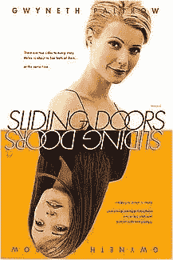

这种交替历史或平行宇宙的想法甚至延伸到电影本身的选角。

例如，你知道《低俗小说》中的毒贩埃里克·斯托尔兹最初在《T2 回到未来》中扮演马蒂·小飞侠吗？现在很难想象，但这是一个“滑门”时刻——谁知道如果这个演员阵容不变，电影历史会发生什么变化？

类似的情况也差点发生在《夺宝奇兵》上。乔治·卢卡斯希望汤姆·塞立克(马格南·皮)出演受人喜爱的印第，因为他不想让哈里森·福特成为他的“小鲍比·迪内罗”事实证明，在 Selleck 为这个角色进行了一些试镜后，他决定和 Ford 合作。

这就引出了一个问题:如果我们和 Selleck 一起去呢？

虽然我们可能永远也不会知道这个问题的答案，但我们至少可以清楚地看到，与福特相比，塞莱克扮演的印第安纳·琼斯会是什么样子。

在本帖中，我们将 Delorean 换成 Photoshop，并学习如何将 80 年代的宇宙重塑为强大的汤姆·塞立克统治电影屏幕的宇宙。

## 你需要什么

*   两张照片
*   Photoshop(我用的是 CS5)
*   图形输入板(我也用过笔记本电脑的触摸板)
*   [这种纹理](http://semireal-stock.deviantart.com/art/Crazy-halftone-pattern-126259626)

## 你会做什么

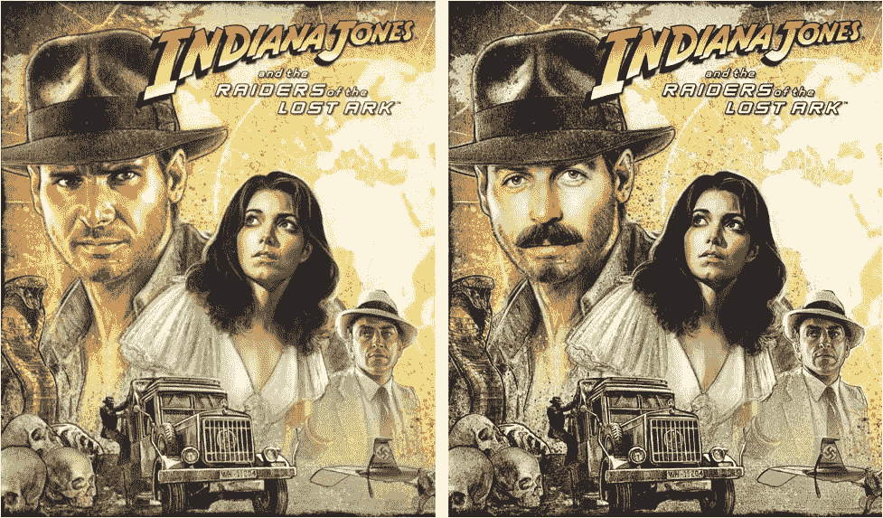

## 选择正确的图像

为了让你的面部交换起作用，你需要确保你选择的两张图像在大小和分辨率上相似，并且为了确保你的面部交换起作用，你需要找到两张图像，它们在大小和分辨率上相似，并且具有几乎相同的姿势。

例如，两个人的头都需要向同一个方向倾斜或转动。我也会试着选择鼻子和嘴巴角度相似的图片。

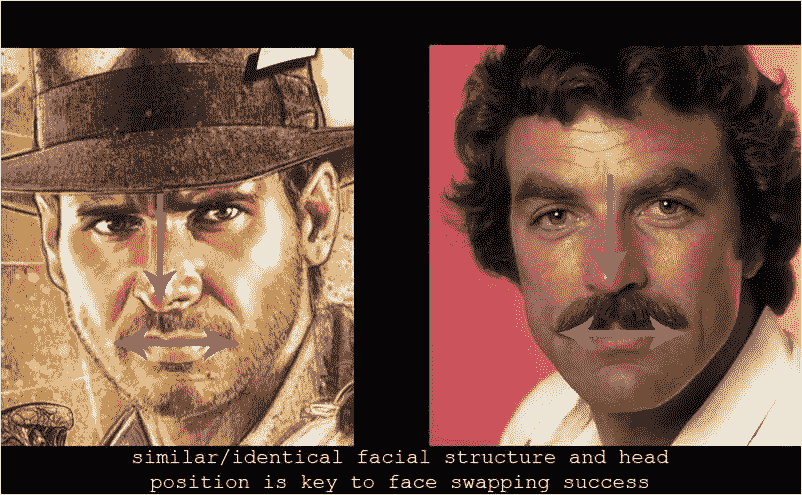

下面你会看到我将要使用的两张图片。

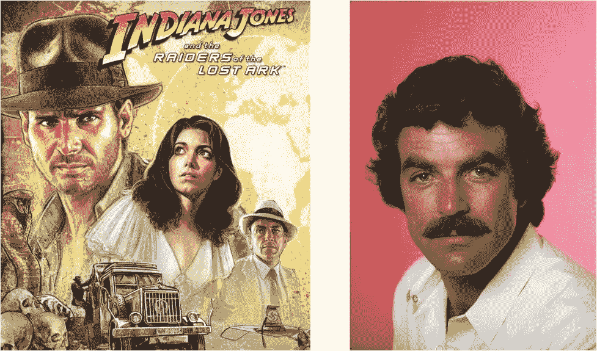

当我在脑海中排列这些图像，看看它们是否可行时，你可以选择在 Photoshop 中重叠它们，看看你的选择是否能一起工作。

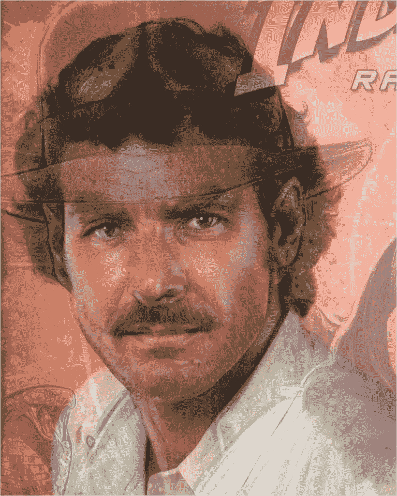

正如你在上面看到的，我选择的图片在这里看起来很不错。

## 面的选择和放置

现在我们已经选择了我们的图像，我们需要得到 Selleck 的脸在福特的。

首先，你只需要分离出主要的面部特征，包括眉毛、眼睛、鼻子和嘴巴。

您可以使用套索工具或钢笔工具来完成此操作。为了得到更好的边缘和曲线，我推荐钢笔工具，但两者都可以。

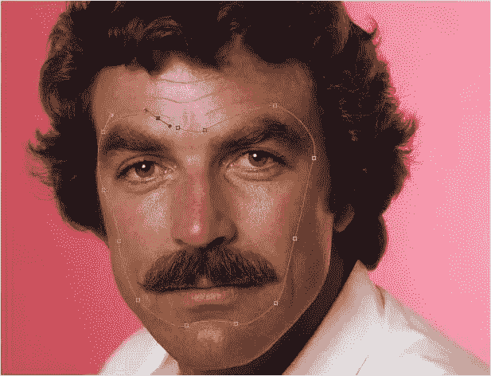

选中面后，简单地复制它(CTRL + C 或 CMD + C ),然后用 CTRL + V 或 CMD + V 把它粘贴到你的工作画布上

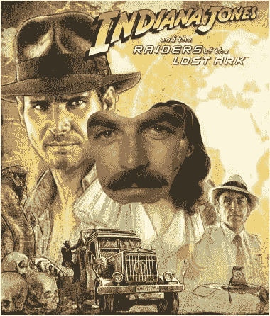

接下来，我们需要把 Selleck 的脸移到 Ford 的上面。

将脸部图层的不透明度降低 50%左右，或者直到你可以看到两个图层。

然后使用变换工具，使调整层的适当位置。

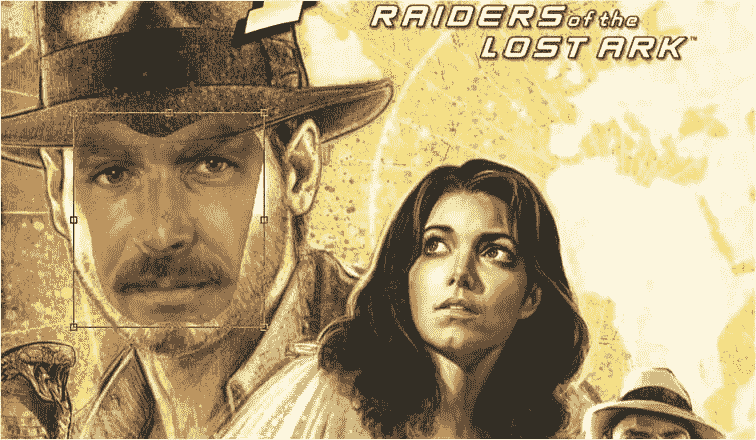

现在，擦除 Selleck 脸上当前应该被帽子遮住的多余部分。

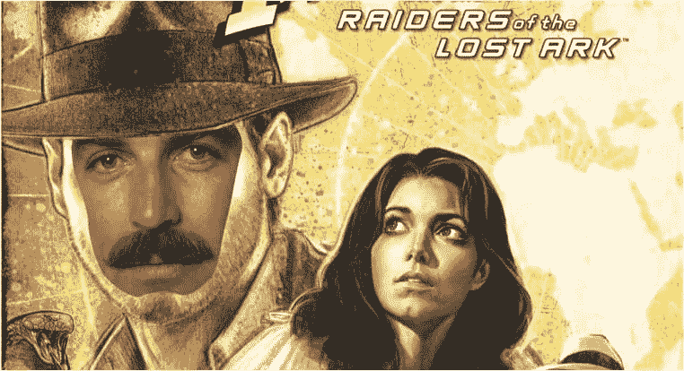

## 混合制剂

在我们混合我们的层之前，我们需要清理一下，这样我们的最终结果看起来几乎是无缝的。

首先，复制海报图像，这样你就有三层了，如下图所示。

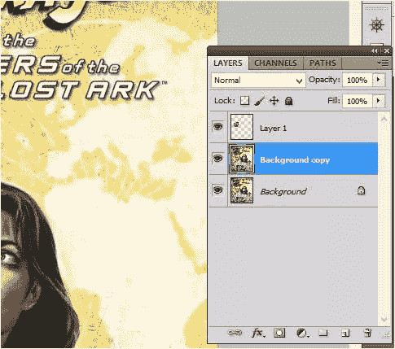

使用魔杖工具，选择 Selleck 脸的内部。我们将使用这个选择作为我们的混合指南。

接下来，隐藏这个选定的层和原始图像，以便更容易看到你在做什么。

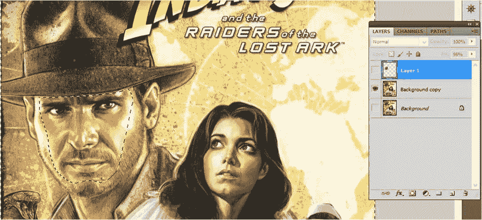

点击新复制的层，然后选择>反向>修改>合同> 12px，然后按下确定。

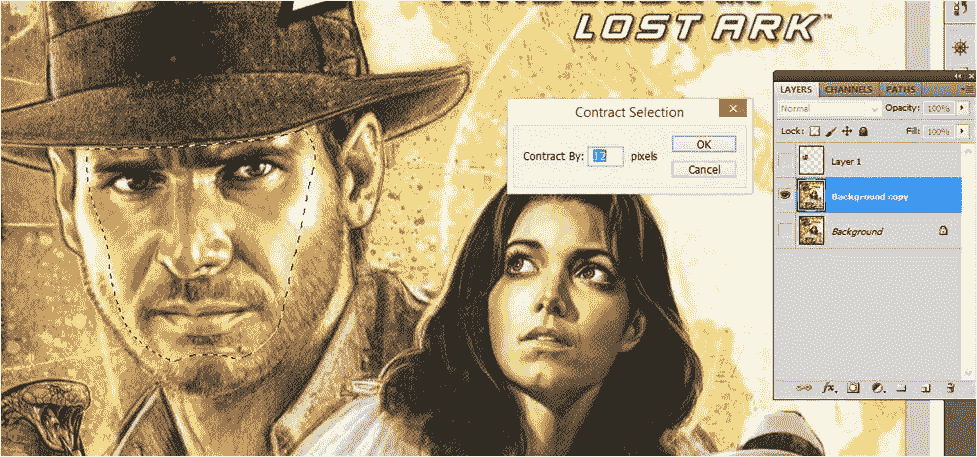

点击删除这样福特的脸就只是一个大洞，就像下面的截图。

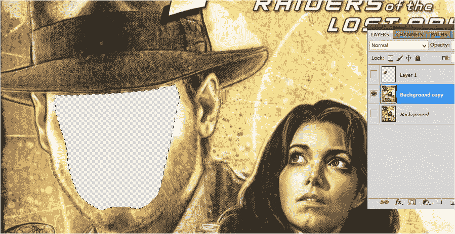

在我们开始混合之前，我们需要做一个轻微的颜色修正。在 Selleck 层，我们需要激活它，然后进入图像>调整>曲线:

*   RGB:输出- 170 输入- 85
*   蓝色:输出- 219 输入- 255

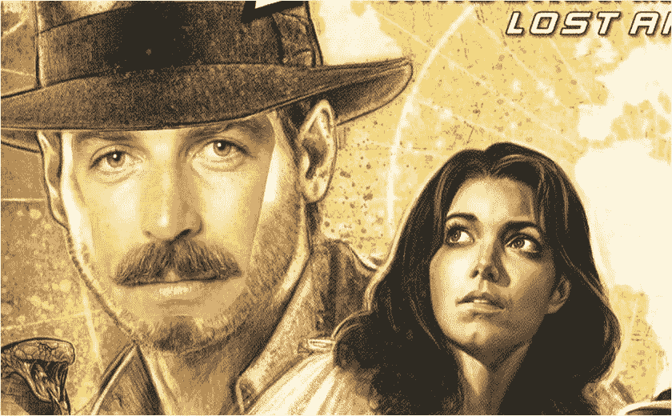

## 自动混合图层

是时候混合这些层了。

首先，使你所有的层“活跃”

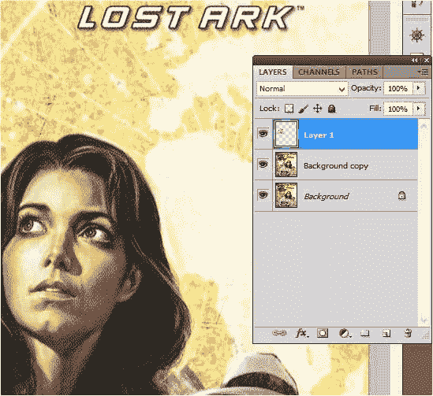

接下来，只选择最上面的两层，然后进入:编辑>自动混合层>堆栈图像>确定。

**重要提示:请注意我是如何选中“*无缝色调和颜色*”框的，这很重要。**

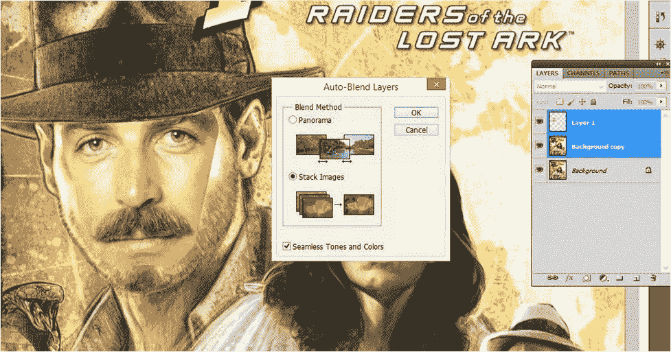

下面的照片是你的混合图像现在应该是什么样子。

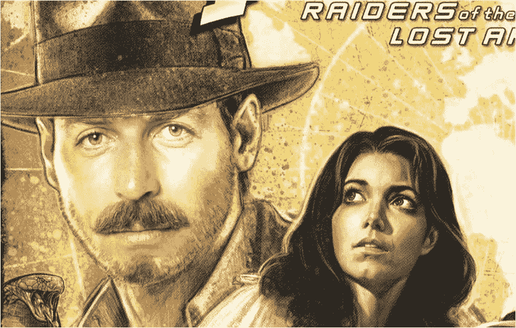

## 颜色校正

因为我们想要一个真实的面部交换和 80 年代的复古风格，我们需要在添加额外效果之前做一些颜色修正。

从调整面部层次开始。

转到编辑>调整>色阶。

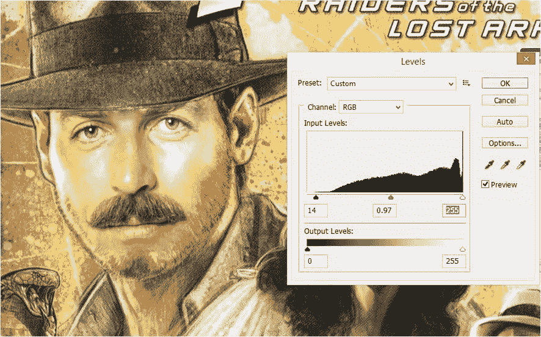

然后，转到:编辑>调整>曝光。

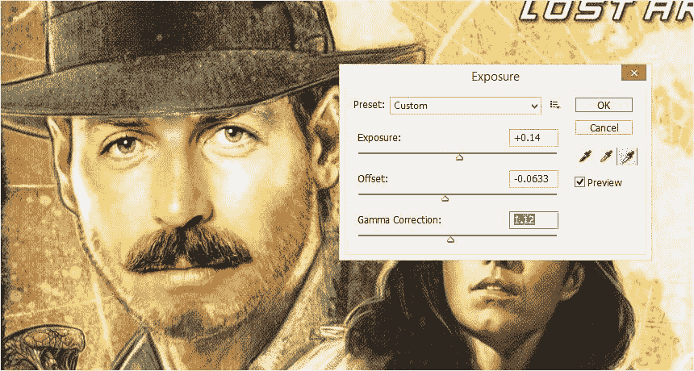

由于包含汤姆·塞拉克的脸的图层的颜色被编辑得非常接近原始肤色的其余部分，我用柔软的圆形笔刷擦除了下唇周围的毛发，以露出更多的面部毛发。

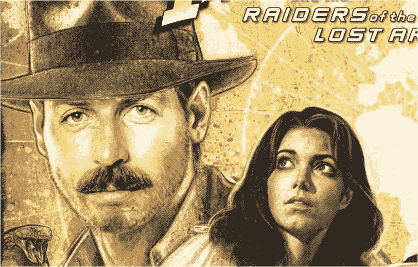

## 纹理应用

现在，是时候确定我们想要的复古外观了。

首先，合并所有图层；然后复制图像，这样你就有两层了。

选择顶层，并前往:过滤器>艺术>海报边缘。

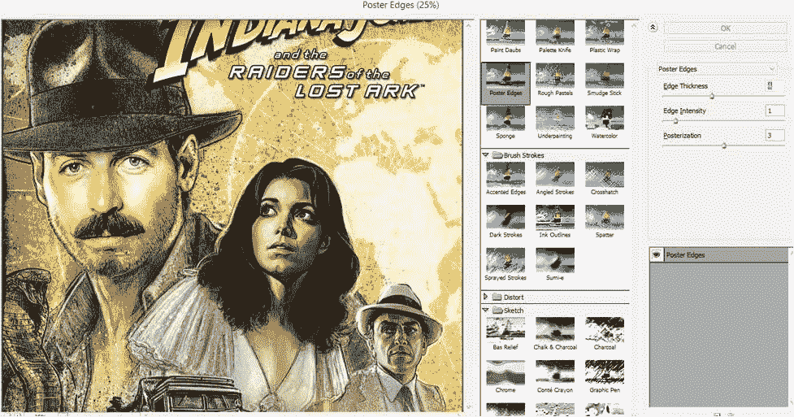

降低不透明度——大约 66%应该可以。

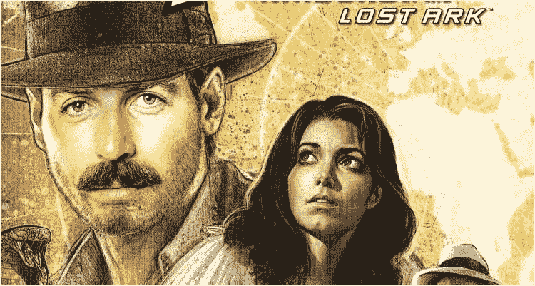

接下来，应用你的纹理，并确保它的位置在脸的大部分。然后把图层模式改成正片。

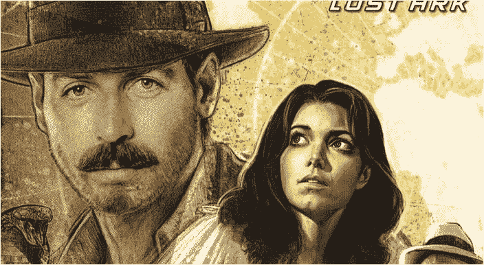

擦除多余部分，不透明度降低到 29%。

最后，添加任何额外的色调、阴影、高光或任何你的小心脏想要的东西，让你的海报流行起来。

这是我的最终结果。

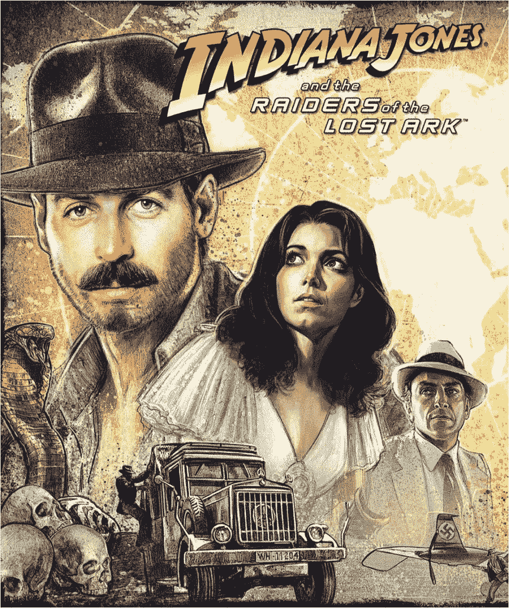

### 现在怎么办？

当然，你不仅仅局限于把名人头像放到你最喜欢的海报上。事实上，我可以想象出数百个有趣的用例。以下是我的一些想法，也是受 80 年代的启发:

*   [回到未来](https://en.wikipedia.org/wiki/Back_to_the_Future)
*   [七宝奇谋](https://en.wikipedia.org/wiki/The_Goonies)
*   [风险业务](https://en.wikipedia.org/wiki/Risky_Business)
*   [闪舞](https://en.wikipedia.org/wiki/Flashdance)

***在下面的评论中告诉我们你的结果。我们迫不及待想知道你的结果。***

## 分享这篇文章