# 提高可用性的 15 个步骤(和更快乐的用户)

> 原文：<https://www.sitepoint.com/making-happy-users-better-usability/>

本文是关于通过更好的可用性增加用户参与度的三部分系列文章的第一部分。

今天我想专门关注**新用户**——那些开始熟悉你的网站的人。这通常是一个 web 应用程序成败的关键。在这个阶段放弃的用户不太可能再次尝试。

我们将探讨一些常见的、经常被忽视的 web 应用程序可用性问题。我们还将了解如何在用户与我们的网络/移动应用程序交互的关键初始阶段提高可用性。

## 清晰简洁的交流

### 1.选择可用的字体大小

随着移动网络越来越主导我们的网络使用，大多数网站已经转向更周到的字体大小。由于响应式网页设计，越来越多的网站开始关注为移动设备提供可用的字体大小。

网站通常会密切关注按钮、图标、折叠、标签和其他点击目标的可用性，而忽略了拥有易于点击的文本链接的重要性。

总是用真实的手指在真实的设备上测试你的文本链接——而不仅仅是模拟器。

### 2.编写有意义的错误消息

错误消息中使用的语言和语气通常被认为是不重要的，或者相对于其他开发项目来说是次要的。通常，开发应用程序的人知道如何避免错误，所以很少会遇到错误——更不用说考虑它们的内容了。

真正的用户就没这么幸运了。

事实是，如果用户不清楚如何从错误中恢复，你将失去业务。

错误信息是开玩笑的好机会，但是至少，我们应该允许用户快速诊断错误并从中恢复。

错误中使用的语言应该总是非技术性的。不要给出用户没有任何用处的信息。甚至验证错误也可以用更加用户友好的语言重新表述。

将下面的例子与同一屏幕臭名昭著的早期版本进行比较。

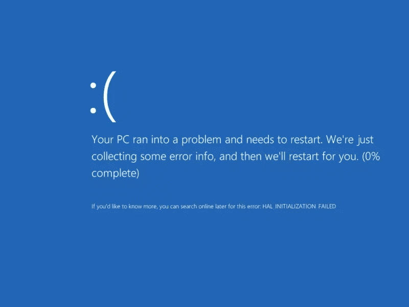

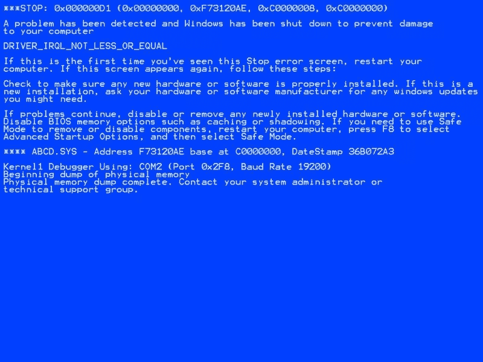

## 表单的可用性

### 3.放松密码要求

强制使用高安全性密码是常见的做法。这应该是积极的、令人鼓舞的帮助之手，而不是路障。

表单的可用性一直是我最讨厌的事情之一。

> 很多表格设计得很漂亮，却无法使用。

正如我们前面提到的，表单确实并且将永远对您的业务产生直接影响。注册表单、登录表单和结帐表单都是任何 web 应用程序的关键部分。因此，对表单可用性的关注需要像激光一样锐利。

例如，选择框在历史上就很难设计。许多现有的选项，包括 Bootstrap 的 dropdown 或 Harvest 的 option，都倾向于隐藏原始的 select 输入，同时将它克隆到一个更具风格的 DOM 元素中。然后，它们将来自克隆元素的数据绑定回原始输入。

仅仅是对下拉菜单进行设计控制就要做大量的工作。但是，这一切麻烦值得吗？

请记住，每个移动用户都已经对其首选操作系统上的原生控件有了来之不易的熟悉。

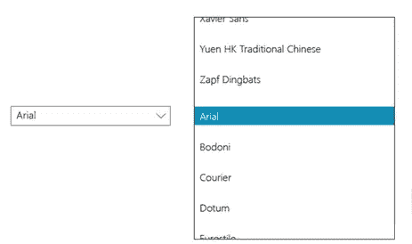

例如，Windows mobile 用户习惯于将下拉选项显示为全屏幕选项，而不是表单中的字段。对于 Android 用户来说，这是一个非常不同的期望，他们被训练来期望一个模态窗口。

出于您自己的设计原因，花费如此大的力气来撤销这种预期的行为，可能对您的用户没有任何好处。十有八九，这只会降低用户的速度，并对他们的体验产生负面影响。

最终，你制造的问题比你解决的问题还多。

### 4.使用正确的输入形式

很多人建议为表单使用合适的输入类型。添加`input[type="email"]`、`input[type="tel"]`有助于适当切换键盘输入。这是反直觉的，实际上阻止了他们快速填写表格。

如果表单有多个字段，最好坚持使用一种输入类型，因为对于用户来说，每次输入都使用同一个键盘实际上更容易，而不是为表单上的每个新项目提供不同的键盘。

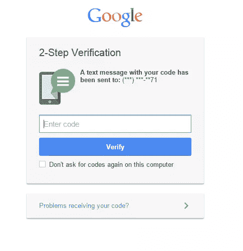

使用各种 HTML 5 输入类型的正确场合是变化最小的时候。Google 的双因素认证只有一种输入形式，并且只需要数字。这是为用户提供数字键盘的理想位置。

然而，在更复杂的表单中，比如 Lyft 的注册驱动表单，为每种不同类型的输入提供不同的键盘可能会令人沮丧。这实际上增加了认知负荷——尤其是在常规键盘和数字键盘之间切换时。

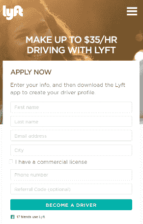

### 5.创造卓越的入职体验

糟糕的入职体验类似于晚宴上粗鲁的主人。如果没有人留下来尝试，你的食物再好也没用。

开发人员很容易忽略一个天真的用户第一次与他们的应用程序交互的方式。充满图标和部分的仪表板并不十分直观。易于忽略的深思熟虑的工具提示和警告消息有助于平稳入职流程。

### 6.细节决定成败

像将光标默认为表单上的第一个输入字段这样的小事情可以大大提高体验的速度和无缝性。理想情况下，我们希望我们的用户通过我们的应用程序自动驾驶。

对新用户缺乏培训的另一面是，在他们第一次访问时，就用你的应用程序的每一个功能轰炸他们。正如我们从微软短暂的 Clippy 功能中所知，在错误的时间或以错误的方式提供帮助会比根本不提供帮助更令人恼火。

创造一次成功的入职体验就像走一根绷紧的绳子，很难做对，但当你做对了，它会变成一次愉快的经历。Stumbleupon 在培训新用户了解该应用的核心概念方面做得非常出色。

将教学融入应用程序的正常使用可能是一种成功的方法。电子邮件应用程序可能会跟进一个操作，例如使用“*嘿，你知道可以使用 ctrl + k 进行归档吗？*”。

与绞尽脑汁的旅行相比，这是一种更温和的培训用户的方法。

### 7.缩微拷贝不应该是事后的想法

“微缩拷贝”指的是我们在应用程序中散布的所有微小的指令和保证。

*   别担心，我们绝不会出售您的电子邮件地址
*   '不需要信用卡'

Microcopy 是开始建立信任和提升用户体验的理想场所。它也是教育不确定该做什么的用户的好地方。

注册信用卡或提供电子邮件地址可能会成为用户的摩擦点。除非你是一个公认的值得信赖的品牌，否则人们总是会担心被不公平地收费或被发送垃圾邮件。

Microcopy 在为用户解决这些问题方面大有可为。

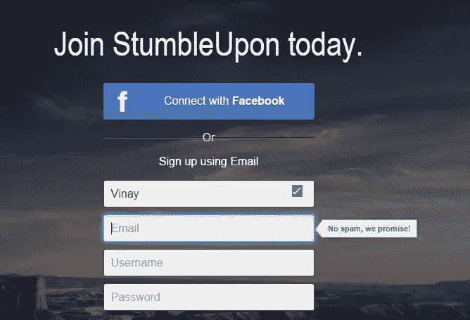

### 8.始终提供上下文

用户讨厌失去上下文。考虑到他们已经需要理解的海量信息，用户试图屏蔽屏幕上的其他内容，以便专注于手头的任务。

当无限滚动风靡一时时，网站面临一个共同的问题。一次错误的点击，用户就会失去他们在应用程序中的位置。如果用户已经滚动了五次，并且无意中点击了一次，这是非常令人沮丧的。

今天大多数网站已经通过使用模态和其他模式来帮助单页面应用程序解决了这个问题。

例如，点击 Pinterest 中的任何一个项目都会以模态方式打开它，而不是加载到一个单独的页面中。这使得用户可以沉迷于细节，而不会丢失上下文、位置或等待新页面的加载。

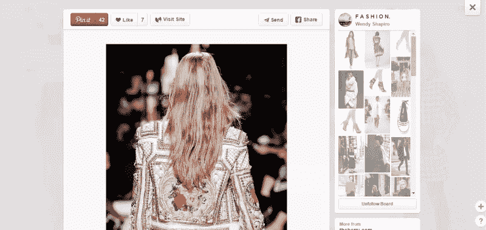

脸书的移动应用程序使用了类似的技术。从相册加载图像会将你带到全屏模式。几乎看起来你已经生成了一个新的页面，但是当你往回导航时，它会优雅地把你带回到原来的环境。

谷歌的[材料设计](http://www.google.com/design/spec/material-design/introduction.html)支持使用动画来提供背景。单击一个项目将在现有页面和正在加载的项目详细信息之间启动一个流动动画。你知道东西从哪里来，又可能回到哪里。

然而，如果在关闭一个项目时将动画反过来执行，效果可能会更好。

Stackoverflow 在通知方面做得非常好。点按笔记会将您带到一个页面，并滚动到您请求的内容的确切位置。

虽然这很有帮助，但他们更进一步，通过一个温和的高亮动画提供了上下文。它微妙而有力地将用户的注意力立即吸引到重要的事情上。这有助于他们过滤掉屏幕上的其他噪音。

### 9.原子动作

当我们能够屏蔽掉任何与他们正在做的事情无关的东西时，用户通常会发现完成一项任务更容易。这有助于减少认知负荷，提供更放松的 UX。

Twitter 的“撰写推文”模式是对这一想法的完美案例研究。撰写推文是一个单元任务，也是这个应用程序最重要的操作之一。如果人们停止发推特，推特最终会消亡。

Twitter 建立了这个模型来帮助用户屏蔽已知宇宙中最令人分心的力量之一——你的 twitter feed！

这使得用户可以完全专注于写他们的推文。

这种方法最适合用于原子操作。其中，您能够在该模型本身中提供该操作所需的一切。

### 10.错误消息

错误消息是用户需要获得上下文的另一个地方。它确实有助于标记或突出需要注意的特定文本框。

一些错误信息非常生硬，不能帮助用户从中恢复。字段的名称和视觉提示有助于用户快速解决问题。

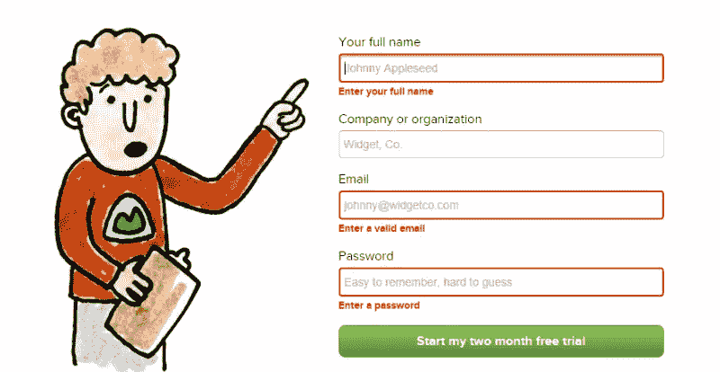

Basecamp 的注册表格清楚地指出了需要解决的问题。

如果您的表单只有两三个要填写的字段，这看起来可能相当明显。但是，即使在这些情况下，提供视觉提示也比简单地列出一系列错误要有用得多。

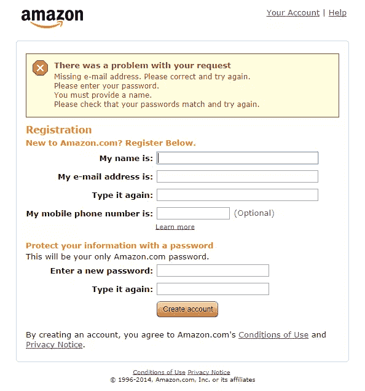

亚马逊的注册表单向你展示了一份你需要改正的错误的“购物清单”。

### 11.集中所有通知

随着单页面应用程序越来越受欢迎，我们现在有能力统一发送给用户的通知。网络应用和本地应用之间的界限正在慢慢模糊。

当一个应用程序需要与用户交流时，他们更容易期望这种通信总是在一个共同的地方，而不是在上下文中。当然，这个规则也有例外，但是谷歌收件箱是所有通知显示在同一个地方的一个很好的例子。

[咆哮通知](http://ksylvest.github.io/jquery-growl/)可以防止用户*没有*注意到重要通信的可能性。

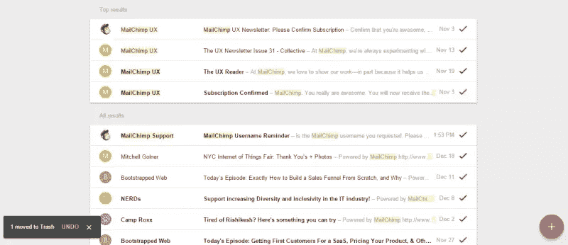

Feedly 的通知总是放在最上面。这训练了用户寻找重要的交流，即使他们执行了一个动作并离开了原来的上下文。一个很好的例子可能是将一篇文章标记为“已读”,然后转到下一篇。

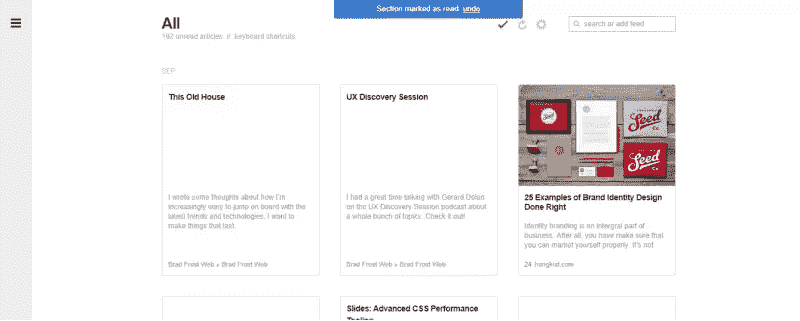

Feedly 的所有通知都是全局的，总是显示在同一个地方。从文本内容中可以清楚地辨别出链接或操作项。

### 12.避免死胡同状态

模态是一种有用的模式，但是不要用它们来阻止用户，阻止他们继续，直到他们对模态中的内容做出响应。

你应该总是让用户负责。这种死路一条的状态让他们别无选择，只能放弃他们正在做的一切。在一些罕见的情况下，*可能*是必要的，但要尽可能避免这种结果。

### 13.给用户控制权

没有导航按钮的转盘给用户的控制很少。避免使用定时转盘载玻片。用户注意和理解信息所需的时间因用户而异。事实上，对于同一个用户，它甚至每天都在变化。

这被认为是一种过时的模式，对 UX 不利，因为其中涉及的变量太多了。如果您在页面顶部使用旋转木马，这一点尤其正确。

在这种情况下，这可能是用户使用你的应用的第一个切入点。限制他们控制这种互动的能力会给你和用户的关系定下不好的基调。

的解决方案是遵循一个简单的经验法则:

> 仅响应**明确的**用户操作

当我们不知道用户到底想要什么时，我们需要为他们提供控制体验的能力。

### 14.避免转移注意力

Javascript 警报极具破坏性。他们从你正在做的任何标签上抢走焦点，并且*要求*注意。只有在绝对必要时才使用它。有比它更好的选择。

当屏幕上的内容突然改变时，用户，尤其是移动用户，会感到迷惑。在没有明确的用户操作的情况下，您应该始终避免对屏幕/视窗内容进行任何更改。

Twitter 和脸书都在处理需要不断更新的实时数据流。

这听起来熟悉吗？当你正在阅读一条推文时，某个后台进程触发了一次重新加载，新推文的突然激增扫除了你正在阅读的内容。

这就像一阵微风夺走了你的报纸——你站在那里感到有点失落和愚蠢。

令人欣慰的是，官方 Twitter 应用程序会温和地通知用户这些新推文，并在加载它们之前等待用户的明确操作。用户可以完全控制屏幕内容的变化，从而防止这种情况下可能出现的任何混乱。

### 15.将大而复杂的任务分成小部分

没有人喜欢填写满是表单字段的页面。设置页面、配置文件和注册表单都可以从逻辑上将项目分组为较小的块中受益。

卡片、区域、标签、侧边导航都是解决这个问题的好模式。在同一个页面上雇佣多个员工也没什么坏处。

将复杂的页面分成逻辑组可以减轻用户的压力。你希望他们能够进入设置页面并完成工作。这不应该感觉像一个可怕的活动。

> 表格烂透了。他们特别喜欢移动设备。–[布拉德·弗罗斯特](http://bradfrostweb.com/blog/post/single-field-credit-card-input-pattern/)

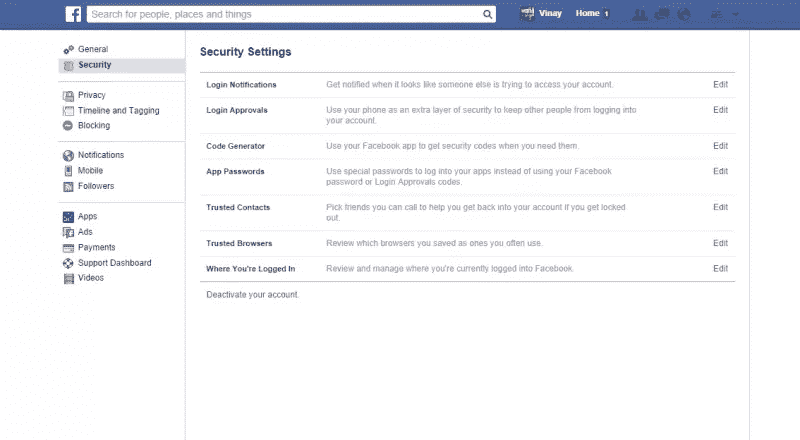

脸书花了很多年试图让人们更容易地配置他们的隐私设置。在过去，这一过程是一个错综复杂的雷区，许多人都积极避免改变它。

然而，通过将这些设置逻辑分组为可管理的块，他们增加了参与这些页面的人数，而不是绝望地放弃他们。

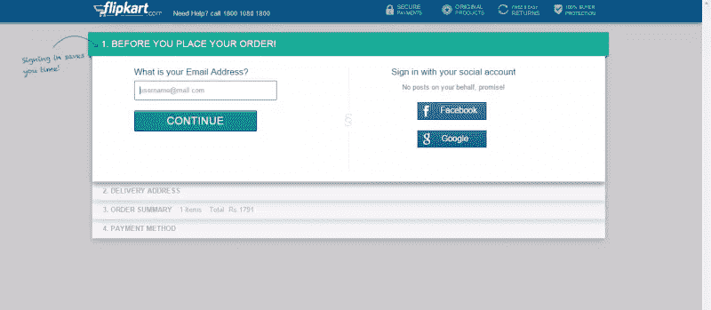

结帐工作流是另一个很好的用例，其中将项目分块到逻辑组是避免让用户不知所措的好方法。

对于许多 web 应用程序来说，购买时刻是直接影响业务的关键时刻。将购买过程分成可消化的部分，让用户感觉他们正在取得进展——即使事情没有完全按照计划进行。

更简单的步骤也使用户更容易识别和解决任何潜在的摩擦点。没有人想要一个问我们“你能解决这 4 件事吗?”？’。

相比之下，提供一个单一的，复杂的页面，要求所有需要填写的细节，将所有的失败风险集中在一个地方。一个错误通常会阻止所有其他好的数据被提交。

捐赠表格也是如此，尤其是在手机上。你希望用户认为“哇，真简单”而不是“哦，亲爱的”。这需要一段时间。提高表单的可用性会直接影响收入。

我们上面讨论的大多数问题，当我们把它们分离出来时，就相对容易看出来。他们经常变得越来越不容易被日常工作的人看到。

对我们大多数人来说，真正的挑战是退一步，用全新的“新用户”的眼光来看待这些问题。

## 分享这篇文章