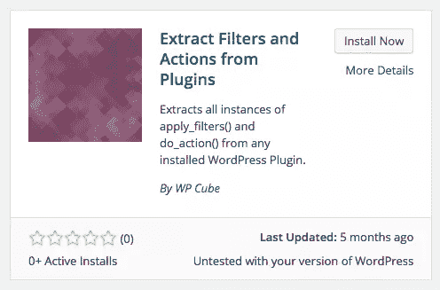
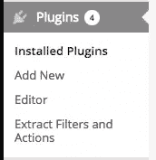
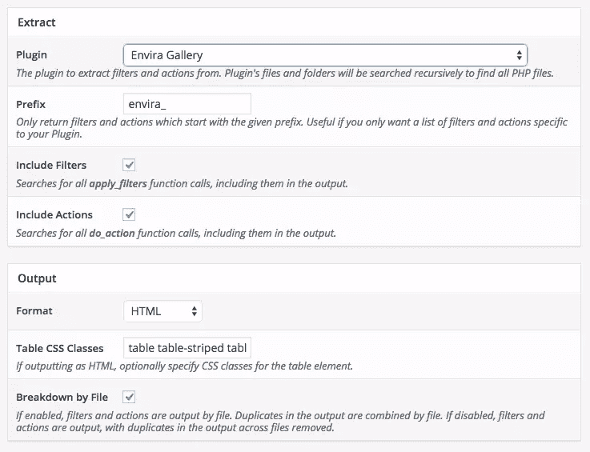
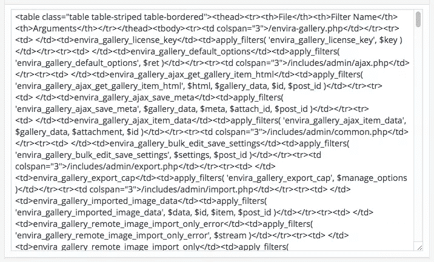
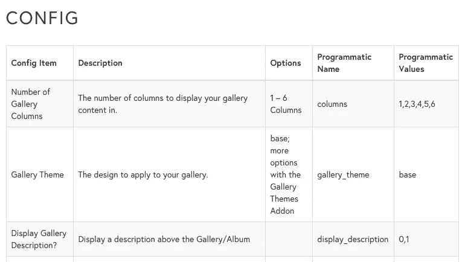

# 让你的 WP 插件对开发者更加友好

> 原文：<https://www.sitepoint.com/making-your-wordpress-plugins-even-more-developer-friendly/>

在上一篇文章的[中，我们看了如何将动作和过滤器添加到你的 WordPress 插件中，以帮助它们对开发者友好。](https://www.sitepoint.com/making-your-wordpress-plugins-developer-friendly/)

今天，我们将看看如何提供开发者文档。

## 记录您的操作和过滤器

记录你的 WordPress 插件的动作和过滤器是很有用的，这样开发者可以很快找到他们需要的，并且理解每个动作和过滤器的作用。

### 代码注释

作为开发人员，我们很乐意审查其他人的代码，以了解一些东西是如何工作的。向我们的操作和过滤器添加 [DocBlock](https://en.wikipedia.org/wiki/PHPDoc) 注释是解释特定调用的作用的一个很好的方式:

```
/**
 * Helper method to retrieve schedule options
 *
 * @since 3.0
 *
 * @return array Schedule Options
 */
static public function get_schedule_options() {

    // Build schedule options
    $schedule = array(
        'queue_bottom'  => __( 'Add to End of Buffer Queue', 'wp-to-buffer-pro' ),
        'queue_top'     => __( 'Add to Start of Buffer Queue', 'wp-to-buffer-pro' ),
        'now'           => __( 'Post Immediately', 'wp-to-buffer-pro' ),
        'custom'        => __( 'Custom Time', 'wp-to-buffer-pro' ),
    );

    /**
     * Returns filtered schedule options
     *
     * @since 3.0
     *
     * @param array $schedule Schedule Options
     * @return array Filtered Schedule Options
     */
    return apply_filters( 'wp_to_buffer_pro_get_schedule_options', $schedule );

}
```

对于更复杂的动作和过滤器，它们是更大的函数调用的一部分，这真的很有用，因为它可以快速解释被传递的变量:

```
/**
* Returns an image link if the original source cannot be found.
*
* @since 1.0.0
*
* @param string $item['link'] Image Link
* @param int    $id           Image Attachment ID
* @param array  $item         Image Data
* @param array  $data         Gallery Data
* @return string              Image Link
*/
return apply_filters( 'envira_gallery_no_image_src', $item['link'], $id, $item, $data );
```

### 在线文档

为所有动作和过滤器调用提供一个单一的参考点将有助于开发人员快速找到他们需要的东西。我们可以将每个`apply_filters`和`do_action`调用复制粘贴到我们的在线文档中。

然而，如果你的插件的动作和过滤器分布在几个文件中，那么将所有这些整理成一个单独的文档将会花费时间。如果我们添加新的操作或过滤器，我们还必须手动重复这个过程。

谢天谢地，有 WordPress 插件可以帮助自动化这个过程。具体来说，[提取过滤器和动作插件](https://wordpress.org/plugins/extract-filters-and-actions/ "Extract Filters and Actions Plugin")允许我们选择一个已安装的 WordPress 插件，并生成 HTML 表格的动作和过滤器。然后可以将这些复制到在线文档中。

要设置提取过滤器和动作，你需要安装一个 WordPress，其中包含你想从中读取动作和过滤器的插件。

在 WordPress 管理区域，导航到插件>添加新的，然后搜索“提取过滤器和动作”。然后，点击*立即安装*从插件中提取过滤器和动作*插件:*



安装完成后，激活插件并开始使用，方法是导航至插件>提取过滤器和操作:



在生成文档之前，需要配置一些设置:

*   插件:为其生成文档的 WordPress 插件。
*   **前缀:**如果您的操作和过滤器以特定名称为前缀(推荐)，您可以在此处输入。
*   **包括过滤器:**要在您生成的文档中包括过滤器，勾选此框
*   **包括行动:**要在您生成的文档中包括行动，勾选此框
*   **格式:**选择输出文档的格式。我们选 HTML 吧。
*   **表格 CSS 类:**对于 HTML 表格，你可以选择指定表格的 CSS 类。
*   **按文件细分:**如果你想按文件显示动作和过滤器，而不是长长的列表，选中这个选项。



单击 *Extract* 按钮，如果一切正常，您将看到您的 HTML 输出，并可以选择将其复制到您的在线文档中:




关于这方面的在线例子，请看[http://enviragallery.com/docs/social-addon/#envira-doc5](http://enviragallery.com/docs/social-addon/#envira-doc5 "Envira Gallery  - Social Addon - Actions and Filters Documentation")

### 程序文件

除了动作和过滤器文档，为那些想在你的 WordPress 插件中使用设置的用户和开发者提供编程文档也很有用。

例如，在 Envira Gallery 中，我们将配置作为 Post 元数据存储在一个数组中，并在 WordPress 管理中提供一个 UI，允许用户编辑每个单独图库的配置。

但是，用户和开发人员也可以通过短代码和模板标签指定编程配置键名和值，以覆盖图库配置。

我们通常每天会收到 4-5 个支持请求，询问使用什么配置键值来实现特定的结果。虽然我们的文档解释了每个配置选项在 WordPress 管理用户界面中的作用，但是它没有解释什么是编程键名称，以及它们可以接受哪些值。

通过更新我们的文档以包括程序密钥和接受的值，我们已经成功地将这些问题的支持请求减少了 80%:



作为 WordPress 插件的作者，这意味着我们可以专注于构建我们的产品，同时用户和开发者可以通过参考在线文档获得问题的即时答案。作为插件作者，保持这些文档的更新也是有用的，因为它为我们提供了一个快速、方便的参考！

### 结论

我们已经学会了如何为我们的动作和过滤器使用 DocBlock 注释，以及为我们的在线文档自动构建一个动作和过滤器的 HTML 列表。最后，我们讨论了如何使现有的在线文档对开发人员更有用，同时又不失非技术用户所需的简单性。

## 分享这篇文章