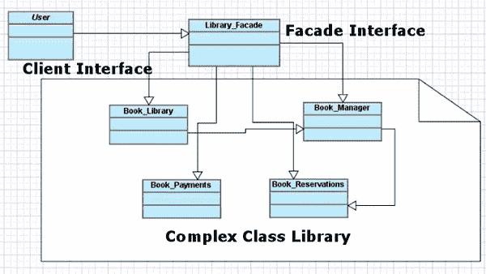

# 用外观模式管理复杂性

> 原文：<https://www.sitepoint.com/manage-complexity-with-the-facade-pattern/>

设计模式是为了标准化软件开发中常见问题的解决方案而构建的。当我们开发复杂的应用程序时，我们应该分配足够的时间来规划应用程序的设计和结构。当我们这样做时，我们有机会选择合适的设计模式。但是有些情况下，我们甚至不知道我们正在使用一个设计模式。

Facade 是几乎每个 web 应用程序中都使用的一种设计模式，但人们往往不知道。术语“设计模式”创建了一个复杂且难以理解的事物的心理图像。尽管有时这可能是真的，但是 Facade 模式实现起来很简单。让我们看看什么是 Facade，它能帮助我们写出好的代码。

## 借书的过程

假设我们正在开发一个图书馆管理系统的应用程序。借书和还书显然是这种系统的两个最重要的任务。但是考虑图书借阅过程的一个典型实现:

*   用户来到图书馆，归还她借的书，这样她就可以借新书了。
*   用户必须为过期的书支付罚款。
*   用户或图书馆工作人员搜索一本新书。
*   这本书的可用性得到了证实。
*   如果上述步骤成功完成，则必须检索书的位置。
*   用户借书。
*   该书的状态在系统中被标记为不可用。

每个任务的实现都包含在单独的类中，它们有自己的接口。以下代码说明了系统如何通过调用必要的方法让用户借书:

```
<?php
public class User
{
    public function borrowBook() {
        $bookManager = new Book_Manager();
        $bookManager->returnBooks();

        $bookPayments = new Book_Payments();
        if ($bookPayments->hasOverdueBooks()) {
            $bookPayments->payBookFines();
        }

        $bookLibrary = new Book_Library();
        $bookReservations = new Book_Reservations();

        $book = $bookLibrary->searchBooks();
        $isAvailable = $bookLibrary->isBookAvailable($book);
        $isReserved = $bookReservations->isBookReserved($book); 
        if ($isAvailable && !isReserved) {
            $bookLibrary->locateBook($book);

            $bookManager->borrowBook($book);
            $bookLibrary->updateBookAvailability($book, $status);
        }
    }
}
```

你可以看到借书的过程其实是一个复杂的过程！在这个实现中，用户必须与四个不同的类和大约十种方法进行交互才能借书。

假设每个功能都是作为应用程序中的一个单独的屏幕来实现的；你能想象用这个系统借三本书需要付出多大的努力吗？并且借用者不需要知道诸如检查预订和更新状态之类的功能。我们的实施肯定有问题。

## 实现库外观

我们需要将用户从复杂的库工作流中分离出来，并允许一个简化的界面，只暴露与用户直接相关的信息——外观。让我们看看库外观的实现。

```
<?php
class Library_Facade
{
    public function returnBooks() {
        // previous implementation by calling necessary classes
    }

    public function borrowBooks() {
    }

    public function searchBooks() {
    }

    public function reserveBooks() {
    }
}
```

用户可以通过调用`Library_Facade`类的`borrowBook()`方法来借书，如下例所示:

```
<?php
class User
{
    public function borrowBook() {
        $libraryFacade = new Library_Facade();
        $libraryFacade->borrowBook();
    }
}
```

使用这种基于 facade 的实现，用户只与`Library_Facade`类对话，不知道在它之外的功能是如何实现的。用户可以直接从 facade 请求任何功能，facade 负责处理复杂的流程并返回适当的信息。Facade 模式遵循最少知识的原则，即每个单元应该对其他单元有最少的了解。

即使低级功能通过外观对用户隐藏，用户仍然可以在需要时直接请求低级类。想一想你自己的项目，你可能会发现你在没有意识到的情况下实现了 Facade 模式。

## 外观模式定义

既然我们已经确定了实现 Facade 模式的过程和重要性，现在是时候学习模式的定义了。以下摘自维基百科:

> facade 是一个对象，它为大量代码(如类库)提供了一个简化的接口。外观可以:
> 
> *   使软件库更容易使用、理解和测试，因为 facade 为常见任务提供了方便的方法；
> *   出于同样的原因，让图书馆更具可读性；
> *   减少外部代码对库内部工作的依赖性，因为大多数代码使用外观，允许在开发系统时有更大的灵活性；
> *   用一个设计良好的 API 包装一个设计糟糕的 API 集合。

下面是我们的库示例的类图，它标识了 Facade 模式定义中提到的组件。



## 真实世界的实现

在前面的章节中，我们以图书馆系统为例，学习了 Facade 模式背后的理论。在现实世界中，外观可能比我们的图书馆场景中的实现复杂得多。让我们在现实世界的应用程序和库的上下文中回顾一下该模式的一些实现。

### 开放式身份验证的 Opauth

我最近写了一篇关于流行的开放认证库 Opauth 的文章，如果你还没有读过，我建议你读一读。假设我们已经开发了一个专业的社交网站，我们希望我们的用户能够使用其他流行的网站，如 Twitter、LinkedIn 和脸书来进行身份验证。为了完成认证过程，我们使用现有的第三方库来访问网络服务。让我们来看一些使用 Twitter 库实现所需功能的示例代码。

```
<?php
$toauth = new TwitterOAuth('consumer key', 'consumer secret');

$request_token = $toauth->getRequestToken('http://exmaple.com/twitter_oauth.php');

$_SESSION['oauth_token'] = $request_token['oauth_token'];
$_SESSION['oauth_token_secret'] = $request_token['oauth_token_secret'];

if ($toauth->http_code == 200) {
    $url = $toauth->getAuthorizeURL($request_token['oauth_token']);
    header('Location: '. $url);
}
else {
    // Generate error
}
```

如您所见，我们调用了一组特定于 Twitter 的库方法来实现所需的功能。LinkedIn 和脸书都需要类似的方法。这个过程已经变得复杂了。我们没有开发 Twitter、脸书或 Linkedin 应用程序；我们应该只验证凭证并验证用户。我们的应用程序不应该担心这些服务的实现。

我们可以通过使用 Opauth 库作为门面接口来解决这个问题。首先，我们需要以 Opauth 插件识别的通用格式指定所需服务的登录 URL。考虑以下用于实现身份验证过程的代码。

```
<?php
public function login($stratergy = '') {
    if ($stratergy != '') {
        $this->opauth_lib->initialize();
    }
}
```

一旦请求了登录链接，Opauth 就从 URL 中识别所请求的服务，并初始化库来重定向用户进行身份验证。我们的应用程序现在只需要创建登录链接并调用 initialize 方法。所有复杂的身份验证工作都是使用每个服务各自的库在幕后处理的。这可以被认为是有效使用 Facade 模式的完美例子。

### WordPress 元函数

考虑到代码质量，WordPress 在严肃的 PHP 开发人员中并不是最受欢迎的框架之一。但是我们可以很容易地在 WordPress 代码库中找到一些成功的 facade 实现。在这里，我将看看保存 WordPress 帖子自定义数据的`update_post_meta()`函数。

WordPress 允许我们创建与现有帖子相关的自定义字段。想想我们在通常情况下是如何保存这些字段的…我们必须执行以下所有任务:

*   验证现场数据
*   过滤 HTML 标记、脚本和 SQL 注入的数据
*   检查数据库中的字段是否存在
*   根据存在状态保存或更新记录

保存一个自定义字段需要做大量的工作！WordPress 通过提供一个名为`update_post_meta()`的内置函数作为门面来隐藏保存这些字段的复杂性。这使我们能够专注于传递与应用程序相关的必要数据；所有上述任务对用户都是隐藏的。

现在考虑`update_post_meta()`的实现，将其功能标识为外观:

```
<?php
function update_post_meta($post_id, $meta_key, $meta_value, $prev_value = '') {
    // make sure meta is added to the post, not a revision
    if ($the_post = wp_is_post_revision($post_id))
        $post_id = $the_post;

    return update_metadata('post', $post_id, $meta_key, $meta_value, $prev_value);
}

function update_metadata($meta_type, $object_id, $meta_key, $meta_value, $prev_value = '') {
    // expected_slashed ($meta_key)
    $meta_key = stripslashes($meta_key);
    $passed_value = $meta_value;
    $meta_value = stripslashes_deep($meta_value);
    $meta_value = sanitize_meta($meta_key, $meta_value, $meta_type);

    $check = apply_filters("update_{$meta_type}_metadata", null, $object_id, $meta_key, $meta_value, $prev_value);
    if (null !== $check)
        return (bool) $check;

    // Compare existing value to new value if no prev value given and the key exists only once.
    if (empty($prev_value)) {
        $old_value = get_metadata($meta_type, $object_id, $meta_key);
        if (count($old_value) == 1) {
            if ($old_value[0] === $meta_value)
                return false;
        }
    }

    $wpdb->update($table, $data, $where);
}
```

仅显示必要的代码；`update_metadata()`函数的完整源代码可以在`wp-includes`目录下的`meta.php`文件中找到。但是您可以看到所有的验证、过滤和数据库更新都是在这里实现的，只有 facade 接口知道细节。

### 结论

Facade 是软件开发中最简单易用的设计模式之一。在整篇文章中，我讨论了 Facade 模式的各种实现。现在是时候在下面的评论中分享你的经历了。你知道任何利用门面的图书馆或服务吗？请随意分享您遇到的 Facade 模式的实际实现。

图片 via[Fotolia](http://us.fotolia.com/?utm_source=sitepoint&utm_medium=website_link&utm=campaign=sitepoint "Royalty Free Stock Photos at Fotolia.com")

## 分享这篇文章