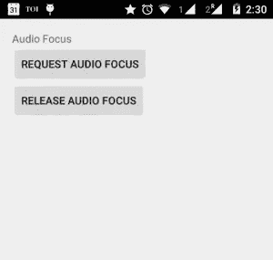

# 使用音频焦点管理 Android 中的多个声源

> 原文：<https://www.sitepoint.com/managing-multiple-sound-sources-in-android-with-audio-focus/>

声音是抓住用户注意力、给出界面反馈或让玩家沉浸在游戏中的好方法。想象一下，如果多个应用程序都试图同时播放声音。这将导致难以理解的杂音，并使用户达到静音按钮。Android 提供了一个简单的 API 来播放音乐和音频效果，并管理不同的源。Android audio focus API 允许应用程序请求“音频聚焦”,并让应用程序知道它是否失去了焦点，以便它可以做出反应。在本教程中，我将展示如何在你自己的应用中使用这些 API。

你可以在 [GitHub](https://github.com/sitepoint-editors/AndroidAudioFocus) 上找到本教程的最终代码。

## 为你的应用请求音频焦点

在播放任何声音之前，您应该在应用程序中请求音频焦点。为此你需要得到一个 [`AudioManager`](http://developer.android.com/reference/android/media/AudioManager.html) 的实例。一旦你有了实例，你就可以使用 **[`requestAudioFocus`](http://developer.android.com/reference/android/media/AudioManager.html#requestAudioFocus)** 。

创建一个带有空活动的新应用程序，并用以下内容替换活动的内容:

```
<RelativeLayout xmlns:android="http://schemas.android.com/apk/res/android"
    xmlns:tools="http://schemas.android.com/tools" android:layout_width="match_parent"
    android:layout_height="match_parent" android:paddingLeft="@dimen/activity_horizontal_margin"
    android:paddingRight="@dimen/activity_horizontal_margin"
    android:paddingTop="@dimen/activity_vertical_margin"
    android:paddingBottom="@dimen/activity_vertical_margin" tools:context=".MainActivity">

    <LinearLayout
        android:layout_width="match_parent"
        android:layout_height="match_parent"
        android:orientation="vertical">

        <TextView android:text="Audio Focus"
            android:layout_width="wrap_content"
            android:layout_height="wrap_content" />
        <Button
            android:id="@+id/btnRequestFocus"
            android:layout_width="wrap_content"
            android:layout_height="wrap_content"
            android:text="Request Audio Focus"/>

        <Button
            android:id="@+id/btnReleaseFocus"
            android:layout_width="wrap_content"
            android:layout_height="wrap_content"
            android:text="Release Audio Focus"/>

    </LinearLayout>

</RelativeLayout> 
```

这个布局使用包含两个按钮的`LinearLayout`样式。一个请求聚焦，一个释放聚焦。将*MainActivity.java*的内容更新为:

```
public class MainActivity extends Activity {

    @Override
    protected void onCreate(Bundle savedInstanceState) {
        super.onCreate(savedInstanceState);
        setContentView(R.layout.activity_main);

        Button btnRequestFocus = (Button)findViewById(R.id.btnRequestFocus);
        btnRequestFocus.setOnClickListener(new View.OnClickListener() {
            @Override
            public void onClick(View v) {

                boolean gotFocus = requestAudioFocusForMyApp(MainActivity.this);
                if(gotFocus) {
                    //play audio.
                }
            }
        });

        Button btnReleaseFocus = (Button)findViewById(R.id.btnReleaseFocus);
        btnReleaseFocus.setOnClickListener(new View.OnClickListener() {
            @Override
            public void onClick(View v) {
                //Stop playing audio.
                releaseAudioFocusForMyApp(MainActivity.this);
            }
        });
    }

    private boolean requestAudioFocusForMyApp(final Context context) {
        AudioManager am = (AudioManager)context.getSystemService(Context.AUDIO_SERVICE);

        // Request audio focus for playback
        int result = am.requestAudioFocus(null,
                // Use the music stream.
                AudioManager.STREAM_MUSIC,
                // Request permanent focus.
                AudioManager.AUDIOFOCUS_GAIN);

        if (result == AudioManager.AUDIOFOCUS_REQUEST_GRANTED) {
            Log.d("AudioFocus", "Audio focus received");
            return true;
        } else {
            Log.d("AudioFocus", "Audio focus NOT received");
            return false;
        }
    }

    void releaseAudioFocusForMyApp(final Context context) {
        AudioManager am = (AudioManager)context.getSystemService(Context.AUDIO_SERVICE);
        am.abandonAudioFocus(null);
    }
} 
```

该活动将点击监听器添加到两个按钮中。当用户点击*请求音频焦点*按钮时，它通过调用`getSystemService` API 获得`AudioManager`实例，并传递`Context.AUDIO_SERVICE`上下文。一旦有了`AudioManager`，就可以通过调用接受`AudioManager.OnAudioFocusChangeListener`作为第一个参数的`requestAudioFocus` API 来请求焦点。稍后你会看到更详细的内容，但现在先跳过`null`。第二个参数是流类型，可以是以下类型之一，具体取决于您想要使用的声音类型:

*   `STREAM_ALARM`:音频是一种报警。
*   音频是指音乐、视频、背景声音等媒体。
*   `STREAM_NOTIFICATION`:音频是通知用的。
*   `STREAM_RING`:音频是手机铃声。
*   `STREAM_SYSTEM`:音频是系统声音。
*   音频是 DTFM 的音调。

第三个参数是您想要的焦点类型，例如永久焦点或暂时焦点。它接受以下参数之一:

*   `AUDIOFOCUS_GAIN`:当您想要长时间聚焦以播放长时间的音频时。
*   当你想短时间聚焦时。
*   `AUDIOFOCUS_GAIN_TRANSIENT_MAY_DUCK`:当你想要短时间聚焦，而其他应用程序可以“闪开”而不是停止音频时。

一旦你用适当的参数调用了`requestAudioFocus`，API 将返回`AUDIOFOCUS_REQUEST_GRANTED`或者`AUDIOFOCUS_REQUEST_FAILED`。如果更高优先级的声音(如电话呼叫)正在进行，音频聚焦请求可能会失败，只有在`requestAudioFocus` API 成功的情况下，您才应该开始播放音频。

上述活动请求音频焦点，流类型为`STREAM_MUSIC`，持续时间为`AUDIOFOCUS_GAIN`，以长时间播放媒体文件。一旦音频完成，使用`AudioManager` `abandonAudioFocus` API 释放焦点。在示例应用程序中，当用户单击*释放音频焦点*按钮时，就会发生这种情况。



## 在应用程序中处理音频焦点事件

当你的应用程序获得焦点时，它可以传递一个`AudioManager.OnAudioFocusChangeListener`,当焦点发生变化时，它提供回调。

假设您的应用程序获得音频焦点，而另一个应用程序请求瞬时音频焦点，焦点将被给予另一个应用程序。Android 会通过一个`OnAudioFocusChangeListener`通知你的应用程序，这样你的应用程序就可以对这个变化做出反应。一旦另一个应用程序放弃了它的焦点，你的应用程序将重新获得焦点，并收到适当的回调。这在概念上类似于`onStart`、`OnStop`、`OnPause`、`OnResume`等活动生命周期事件。

要接收焦点事件，您需要将一个`AudioManager.OnAudioFocusChangeListener`实例传递给`requestAudioFocus`和`abandonAudioFocus`调用。更新代码*MainActivity.java*到以下以接收回调:

```
public class MainActivity extends Activity {

    private final static String TAG = "AudioFocus";
    private AudioManager.OnAudioFocusChangeListener mOnAudioFocusChangeListener = new AudioManager.OnAudioFocusChangeListener() {

        @Override
        public void onAudioFocusChange(int focusChange) {
            switch (focusChange) {
                case AudioManager.AUDIOFOCUS_GAIN:
                    Log.i(TAG, "AUDIOFOCUS_GAIN");
                    //restart/resume your sound
                    break;
                case AudioManager.AUDIOFOCUS_LOSS:
                    Log.e(TAG, "AUDIOFOCUS_LOSS");
                    //Loss of audio focus for a long time
                    //Stop playing the sound
                    break;
                case AudioManager.AUDIOFOCUS_LOSS_TRANSIENT:
                    Log.e(TAG, "AUDIOFOCUS_LOSS_TRANSIENT");
                    //Loss of audio focus for a short time
                    //Pause playing the sound
                    break;
                case AudioManager.AUDIOFOCUS_LOSS_TRANSIENT_CAN_DUCK:
                    Log.e(TAG, "AUDIOFOCUS_LOSS_TRANSIENT_CAN_DUCK");
                    //Loss of audio focus for a short time.
                    //But one can duck. Lower the volume of playing the sound
                    break;

                default:
                    //
            }
        }
    };

    @Override
    protected void onCreate(Bundle savedInstanceState) {
        super.onCreate(savedInstanceState);
        setContentView(R.layout.activity_main);

        Button btnRequestFocus = (Button)findViewById(R.id.btnRequestFocus);
        btnRequestFocus.setOnClickListener(new View.OnClickListener() {
            @Override
            public void onClick(View v) {

                boolean gotFocus = requestAudioFocusForMyApp(MainActivity.this);
                if(gotFocus) {
                    //play audio.
                }
            }
        });

        Button btnReleaseFocus = (Button)findViewById(R.id.btnReleaseFocus);
        btnReleaseFocus.setOnClickListener(new View.OnClickListener() {
            @Override
            public void onClick(View v) {
                //Stop playing audio.
                releaseAudioFocusForMyApp(MainActivity.this);
            }
        });
    }

    private boolean requestAudioFocusForMyApp(final Context context) {
        AudioManager am = (AudioManager)context.getSystemService(Context.AUDIO_SERVICE);

        // Request audio focus for playback
        int result = am.requestAudioFocus(mOnAudioFocusChangeListener,
                // Use the music stream.
                AudioManager.STREAM_MUSIC,
                // Request permanent focus.
                AudioManager.AUDIOFOCUS_GAIN);

        if (result == AudioManager.AUDIOFOCUS_REQUEST_GRANTED) {
            Log.d(TAG, "Audio focus received");
            return true;
        } else {
            Log.d(TAG, "Audio focus NOT received");
            return false;
        }
    }

    void releaseAudioFocusForMyApp(final Context context) {
        AudioManager am = (AudioManager)context.getSystemService(Context.AUDIO_SERVICE);
        am.abandonAudioFocus(mOnAudioFocusChangeListener);
    }
} 
```

在`AudioManager.OnAudioFocusChangeListener`中，您需要覆盖焦点改变事件传递到的`onAudioFocusChange`函数。

这些事件可以是下列事件之一:

*   `AUDIOFOCUS_LOSS`:音频焦点被应用程序丢失。您应该停止播放声音，并释放为播放声音而获取的任何资产。
*   `AUDIOFOCUS_LOSS_TRANSIENT`:应用程序短时间失去音频焦点。您应该暂停音频。
*   `AUDIOFOCUS_LOSS_TRANSIENT_CAN_DUCK`:应用程序短时间失去音频焦点。您可以继续播放音频，但应降低音量。
*   `AUDIOFOCUS_GAIN`:你的应用程序在失败后重新获得了音频焦点。如果在之前的事件中音量降低，您应该重新启动它并增加音量。

## 闪避

有时，Android 系统或其他应用程序可能需要播放简短的高优先级声音。在这些情况下，它将请求音频聚焦为`AUDIOFOCUS_GAIN_TRANSIENT_MAY_DUCK`。如果你的应用程序持有音频焦点，你将收到事件为`AUDIOFOCUS_LOSS_TRANSIENT_CAN_DUCK`，你应该继续播放声音，但降低音量。如果您使用的是标准安卓 [`MediaPlayer`](http://developer.android.com/reference/android/media/MediaPlayer.html) ，您可以使用 [`setVolume`](http://developer.android.com/reference/android/media/MediaPlayer.html#setVolume(float,%20float)) 功能降低音量。

## 尊重音频焦点

想象一下，在一次会议上，所有发言者同时对着麦克风讲话。这将是完全的混乱，观众会离开。

虽然你的应用程序不需要尊重 Android 系统或其他应用程序的焦点，但这是一个很好的用户体验。如果你不这样做，你的应用会收到差评或频繁卸载。

您的应用程序对这些事件的反应取决于预期的功能，但将这一点考虑在内是很重要的。

*如果您有任何意见或问题，请在下面*告诉我。

## 分享这篇文章