# 如何用 Asana 管理项目

> 原文：<https://www.sitepoint.com/managing-projects-with-asana/>

"你有机会看那封邮件吗？"

不知道下一步去哪里，我的指针在我的收件箱上徘徊。

我老板提到的那封邮件是一篇附带文章，她想听听我的意见。我知道我收到了，但是是谁寄的呢？设计师之一？我老板转发了吗？我的大脑一片空白。

在翻遍各种收件箱文件夹后，我终于看到了最新的版本，我们可以继续我们的对话了。

如果这听起来很熟悉，那么你应该知道[使用电子邮件作为项目管理和协作工具](http://tech.co/phil-simon-message-not-received-2015-04)的挫败感。所以别说了。

> 作家罗伯特·弗里茨教导说，每当你意识到自己对某个情况感到不开心或沮丧时，那就是“你的力量之源”，因为现在你对自己不希望事情变成什么样子有了清晰的认识。想象与令人沮丧的情况完全相反的情况，这样你就有了你的愿景。–路径

我想象了一个工具，对话存在于一个地方，而不是分散在十几封“回复所有人”的电子邮件中。但是这样的工具存在吗？

当然了。但是问题不在于*找到*一个，而在于*从几十个可用的中选择*。

几年前我用过 Asana，当我再次使用它时，我对他们的改进感到惊喜。因此，这里有一个内幕，看看我们的团队如何使用它在营销项目上进行合作，这个团队由两名营销人员、两名设计师、一名文案、一名销售总监、我的老板和我自己组成。

## 设置体式

第一步是决定组织结构。体式使用以下层级:

1.  工作区
2.  项目
3.  任务
4.  子任务

### 工作区

Asana 的免费版本允许每个工作区有 15 个成员。每个工作区都是一个独立的单元，因此一个工作区中的项目和任务不会出现在另一个工作区中。

这很重要，因为如果你有太多的工作空间，你将不得不在每个工作空间之间来回切换来管理你所有的项目。因此，我没有创建多个工作区，而是创建了一个名为“营销”的工作区

### 项目

接下来，我添加了我们当前的项目。这些显示在左侧栏中:

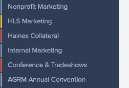

建立集客活动每次都需要相同的步骤。所以我创建了一个名为“Template”的可重用项目，其中包含了作为任务的每一个步骤。

您可以通过从“项目”下拉菜单中选择“用作模板(复制项目)”来复制模板。

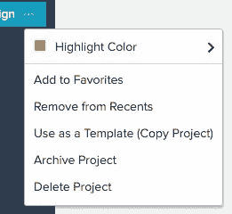

### 任务和子任务

在每个项目中，您可以创建任务和子任务。在下一节中，我将使用一个真实的例子向您展示这是如何工作的。

## 用 Asana 管理活动

以下项目是我们在四月份提供的网上研讨会的宣传活动。它涉及五个人和多个步骤。下面是我们在 Asana 的设置:

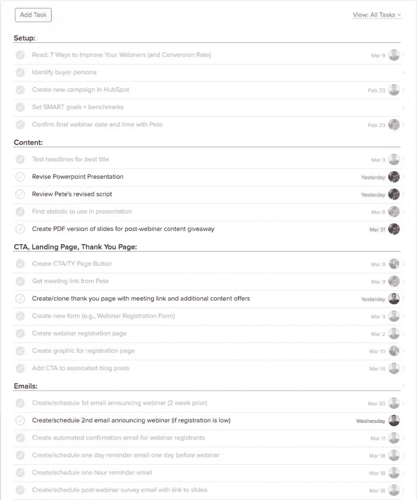

您会注意到已完成的任务是灰色的。Asana 默认只显示未完成的任务。但是通过将视图更改为“所有任务”，我可以同时看到两者。

在右边，您可以看到每项任务分配给了哪个团队成员，以及截止日期。

您还可以查看项目进度的图表，并在项目偏离轨道时通知您的团队。

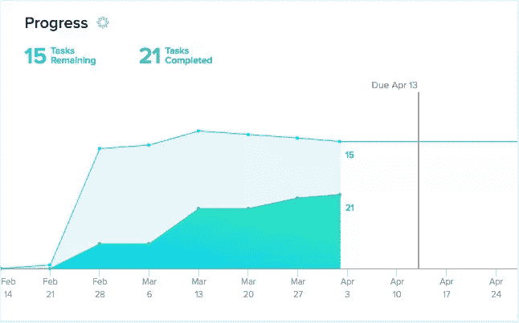

## 用 Asana 管理资产

大多数活动需要电子书、CTA 按钮或信息图等资产。Asana 集成了 Dropbox、Google Drive 和 box，因此在这些服务之一中附加共享文件夹中的文件简化了资产管理。

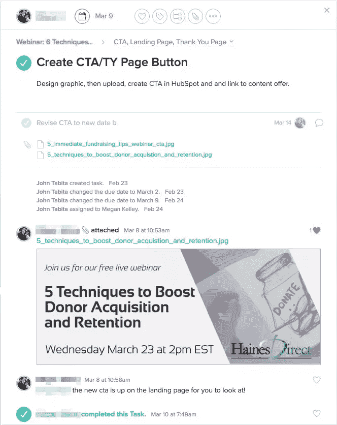

与图像不同，PowerPoint 或 Word 等文件不显示预览。因此，除非你把它们保存在共享的盒子、驱动器或 Dropbox 文件夹中，否则你必须下载附件才能查看。

使用共享文件夹还有一个好处，就是可以显示最新版本。

## 用体式管理团队成员

我可以通过点击每个团队成员的图标来查看他们的任务:

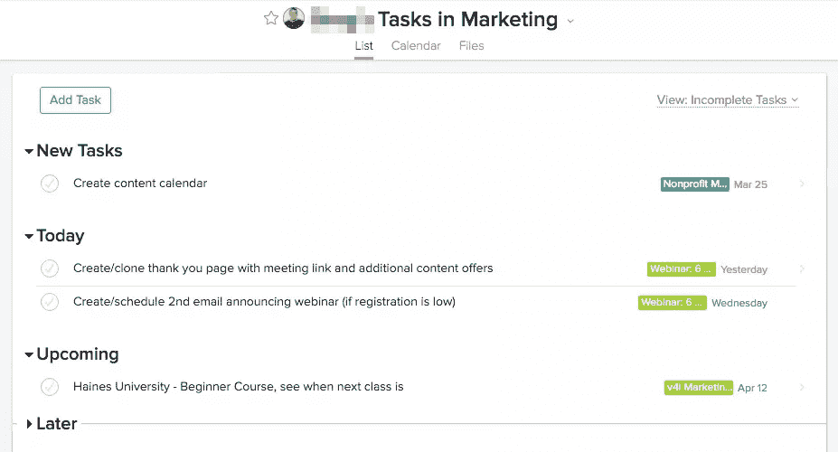

这有助于将我们的每周会议保持在 15 分钟左右，从而进入下一个项目。

## 管理与 Asana 的会议

Asana 最好的特性之一是它能够将一个任务关联到多个项目。这让我可以创建即时会议议程。以下是方法。

每两周，我都会和我们的销售总监开一次销售会议，就销售和营销计划进行合作。所以我创建了一个项目，叫做*营销*。

需要在该会议上讨论的来自其他项目的任务与*营销*项目相关联:

我有一个紧急议程:

## 用 Asana 管理编辑内容

以下是我们的电子邮件营销时间表示例，设置为任务:

任务窗格允许我添加细节，如大纲或注释。我还可以创建子任务，并将其分配给其他团队成员。

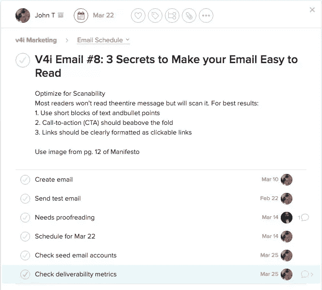

我可以将任务视为日历:

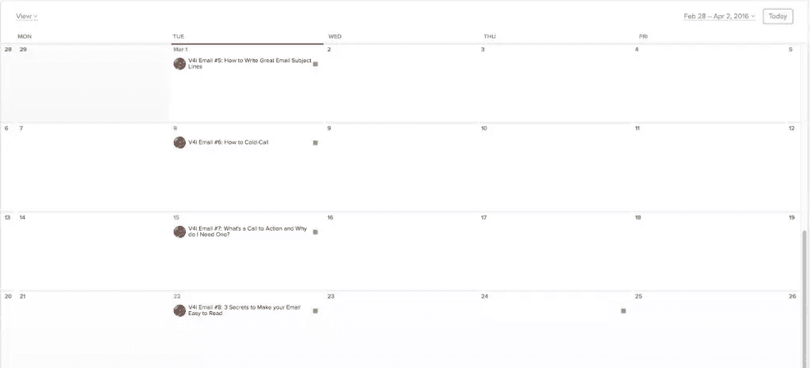

## 用 Asana 维护内容库

Asana 是一个拥有内部资源或参考资料的内部图书馆的好地方。例如，我创建了一个名为“学习体式”的项目来帮助新成员。在“做这些”下面，我分配任务给新成员去完成。

剩下的项目是链接到 Asana 用户指南的参考资料。

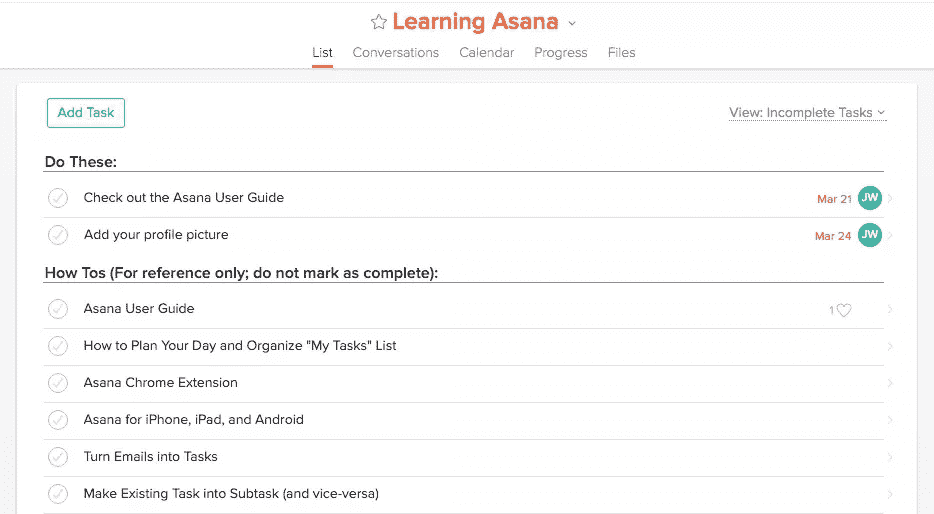

## 用体式管理自己

在体式中管理自己需要你像监控你的电子邮件收件箱一样密切监控我的任务和 T2 的收件箱。

### 使用我的任务

在“我的任务”中，您将看到分配给您的所有任务，新任务位于顶部。您可以将这些标记为今天、即将到来(本周的另一天)或稍后(下周或之后)。

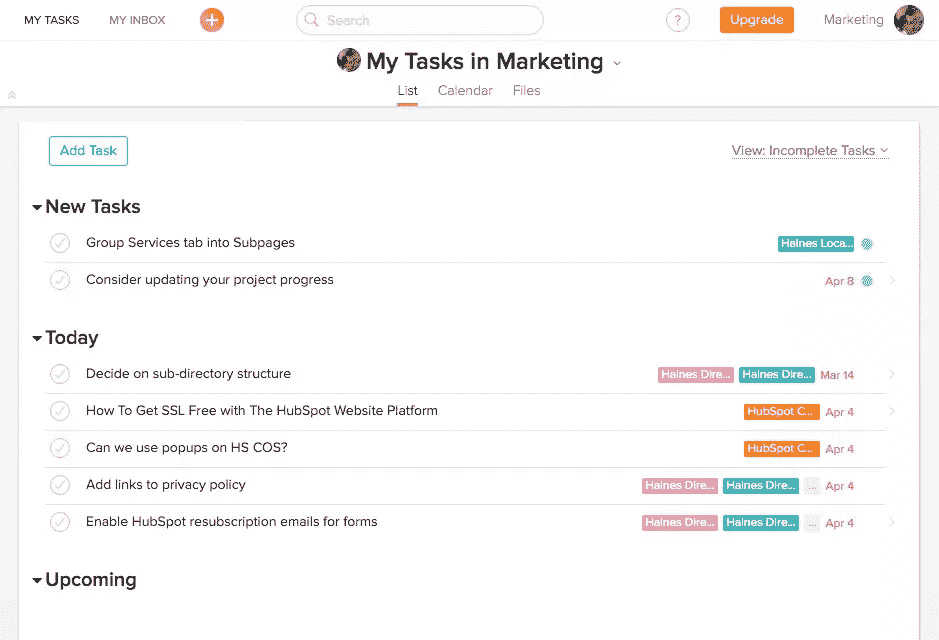

在管理自己和他人时，请记住这两点:

**不要超额预定**

试着一天不要安排超过五个任务，除非它们很小。否则，我的任务看起来就像 101 高速公路上 15 辆汽车连环相撞，而你将花大部分时间修改截止日期。

**如有可能，委派代表**

有时候我忘记了我有一个团队，给自己分配了太多的任务，而给别人的任务却不够多。

### 使用我的收件箱

在我的收件箱中，您将看到您参与的所有任务或项目的通知和评论:

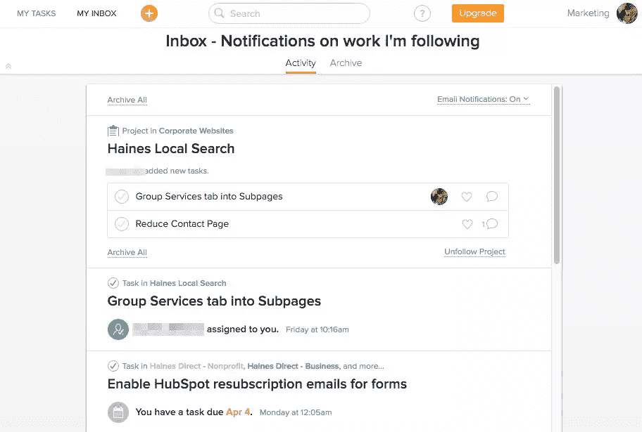

就像电子邮件一样，当你用完后，你可以把它们存档。

## 那么投资回报率是多少呢？

现在你在想 Asana 的学习曲线是否值得花时间和精力。我不怪你。我坚信你承诺的任何活动都应该产生投资回报。

我倾向于研究生产力黑客，所以我花在用户指南上的时间可能比大多数人需要的多。

但是我发现我为自己节省的时间和挫折是值得投资的。据说果汁非常值得压榨。

我在窗帘后的窥视到此结束。现在我合作的每个人都在使用 Asana，我花在管理邮件上的时间更少了。

那是一个美丽的地方。

## 分享这篇文章